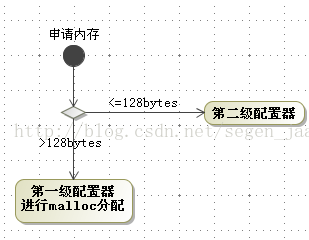
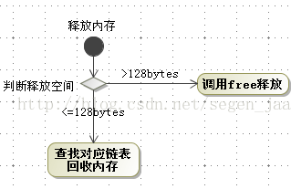
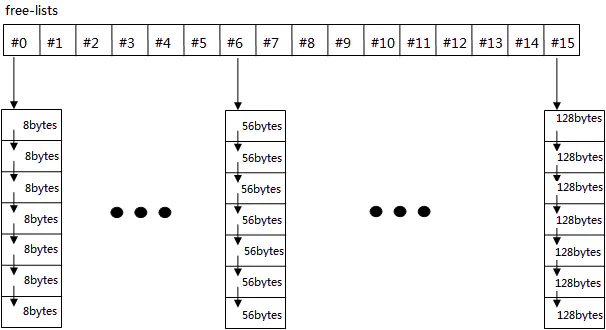

# 空间配置器

allocator 是空间配置器，而不是内存配置器，因为空间也可以是硬盘

## allocator 必要接口

```cpp
allocator::value_type

allocator::pointer

allocator::const_pointer

allocator::reference

allocator::const_reference

allocator::size_type

allocator::difference_type

// 一个嵌套的 class template， class rebind<U> 拥有唯一成员 other，
// 是一个 typedef，代表 allocator<U>
allocator::rebind  

// 默认构造函数
allocator::allocator()

// 复制构造函数
allocator::allocator(const allocator &)

// 泛化的复制构造函数
template <class U>allocator::allocator<const allocator<U> &> 

// 析构函数
allocator::~allocator()

// 返回某个对象的地址，a.address(x) 等同于 &x
pointer allocator::address(reference x) const

// 返回某个 const 对象的地址，a.address(x) 等同于 &x
const_pointer allocator::address(const_reference x) const

// 配置空间，足以存储 n 个 T 对象
// 第二个参数是个提示，可能会利用它来增进区域性
pointer allocator::allocate(size_type n, const void * = 0)

// 归还先前配置的空间
void allocator::deallocate(pointer p, size_type n)

// 返回可成功配置的最大量
size_type allocator::max_size() const

// 等同于 new (( void*) p) T(x)
void allocator::construct(pointer p, const T& x)

// 等同于 p->~T()
void allocator::destroy(pointer p)
```

## 内存机制

STL 使用双层级配置器，第一级采用 `malloc/free`，第二级视情况采用不同策略，从而解决内存碎片问题





第二级配置器目的解决小型区块造成的内存碎片问题，将需要的内存上调至 8 的倍数；内存池有 128  / 8 = 16 个 free list，各自管理大小分别为 8、16、24、32、40、48、56、64、72、80、88、96、104、112、120、128 bytes 的小额区块



freelist 是一个指针数组，当要开辟空间大小内存对应的数组元素的值为空指针时会先开辟 20 个相应的大小的内存，并将其切割成 20 个小块，在内存块头部用 `union obj` 占用 4 个字节将全部小块串联起来，使用时会再将这 4 个字节覆盖

```cpp
// free list 结构
union obj {
    union obj * free_list_link;
    char client_data[1];
}

/*
char client_data;    // 此处的client_data是一个char型变量
char client_data[1]; // 而此处client_data是一个数组的首地址
*/
```
