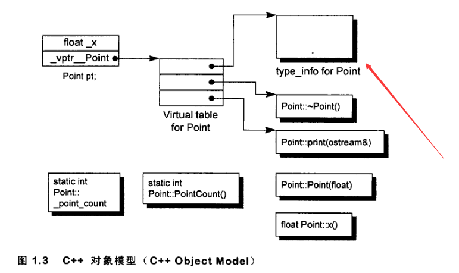

# 类型转换

## C 风格转换

C 风格的转换格式很简单，但是有不少缺点的：

1. 转换太过随意，可以在任意类型之间转换。可以把一个指向 const 对象的指针转换成指向非 `const` 对象的指针，把一个指向基类对象的指针转换成一个派生类对象的指针，这些转换之间的差距是非常巨大的，但是传统的 C 语言风格的类型转换没有区分这些

2. C 风格的转换没有统一的关键字和标示符

## 隐式转换

### 数值类型转换

从小整形类型（`char`、`short`）转换 `int`，或者 `float` 转换 `double` 等，编译器都会自动完成替换

隐式类型转换可以看做是一种类型提升，不会造成数值上的差异

### 指针类型转换

空指针可以转换成任意指针类型

任意指针类型都可以转换到 `void*` 指针

子类指针可以转换到可访问的明确的基类指针，同时不改变 `const` 或 `volatile` 属性

### 注意事项

- 负数转无符号类型

- 对于 `bool` 类型，`false` 等价于 0 或空指针，`true` 等价于其他任何数值

- 浮点转化为整形，会采用截断操作，如果发生数值溢出可能会出现未定义行为

## 显示类型转换

### static_cast

```cpp
static_cast<type-id>(expression)
// 1. 执行非动态的转换操作，用于替代 C 中的转换操作
// 2. 替换隐式转换
```

- 用于类层次结构中基类和派生类之间指针或引用的转换；向上转换（派生类---->基类）是安全的；向下转换（基类---->派生类）由于没有动态类型检查，所以是不安全的

- 用于基本数据类型之间的转换，如把 `int` 转换为 `char`，这种带来安全性问题由程序员来保证

- 把空指针转换成目标类型的空指针

- 把任何类型的表达式转为 `void` 类型

- 转换成右值引用

### dynamic_cast

```cpp
dynamic_cast<type-id>(expression)

/*
1. type-id 必须是指针或者引用，type-id 为指针时 expression 必须是指针，type-id 为引用时 expression 必须是左值

2. 基类必须要有虚函数，因为 dynamic_cast 是运行时类型检查，需要运行时类型信息，而这个信息是存储在类的虚函数表中，只有一个类定义了虚函数，才会有虚函数表

3. 对于向下转换，dynamic_cast 是安全的（当类型不一致时，转换过来的是空指针或抛出异常），而 static_cast 是不安全的（当类型不一致时，转换过来的是错误意义的指针，可能造成踩内存，非法访问等各种问题）

4. dynamic_cast 还可以进行交叉转换
*/
```

根据 C++ 对象模型，对象的 `type_info` 被存在了虚表的首部，所以要使用 `dynamic_cast`，对象必须有多态，然后运行时期比对要转换的类型是否和 `type_info` 中记录的类型相同即可

由于使用 RTTI 进行类型检查，所以存在一定的性能损失



### const_cast

```cpp
const_cast<type-id>(expression)

/*
1. 唯一可以对常量进行操作的转换符

2. 去除常量性是一个危险的动作，尽量避免使用
*/
```

- 用于去除对象 `const` 或者 `volatile` 属性

- 常量指针转换为非常量指针，并且仍然指向原来的对象

- 常量引用被转换为非常量引用，并且仍然指向原来的对象

### reinterpret_cast

```cpp
reinterpret_cast<type-id>(expression)
// 1. 从底层对数据进行重新解释，依赖具体的平台，可移植性差
// 2. 可以将整型转换为指针，也可以把指针转换为数组
// 3. 可以在指针和引用里进行肆无忌惮的转换
```

不到万不得已，不用使用这个转换符，高危操作

## 类型转换运算符重载

类型转换操作符是一种特殊的类成员函数，将类类型值转变为其他类型值

不能声明返回类型，形参列表也必须为空

支持继承，可以为虚函数

```cpp
operator type() const;
```

只要存在转换，编译器将在可以使用内置转换的地方自动调用