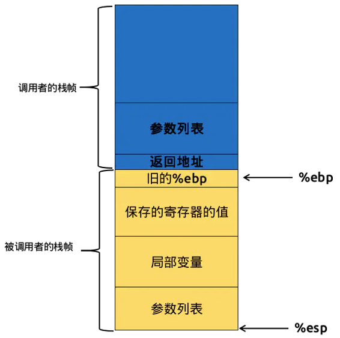
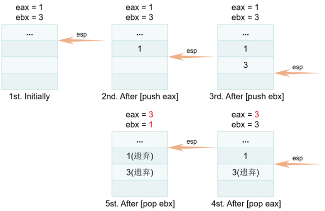

# 函数调用

## 栈帧

栈帧专门用于保存函数调用过程中的各种信息，如参数、返回地址本地变量等

栈顶的地址最低，栈底的地址最高，栈指针 esp 指向栈顶的，基址指针 ebp 指向栈底，ebp 在调用过程中不变

程序执行时，esp 减小将分配空间，esp 增大将释放空间



## 寄存器

esp 存放于堆栈指针寄存器中，ebp 存放于基址指针寄存器

指令寄存器 eip 存放下一条执行指令的所在地址

eax 用于存放函数返回值

## push、pop、call

`push`、`pop` 和 `call` 都属于汇编指令

入栈操作分为两步：

1. 栈顶指针自减以扩大栈帧空间

2. 将某个寄存器的值保存新开辟的位置上

出栈操作只有一步：

1. 栈顶指针自增以缩小栈帧空间，将原先最靠近栈顶的值赋予某个寄存器



调用分为两步：

1. 让当前指令寄存器 eip 的值入栈，作为返回地址

2. 将指令寄存器 eip 的值修改为接下来即将调用的函数第一条机器指令的所在地址，从而实现跳转

## 函数调用基本过程

在函数调用过程中，调用者需要知道在哪里获取被调用者返回的值，被调用者需要知道传入的参数在哪里以及返回的地址在哪里，同时还需要保证在被调用者返回后，ebp、esp 等寄存器的值应该和调用前一致

### 函数调用者栈帧操作

1. 将被调用函数的参数按照从右到左的顺序压入栈中

2. 将返回地址 eip 压入栈中

这两步操作都是调用者负责的，因此压入的栈属于调用者的栈帧

### 被调用者栈帧操作

每个函数的机器指令段的开头：

1. 在栈帧中保存上一栈帧的栈底地址，汇编指令为 `push ebp`

2. 将上一栈帧的栈顶地址作为当前函数栈帧的栈底地址，汇编指令为 `mov ebp, esp`，此时保存了调用者函数的 ebp，并且建立了一个新的栈帧

3. 为当前函数的局部变量开辟足够的空间，汇编指令为 `sub esp, M`，M 为局部变量占用栈帧空间的字节数

每个函数的机器指令段的末尾：

1. 将 esp 恢复为为局部变量开辟空间之前的值，汇编指令为 `mov esp, ebp`，恢复后 esp 的值恰好是上一栈帧栈底地址的地址

2. 将 ebp 恢复为上一栈帧的栈底地址，汇编指令为 `mov ebp, [esp]`

3. 执行汇编指令 `pop esp`，恢复后 esp 的值恰好是存放返回地址的地址

4. 将 eip 恢复为 `call` 指令之前的待执行的命令，汇编指令为 `mov eip, [esp]`

5. 执行 `pop esp`， 恢复后 esp 的值恰好为刚执行完的函数的第一个形参的入栈地址

4. 弹出调用函数的所有实参，汇编指令为 `pop ...`，恢复后 esp 的值

## 函数约定调用

在函数调用过程中，有两个很重要的问题必须得到明确说明

- 当参数个数多于一个时，按照什么顺序把参数压入堆栈

- 函数调用后，由谁来把堆栈恢复原装

函数约定调用是函数调用者和被调用的函数体之间关于参数传递、返回值传递、堆栈清除、寄存器使用的一种约定

常见的调用约定有：`stdcall`、`cdecl`、`fastcall`、`thiscall`

### stdcall

Standard Call 的缩写，C++ 的标准调用方式

```cpp
// 声明语法
int __stdcall function(int a,int b)
```

`stdcall` 的调用约定意味着：

- 参数从右向左压入堆栈

- 函数自身清理堆栈

- 函数名自动加前导的下划线，后面紧跟一个 `@` 符号，其后紧跟着参数的尺寸

### cdecl

C Declaration 的缩写，C 语言缺省的调用约定

```cpp
// 声明语法
int function(int a, int b)          // 不加修饰就是 C 调用约定 
int __cdecl function(int a, int b)  // 明确指出 C 调用约定
```

`cdecl` 调用约定意味着：

- 参数从右向左压入堆栈

- 调用者负责清理堆栈

- C 调用约定允许函数的参数的个数是不固定的

- 仅在函数名前加上一个下划线前缀

### fastcall

```cpp
// 声明语法
int fastcall function(int a, int b)  
```

`fastcall` 调用约定意味着：

- 函数的第一个和第二个 `DWORD` 参数（或者尺寸更小的）通过 ecx 和 edx 传递，其他参数通过从右向左的顺序压栈

- 函数自身清理堆栈

- 函数名修改规则同 `stdcall`

### thiscall

C++ 类成员函数缺省的调用约定

`thiscall` 是唯一一个不能明确指明的函数修饰，因为 `thiscall` 不是关键字

对于参数个数固定情况下，类似于 `stdcall`，不定时则类似 `cdecl`

`thiscall` 意味着：

- 参数从右向左入栈

- 如果参数个数不确定，`this` 指针在所有参数压栈后被压入堆栈，如果参数个数确定，`this` 指针通过 ecx 传递给被调用者

- 如果参数个数不确定，调用者清理堆栈，否则函数自己清理堆栈