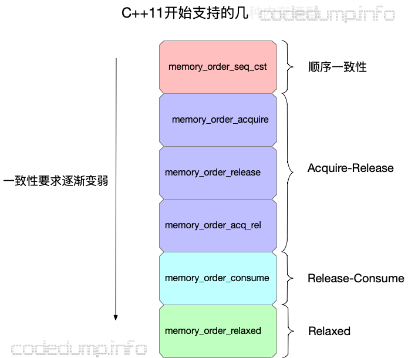

# 内存一致性模型

## 简单的多线程访问数据带来的问题

```cpp
int A = 0, B = 0;

void func1() {
	A = 1;
	cout << B;
}

void func2() {
	B = 2;
	cout << A;
}

int main() {
    thread t1(func1);
    thread t2(func2);
    t1.join();
    t2.join();
    return 0;
}

/*
可能的结果有：(0,0)、(1,0)、(0,2)、(1,2)、(0,1)、(2,0)、(2,1)
*/
```

## 指令重排

```cpp
int A, B;

void foo() {
  A = B + 1;
  B = 0;
}

int main() {
  foo();
  return 0;
}

/*
在不使用优化的情况下编译：
1. 先把变量 B 的值赋给寄存器 eax
2. 将寄存器 eax 加 1 的结果赋值给变量 A
3. 将变量 B 置为 0

使用 O2 优化编译：
1. 先把变量 B 的值赋给寄存器 eax
2. 变量 B 置零
3. 将寄存器 eax 加 1 的结果赋值给变量 A
*/
```

## 几种关系术语

### sequenced-before

sequenced-before 用于表示单线程之间，两个操作上的先后顺序，这个顺序是非对称、可以进行传递的关系；它不仅仅表示两个操作之间的先后顺序，还表示了操作结果之间的可见性关系

两个操作 A 和操作 B，如果有 A sequenced-before B，除了表示操作 A 的顺序在 B 之前，还表示了操作 A 的结果操作 B 可见

### happens-before

与 sequenced-before 不同的是，happens-before 关系表示的不同线程之间的操作先后顺序，同样的也是非对称、可传递的关系

如果 A happens-before B，则 A 的内存状态将在 B 操作执行之前就可见

### synchronizes-with

synchronizes-with 关系强调的是变量被修改之后的传播关系，即如果一个线程修改某变量的之后的结果能被其它线程可见，那么就是满足 synchronizes-with 关系的

满足 synchronizes-with 关系的操作一定满足 happens-before 关系

## 

## C++11 支持内存模型

C++11 原子操作的很多函数都有个 `std::memory_order` 参数，这个参数就是这里所说的内存模型，其并不是类似 POD 的内存布局，而是一种数据同步模型，准确说法应该是储存一致性模型，其作用是对同一时间的读写操作进行排序

```cpp
enum memory_order {
    memory_order_relaxed,
    memory_order_consume,
    memory_order_acquire,
    memory_order_release,
    memory_order_acq_rel,
    memory_order_seq_cst
};
```

与内存模型相关的枚举类型有以上六种，但是其实分为四类



## C++11 为 `std::atomic` 提供了 4 种 memory ordering

- Relaxed ordering

- Release-Acquire ordering

- Release-Consume ordering

- Sequentially-consistent ordering

默认情况下，`std::atomic` 使用的是 Sequentially-consistent ordering，但在某些场景下合理使用其它三种 ordering，可以让编译器优化生成的代码，从而提高性能

### Relaxed ordering

最宽松的内存模型，效率也最高

在这种模型下，`std::atomic` 的 `load()` 和 `store()` 都要带上 `memory_order_relaxed` 参数

- 针对一个变量的读写操作是原子操作

- 不同线程之间针对该变量的访问操作先后顺序不能得到保证，即有可能乱序

```cpp
// 最初 x 和 y 都是 0

// 线程 1 ：
r1 = y.load(std::memory_order_relaxed); // A
x.store(r1, std::memory_order_relaxed); // B
// 线程 2 ：
r2 = x.load(std::memory_order_relaxed); // C 
y.store(42, std::memory_order_relaxed); // D

/*
允许产生结果 r1 == 42 && r2 == 42 
因为 C 和 D 之间没有依赖关系，因此编译器允许调整 C 和 D 的执行顺序
D 在 y 上的副效应，可能可见于线程 1 中的加载 A ，同时 B 在 x 上的副效应，可能可见于线程 2 中的加载 C
*/
```

一般用于多线程计数器，`std::shared_ptr` 的引用计数就是利用这个实现的

### Release-Acquire ordering

在这种模型下，`store()` 使用 `memory_order_release`，`load()` 使用 `memory_order_acquire`

#### std::memory_order_acquire

读操作 (load) 时可以指定的内存顺序

当前线程中，在 `load()` 之后的读指令不允许重排至 `load()` 之前，表示在本线程中，所有后续的读内存操作都必须在本条原子操作完成后执行，但之后的读操作是允许乱序的

#### std::memory_order_release

写操作 (store) 时可以指定的内存顺序

当前线程中，在 `store()` 之前的写指令不允许重排至 `store()` 之后，表示在本线程中，所有之前的写内存操作完成后才能执行本条原子操作，但之前的写操作是允许乱序的

#### 搭配使用

`std::memory_order_release` 和 `std::memory_order_acquire` 搭配使用，达到线程同步的效果

```cpp
std::atomic<bool> has_release;

void release(int *data) {
    if (!data) {
        data = new int[100];                            // line 1
    }
    has_release.store(true, std::memory_order_release); // line 2

    //.... do something other.
}

void acquire() {
    // 同步操作
    while (!has_release.load(std::memory_order_acquire));
    // 取值
    int a = data[0];
}

int main() {
    thread t1(release);
    thread t2(acquire);
    return 0;
}
```

#### 副作用

```cpp
std::atomic<int> net_con{0};
std::atomic<int> has_alloc{0};
char buffer[1024];
char file_content[1024];

void release_thread(void) {
    sprintf(buffer, "%s", "something_to_read_tobuffer");

    // 这两个是与buffer完全无关的代码
    // net_con表示接收到的链接
    net_con.store(1, std::memory_order_release);
    // 标记alloc memory for connection
    has_alloc.store(1, std::memory_order_release);
}

void acquire_thread(void) {
    // 这个是与两个原子变量完全无关的操作。
    if (strstr(file_content, "auth_key =")) {
        // fetch user and password
    }

    while (!has_alloc.load(std::memory_order_acquire));
    bool v = has_alloc.load(std::memory_order_acquire);
    if (v) {
         net_con.load(std::memory_order_relaxed);
}
```

buffer 与 file_content 的使用与两个原子变量就目前的这段简短的代码而言是没有任何联系；按理说，这两部分的代码是可以放到任何位置执行的，但是由于使用了 release-acquire，那么会导致的情况就是 buffer 和 file_content 的访问都被波及


### Release-Consume order

因为 Release-Acquire order 的副作用，给性能带来一定的影响；`std::memory_order_consume` 把与真正变量无关的代码剥离出去，让它们能够任意排列，不要被 release-acquire 误伤

#### std::memory_order_consume

本操作只能用来对读操作进行优化，所有后续对本原子类型的操作，必须在本操作完成之后才可以执行

`std::memory_order_acquire` 是要求后面所有的读都不得提前，`std::memory_order_consume` 是要求后面依赖于本次读的操作不能乱序

```cpp
std::atomic<int*> global_addr{nullptr};

void func(int *data) {
    int *addr = global_addr.load(std::memory_order_consume);
    int d = *data;
    int f = *(data+1);
    if (addr) {
        int x = *addr;
}
/*
global_addr、addr、x 形成了读依赖，这几个变量是不能乱序的
*/
```

### 最强约束

`std::memory_order_seq_cst` 表示最强约束，所有这条指令前面的语句不能放到后面，所有这条语句后面的语句不能放到前面来执行