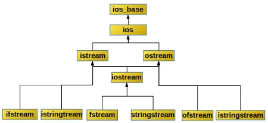

# 流

## C++ IO

C++ 输入输出包括：

- 对系统指定的标准设备的输入和输出（标准 IO），即从键盘输入数据，输出到显示器屏幕

- 以外存磁盘文件为对象进行输入和输出（文件 IO），即从磁盘文件输入数据，数据输出到磁盘文件

- 对内存中指定的空间进行输入和输出（串 IO），通常指定一个字符数组作为存储空间


## 类结构

`ios` 是抽象基类，由它派生出 `istream` 类和 `ostream` 类



`istream` 类支持输入操作，`ostream` 类支持输出操作，`iostream` 类支持输入输出操作

对文件的输入输出需要用 `ifstream` 和 `ofstream` 类

## 标准 IO

### cout

`cout` 不是 C++ 预定义的关键字，而是 `ostream` 流类的对象，在 `iostream` 中定义

`cout` 流在内存中对应开辟了一个缓冲区，用来存放流中的数据，当向 `cout` 流插人一个 `endl` 时，不论缓冲区是否已满，都立即输出流中所有数据，然后插入一个换行符，并刷新清空缓冲区

### cerr

`cerr` 流对象是标准错误流，已被指定为与显示器关联，与 `cout` 的用法相同

`cerr` 不经过缓冲区

### clog

`clog` 流对象也是标准错误流，作用和 `cerr` 相同，都是在终端显示器上显示出错信息

`clog` 中的信息存放在缓冲区中，缓冲区满后或遇 `endl` 时向显示器输出

## 文件 IO

和文件有关系的输入输出类主要在 fstream.h 头文件中定义，在这个头文件中主要被定义了三个类，由这三个类控制对文件的各种输入输出操作，他们分别是 `ifstream`、`ofstream`、`fstream`

### 文件操作

```cpp
void std::ofstream::open(const char *filename,
            ios_base::openmode mode = ios_base::out);
void std::ofstream::open(const std::string &filename, 
            ios_base::openmode mode = ios_base::out);
void std::ifstream::open(const char *filename,
            ios_base::openmode mode = ios_base::out);
void std::ifstream::open(const std::string &filename, 
            ios_base::openmode mode = ios_base::out);
/*
std::ios_base::trunc --- 打开文件，若文件已存在那么，清空文件内容；如果指定的路径不存在该文件不会创建
std::ios_base::ate --- 打开文件之后立即定位到文件末尾；如果指定的路径不存在该文件不会创建
std::ios_base::binary --- 以二进制的方式对打开的文件进行读写；如果指定的路径不存在该文件不会创建
std::ios_base::app --- 每次进行写入操作的时候都会重新定位到文件的末尾；如果指定路径不存在该文件那么创建一个
std::ios_base::in --- 打开文件进行读操作，即读取文件中的数据；如果指定路径中没有包含该文件，不会创建
std::ios_base::out --- 打开文件进行写操作，即写入数据到文件；如果指定路径中并没有包含该文件，会创建一个新的；如果指定的路径中包含有该文件，那么打开后，会清空文件中内容

在对已打开的磁盘文件的读写操作完成后，应关闭该文件
void close();

检查文件流是否绑定文件成功
bool is_open();
*/
```

每一个打开的文件都有一个文件指针，该指针的初始位置由 I/O 方式指定，每次读写都从文件指针的当前位置开始；每读入一个字节，指针就后移一个字节；当文件指针移到最后，就会遇到文件结束 `EOF`（文件结束符也占一个字节，其值为 -1)，此时流对象的成员函数 `eof` 的值为非 0 值(一般设为 1)，表示文件结束了

### ifstream

```cpp
template<typename T> 
basic_istream& operator>>( T& value );

int_type get();
basic_istream& get( char_type& ch );
basic_istream& get( char_type* s, std::streamsize count );
basic_istream& get( char_type* s, std::streamsize count, char_type delim );
basic_istream& putback( char_type ch );
basic_istream& getline( char_type* s, std::streamsize count );
basic_istream& getline( char_type* s, std::streamsize count, char_type delim );
basic_istream& read( char_type* s, std::streamsize count );
std::streamsize readsome( char_type* s, std::streamsize count );

// 将输入缓冲区与关联的数据源同步
int sync();
```

### ofstream

```cpp
template<typename T>
basic_ostream& operator<<( T value );

basic_ostream& put( char_type ch );
basic_ostream& write( const char_type* s, std::streamsize count );

basic_ostream& flush();

bool eof() const;
```