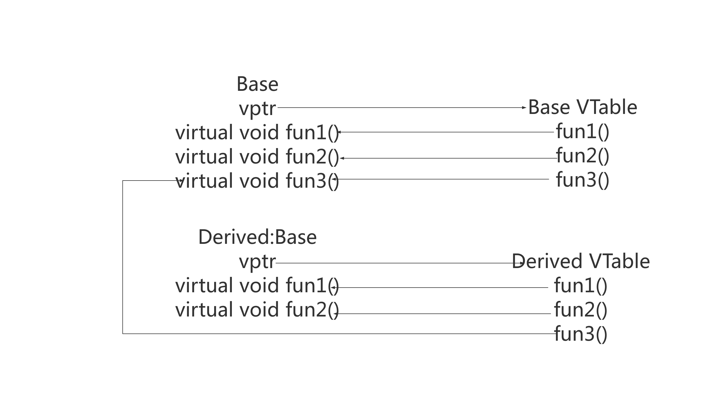

# Virtual

## 虚函数

### 虚函数与运行多态

虚函数的调用取决于指向或者引用的对象的类型，而不是指针或者引用自身的类型

```cpp
class Employee {
public: 
    virtual void raiseSalary() 
    {
        cout<<0<<endl; 
    }

    virtual void promote() 
    { /* common promote code */ } 
}; 

class Manager: public Employee { 
    virtual void raiseSalary() 
    {   
        cout<<100<<endl;    
    } 

    virtual void promote() 
    { /* Manager specific promote */ } 
}; 
class Engineer: public Employee { 
    virtual void raiseSalary() 
    {
        cout<<200<<endl;    
    }

    virtual void promote() 
    { /* Manager specific promote */ } 
}; 

// Similarly, there may be other types of employees 
// We need a very simple function to increment salary of all employees 
// Note that emp[] is an array of pointers and actual pointed objects can 
// be any type of employees. This function should ideally be in a class  
// like Organization, we have made it global to keep things simple 
void globalRaiseSalary(Employee *emp[], int n) 
{ 
    for (int i = 0; i < n; i++) 
        emp[i]->raiseSalary(); // Polymorphic Call: Calls raiseSalary()  
    // according to the actual object, not  
    // according to the type of pointer                                  
} 
int main(){
    Employee *emp[]={new Manager(),new Engineer};
    globalRaiseSalary(emp,2); 
    return 0;
}
```

### 纯虚函数和抽象类

#### 纯虚函数
纯虚函数是我们没有实现的虚函数，在声明时通过赋值 0 来声明纯虚函数

```cpp
class A {
pubic:
    virtual void func() = 0;
}
```

#### 抽象类

包含纯虚函数的的类为抽象类，抽象类只能作为基类来派生新类使用，不能创建抽象类的对象,抽象类的指针和引用

- 抽象类中：在成员函数内可以调用纯虚函数，在构造函数/析构函数内部不能使用纯虚函数

- 如果一个类从抽象类派生而来，它必须实现了基类中的所有纯虚函数，才能成为非抽象类

- 如果我们不在派生类中覆盖纯虚函数，那么派生类也会变成抽象类

- 抽象类可以有构造函数，构造函数不能是虚函数，而析构函数可以是虚析构函数（当基类指针指向派生类对象并删除对象时，我们可能希望调用适当的析构函数。如果析构函数不是虚拟的，则只能调用基类析构函数）


### 虚指针和虚表

C++ 的动态多态性是通过虚函数来实现的，通过 virtual 函数，指向子类的基类指针可以调用子类的函数

#### 基础理论

为了实现虚函数，C++ 使用一种称为虚表的特殊形式的后期绑定

编译器会添加一个隐藏指向基类的指针，我们称之为虚指针，虚指针在创建类实例时自动设置，以便指向该类的虚拟表

每个使用虚函数的类（或者从使用虚函数的类派生）都有自己的虚表；该表只是编译器在编译时设置的静态数组；虚拟表包含可由类的对象调用的每个虚函数的一个条目；表中的每个条目只是一个函数指针，指向该类可访问的派生函数

### 实现



```cpp
/**
 * @brief 函数指针
 */
typedef void (*Fun)();

class Base
{
public:
    Base(){};
    virtual void fun1()
    {
        cout << "Base::fun1()" << endl;
    }
    virtual void fun2()
    {
        cout << "Base::fun2()" << endl;
    }
    virtual void fun3(){}
    virtual ~Base(){};
};

/**
 * @brief 派生类
 */
class Derived: public Base
{
public:
    Derived(){};
    void fun1()
    {
        cout << "Derived::fun1()" << endl;
    }
    void fun2()
    {
        cout << "DerivedClass::fun2()" << endl;
    }
    virtual ~Derived(){};
};

/**
 * @brief 获取vptr地址与func地址,vptr指向的是一块内存，这块内存存放的是虚函数地址，这块内存就是我们所说的虚表
 */
Fun getAddr(void* obj,unsigned int offset)
{
    cout << "=======================" << endl;
	// 32 位操作系统，占 4 字节，通过 *(unsigned int*)obj 取出前 4 字节，即 vptr 指针
	unsigned int vptr= *(unsigned int*)obj;
	printf("vtable addr: %p\n", vptr);

	/*
	 * 通过 vptr 指针访问 virtual table 
	 * 因为虚表中每个元素在 32 位编译器下是 4 个字节
	 * 因此通过 *(unsigned int*)vptr_addr 取出前 4 字节，
	 * 后面加上偏移量就是每个函数的地址！
	 */
	unsigned int func_addr = *(unsigned int*)(vptr + 4 * offset);
	printf("func_addr: %p\n", func_addr);
	return (Fun)func_addr;
}

int main(void)
{
    Base ptr;
    Derived d;
    Base *pt = new Derived(); // 基类指针指向派生类实例
    Base &pp = ptr; // 基类引用指向基类实例
    Base &p = d; // 基类引用指向派生类实例
    cout<<"基类对象直接调用"<<endl;
    ptr.fun1();
    cout<<"基类引用指向派生类实例"<<endl;
    pp.fun1(); 
    cout<<"基类指针指向派生类实例并调用虚函数"<<endl;
    pt->fun1();
    cout<<"基类引用指向基类实例并调用虚函数"<<endl;
    p.fun1();

    // 手动查找vptr 和 vtable
    Fun f1 = getAddr(pt, 0);
    (*f1)();
    Fun f2 = getAddr(pt, 1);
    (*f2)();
    delete pt;
    return 0;
}
```

### 初始化时机

在编译的过程中编译器就为含有虚函数的类创建了虚函数表，并且编译器会在构造函数中插入一段代码，这段代码用来给虚函数指针赋值

对于虚函数指针来说，由于虚函数指针是基于对象的，所以对象在实例化的时候，虚函数指针就会创建，所以是在运行时创建

对象虚指针赋值发生在当前类构造函数初始化列表执行前，其基类构造函数执行后

```cpp
class Base {
public:
    Base() { Foo(); }   ///< 可能的结果：编译警告、链接出错、运行时错误

    virtual void Foo() {
        cout<<1<<endl;
    }
};

class Derive : public Base {
public:
    Derive() : Base(), m_pData(new int(2)) {}
    ~Derive() { delete m_pData; }

    virtual void Foo() {
        std::cout << *m_pData << std::endl;
    }
private:
    int* m_pData;
};

Base* p = new Derive();
delete p;

/*
打印 1
*/
```

禁止在基类构造、析构函数中调用虚函数，此时对象会被下降为父类类型对待，将导致程序出现一些未定义行为

## 虚继承

菱形继承即多个类继承了同一个公共基类，而这些派生类又同时被一个类继承


```cpp
class Base
{
protected:
	int _base;
public:
	void fun()
	{
		cout << "Base::fun" << endl;
	}
};

class A:public Base
{
protected:
	int _a;
};

class B : public Base
{
protected:
	int _b;
};

class D :public A, public B
{
private:
	int _d;
};

int main()
{
	D d;
	d.fun();//编译器报错：调用不明确

    // 使用域限定所需访问函数
    d.A::fun();
	d.B::fun();
	getchar();
}
```

在继承时，A 和 B 使用 `virtual` 虚继承，使派生类中只保留一份节间基类成员；虚继承的目的是让某个类做出声明，承诺愿意共享它的基类

```cpp
class Base
{
protected:
	int _base;
public:
	void fun()
	{
		cout << "Base::fun" << endl;
	}
};

class A:virtual public Base
{
protected:
	int _a;
};

class B :virtual public Base
{
protected:
	int _b;
};

class D :public A, public B
{
private:
	int _d;
};

int main()
{
	D d;
	d.fun();
	getchar();
}
```

- 基类在虚继承中需要显示地直接调用公共基类构造函数，不能通过中间类进行传递，否者编译器将使用公共基类默认构造函数；这种方法对于虚基类是合法的，对于非虚基类是非法的

- 虚继承底层实现原理一般通过虚基类指针和虚基类表实现，每个虚继承的子类都有一个虚基类指针和虚基类表（不占用类对象的存储空间）；虚基类依旧会在子类里面存在拷贝，只是仅仅最多存在一份而已，并不是不在子类里面了；当虚继承的子类被当做父类继承时，虚基类指针也会被继承；虚基类表中记录了虚基类与本类的偏移地址，通过偏移地址，这样就找到了虚基类成员