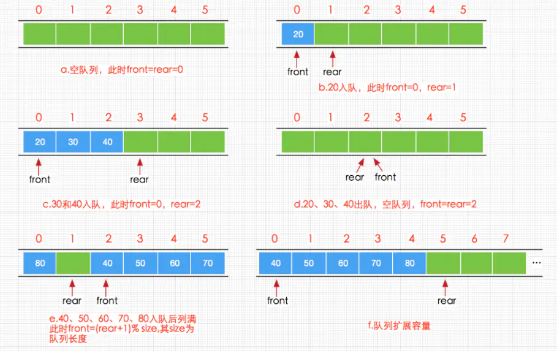

# 循环队列

对于长度一定的数组，存储的空间是确认的，在队列的入队和出队的过程中，数组中的存储空间需要不断的重复使用，那么这里的“不断重复使用”，就需要循环来实现，否则会出现空间的浪费

使用两个参数：front、rear，front 代表的是队列第一个元素的下标，而 rear 代表的是队列最后一个有效元素的下一个元素的下标



入队算法：rear = (rear + 1) % 数组长度

出队算法：front = (front + 1) % 数组长度

```cpp
struct CQ {
    int * pt;
    int size;
    int front;
    int rear;

    CQ(int n) : size(n) {
        pt = new int [size];
        front = 0;
        rear = 0;
    }
    ~CQ () {
        if(pt) delete [] pt;
    }
    bool empty() {
        if(rear == front) return true;
        else return false;
    }
    bool full() {
        if(rear + 1 / size == front) return true;
        else return false;
    }
    bool push(int ele) {
        if(full()) return false;
        pt[rear] = ele;
        rear = (rear + 1) % size;
    }
    bool pop() {
        if(empty()) return false;
        front = (front + 1) % size;
    }
}
```