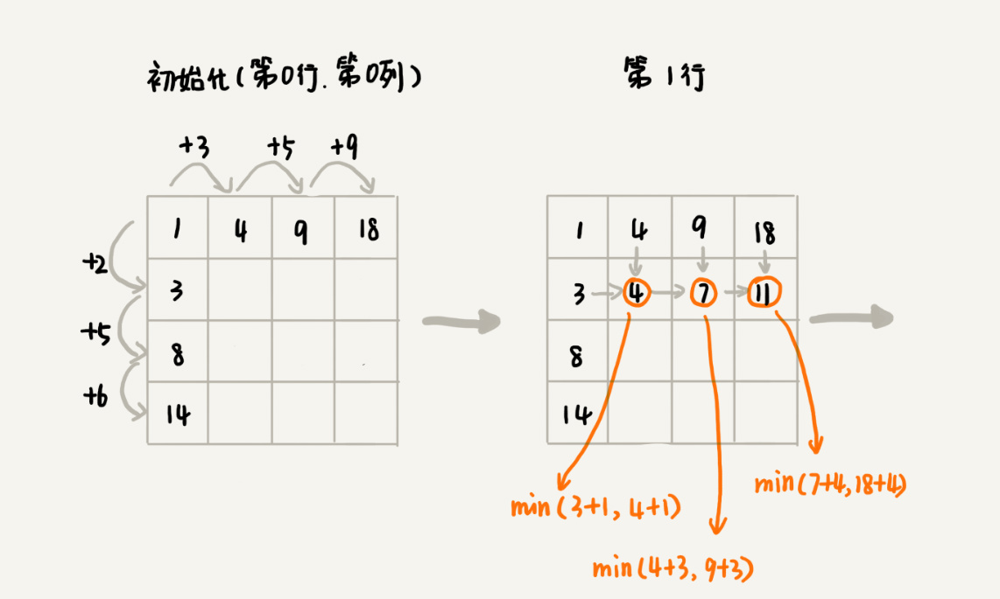

# 动态规划

动态规划适合用来求解最优问题，比如最大值、最小值等，它可以显著地降低时间复杂度，提高代码的执行效率

## 0-1 背包问题

### 回溯算法实现
```cpp
int maxW = INT_MIN;  // 结果放到 maxW 中
int weight[5] {2, 2, 4, 6, 3};  // 物品重量
int w = 9;  // 背包承受最大重量

void f(int i, int cw)  // 现考察是否装入第 i(0-4) 个物品，目前背包重量 cw
{
    if(cw == w || i == 5)  // cw == w 表示装满了  i == 5 表示物品都考擦完了
    {
        if(cw > maxW)   maxW = cw;  
        return;
    }

    f(i + 1, cw);  // 选择不装第 i 个物品
    if(cw + weight[i] <= w)
    {
        f(i + 1, cw + weight[i]);  // 装第 i 个物品
    }
}

int main()
{
    f(0, 0);
    return 0;
}
```


递归树中的每个节点表示一种状态，用 (i, cw) 表示
从递归树中可以发现有些子问题是重复的，比如 f(2, 2) 和 f(3, 4) 都被重复计算了两次，通过记录 f(i, cw) 的值避免冗余计算

```cpp
int maxW = INT_MIN;  // 结果放到 maxW 中
int weight[5] {2, 2, 4, 6, 3};  // 物品重量
int w = 9;  // 背包承受最大重量
bool mem[5][10];

void f(int i, int cw)  // 现考察是否装入第 i(0-4) 个物品，目前背包重量 cw
{
    if(cw == w || i == 5)  // cw == w 表示装满了  i == 5 表示物品都考擦完了
    {
        if(cw > maxW)   maxW = cw;  
        return;
    }

    if(mem[i][cw])  return;  // 重复状态
    mem[i][cw] = true;  // 记录 (i, cw) 这个状态
    f(i + 1, cw);  // 选择不装第 i 个物品
    if(cw + weight[i] <= w)
    {
        f(i + 1, cw + weight[i]);  // 装第 i 个物品
    }
}

int main()
{
    for(auto & e : mem)
    {
        for(auto & l : e)
        {
            l = false;
        }
    }
    f(0, 0);
    return 0;
}
```

### 动态规划实现

把整个求解过程分为 n 个阶段，每个阶段决策一个物品是否放入背包中，每个物品决策（放入或不放入）完之后，背包的物品重量会有多种情况

把每一层重复的状态合并，只记录不同的状态，然后基于上一层的状态集合来推导一下层的状态集合；通过合并每一层重复的状态，就保证了每一层不同状态的个数都不会冲过 w 个（w 表示背包的承载重量）

用二维数组 `bool states[n][w + 1]` 来记录每层可以达到的不同状态

第 0 个（下标从 0 开始编号）物品重量是 2，要么装入要么不装入，对应背包两种状态，用 `states[0][0] = true, states[0][2] = true` 来表示这两种状态

第 1 个物品重量是 2，基于之前的背包状态，在决策完这个物品之后会有 3 个不同的状态，分别是 0(0 + 0), 2(0 + 2, 2 + 0), 4(2 + 2)，用 `states[1][0] = true, states[1][2] = true, states[0][4] = true`

以此类推，考察完所有物品后，整个状态数组都计算好了，只需要在最后一层找一个值为 true 的最接近 w 的值，就是背包中物品重量的最大值

```cpp
int knapsack(bool ** states, int n, int w)
{
    states = new bool* [n];
    for(int i = 0; i < n; ++i)
    {
        states[i] = new bool [w + 1];  // w + 1 个状态
    }

    // 第一行的数据要特殊处理，可利用哨兵优化
    states[0][0] = true;  
    if(weight[0] <= w)    states[0][weight[0]] = true;

    // 动态规划状态转移
    for(int i = 1; i < n; ++i)
    {
        // 不把第 i 个物品放入背包
        for(int j = 0; j <= w; ++j)
        {
            if(states[i - 1][j])    states[i][j] = true;
        }
        // 把第 i 个物品放入背包
        for(int j = 0; j <= w - weight[i]; ++j)
        {
            if(states[i - 1][j])    states[i][j + weight[i]] = true;
        }
    }

    // 输出结果
    for(int i = w; i >= 0; --i)
    {
        if(states[n - 1][i] == true)    return i;
    }
    return 0;
}
```


动态规划思想：把问题分解为多个阶段，每个阶段对应一个决策，记录每一个阶段可达的状态集合（去掉重复的），然后通过当前阶段的状态集合去推导下一个阶段的状态集合，动态地往前推进

尽管动态规划的执行效率比较高，但上面的代码需要额外申请一个 n * (w + 1) 的二维数组，空间消耗比较大（空间换时间）

实际上只需要一个大小为 w + 1的一维数组，

```cpp
int knapsack(bool * states, int n, int w)
{
    states = new bool [w + 1];  // w + 1 个状态

    // 第一行的数据要特殊处理，可利用哨兵优化
    states[0] = true;  
    if(weight[0] <= w)    states[weight[0]] = true;

    // 动态规划状态转移
    for(int i = 1; i < n; ++i)
    {
        // 一维数组只需要考虑放入背包的情况
        // 把第 i 个物品放入背包
        for(int j = w - weight[i]; j >= 0; --j)
        {
            // 这里是从大到小来处理的
            // 如果换成 j 从小到大，会出现 for 循环里重复计算
            if(states[j])    states[j + weight[i]] = true;
        }
    }

    // 输出结果
    for(int i = w; i >= 0; --i)
    {
        if(states[i] == true)    return i;
    }
    return 0;
}
```

## 0-1 背包问题升级

引入物品价值，对于一组不同重量、不同价值、不可分割的物品，如何选择物品在满足重量限制的前提下装入物品总价值最大

### 回溯实现

```cpp
int maxV = INT_MIN;  // 最大价值
int weight[5] {2, 2, 4, 6, 3};  // 物品重量
int value[5] {3, 4, 8, 9, 6};
int w = 9;

void f(int i, int cw, int cv)
{
    if(cw == w || i == n)
    {
        if(cv > maxV)   maxV = cv;
        return;
    }
    f(i + 1, cw, cv);  // 不装第 i 个物品
    if(cw + weight[i] <= w)
    {
        f(i + 1, cw + weight[i], cv + value[i]);  // 选择第 i 个物品
    }
}

int main()
{
    f(0, 0, 0);
    return 0;
}
```


对于 f(2, 2, 4) 和 f(2, 2, 3)，在背包物品重量一样的情况下 f(2, 2, 4) 的物品总价值更大，故可以舍弃 f(2, 2, 3)，只需要沿着 f(2, 2, 4) 的决策路线继续往下决策

也就是说对于 (i, cw) 相同的不同状态只保留 cv 最大的，继续递归处理，但回溯的办法就没办法适应了

### 动态规划实现

把整个求解过程分为 n 个阶段，每个阶段决策一个物品是否放入到背包中，每个阶段决策完之后，背包中的物品的总重量以及总价值会有多种情况，即会达到多种不同状态

用二维数组 `states[n][w + 1]` 来记录每层可达到的不同状态，数组存储的值是当前状态对应的最大总价值，把每层 (i, cw) 重复状态合并，只记录 cv 值最大的状态，然后基于这些状态来推导下一层的状态

```cpp
bool * knapsack(int ** states, int n, int w)
{
    // 初始化 states 数组
    int * states = new int * [n];
    for(int i = 0; i < w; ++i)
    {
        states[i] = new int [w + 1];
        for(int j = 0; j <= w; ++j)
        {
            states[i][j] = -1;
        }
    }

    // 特殊处理第一行
    states[0][0] = 0;
    if(weight[0] <= w)    states[0][weight[0]] = value[0];

    // 动态规划，状态转移
    for(int i = 1; i < n; ++i)
    {
        // 不选择第 i 个物品
        for(int j = 0; j <= w; ++j)
        {
            if(states[i - 1][j] >= 0)   states[i][j] = states[i - 1][j];
        }

        // 选择第 i 个物品
        for(int j = 0; j <= w - weight[i]; ++j)
        {
            if(states[i - 1][j] >= 0)
            {
                int v = states[i - 1][j] + value[i];
                if(v > states[i][j + weight[i]])
                {
                    states[i][j + weight[i]] = v;
                }
            }
        }
    }

    // 找出最大值
    int maxv = -1;  // 计算的最大价值
    int minm = 0;  // 最大价值对应的最大质量
    for(; minm <= w; ++minm)
    {
        if(states[n - 1][minm] > maxv)    maxv = states[n - 1][minm];
    }

    // 反推组合情况
    // 在满足重量的情况下，价值都是 -1
    if(minm == w + 1)   return nullptr;  
    // 在满足重量情况下，最大价值为 maxv，质量为 maxm
    bool * ans = new bool[n];
    for(int i = n - 1; i>= 1; --i)
    {
        // 要选择第 i 个物品，必须重量不超标
        // 并且在决策第 i - 1 个物品后质量为 maxm - weight[i]
        if(maxm - weight[i] >= 0 && states[i - 1][maxm- weight[i]] != -1)
        {
            maxm = maxm - weight[i];
            ans[i] = true;
        }
    }
}
```

可以通过 states 数组倒推组合情况；由于状态 (i, j) 只能从 (i - 1, j) 或 (i - 1, j - value[i]) 两个状态推导过来，所以只需检查者两个状态是否可达

## 什么问题适合用动态规划

### 一个模型三个特征

- 多阶段决策最优解模型：解决问题的过程中需要经历多个决策阶段，每个决策阶段都对应一组状态；然后寻找一组决策序列，经过这组序列能够产生最终期望求解的最优解

- 最优子结构特征：问题最优解包含子问题的最优解，即可以通过子问题的最优解推导出问题的最优解，即后面阶段的状态可以通过前面阶段的状态推导出来

- 无后效性特征：一是在推导后面阶段状态时只关心前面阶段的状态值，而不关心这个状态时怎么一步一步推导出来的；二是某阶段一旦确定，就不受后面阶段的决策影响

- 重复子问题特征：不同决策序列，到达某个相同的阶段时，可能会产生重复的状态

### 实例

假设有个 n * n 的矩阵 w[n][n]，矩阵存储的都是正整数，棋子从起始位置运动到终止位置，每次只能向下移动一格或向右移动一格，把经过的格子的数字加起来作为路径的长度，求最短路径


- 一个模型：从 (0, 0) 到 (n - 1, n - 1) 总共要走 2 * (n - 1) 步，也就对应了 2 * (n - 1) 个阶段，并且每个阶段对应一个状态集合；状态定义为 min_dist(i, j)，i 表示行，j 表示列，min_dist(i, j) 的值表示从 (0, 0) 到 (i, j) 的最短路径长度

- 用回溯算法求解的递归树中有重复节点。即存在重复子问题特征

- 走到 (i, j) 时只能通过 (i - 1, j) 或 (i, j - 1) 这两个位置移动过来，所以计算 (i, j) 状态时只需要关心 (i - 1, j) 和 (i, j - 1) 两个位置对应的状态，并不关心是通过怎么样的路线到达这两个位置的，所以前面阶段的状态确定之后不会被后面阶段的决策改变。即存在无后效性特征

- min_dist(i ,j) 可以通过 min_dist(i, j - 1) 和 min_dist(i - 1, j) 推导出来。即存在最优子结构特征


## 两种动态规划解题思路总结

### 状态转移表法

一般能用动态规划解决的问题，都能通过回溯算法的暴力搜索解决，所以可以先用简单的回溯算法解决，然后定义状态，每个状态表示一个节点然后对应画出递归树

第一种思路：找到重复子问题后，可以直接用回溯加记录的方法避免重复子问题，在执行效率上跟动态规划没有区别

第二种思路：状态转移表法，先画出一个状态表，一般是二维的，可以把它想象成二维数组，包括行、列、值三个变量；根据决策的先后过程从前往后，根据递推关系，分阶段填入状态表中的每个状态；最后将递推填表的过程翻译成代码；如果问题的状态比较复杂需要很多变量表示，可以将状态表写成高维的

回溯算法解决最短路径问题
```cpp
int mindist = INT_MAX;  // 最短路径

// w[n][n] 数组表示格子的值
void minDist(int i, int j, int dist)
{
    // 这里已经到达了 n - 1, n - 1 这个位置
    // 与 mindist 比较的值是传入的 dist
    if(i == n && j == n)
    {
        if(dist > mindist)    mindist = dist;
        return;
    }

    // 往下走
    if(i < n)   minDist(i + 1, j, dist + w[i][j]);
    // 往右走
    if(j < n)   minDist(i, j + 1, dist + w[i][j]);
}
```


虽然递归树中没有重复的 (i, j, dist), 但 (i, j) 有重复的，对于重复的 (i, j) 只保存 dist 最小的

画出二维状态表，行、列表示棋子所在的位置，值表示最短路径




根据填表过程，翻译成代码

```cpp
int minDist()
{
    // 定义状态矩阵
    int ** states = new int * [n];
    for(int i = 0; i < n; ++i)
    {
        states[i] = new int [n];
    }

    // 初始化第一行第一列
    int sum_row = 0, sum_col = 0;
    for(int i = 0; i <n; ++i)
    {
        sum_row += w[0][i];
        sum_col += w[i][0];
        states[0][i] = sum_row;
        states[i][0] = sum_col;
    }

    // 填表
    for(int i = 1; i < n; ++i)
    {
        for(int j = 1; j < n; ++j)
        {
            states[i][j] = min(states[i - 1][j], states[i][j - 1]) + w[i][j];
        }
    }
    return states[n - 1][n - 1];
}
```

### 状态转移方程法

状态转移方程法类似递归，需要分析某个问题如果通过子问题来递归求解，也就是最优子结构，根据最优子结构写出递归公式，即状态转移方程

有两种代码实现方法，一种是递归加记录，一种是迭代递推

```cpp
// 状态转移方程
min_dist(i, j) = w[i][j] + min(min_dist(i, j - 1), min_dist(i - 1, j))
```

```cpp
// 递归加记录实现
int mem[4][4];

int minDist(int i, int j) 
{
    if(i == 0 && j == 0)    return w[0][0];
    if(mem[i][j] > 0)   return mem[i][j];

    int minLeft = INT_MAX;
    if(j - 1 >= 0)  minLeft =minDist(i, j - 1);
    int minUp = INT_MAX;
    IF(i - 1 >= 0)  minUp = minDist(i - 1, j);

    mem[i][j] = w[i][j] + min(minLeft, minUp);
    return mem[i][j];
}
```