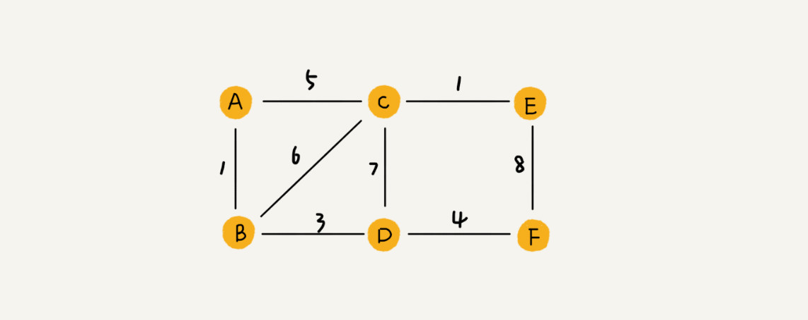

# 图

图是非线性表数据结构，涉及到图的搜索、最短路径、最小生成树、二分图等


## 定义

- 图中的元素称作顶点（vertex）
- 图中的一个顶点可以与任意其他顶点建立连接关系，建立的关系叫作边（edge）
- 跟顶点相连接的边的条数为顶点的度（degree）
- 边有方向则为有向图，没方向则为无向图
- 无向图中顶点有度，有向图中顶点有入度（In-degree，表示有多少条边指向这个顶点）和出度（Out-degree，表示有多少条边以这个顶点为起点指向其他顶点）
- 带权图（weighted graph）每条边都有一个权重（weight）



## 存储

### 领接矩阵存储(Adjacency Matrix)

底层依赖一个二维数组

- 无向图：如果顶点 i 与顶点 j 之间有边，则将 `A[i][j]` 和 `A[j][i]` 标记为 1
- 有向图：如果顶点 i 指向顶点 j ，则将 `A[i][j]` 标记为 1；
- 带权图： `A[i][j]` 存储相应权值


用领接矩阵表示图，虽然简单、直观，因为基于数组所以在获取两个顶点关系时非常高效，同时可以将很多图的运算转换成矩阵的运算，但比较浪费存储空间

对于无向图，如果 `A[i][j]` 等于 1，那么 `A[j][i]` 也肯定等于1，则只需要存储一个就可以了，所以浪费了一半的存储空间

对于稀疏图（Sparse Matrix），即顶点很多但每个顶点的边并不多，用领接矩阵存储更加浪费空间


### 邻接表存储(Adjacency List)

每个顶点对应一个链表，链表中存储的是与这个顶点相连接的其他顶点


领接矩阵存储起来浪费空间，但使用节省时间；领接表存储节省空间，但使用浪费时间

## 搜索

深度优先搜索算法和广度优先搜索算法都是基于图这种数据结构

图上的搜索算法就是，在图中找出从一个顶点出发到另一个顶点的路径；具体方法包括：深度优先、广度优先、 A* 等

深度优先搜索和广度优先搜索既可用在无向图，也可用在有向图

```cpp
class Graph
{
private:
	int v;  // 边数
	std::list<int> * edge;  // 领接表

public：
	Graph(int nums)
	{
		v = nums;
		edge = new std::list<int>[v];
	}

	~Graph()
	{
		if(edge != nullptr)
		{
			delete [] edge;
		}
	}

	void add(int s, int e)
	{
		edge[s].push_back(e);
		edge[e].push_back(s);
	}
}
```

### 广度优先搜索（BFS）

一种“地毯式”层层推进的搜索策略，即先查找离起始顶点最近的，然后是次近的，依次往外搜索


广度搜索的路径是最短路径

```cpp
void CGraph::Printf(int * pt, int start, int end)
{
	if (start != end && pt[end] != -1)
	{
		Printf(pt, start, pt[end]);
	}
	std::cout << end << std::endl;
}

void CGraph::BFS(int start, int end)
{
	if (start == end)
	{
		return;
	}
	bool * visited = new bool [v];
	int * prev = new int[v];
	for (int i = 0; i < v; ++i)
	{
		prev[i] = -1;
		visited[i] = false;
	}
	visited[start] = true;

	std::queue<int> queue;
	queue.push(start);

	while (queue.size() != 0)
	{
		int top = queue.front();
		for (auto ite = edge[top].begin(); ite != edge[top].end(); ite++)
		{
			if (end != *ite)
			{
				if (!visited[*ite])
				{
					queue.push(*ite);
					visited[*ite] = true;
					prev[*ite] = top;
				}
			}
			else
			{
				prev[*ite] = top;
				Printf(prev, start, end);
				delete[] prev;
				delete[] visited;
				return;
			}
		}
		queue.pop();
	}

	delete[] prev;
	delete[] visited;
}
```

`visited` 用来记录已经被访问的顶点，用来避免顶点被重复访问

`queue` 用来存储已经被访问、但相连的顶点还没有被访问的顶点

`prev` 用来记录搜索路径


最坏情况下，终止顶点 t 离起始顶点 s 很远，需要遍历完整个图才能找到，所以广度优先搜索的时间复杂度是 O(V+E)，其中，V 表示顶点的个数，E 表示边的个数；对于一个连通图来说，也就是说一个图中的所有顶点都是连通的，E 肯定要大于等于 V - 1，所以，广度优先搜索的时间复杂度也可以简写为 O(E)

空间复杂度是 O(V)

### 深度优先搜索（DFS）

深度优先搜索用的是回溯思想，这种思想解决问题的过程，非常适合用递归来实现

深度优先搜索找出来的路径并不是最短路径


```cpp
void CGraph::DFS(int start, int end)
{
	bool found = false;
	bool * visited = new bool[v];
	int * prev = new int[v];
	for (int i = 0; i < v; ++i)
	{
		visited[i] = false;
		prev[i] = -1;
	}

	RDFS(start, end, visited, prev, found);
	Printf(prev, start, end);
}

void CGraph::RDFS(int start, int end, bool * v, int * pr, bool & found)
{
	if (found)
	{
		return;
	}
	v[start] = true;
	if (start == end)
	{
		found = true;
		return;
	}

	for (auto ite = edge[start].begin(); ite != edge[start].end(); ++ite)
	{
		if (!v[*ite])
		{
			pr[*ite] = start;
			RDFS(*ite, end, v, pr, found);
		}
	}
}
```

图上的深度优先搜索算法的时间复杂度是 O(E)，空间复杂度就是 O(V)

## 有权图最短路径算法

图结构中一个显而易见的定理：最短路径的子路径仍然是最短路径

对于有权图，如果权边有负数，则分两种情况：

1. 如果从某点出发，可以到达一个权值和为负数的环，那么这个点到其他点的最短距离就是负无穷了

2. 如果说不存在一个这样的负环，那么就和没有负权边一样了

### Floyd 算法

Floyd 算法一种基于动态规划的多源最短路算法，只能在不存在负权环的情况下使用，因为其并不能判断负权环

定义状态：`f[k][i][j]` 为经过前 k 个节点，从 i 到 j 所能得到的最短路径，可以从 `f[k - 1][i][j]` 转移过来（即不经过第 k 个节点）；也可以从 `f[k - 1][i][k] + f[k - 1][k][j]` 转移过来，即经过第 k 个节点；

状态转移方程：`f[k][i][j] = min(f[k-1][i][j], f[k-1][i][k] + f[k-1][k][j]) `，降维后为：`f[i][j] = min(f[i][j], f[i][k] + f[k][j]) `

```cpp
// 初始化为一个比较大的值
vector<vector<int>> graph(n, vector<int>(n, INT_MAX / 2));  
initGraph(graph);  // 给图中的边赋值

for(int k = 0; k < n; ++k) {
	for(int i = 0; i < n; ++i) {
		for(int j = 0; j < n; ++j) {
			graph[i][j] = min(graph[i][j], graph[i][k] + graph[k][j]);
		}
	}
}

/*
// 记录路径
vector<vector<int>> path(n, vector<int>(n, -1));
for(int k = 0; k < n; ++k) {
	for(int i = 0; i < n; ++i) {
		for(int j = 0; j < n; ++j) {
			if(graph[i][j] > graph[i][k] + graph[k][j]) {
				graph[i][j] = graph[i][k] + graph[k][j];
				path[i][j] = k;
			}
		}
	}
}

function<string(int, int)> helper = [&](int i, int j)->string {
	if(path[i][j] == -1) {
		return to_string(i) + " -> " + to_string(j);
	}
	else {
		int k = path[i][j];
		return helper(i, k) + " -> " + helper(k, j);
	}
};
*/
```

维护路径矩阵使得空间复杂度达到了 O(n^2)，时间复杂度达到了 O(n^3)

### Dijkstra 算法

Dijkstra 算法适用于求单源最短路径，主要特点是以起始点为中心向外层层拓展（广度优先搜索思想），直到拓展到终点为止，要求图中的边全部非负

维护两个点集 A，B，A 点集代表已经求出源点到该点的最短路的点的集合，B 代表未求出源点到该点的最短路径的点的集合。维护一个向量 d，d[i] 代表源点到点 i 的最短路径长度；不断进行以下操作：找出点集 B 中 d[i] i∈B 最小的点，这个点为进入点集A的候选节点，然后通过该点松弛点集 B 中其他的点，更新向量 d，然后将该候选点放入点集 A，直到点集 B 为空

```cpp
vector<vector<int>> graph(n, vector<int>(n, INT_MAX));

int dijkstra(int start, int end) {
	vector<int> dist(n, INT_MAX / 2);
	unordered_set<int> A, B;
	A.insert(start);
	for (int i = 0; i < n; ++i) {
		dist[i] = (i == start ? 0 : graph[start][i]);
		if (i != start) B.insert(i);
	}

	// 在 B 中找 dist 里最小的值加入 A
	while (B.size()) {
		int pos = 0;
		int INF = INT_MAX;
		for (int i = 0; i < n; ++i) {
			if (B.count(i) && dist[i] < INF) {
				pos = i;
				INF = dist[i];
			}
		}
		B.erase(pos);
		A.insert(pos);
		for (int i = 0; i < n; ++i) {
			if (B.count(i)) {
				dist[i] = min(dist[i], dist[pos] + graph[pos][i]);
			}
		}
	}
	return dist[end];
}
```

算法的时间复杂度为 O(n^2)，若通过这个算法求所有的点的最短路，即调用 n 次，那么算法复杂度为 O(n^3)；对于集合 B 可使用优先队列进行优化，时间复杂度为 O(nlogn)

```cpp
int dijkstra(int start, int end) {
	vector<int> dist(n, INT_MAX / 2);
	vector<pair<int, int>> B;
	vector<int> path(n, start);  // 存储前驱节点
	for (int i = 0; i < n; ++i) {
		dist[i] = (i == start ? 0 : roads[start][i]);
		if (i != start) B.emplace_back(make_pair(dist[i], i));
	}
	make_heap(B.begin(), B.end(), greater<pair<int, int>>());

	// 在 B 中找 dist 里最小的值加入 A
	while (B.size()) {
		// 取出最小值
		pop_heap(B.begin(), B.end());
		auto pos = B.back();
		B.pop_back();
		
		// 更新
		for (int i = 0; i < B.size(); ++i) {			
			if (dist[B[i].second] > dist[pos.second] + roads[pos.second][B[i].second]) {
				dist[B[i].second] = dist[pos.second] + roads[pos.second][B[i].second];
				path[B[i].second] = pos.second;
			}
			B[i].first = dist[B[i].second];
		}
		make_heap(B.begin(), B.end(), greater<pair<int, int>>());
	}
	function<void(int, int)> print = [&](int s, int e) {
		if(s == e) return;
		print(s, path[e]);
		cout << s << " -> " << path[e];
	};
	print(start, end);
	return dist[end];
}
```

### Bellman-Ford 算法

用于计算出起点到各个节点的最短距离，支持存在负权重的情况

与 Dijkstra 最大的不同是每次都是从源点 s 重新出发进行松弛更新操作，而 Dijkstra 则是从源点出发向外扩逐个处理相邻的节点，不会去重复处理节点

流程：

1. 初始化时将起点 s 到各个顶点 v 的距离 dist(s->v) 赋值为无穷大，dist(s->s) 赋值为 0

2. 后续进行最多 n-1 次遍历操作，对所有的边进行松弛操作，因为在一个含有 n 个顶点的图中，任意两点之间的最短路径最多包含 n-1 边；第 i 轮在对所有边进行松弛后，得到的是源点最多经过 i 条边到达其他顶点的最短距离

3. 遍历都结束后，若再进行一次遍历，还能得到s到某些节点更短的路径的话，则说明存在负环路

```cpp
vector<vector<int>> g(n, vector<int>(n, INT_MAX));
vector<int> dist(n, INT_MAX / 2);
InitGraph(g);

for(int i = 1; i < n; ++i) {
	for(int j = 0; j < n ; ++j) {
		for(int k = 0; k < n; ++k) {
			// 因为只是求最短路径，所以可以使用本次最外层循环更新过的数据
			dist[k] = min(dist[k], dist[j] + g[j][k]);
			// 如果有要求最多经过几条边，则不能使用本次最外层循环更新过的数据
		}
	}
}

bool loop = false;
for(int j = 0; j < n ; ++j) {
	for(int k = 0; k < n; ++k) {
		if(dist[k] < dist[j] + g[j][k]) {
			loop = true;  // 有负环
		}
	}
}
```

## 模板

### 广度单向搜索

```cpp
q.push(start)
while(!q.empty()) {
	size = q.size();
	// 层次遍历完
	while(size-- > 0) {
		node = q.top();
		q.pop();
		new_node = fun(node);
		if(g(new_node)) return;
		q.push(new_node);
	}
	return;
}
```

### 双向广度搜索

适用于已知初始点和目标点，对初始点和目标点分别进行广度搜索，提高搜索效率
```cpp
unordered_set<string> s1, s2;  // 初始点和目标点的搜索集合
s1.insert(start);
s2.insert(end);
int step = 0;  // 搜索步长
while(!s1.empty() && !s2.empty()) {
	++step;
	// 每步只搜索较小集合
	if(s1.size() > s2.size()) swap(s1, s2);
	unordered_set<string> s;
	for(string str : s1) {
		// str 能扩展的所有节点
		for(string new_str : expand(str)) {
			if(s2.count(new_str)) return step + 1;
			s.insert(new_str);
		}
	}
	swap(s1, s);
}
return 0;
```

### 拓扑排序

拓扑排序适用于单向无环图，可以判断单向图是否有环，也可以用来记录访问的过程

#### DFS 实现

与传统 DFS 不同，一个节点有三个状态：未访问过、访问中、访问过，但无法控制相同级别节点的访问顺序

```cpp
vector<vector<int>> graph;
vector<int> vis;  // 0 未访问, 1 visiting, 2 visited
vector<int> path;
function<bool(int)> dfs = [&](int n)->bool {
	if(vis[n] == 2) return false;
	if(vis[n] == 1) return true;
	vis[n] = 1;
	for(int i = 0; i < graph[n].size(); ++i) {
		if(dfs(graph[n][i])) return true;
	}
	vis[n] = 2;
	/*
	add node to the head of ordered_list
	先被标记为 visited 的节点是最后被访问的
	*/
	path.push_back(n);
	return false;
};
for(int i = 0; i < graph.size(); ++i) {
	if(dfs(i)) return true;  // 有环
}
return false;
```

#### BFS 实现

记录每个点的入度，将入度为 0 的顶点加入队列，每次从该集合中取出(没有特殊的取出规则，随机取出也行，使用队列/栈也行)一个顶点，将该节点放入保存结果的容器中，紧接着循环遍历由该顶点引出的所有边，从图中移除这条边，同时获取该边的另外一个顶点，如果该顶点的入度在减去本条边之后为 0，那么也将这个顶点放到入度为 0 的集合中

当出队的个数等于图节点个数的时候是无环图，相反便是有环图

与 DFS 相比可以控制相同级别节点的控制顺序

```cpp
// n 节点个数
// vector<vector<int>> input 输入边

vector<vector<int>> graph(n);
vector<int> indegree(n, 0);

for(auto i : input) {
	graph[i[0]].push_back(i[1]);
	indegree[i[1]] += 1;
}

// 这里可以根据顺序规则选择相关的容器保存入度为 0 的节点
// 这里以节点数值大小为顺序，小的排前面
priority_queue<int, vector<int>, greater<int>> pq;
for(int i = 0; i < n; ++i) {
	if(indegree[i] == 0) pq.push(i);
}

int cnt = 0;
vector<int> path(n);
while(!pq.empty()) {
	int u = pq.top();
	pq.pop();
	path[cnt++] = u;
	for(int j = 0; j < graph[u].size(); ++j) {
		int w = graph[u][j];
		indegree[w] -= 1;
		if(indegree[w] == 0) pq.push(w);
	}
}
if(cnt == n) return false;  // 无环
else return true;  // 有环 
```