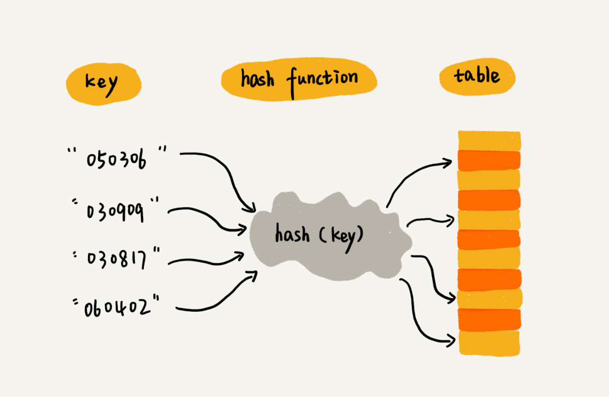
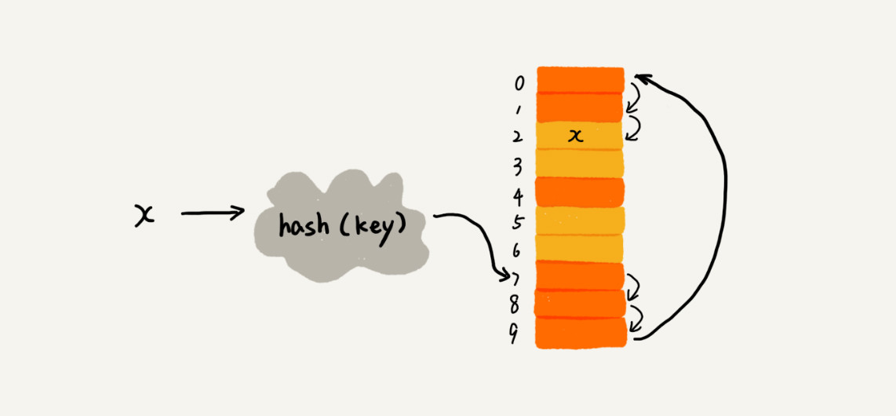
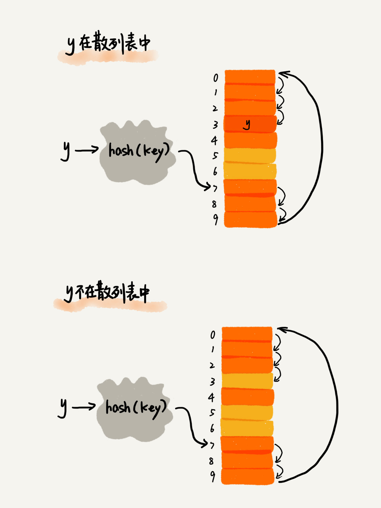
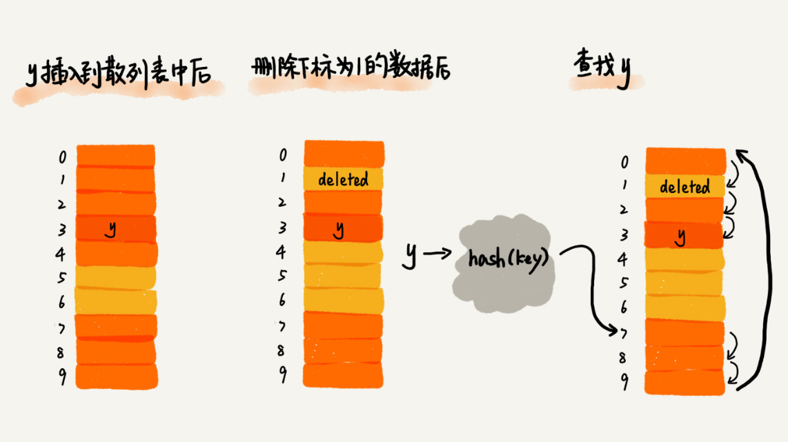

# 哈希表

哈希表用的是数组支持按照下标随机访问数据特性，所以哈希表其实就是数组的一种扩展，由数组演化而来

数组存储的值与数组下标形成映射，所以利用数组支持根据下标随机访问时间复杂度 O(1) 的特性，可以快速查找

存储的值为哈希键（key）
将哈希键转换为数组下标的映射方法为哈希函数（hash function），得到的值为哈希值（value)



我们通过哈希函数把元素的键值映射为下标，然后将数据存储在数组中对应下标的位置

当我们按照键值查询数据时，可以用同样的哈希函数将键值转化为数组下标，从对应的数组下标的位置获取数据


## 哈希函数
把它定义成 hash(key)，key 表示元素的键值，经过哈希函数计算得到哈希值

哈希函数设计的基本要求：
- 哈希函数计算得到的哈希值是一个非负整数；因为数组下标从 0 开始，所以散列值必须是非负整数
- 如果 key1 = key2，那 hash(key1) == hash(key2)；相同的 key，经过哈希函数得到的值也应该相同
- 如果 key1 != key2，那 hash(key1) != hash(key2)；无法避免哈希冲突

### 哈希冲突
再好的哈希函数也无法避免哈希冲突，常用开放寻址法和链表法来解决

#### 开放寻址法
核心思想是如果出现了哈希冲突，我们就重新探测一个空闲位置将其插入；插入方法有：线性探测、二次探测和双重哈希

1.  线性探测：当我们往哈希表中插入数据时，如果某个数据经过哈希函数之后，存储位置已经被占用了，我们就从当前位置开始，依次往后查找，看是否有空闲位置，直到找到为止


  
从图中可以看出，哈希表大小为 10，已经有 6 个元素插入到哈希表中；x 经过哈希函数得到哈希值 7，但这个位置已经有数据了，所以产生了冲突；我们按顺序一个一个往后找，看有没有空闲位置，遍历到尾部都没有找到空闲位置，于是再从表头开始找，直到找到空位 2，于是将其值插入到这个位置
  
在哈希表中查找元素的过程类似于插入过程；我们通过哈希函数求出查找元素的键值对应的哈希值，然后比较数组中下标为哈希值的元素和要查找的元素；如果相等，说明是要查找的元素，如果不是，则按顺序往后依次查找，如果遍历到数组中的空位位置，还没找到，则说明查找到的元素不在哈希表中
  


哈希表跟数组一样，不仅支持插入、查找，还支持删除，对于使用线性探测的哈希表，删除操作有些不同，不能单纯地把要删除的元素设置为空，因为在查找的时候，我们通过找到一个空闲位置来判定数据在不在哈希表中，如果这个空闲位置是我们后来删除的，就会导致原来的查找算法失败，本来存在数据会被认为不存在；为解决这个问题，我们可以将删除的元素特殊标记为 deleteed，当线性探测查找的时候，遇到标记为 deleted 的空间，并不停下来而是继续探测


  
线性探测存在很大的问题，当散列表插入的数据越来越多时，哈希冲突发生的可能性就越来越大，空闲位置会越来越少，线性探测的时间就会越来越久；极端情况下可能需要探测整个哈希表，所以最坏的时间复杂度是 O(n)；同理，删除和查找时也有可能会线性探测整张哈希表才能查找或删除数据
    
    
2. 二次探测：线性探测每次探测的步长是 1，二次探测步长是线性探测的二次方

线性探测的下标序列：hash(key)+0、hash(key)+1、hash(key)+2、...
二次探测的下标序列是：hash(key)+0^2、hash(key)+1^2、hash(key)+2^2、...


3. 双重哈希：我们先用一个哈希函数，如果计算得到的存储位置被占用，再用第二个哈希函数，以此类推直到找到空闲的存储位置


#### 链表法

在每一个表格元素中维护一个 `list`，哈希函数为元素分配一个 `list`，然后在 `list` 上执行元素的插入、搜寻、删除等操作

使用链表法，装载因子将大于 1


但不管采用哪种探测方法，当哈希表中位置不多时，哈希冲突的概率大大提高；为了保证哈希表的操作效率，一般情况下尽可能保证哈希表中有一定比例的空闲槽位，用装载因子来表示空位的多少
```
装载因子 = 填入表中的元素个数 / 散列表长度
```

---
哈希表的查询效率并不能笼统地说成是 O(1)，它跟哈希函数、装载因子、哈希冲突等都有关系；如果哈希函数设计得不好，或者装载因子过高，多会导致哈希冲突发生的概率升高，查询效率降低

好的哈希函数：
1. 不能太复杂，复杂的哈希函数会消耗很多计算时间，间接的影响到哈希表的性能
2. 哈希函数生成的值尽可能随机并且均匀分布，避免哈希冲突

装载因子过大，说明哈希表的元素越多，空闲位置越少，哈希冲突的概率就越大；当装载因子过大时，我们可以进行动态扩容，重新申请一个更大的哈希表，将数据搬移到新的哈希表中；针对哈希表的扩容，需要通过哈希函数重新计算每个数据的存储位置；支持动态扩容的哈希表，插入一个数据最好的情况时间复杂度是 O(1)，最坏的情况，启动动态扩容，时间复杂度 O(n)，所以均摊情况下时间复杂度是 O(1)

为了解决一次性扩容耗时过多的情况，我们可以将扩容操作穿插在插入操作过程中，分批完成；达到装载因子阈值时，只申请新空间，但并不将老的数据搬移到新哈希表中，当有新数据要插入时，我们将新数据插入新哈希表中，并且从老的哈希表中拿出一个数据放入到新哈希表中；这样没有了集中一次性；查询时，为了兼容新老哈希表，我们先从新哈希表中查找，如果没有找到，再去老的哈希表中查找，插入一个数据时间复杂度都是 O(1)

开放寻址法解决哈希冲突：当数据量比较小、装载因子小的时候，适合采用
链表法解决哈希冲突：链表法对内存的利用率高，因为链表节点可以在需要的时候再创建；链表法对大装载因子的容忍度更高；适用于存储大对象、大数据量的哈希表，而且更加灵活，支持更多的优化策略

---
哈希表和链表经常一块使用

哈希表这种数据结构虽然支持非常高效的数据插入、删除、查找操作，但哈希表中的数据都是经过哈希函数打乱之后无规律存储的，它无法支持按照某种顺序快速地遍历数据；如果希望按照顺序遍历哈希表，我们需要将哈希表中的数据拷贝到数组中，然后排序再遍历；所以将哈希表和链表或跳表结合在一起使用