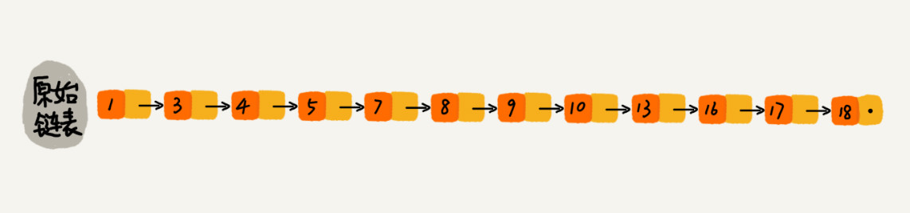

# 跳表  --待实现

二分查找底层依赖数据的随机访问特性，所以只能用数组来实现

如果数据存储在链表中，我们对链表进行稍加改造，就可以支持类似“二分”查找的算法，把改造之后的数据结构称作跳表

---

跳表是一种各方面性能都比较优秀的动态数据结构，可以支持快速的插入、删除、查找操作，写起来也不复杂

对链表建立一级“索引”，每两个节点提取一个节点到上一级，把抽出来的那一级叫做索引或索引层；如图， down 指针指向下一级节点；加上一层索引之后，查找一个节点需要遍历的节点个数减少，查找效率提升了
  

在一级索引的基础上，每两个节点就抽出一个节点到第二级索引，需要遍历的节点数量又减少了这种链表加多级索引的结构就是跳表

### 时间复杂度 O(logn)
假设最高索引有 2 个节点，会有 logn 级索引，每层最多遍历 3 个节点，所以时间复杂度 O(logn)
空间换时间的设计思路

### 空间复杂度 O(n)
包含 n 个节点，需要额外接近 n 个节点的存储空间

实际上，索引节点只需要存储关键值和几个指针，并不需要存储对象，所以当对象比索引节点大很多时，索引占用的空间可以忽略

### 动态插入和删除
动态插入、删除的时间复杂度也是 O(logn)

删除时，如果节点在索引中出现，我们除了删除原始链表中的节点，还要删除索引中的
  
### 索引动态更新
当不停往调表中插入数据时，如果不更新索引就有可能出现某两个索引节点之间数据非常多，极端情况下跳表会退化成单链表；我们需要某种手段来维护索引与原始链表大小之间的平衡，也就是说如果链表中结点多了，索引节点也要相应的增加；通过一个随机函数，来决定将这个结点插入到哪几级索引中，比如随机生成一个k ，那就将这个结点添加到第一级到第 k 级的索引中

