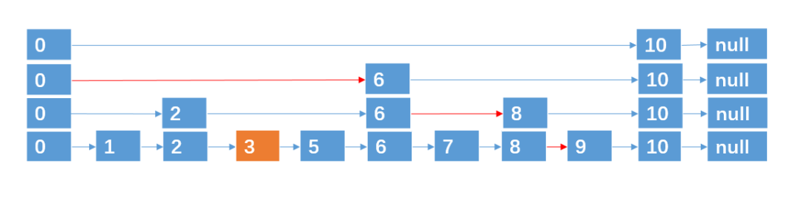
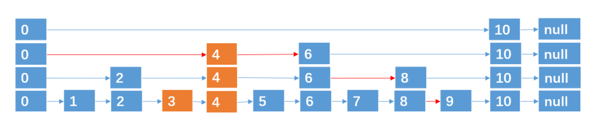
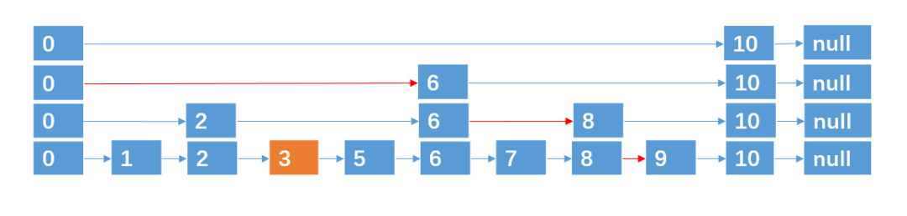

# 跳表 

二分查找底层依赖数据的随机访问特性，所以只能用数组来实现

如果数据存储在链表中，我们对链表进行稍加改造，就可以支持类似二分查找的算法，把改造之后的数据结构称作跳表

跳表是一种各方面性能都比较优秀的动态数据结构，可以支持快速的插入、删除、查找操作，写起来也不复杂


对链表建立一级索引，每两个节点提取一个节点到上一级，把抽出来的那一级叫做索引或索引层；down 指针指向下一级节点；加上一层索引之后，查找一个节点需要遍历的节点个数减少，查找效率提升了
  


在一级索引的基础上，每两个节点就抽出一个节点到第二级索引，需要遍历的节点数量又减少了这种链表加多级索引的结构就是跳表

假设最高索引有 2 个节点，会有 logn 级索引，每层最多遍历 3 个节点，所以时间复杂度 O(logn)
空间换时间的设计思路

包含 n 个节点，需要额外接近 n 个节点的存储空间

实际上，索引节点只需要存储关键值和几个指针，并不需要存储对象，所以当对象比索引节点大很多时，索引占用的空间可以忽略

动态插入、删除的时间复杂度也是 O(logn)


删除时，如果节点在索引中出现，我们除了删除原始链表中的节点，还要删除索引中的
  
当不停往调表中插入数据时，如果不更新索引就有可能出现某两个索引节点之间数据非常多，极端情况下跳表会退化成单链表；我们需要某种手段来维护索引与原始链表大小之间的平衡，也就是说如果链表中结点多了，索引节点也要相应的增加；通过一个随机函数，来决定将这个结点插入到哪几级索引中，比如随机生成一个k ，那就将这个结点添加到第一级到第 k 级的索引中


## 索引建立策略

新插入的结点应该跨越的层数是通过抛硬币来决定新插入结点跨越的层数

每次要插入一个结点的时候，就来抛硬币，如果抛出来的是正面，则继续抛，直到出现负面为止，统计这个过程中出现正面的次数，这个次数作为结点跨越的层数

### 插入

例如，当插入 3 时，通过抛硬币得到跨越层数为 0，则插入 3 跨越 0 层



插入 4 时，通过抛硬币得到跨越层数为 2



### 删除

直接把元素和所跨越层数删除




## 红黑树和跳表

红黑树插入、删除结点时，是通过调整结构来保持红黑树的平衡，比起跳跃表直接通过一个随机数来决定跨越几层，在时间复杂度的花销上是要高于跳跃表的

跳表的复杂度和红黑树一样，但实现起来更简单

在并发环境下，红黑树在插入和删除的时候由于需要做一些平衡的操作，这样的操作可能会涉及到整个树的其他部分，而跳表的操作显然更加局部性一些，锁需要盯住的节点更少，因此在并发情况下性能好一些

## 实现

```cpp
class SkipList {
private:
    struct Node {
        typedef shared_ptr<Node> node_ptr;
        int value;
        int level;          // 跨越几层
        vector<node_ptr> next; // 指向下一个节点

        Node(int v, int l) : next(l, nullptr) {
            value = v;
            level = l;
        }

        ~Node() {
            cout << "delete " << value << endl;
        }
    };

private:
	int maxLevel;               // 允许的最大层数
	int size;                   // 当前节点数
	int levelCount;             // 当前层数
	Node::node_ptr head;        // 头结点
	default_random_engine dre;  // 随机数引擎

public:
	SkipList() {
		maxLevel = 4;
		size = 0;
		levelCount = 1;
		head = make_shared<Node>(INT_MIN, maxLevel);
	}

	// 为简化处理，跳表不会插入重复值
	void insert(int val) {
		int level = get_level() % maxLevel + 1;
		auto node = make_shared<Node>(val, level);

		// 注意这里的逻辑
		auto idx = head;
		for (int i = level - 1; i >= 0; --i) {
			while (idx->next[i] && idx->next[i]->value < val) {
				idx = idx->next[i];
			}
			auto tmp = idx->next[i];
			idx->next[i] = node;
			node->next[i] = tmp;
		}
		levelCount = max(levelCount, level);
		++size;
	}

	const Node::node_ptr find(int val) {
		auto idx = head;
		for (int i = levelCount - 1; i >= 0; --i) {
			while (idx->next[i] && idx->next[i]->value < val) {
				idx = idx->next[i];
			}
		}
		if (idx->next[0] && idx->next[0]->value == val) {
			return idx->next[0];
		}
		else return nullptr;
	}

	void remove(int val) {
		auto idx = head;
		Node::node_ptr node = nullptr;
		for (int i = levelCount - 1; i >= 0; --i) {
			while (idx->next[i] && idx->next[i]->value < val) {
				idx = idx->next[i];
			}
			if (idx->next[i] && idx->next[i]->value == val) {
				node = idx->next[i];
				idx->next[i] = node->next[i];
			}
		}
	}

	void print() {
		for (int i = levelCount - 1; i >= 0; --i) {
			auto idx = head->next[i];
			while (idx) {
				cout << idx->value << "  ";
				idx = idx->next[i];
			}
			cout << endl;
		}
		cout << endl;
	}

private:
	// 获取随机层数
	int get_level() {
		int level = 1;
		while (dre() % 2) {
			++level;
		}
		return level;
	}
};


```