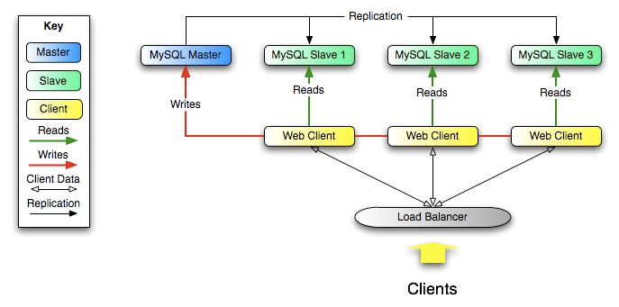
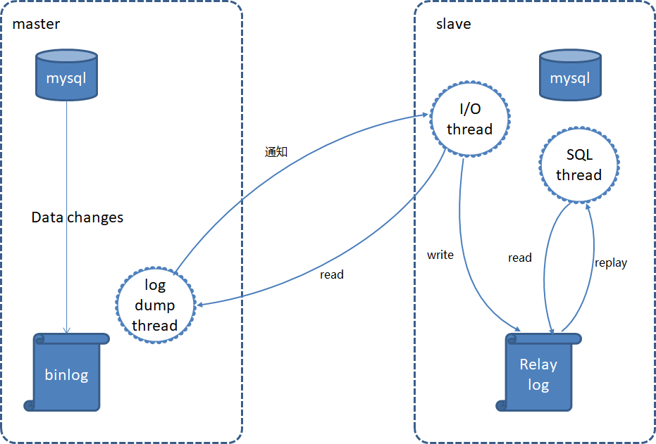

# MySQL

## 关系数据库三大范式

进行数据库设计时，应遵循三大范式：

- 第一范式：数据库表的每一列都是不可分割的基本数据项（对于地名，可以拆分成省份名、市名、区名、街道）

- 第二范式：在满足第一范式的前提下，每一行都要有唯一标识存在，非主键字段必须只依赖于主键，不能只依赖主键的部分（对于学生成绩，主键是学号和课程号，学分依赖课程号，姓名依赖学号）；造成了数据冗余、删除异常、插入异常和更新异常

- 第三范式：在满足第二范式的前提下，属性不依赖于其他非主属性，即不存在传递依赖（对于员工工资，工资依赖于等级，等级依赖于工号）；造成了数据冗余和更新异常

## 范式与反范式

没有冗余的数据库未必是最好的数据库，有时为了提高运行效率就必须降低范式标准，适当保留冗余数据，增加字段允许冗余，达到空间换时间的目的

- 范式优点：减少数据冗余，表更新体积小速度快

- 范式缺点：对于查询需要对多表进行关联；更难进行索引优化

- 反范式优点：减少表的关联；更好地进行索引优化

- 反范式缺点：存在数据冗余及数据维护异常，对数据修改需要更多的成本

## 百万级别的数据删除

索引文件是单独存在的文件，所以当我们对数据的增加、修改、删除，都会产生额外的对索引文件的操作，这些操作需要消耗额外的 IO，会降低增改删的执行效率

在删除数据库百万级别数据的时候，删除数据的速度和创建的索引数量是成正比的

1. 先删除索引

2. 删除数据

3. 重新创建索引

## 堆表和索引表

像 MyISAM 这样以堆形式存储数据的我们通常把它叫做堆表（HOT），像 InnoDB 这种将数据保存在叶子节点中叫做索引组织表（IOT）

## 事务

事务是一个不可分割的数据库操作序列，要么完全地执行，要么完全地不执行，是数据库并发控制得基本单位

事务处理可以确保除非事务性单元内的所有操作都成功完成，否则不会永久更新面向数据的资源

通过将一组相关操作组合为一个要么全部成功要么全部失败的单元，可以简化错误恢复并使应用程序更加可靠

一个逻辑工作单元要成为事务，必须满足所谓的 ACID（原子性、一致性、隔离性和持久性）属性

- 原子性（Atomicity）：原子性是指事务包含的所有操作要么全部成功，要么全部失败回滚

- 一致性（Consistency）：一致性规定了事务提交前后，永远只可能存在事务提交前的状态和事务提交后的状态，从一个一致性的状态到另一个一致性状态，而不可能出现中间的过程态；事务的执行结果是量子化状态，而不是线性状态

- 隔离性（Isolation）：当多个用户并发访问数据库时，比如操作同一张表时，数据库为每一个用户开启的事务不能被其他事务的操作所干扰，多个并发事务之间要相互隔离；多个事务并发访问时，事务之间是隔离的，一个事务不应该影响其它事务运行效果；当不同的事务同时操纵相同的数据时，每个事务都有各自的完整数据空间

- 持久性（Durability）：持久性是指一个事务一旦被提交了，那么对数据库中的数据的改变就是永久性的，即便是在数据库系统遇到故障的情况下也不会丢失提交事务的操作

## 快照读和当前读

### 快照读

在 READ COMMITTED 和 REPEATABLE READ 隔离级别下，普通的 SELECT 查询都是读取 MVCC 版本链中的一个版本，相当于读取一个快照，因此称为快照读；这种读取方式不会加锁，因此读操作时非阻塞的，因此也叫非阻塞读

### 当前读

读取的是当前最新版本，称为当前读；当前读不仅会对当前记录加行记录锁，还会对查询范围空间的数据加间隙锁

## MySQL 引擎

InnoDB 是聚集索引，数据文件是和索引绑在一起的，必须要有主键，通过主键索引效率很高，但是辅助索引需要两次查询，先查询到主键，然后再通过主键查询到数据，因此，主键不应该过大，否则其他索引也会很大；MyISAM 是非聚集索引，数据文件是分离的，索引保存的是数据文件的指针，主键索引和辅助索引是独立的

InnoDB 支持外键，MyISAM 不支持外键

InnoDB 锁粒度是行锁，而 MyISAM 是表锁

InnoDB 支持事务，对于 InnoDB 每一条 SQL 语言都默认封装成事务，自动提交，这样会影响速度，所以最好把多条 SQL 语言放在 begin 和 commit 之间，组成一个事务；MyISAM 不支持事务，但可以在 service 层进行根据自己的业务需求进行相应的控制

InnoDB 不保存表的具体行数，MyISAM 用一个变量保存了整个表行数

InnoDB 支持 MVCC，MyISAM 不支持

InnoDB 和 MyISAM 都支持 B+ 树索引，InnoDB 还支持自适应哈希索引

MyISAM 实现了前缀压缩技术，占用存储空间更小（但会影响查找），InnoDB 是原始数据存储，占用存储更大

MyISAM 支持全文索引，InnoDB不支持全文索引，但可以通过插件实现

## MyISAM 表加锁方法

在执行查询语句前，会自动给涉及的表加读锁，在执行更新操作前，会自动给涉及的表加写锁

在自动加锁的情况下，MyISAM 总是一次获得 SQL 语句所需要的全部锁

MyISAM 存储引擎支持并发插入，以减少的读和写操作之间的冲突：如果 MyISAM 表在数据文件中间没有空闲块，则行始终插入数据文件的末尾；可以在其他线程进行读操作的时候，同时将行插入到 MyISAM 表中；文件中间的空闲块可能是从表格中间删除或更新的行而产生的，如果文件中间有空闲块，则并发插入会被禁用，但是当所有空闲块都填充有新数据时，它又会自动重新启用

## InnoDB 加锁方式

对于普通 SELECT 语句，InnoDB 不会加任何锁；事务可以通过显式方式加共享锁或排他锁

对于 UPDATE、 DELETE 和 INSERT 语句， InnoDB 会自动加排他锁

InnoDB 在事务执行过程中，使用两阶段锁协议：根据隔离级别在需要的时候自动加锁；在执行 commit 或者 rollback 的时候所有的锁在同一时刻被释放

## MyISAM 和 InnoDB 适合场景

### MyISAM

MyISAM 表的读操作与写操作之间，以及写操作之间是串行的。当一个线程获得对一个表的写锁后， 只有持有锁的线程可以对表进行更新操作。 其他线程的读、 写操作都会等待，直到锁被释放为止

默认情况下，写锁比读锁具有更高的优先级：当一个锁释放时，这个锁会优先给写锁队列中等候的获取锁请求，然后再给读锁队列中等候的获取锁请求；因此 MyISAM 适合于以读为主，不适合有大量更新操作，大量的更新操作会造成查询操作很难获得读锁，从而可能永远阻塞

### InnoDB

Innodb 适合于读写操作且频率高，要保证数据的完整性，并发量高，支持事务和外键的应用程序

## InnoDB 索引和 MyISAM 索引

- InnoDB 索引是聚簇索引，MyISAM 索引是非聚簇索引

- InnoDB 的主键索引的叶子节点存储着行数据，因此主键索引非常高效

- MyISAM 索引的叶子节点存储的是行数据地址，需要再寻址一次才能得到数据

- InnoDB 非主键索引的叶子节点存储的是主键和其他带索引的列数据，因此查询时做到覆盖索引会非常高效

## SQL 优化

- 在经常性的检索列上，建立必要索引，以加快搜索速率，避免全表扫描

- 多次查询同样的数据，可以考虑缓存该组数据

- 切分查询（大查询切分成为小查询，避免一次性锁住大量数据）

- 分解关联查询（单表查询，结果在应用程序中进行关联，可以减少处理过程中的锁争用）

- 尽量先做单表查询

- 当并发插入比较多时尽量使用等值查询，避免范围条件

## 子查询与关联查询

子查询就是查询中又嵌套的查询，表连接都可以用子查询替代，但不是所有子查询都能用表连接替换，子查询比较灵活，方便，形式多样，适合用于作为查询的筛选条件，而表连接更适合与查看多表的数据

子查询不一定需要两个表有关联字段，而连接查询必须有字段关联

对于数据量多的肯定是用连接查询快些，因为子查询会多次遍历所有的数据（视你的子查询的层次而定），而连接查询只会遍历一次

执行子查询时，MYSQL 需要创建临时表，查询完毕后再删除这些临时表，所以子查询的速度会受到一定的影响，这里多了一个创建和销毁临时表的过程；使用连接查询（JOIN）代替子查询，连接查询不需要建立临时表，因此其速度比子查询快

## 视图

视图是一种虚拟表，在物理上是不存在，其内容与真实的表相似，包含一系列带有名称的列和行数据

视图根本用途：简化 sql 查询，提高开发效率

### 特点

- 视图的列可以来自不同的表，是表的抽象和在逻辑意义上建立的新关系

- 视图的建立和删除不影响基本表

- 对视图内容的更新(添加，删除和修改)直接影响基本表

- 当视图来自多个基本表时，不允许添加和删除数据

### 优点

- 查询简单化

- 数据安全性

- 逻辑数据独立性

### 缺点

- 数据库必须把视图的查询转化成对基本表的查询，性能较差

- 修改视图的某些行时，数据库必须把它转化为对基本表的某些行的修改，因此带来修改限制

## 删除数据库

||Delete|Truncate|Drop|
|-|-|-|-|
回滚|可回滚|不可回滚|不可回滚|
删除内容|表结构还在，删除表的全部或一部分行|表结构还在，删除所有数据|删除表，数据、索引和权限都删除|
删除速度|慢，需逐行删除|快|最快|

## MySQL 查询缓存

MySQL 查询缓存是用来缓存特定 Query 的整个结果集信息，且共享给所有客户端，对查询语句进行 Hash 计算后，把得到的 hash 值与 Query 查询的结果集对应存放在 Query Cache 中；MySQL Server 会对接收到的每一个 SELECT 语句通过特定的 Hash 算法计算该 Query 的 Hash 值，然后通过该 hash 值到 Query Cache 中去匹配；如果通过 hash 值匹配到了一样的 Query，则直接将 cache 中相应的 Query 结果集返回给客户端；如果没有匹配，将这个 hash 值存放在一个 hash 链表中，并将 Query 的结果集存放到 cache 中，存放 hash 值链表的每个 hash 节点存放了相应 Query 结果集在 cache 中的地址，以及该 query 所涉及到一些 table 相关信息

MySQL 缓存机制简单的说就是缓存 sql 文本及查询结果，如果运行相同的 SQL，服务器直接从缓存中取到结果，而不需要再去解析和执行 SQL。如果表更改了，那么使用这个表的所有缓存查询将不再有效，查询缓存中值相关条目被清空

对于频繁更新的表，查询缓存是不适合的，而对于一些不常改变数据且有大量相同 SQL 查询的表，查询缓存会节约很大的性能

MySQL Query Cache 使用内存池技术，自己管理内存释放和分配，而不是通过操作系统。内存池使用的基本单位是变长的 block, 用来存储类型、大小、数据等信息；一个 result set 的 cache 通过链表把这些 block 串起来

MySQL Server 中打开 Query Cache 对数据库的读和写都会带来额外的消耗:

- 读查询开始之前必须检查是否命中缓存

- 如果读查询可以缓存，那么执行完查询操作后，会把查询结果和查询语句写入缓存

- 当向某个表写入数据的时候，必须将这个表所有的缓存设置为失效，如果缓存空间很大，则消耗也会很大

- 对 InnoDB 表，当修改一个表时，设置了缓存失效，但是多版本特性会暂时将这修改对其他事务屏蔽，在这个事务提交之前，所有查询都无法使用缓存，直到这个事务被提交，所以长时间的事务，会大大降低查询缓存的命中

## MySQL 查询缓存

### 机制

查询缓存用来缓存特定 Query 的整个结果集信息，且共享给所有客户端

对查询语句进行 Hash 计算后，把得到的 hash 值与 Query 查询的结果集对应存放在 Query Cache 中，目前 MySQL Query Cache 只会 cache select 语句

1. 如果没有匹配，将这个 hash 值存放在一个 hash 链表中，并将 Query 的结果集存放到 cache 中，存放 hash 值链表的每个 hash 节点存放了相应 Quey 结果集在 cache 中的地址，以及该 query 所涉及到一些 table 相关信息

2. 如果通过 hash 值匹配到了一样的 Query，则直接将 cache 中相应的 Query 结果集返回给客户端

### 命中条件

- 两个 SQL 语句，只要相差哪怕一个字符(例如大小写不一样，多一个空格，多注释)，那么这两个 SQL 将使用不同的 Cache 地址

- 如果表更改了，那么使用这个表的所有缓存查询将不再有效，查询缓存中值相关条目被清空；这里的更改指的是表中任何数据或是结构发生改变，包括 INSERT、UPDATE、 DELETE、TRUNCATE、ALTER TABLE、DROP TABLE 或 DROP DATABASE 等，也包括那些映射到改变了的表使用 MERGE 表的查询

- 当某个表正在写入数据，则这个表的缓存（命中缓存，缓存写入等）将会处于失效状态；在 Innodb 中，如果某个事务修改了这张表，则这个表的缓存在事务提交前都会处于失效状态，在这个事务提交前，这个表的相关查询都无法被缓存

- where 条件中如包含任何一个不确定的函数将永远不会被 cache, 比如 current_date, now 等

- 太大的 result set 不会被 cache (< query_cache_limit)

- 缓存清空的机制是目标表有任何更新操作，都会导致该表的所有缓存失效，而不能实现行级别的缓存清空；Serializable 情况下，所有查询语句都不能缓存

### 内存管理

MySQL Query Cache 使用内存池技术，自己管理内存释放和分配，而不是通过操作系统

query_cache_limit：可以缓存的单条查询的最大结果集的大小，默认值为 1MB

query_cache_min_res_unit：每次分配内存的最小空间大小，也就是用于缓存查询结果的最小内存空间的大小，默认值为 4KB

query_cache_size：可以使用的最大内存空间的大小，必须是 1024 的整数倍

1. 数据库启动时需要初始化查询缓存需要的内存，这时内存池是一个完整的空闲块，而这个空闲块的大小是 query_cache_size 的值减去用于维护元数据的数据结构所消耗的空间（约 40KB）

2. 当有查询结果需要缓存的时候，MySQL 先从大的空闲块中申请 query_cache_min_res_unit 大小的内存用于存储结果

3. MySQL 逐步向数据块写入数据，若数据块全部使用完成后仍然有剩余的数据需要存储，那么将再次向空闲空间申请一个数据块，直到数据全部存储完成

4. 当存储完成后申请的数据块还有部分剩余空间，那么这部分将被释放，并入到空闲内存部分

并发插入和缓存失效都会导致内存碎片

### 优缺点

优点：Query Cache 的查询，发生在 MySQL 接收到客户端的查询请求、查询权限验证之后和查询 SQL 解析之前；Query Cache是基于内存的，直接从内存中返回相应的查询结果，减少了大量的磁盘 I/O 和 CPU 计算，提高效率

缺点：

- 查询语句的 hash 计算和 hash 查找带来的资源消耗

- 如果表的变更比较频繁，则会造成 Query Cache 的失效率非常高

- 查询语句不同，但查询结果相同的查询都会被缓存，这样便会造成内存资源的过度消耗

- 内存碎片会导致 Query Cache 频繁清理内存

## 触发器

触发器是与表有关的数据库对象，在满足定义条件时触发，并执行触发器中定义的语句集合，使用触发器可以保证某些操作之间的一致性

能决定触发器执行某个操作的事件有：insert、update 和 delete

不能在同一张表上建立 2 种同类型的触发器，一张表最多创建 6 个触发器(6 种类型)：即 BEFORE INSERT、BEFORE UPDATE、BEFORE DELETE、AFTER INSERT、AFTER UPDATE、AFTER DELETE

在 INSERT 型触发器中，NEW 用来表示将要（BEFORE）或已经（AFTER）插入的新数据

在 UPDATE 型触发器中，OLD 用来表示将要或已经被修改的原数据，NEW 用来表示将要或已经修改为的新数据

在 DELETE 型触发器中，OLD 用来表示将要或已经被删除的原数据

OLD 是只读的，而 NEW 则可以在触发器中使用 SET 赋值，这样不会再次触发触发器，造成循环调用

多个执行语句则用 BEGIN、END 包围

触发器基于行触发，当对整个表进行操作时效果较差

在基于锁的操作中，触发器可能会导致锁等待或死锁；触发器执行失败，原来执行的 SQL 语句也会执行失败

## 主从同步

为了减轻数据库压力，需要对数据库做读写分离和主从同步，写操作走主库，读操作走从库，分散了数据库的访问压力，提升整个系统的性能和可用性

### 主从复制原理

主从复制需要三个线程，master（binlog dump thread）、slave（I/O thread 、SQL thread）

- master 库 binlog dump 线程：当主库中有数据更新时，会将此次更新的事件类型写入到主库的 binlog 文件中，此时主库会创建 log dump 线程通知 slave 有数据更新，当 I/O 线程请求日志内容时，会将此时的 binlog 名称和当前更新的位置同时传给 slave 的 I/O 线程

- slave 库 I/0 线程：该线程会连接到 master，向 log dump 线程请求一份指定 binlog 文件位置的副本，并将请求回来的 binlog 存到本地的 relay log 中

- slave 库 SQL 线程：该线程检测到 relay log 有更新后，会读取并在本地做 redo 操作，将发生在主库的事件在本地重新执行一遍，来保证主从数据同步；如果一个 relay log 文件中的全部事件都执行完毕，那么 SQL 线程会自动将该 relay log 文件删除掉

