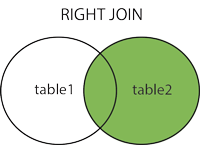
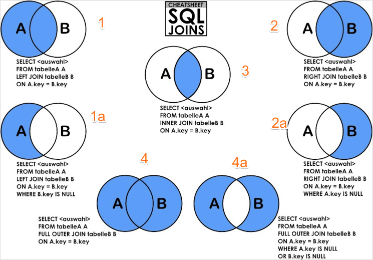

# SQL

## 什么是数据库

数据库（Database）是按照数据结构来组织、存储和管理数据的仓库

关系型数据库，是建立在关系模型基础上的数据库，借助于集合代数等数学概念和方法来处理数据库中的数据，特点：

- 数据以表格的形式出现

- 每行为各种记录的名称

- 每列为记录名称所对应的数据域

- 许多的行和列组成一张表单

- 若干的表单组成 database

MySQL 是最流行的关系型数据库管理系统

## SQL 命令

所有的数据库名，表名，表字段都是区分大小写的

### 列出数据库列表

`show databases`

### 选择数据库

`use database`

### 列出所有表

`show tables`

### 显示数据表所有属性

`show columns from table`

### 显示数据表详细索引信息

`show index from table`

### 创建数据库

`create database database_name`

### 删除数据库

`drop database database_name`

### 数据类型

#### 数值类型

严格数值数据类型(INTEGER、SMALLINT、DECIMAL 和 NUMERIC)，以及近似数值数据类型(FLOAT、REAL 和 DOUBLE PRECISION)

|类型|大小|范围（有符号）|范围（无符号）|用途
|-|-|-|-|-|
TINYINT|1 byte|(-128, 127)|(0, 256)|小整数
SMALLINT|2 byte|(-32768, 32767)|(0, 65535)|大整数
MEDIUMINT|3 byte|(-8 388 608，8 388 607)|(0，16 777 215)|大整数
INT|4 byte|(-2 147 483 648，2 147 483 647)|(0，4 294 967 295)|大整数
BIGINT|8 byte|(-9,223,372,036,854,775,808，9 223 372 036 854 775 807)|(0，18 446 744 073 709 551 615)|极大整数
FLOAT|4 byte|	(-3.402 823 466 E+38，-1.175 494 351 E-38)，0，(1.175 494 351 E-38，3.402 823 466 351 E+38)|0，(1.175 494 351 E-38，3.402 823 466 E+38)|单精度浮点数
DOUBLE|8 byte|	(-1.797 693 134 862 315 7 E+308，-2.225 073 858 507 201 4 E-308)，0，(2.225 073 858 507 201 4 E-308，1.797 693 134 862 315 7 E+308)|0，(2.225 073 858 507 201 4 E-308，1.797 693 134 862 315 7 E+308)|双精度浮点整数
DECIMAL|对 DECIMAL(M,D)，M 表示小数点左边和右边可以存储的十进制数字的最大个数，D 表示小数点右边可以存储的十进制数字的最大个数。如果 M>D，为 M+2 否则为 D+2，D 默认为 0|依赖于 M 和 D 的值|依赖于 M 和 D 的值|小数

### 日期和时间类型

日期和时间类型为 DATETIME、DATE、TIMESTAMP、TIME 和 YEAR，每个时间类型有一个有效值范围和一个"零"值

|类型|大小|范围|格式|用途
|-|-|-|-|-|
DATA|3 byte|1000-01-01/9999-12-31|YYYY-MM-DD|日期值
TIME|3 byte|'-838:59:59'/'838:59:59'|HH:MM:SS|时间值
YEAR|1 byte|1901/2155|YYYY|年份值
DATATIME|8 byte|1000-01-01 00:00:00/9999-12-31 23:59:59|YYYY-MM-DD HH:MM:SS|混合日期和时间值
TIMESTAMP|4 byte|1970-01-01 00:00:00/2038 结束时间是第 2147483647 秒，北京时间 2038-1-19 11:14:07，格林尼治时间 2038年1月19日 凌晨 03:14:07|YYYYMMDD HHMMSS|混合日期和时间值，时间戳

### 字符串类型

字符串类型指 CHAR、VARCHAR、BINARY、VARBINARY、BLOB、TEXT、ENUM 和 SET


|类型|大小|用途
|-|-|-|
CHAR|0-255 byte|定长字符串|
VARCHAR|0-65535 byte|变长字符串|
TINYTEXT|0-255 byte|短文本字符串|
TEXT|0-65 535 byte|长文本数据|
MEDIUMTEXT|0-16 777 215 byte|中等长度文本数据|
LONGTEXT|0-4 294 967 295 4 byte|极大文本数据|
TINYBLOB|0-255 byte|不超过 255 个字符的二进制字符串|
BLOB|0-65 535 byte|二进制形式的长文本数据|
MEDIUMBLOB|0-16 777 215 byte|二进制形式的中等长度文本数据|
LONGBLOB|0-4 294 967 295  byte|二进制形式的极大文本数据|

- CHAR(n) 和 VARCHAR(n) 中括号中 n 代表字符的个数，并不代表字节个数，比如 CHAR(30) 就可以存储 30 个字符；如果使用 utf8 则插入 m 个中文，占用 3 * m 个字节；

- 当保存 CHAR 值时，在它们的右边填充空格以达到指定的长度；当检索到 CHAR 值时，尾部的空格被删除掉；在存储或检索过程中不进行大小写转换

- VARCHAR 的最大有效长度由最大行大小和使用的字符集确定，整体最大长度是 65532 字节；VARCHAR 值保存时只保存需要的字符数，另加一个字节来记录长度（如果列声明的长度超过 255，则使用两个字节）；VARCHAR 值保存时不进行填充，当值保存和检索时尾部的空格仍保留，符合标准SQL

- CHAR 不管实际 value 都会占用 n 个字符的空间，而 VARCHAR 只会占用实际字符应该占用的空间 +1/2（取决于字符数是否大于 255），并且实际空间 +1<=n；超过 CHAR 和 VARCHAR 设置的 n 后，字符串会被截断；

- CHAR 在存储的时候会截断尾部的空格， VARCHAR、TEXT 和 BLOB 不会

- CHAR 和 VARCHAR 可以有默认值，TEXT 不能指定默认值

- VARCHAR 需要定义大小，有 65535 字节的最大限制；TEXT 则不需要

- BLOB 和 TEXT 类型需要 1，2，3 或 4 个字节来记录列值的长度

- BLOB 可以储存图片，TEXT 不行，TEXT 只能储存纯文本文件；对 BLOB 值的排序和比较以大小写敏感方式执行，而对 TEXT 值是大小写不敏感的；BLOB 和 TEXT 列不能有 默认值

- 效率来说基本是 CHAR>VARCHAR>TEXT，但是如果使用的是 Innodb 引擎的话，推荐使用 VARCHAR 代替 CHAR


### 约束

```sql
CREATE TABLE table_name
(
   column_name1 data_type(size) constraint_name,
   column_name2 data_type(size) constraint_name,
   column_name3 data_type(size) constraint_name,
);
```

- NOT NULL：指示某列不能存储 NULL 值

- UNIQUE：保证某列的每行必须有唯一的值

- PRIMARY KEY： NOT NULL 和 UNIQUE 的结合，确保某列（或两个列多个列的结合）有唯一标识，有助于更容易更快速地找到表中的一个特定的记录；主键可以由多个列组成，但只能有一个主键，`CONSTRAINT pk_PersonID PRIMARY KEY (P_Id,LastName)`

- FOREIGN KEY：保证一个表中的数据匹配另一个表中的值的参照完整性，指向另一个表中的 UNIQUE KEY；`FOREIGN KEY (P_Id) REFERENCES Persons(P_Id)`

- CHECK：保证列中的值符合指定的条件

- DEFAULT：规定没有给列赋值时的默认值


### 创建数据表 
`create table table_name (column_name column_type)`

```sql
CREATE TABLE IF NOT EXISTS `tbl`(
   id INT UNSIGNED AUTO_INCREMENT,
   title VARCHAR(100) NOT NULL,
   author VARCHAR(40) NOT NULL,
   submission_date DATE,
   PRIMARY KEY ( `id` )
)ENGINE=InnoDB DEFAULT CHARSET=utf8;
```

### 删除数据库

`drop table table_name`

### 插入数据

```sql
insert into table_name (field1, field2, ...)
values
(value1, value2, ...)
```

### 查询数据

```sql
SELECT column_name,column_name
FROM table_name
[WHERE Clause]
[LIMIT N][ OFFSET M]
```

- 查询语句中你可以使用一个或者多个表，表之间使用逗号 `,` 分割，并使用 `WHERE` 语句来设定查询条件

- `SELECT` 命令可以读取一条或者多条记录

- 可以使用星号 `*` 来代替其他字段，`SELECT` 语句会返回表的所有字段数据

- 可以使用 `WHERE` 语句来包含任何条件

- 可以使用 `LIMIT` 属性来设定返回的记录数

- 可以通过 `OFFSET` 指定 `SELECT` 语句开始查询的数据偏移量

### WHERE 子句

```sql
SELECT field1, field2,...fieldN FROM table_name1, table_name2...
[WHERE (BINARY) condition1 [AND [OR]] condition2.....
```

- 可以使用 `AND` 或者 `OR` 指定一个或多个条件

- 可以运用于 SQL 的 `DELETE` 或者 `UPDATE` 命令

- 主键来作为 `WHERE` 子句的条件查询是非常快速的

-  `WHERE` 子句的字符串比较如果不使用 `LIKE` 是不区分大小写的，但可以使用 `BINARY` 关键字来设定 `WHERE` 子句的字符串比较是区分大小写的

- `IN` 操作符允许您在 `WHERE` 子句中规定多个值

- `BETWEEN` 操作符选取介于两个值之间的数据范围内的值，可以是数值、文本或者日期

### UPDATE 修改更新

```sql
UPDATE table_name SET field1=new-value1, field2=new-value2
[WHERE Clause]
```

- 可以同时更新一个或多个字段

- 可以在 WHERE 子句中指定任何条件

- 可以在一个单独表中同时更新数据

### DELETE 

`DELETE FROM table_name [WHERE Clause]`

### LIKE 子句

```sql
SELECT field1, field2,...fieldN 
FROM table_name
WHERE field1 LIKE condition1 [AND [OR]] filed2 = 'somevalue'
```

`LIKE` 子句中使用：
-  `%` 字符来表示非空的任意字符

- `_` 表示任意单个字符

- `[]` 表示括号内所列字符中的一个，指定一个字符、字符串或范围，要求所匹配对象为它们中的任一个

- `[^]` 表示不在括号所列之内的单个字符

- 查询内容包含通配符时，由于通配符的缘故，导致我们查询特殊字符 `%`、`_`、`[` 的语句无法正常实现，而把特殊字符用 `[ ]` 括起便可正常查询

- 没有使用通配符, LIKE 子句与等号 = 的效果是一样的

- 匹配默认不区分大小写，使用 LIKE BINARY 严格对比二进制形式；当检索的内容是中英文混合且需要忽略英文大小写的时候，使用 BINARY 失效，需要引入 MySQL 中的 `UPPER()` 将英文字符串变大写与 `CONCAT()` 将多个字符串连接成一个字符串

- 使用 `\` 进行转义；可以使用 escape ，转义字符后面的 % 或 _ 就不作为通配符了

- LIKE 操作符强制 MySQL 扫描整个表以找到匹配的行记录，因此，它不允许数据库引擎使用索引进行快速搜索；当要从具有大量行的表查询数据时，使用 LIKE 运算符来查询数据的性能会大幅降低


### UNION 操作符

用于连接两个以上的 `SELECT` 语句的结果组合到一个结果集合中，多个 `SELECT` 语句会删除重复的数据

```sql
SELECT expression1, expression2, ... expression_n
FROM tables
[WHERE conditions]
UNION [ALL | DISTINCT]
SELECT expression1, expression2, ... expression_n
FROM tables
[WHERE conditions];
```

- Union 中的每个查询必须包含相同的列、表达式或者聚合函数，他们出现的顺序可以不一致

- DISTINCT: 删除结果集中重复的数据，默认情况下 UNION 操作符已经删除了重复数据，所以 DISTINCT 修饰符对结果没啥影响

- ALL: 可选，返回所有结果集，包含重复数据

- 只能使用一条 order by 子句对结果集进行排序，而且必须出现在最后一条出现的 SELECT 语句之后

- 多表查询的时候并不要求两个表完全相同，只需要你检索的字段结构相似就可以

- 可以添加别名作为表明来区分多表

### ORDER BY 排序

使用 ORDER BY 子句将查询数据排序后再返回数据

```sql
SELECT field1, field2,...fieldN FROM table_name1, table_name2...
ORDER BY field1 [ASC [DESC][默认 ASC]], [field2...] [ASC [DESC][默认 ASC]]
```

- 可以使用任何字段来作为排序的条件，从而返回排序后的查询结果

- 可以设定多个字段来排序

- 可以使用 ASC 或 DESC 关键字来设置查询结果是按升序或降序排列，默认情况下，它是按升序排列

- 多列排序的时候，先对第一个字段进行排序，然后对于相同的第一字段内部再采用第一个字段进行排序，以此类推

### LIMIT

```sql
SELECT 
    column_list
FROM
    table1
ORDER BY column_list
LIMIT row_count OFFSET offset;
```

-  row_count 确定将返回的行数

- OFFSET 子句在开始返回行之前跳过偏移行

### GROUP BY 语句

根据一个或多个列对结果集进行分组统计得到一个分组合总表，在分组的列上我们可以使用 `COUNT`, `SUM`, `AVG` 等函数

group by 必须出现在 where 之后 order by 之前

```sql
SELECT column_name, function(column_name)
FROM table_name
WHERE column_name operator value
GROUP BY column_name;
HAVING function(column_name)
```

- WITH ROLLUP 可以实现在分组统计数据基础上再进行相同的统计（`SUM`, `AVG`, `COUNT`）

- Where 是一个约束声明，使用 Where 约束来自数据库的数据，Where 是在结果返回之前起作用的，Where 中不能使用聚合函数

- Having 是一个过滤声明，是在查询返回结果集以后对查询结果进行的过滤操作，在 Having 中可以使用聚合函数


### JOIN 语句

`JOIN` 在两个或多个表中查询数据，可以在 `SELECT`, `UPDATE` 和 `DELETE` 语句中使用 `JOIN` 来联合多表查询

#### INNER JOIN

获取两个表中字段匹配关系的记录

```sql
SELECT a.column1, a.column2, b.column1 from tab1 a INNER JOIN tab2 b on a.column1 = b.column1;
```


#### LEFT JOIN

```sql
SELECT a.column1, a.column2, b.column1 from tab1 a LEFT JOIN tab2 b on a.column1 = b.column1;
```

获取左表所有记录，即使右表没有对应匹配的记录


#### RIGHT JOIN

```sql

SELECT a.column1, a.column2, b.column1 from tab1 a RIGHT JOIN tab2 b on a.column1 = b.column1;
```

获取右表所有记录，即使左表没有对应匹配的记录



#### FULL OUTER JOIN

只要左表和右表其中一个表中存在匹配，则返回行；FULL OUTER JOIN 关键字结合了 LEFT JOIN 和 RIGHT JOIN 的结果




### NULL 值处理

提供了三大运算符：

- `IS NULL`: 当列的值是 `NULL`，此运算符返回 `true`

- `IS NOT NULL`: 当列的值不为 `NULL`, 运算符返回 `true`

- `<=>`: 比较操作符（不同于 `=` 运算符），当比较的的两个值相等或者都为 `NULL` 时返回 `true`

### 正则表达式

使用 `REGEXP` 操作符来进行正则表达式匹配


### ALTER 语句

需要修改数据表名或者修改数据表字段时，就需要使用到 `ALTER` 命令

#### 删除字段

```sql
ALTER TABLE table_name DROP filed1  
```

#### 新增字段

```sql
ALTER TABLE table_name ADD filed1 INT 
```

#### 修改字段

```sql
ALTER TABLE table_name MODIFY filed1 CHAR(10) 
```

#### 修改表明

```sql
ALTER TABLE table_name RENAME TO alter_tbl 
```

## 事务

事务主要用于处理操作量大，复杂度高的数据

只有使用了 Innodb 数据库引擎的数据库或表才支持事务

事务处理可以用来维护数据库的完整性，保证成批的 SQL 语句要么全部执行，要么全部不执行

事务用来管理 `insert`, `update`, `delete` 语句

一般来说，事务是必须满足4个条件（ACID）：：原子性（Atomicity，或称不可分割性）、一致性（Consistency）、隔离性（Isolation，又称独立性）、持久性（Durability）

- 原子性：一个事务（transaction）中的所有操作，要么全部完成，要么全部不完成，不会结束在中间某个环节。事务在执行过程中发生错误，会被回滚（Rollback）到事务开始前的状态，就像这个事务从来没有执行过一样

- 一致性：在事务开始之前和事务结束以后，数据库的完整性没有被破坏。这表示写入的资料必须完全符合所有的预设规则，这包含资料的精确度、串联性以及后续数据库可以自发性地完成预定的工作

- 隔离性：数据库允许多个并发事务同时对其数据进行读写和修改的能力，隔离性可以防止多个事务并发执行时由于交叉执行而导致数据的不一致。事务隔离分为不同级别，包括读未提交（Read uncommitted）、读提交（read committed）、可重复读（repeatable read）和串行化（Serializable）

- 持久性：事务处理结束后，对数据的修改就是永久的，即便系统故障也不会丢失

### 事务控制语句

- `BEGIN` 或 `START TRANSACTION` 显式地开启一个事务

- `COMMIT` 或 `COMMIT WORK` 会提交事务，并使已对数据库进行的所有修改成为永久性的

- `ROLLBACK` 或 `ROLLBACK WORK`，回滚会结束用户的事务，并撤销正在进行的所有未提交的修改

- `SAVEPOINT point_name` 允许在事务中创建一个保存点，一个事务中可以有多个 `SAVEPOINT`

- `RELEASE SAVEPOINT point_name` 删除一个事务的保存点，当没有指定的保存点时，执行该语句会抛出一个异常

- `ROLLBACK TO point_name` 把事务回滚到标记点

- `SET TRANSACTION` 用来设置事务的隔离级别，InnoDB 存储引擎提供事务的隔离级别有 `READ UNCOMMITTED`、`READ COMMITTED`、`REPEATABLE READ` 和 `SERIALIZABLE`


## 索引

索引可以大大提高 MySQL 的检索速度，实际上索引也是一张表，该表保存了主键与索引字段，并指向实体表的记录

索引也会有它的缺点：虽然索引大大提高了查询速度，同时却会降低更新表的速度，如对表进行 `INSERT`、`UPDATE` 和 `DELETE`，因为更新表时不仅要保存数据，还要保存一下索引文件；建立索引会占用磁盘空间的索引文件

### 普通索引

#### 创建索引
```sql
CREATE INDEX indexName ON mytable(username(length))
```

如果是 CHAR，VARCHAR 类型，length 可以小于字段实际长度；如果是 BLOB 和 TEXT 类型，必须指定 length

#### 修改表结构（添加索引）

```sql
ALTER table tableName ADD INDEX indexName(columnName)
```

#### 创建表时直接指定

```sql
CREATE TABLE mytable(  
 
ID INT NOT NULL,   
 
username VARCHAR(16) NOT NULL,  
 
INDEX [indexName] (username(length))  
 
); 
```

#### 删除索引

```sql
DROP INDEX [indexName] ON mytable; 
```

### 唯一索引

唯一索引列的值必须唯一，但允许有空值

如果是组合索引，则列值的组合必须唯一

#### 创建索引
```sql
CREATE UNIQUE INDEX indexName ON mytable(username(length))
```

#### 修改表结构（添加索引）

```sql
ALTER table tableName ADD UNIQUE INDEX indexName(columnName)
```

#### 创建表时直接指定

```sql
CREATE TABLE mytable(  
 
ID INT NOT NULL,   
 
username VARCHAR(16) NOT NULL,  
 
UNIQUE INDEX [indexName] (username(length))  
 
); 
```

### 主键索引

不允许有空值，一般是在建表的时候同时创建主键索引

### 组合索引

```sql
CREATE TABLE tableName ADD INDEX indexName(column1, column2, column3)

# 相当于

column1, column2, column3
column1, column2
column1
```

组合索引是最左前缀原则，简单理解就是只从最左面的开始组合，并不是只要包含组合索引列的查询都会用到该组合索引

## 重复数据

可以在 MySQL 数据表中设置指定的字段为 PRIMARY KEY（主键） 或者 UNIQUE（唯一） 索引来保证数据的唯一性

## 使用索引

- USE INDEX()：希望 MySQL 使用该索引

- IGNORE INDEX()：希望 MySQL 获取该索引

- FORCE INDEX()：强制使用该索引

## 示例

### 最晚入职员工所有信息

```sql
CREATE TABLE `employees` (
`emp_no` int(11) NOT NULL,  -- '员工编号'
`birth_date` date NOT NULL,
`first_name` varchar(14) NOT NULL,
`last_name` varchar(16) NOT NULL,
`gender` char(1) NOT NULL,
`hire_date` date NOT NULL,
PRIMARY KEY (`emp_no`));

select * from employees where hire_date = (
    select max(hire_date) from employees
);

select * from employees order by hire_date desc limit 1;

# 入职时间倒数第三的员工所有信息
select * from employees order by hire_date desc limit 1 offset 2;
```

### 各个部门当前领导当前薪水和部门

```sql
CREATE TABLE `salaries` (
`emp_no` int(11) NOT NULL, -- '员工编号',
`salary` int(11) NOT NULL,
`from_date` date NOT NULL,
`to_date` date NOT NULL,
PRIMARY KEY (`emp_no`,`from_date`));

CREATE TABLE `dept_manager` (
`dept_no` char(4) NOT NULL, -- '部门编号'
`emp_no` int(11) NOT NULL, --  '员工编号'
`to_date` date NOT NULL,
PRIMARY KEY (`emp_no`,`dept_no`));

select a.*, b.dept_no from salaries a left join dept_manager b 
on a.from_date = b.from_date
where a.from_date = '9999-01-01' order by a.emp_no; 
```

### 所有员工入职时薪水情况

```sql
CREATE TABLE `employees` (
`emp_no` int(11) NOT NULL,
`birth_date` date NOT NULL,
`first_name` varchar(14) NOT NULL,
`last_name` varchar(16) NOT NULL,
`gender` char(1) NOT NULL,
`hire_date` date NOT NULL,
PRIMARY KEY (`emp_no`));

CREATE TABLE `salaries` (
`emp_no` int(11) NOT NULL,
`salary` int(11) NOT NULL,
`from_date` date NOT NULL,
`to_date` date NOT NULL,
PRIMARY KEY (`emp_no`,`from_date`));

select emp_no, salary from salaries
group by emp_no having salary <= min(salary)
order by emp_no desc;

select a.emp_no, b.salary from employees a, salaries b
where a.emp_no = b.emp_no and a.hire_date = b.from_date
order by a.emp_no desc;
```

### 薪水变动超过 15 次的员工

```sql
CREATE TABLE `salaries` (
`emp_no` int(11) NOT NULL,
`salary` int(11) NOT NULL,
`from_date` date NOT NULL,
`to_date` date NOT NULL,
PRIMARY KEY (`emp_no`,`from_date`));

select emp_no, count(emp_no) t from salaries
group by emp_no having count(emp_no) > 15;

# 所有员工当前薪水情况
select distinct salary from salaries
where to_date = '9999-01-01'
order by salary desc;
```

### 获取员工的经理

```sql
CREATE TABLE `dept_emp` (
`emp_no` int(11) NOT NULL, -- '所有的员工编号'
`dept_no` char(4) NOT NULL, -- '部门编号'
`from_date` date NOT NULL,
`to_date` date NOT NULL,
PRIMARY KEY (`emp_no`,`dept_no`));

CREATE TABLE `dept_manager` (
`dept_no` char(4) NOT NULL, -- '部门编号'
`emp_no` int(11) NOT NULL, -- '经理编号'
`from_date` date NOT NULL,
`to_date` date NOT NULL,
PRIMARY KEY (`emp_no`,`dept_no`));

select a.emp_no, b.emp_no manager_no from
dept_emp a, dept_manager b
where b.to_date = '9999-01-01' 
and a.dept_no = b.dept_no
and a.emp_no != b.emp_no;

select a.emp_no, b.emp_no manager_no from
dept_emp a inner join dept_manager b
on a.dept_no = b.dept_no
where b.to_date = '9999-01-01' 
and a.emp_no != b.emp_no;
```