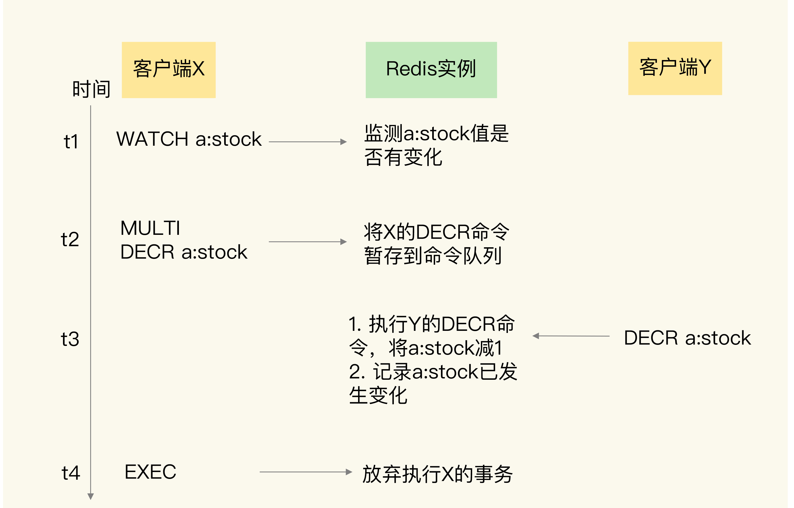

# 事务

事务是数据库的一个重要功能

事务就是指对数据进行读写的一系列操作。事务在执行时，会提供专门的属性保证，包括原子性（Atomicity）、一致性（Consistency）、隔离性（Isolation）和持久性（Durability），也就是 ACID 属性

原子性的要求很明确，就是一个事务中的多个操作必须都完成，或者都不完成

一致性是指数据库中的数据在事务执行前后是一致的

隔离性要求数据库在执行一个事务时，其它操作无法存取到正在执行事务访问的数据

持久性是指数据的修改要被持久化保存下来

## Redis 事务

Redis 提供了 MULTI、EXEC 两个命令来完成事务

客户端要使用 MULTI 显式地表示一个事务的开启；客户端把事务中本身要执行的具体操作（例如增删改数据）发送给服务器端，Redis 实例只是把这些命令暂存到一个命令队列中，并不会立即执行；客户端向服务器端发送 EXEC 提交事务的命令，让数据库实际执行第二步中发送的具体操作

## Redis 事务原子性

在执行 EXEC 命令前，客户端发送的操作命令本身就有错误，在命令入队时就被 Redis 实例判断出来了；在命令入队时，Redis 就会报错并且记录下这个错误，但还能继续提交命令操作；等到执行了 EXEC 命令之后，Redis 就会拒绝执行所有提交的命令操作，返回事务失败的结果，务中的所有命令都不会再被执行了，保证了原子性

事务操作入队时，命令和操作的数据类型不匹配，但 Redis 实例没有检查出错误；在执行完 EXEC 命令以后，Redis 实际执行这些事务操作时就会报错；虽然 Redis 会对错误命令报错，但还是会把正确的命令执行完。在这种情况下，事务的原子性就无法得到保证了

传统数据库（例如 MySQL）在执行事务时，会提供回滚机制，当事务执行发生错误时，事务中的所有操作都会撤销，已经修改的数据也会被恢复到事务执行前的状态；Redis 中并没有提供回滚机制。虽然 Redis 提供了 DISCARD 命令，但是，这个命令只能用来主动放弃事务执行，把暂存的命令队列清空，起不到回滚的效果

在执行事务的 EXEC 命令时，Redis 实例发生了故障，导致事务执行失败；如果 Redis 开启了 AOF 日志，那么只会有部分的事务操作被记录到 AOF 日志中，可以把未完成的事务操作从 AOF 文件中去除，使用 AOF 恢复实例后，事务操作不会再被执行，从而保证了原子性；如果 AOF 日志并没有开启，那么实例重启后，数据也都没法恢复了

Redis 的事务机制可以保证一致性和隔离性，但是无法保证持久性

## Redis 一致性

命令入队时就报错，事务本身就会被放弃执行，所以可以保证数据库的一致性

命令入队时没报错，实际执行时报错，有错误的命令不会被执行，正确的命令可以正常执行，也不会改变数据库的一致性

如果没有开启 RDB 或 AOF，那么，实例故障重启后，数据都没有了，数据库是一致的

使用了 RDB 快照，因为 RDB 快照不会在事务执行时执行，所以，事务命令操作的结果不会被保存到 RDB 快照中，使用 RDB 快照进行恢复时，数据库里的数据也是一致的

使用了 AOF 日志，而事务操作还没有被记录到 AOF 日志时，实例就发生了故障，那么使用 AOF 日志恢复的数据库数据是一致的。如果只有部分操作被记录到了 AOF 日志，清除事务中已经完成的操作，数据库恢复后也是一致的

在命令执行错误或 Redis 发生故障的情况下，Redis 事务机制对一致性属性是有保证的

## Redis 隔离性

事务的隔离性保证，会受到和事务一起执行的并发操作的影响

并发操作在 EXEC 命令前执行，此时，隔离性的保证要使用 WATCH 机制来实现，否则隔离性无法保证

并发操作在 EXEC 命令后执行，此时，隔离性可以保证

WATCH 机制的作用是，在事务执行前，监控一个或多个键的值变化情况，当事务调用 EXEC 命令执行时，WATCH 机制会先检查监控的键是否被其它客户端修改了。如果修改了，就放弃事务执行，避免事务的隔离性被破坏。然后，客户端可以再次执行事务，此时，如果没有并发修改事务数据的操作了，事务就能正常执行，隔离性也得到了保证

因为 Redis 是用单线程执行命令，而且，EXEC 命令执行后，Redis 会保证先把命令队列中的所有命令执行完。所以，在这种情况下，并发操作不会破坏事务的隔离性

## Redis 持久性

如果 Redis 没有使用 RDB 或 AOF，那么事务的持久化属性肯定得不到保证

如果 Redis 使用了 RDB 模式，那么，在一个事务执行后，而下一次的 RDB 快照还未执行前，如果发生了实例宕机，这种情况下，事务修改的数据也是不能保证持久化的

如果 Redis 采用了 AOF 模式，因为 AOF 模式的三种配置选项 no、everysec 和 always 都会存在数据丢失的情况，所以，事务的持久性属性也还是得不到保证