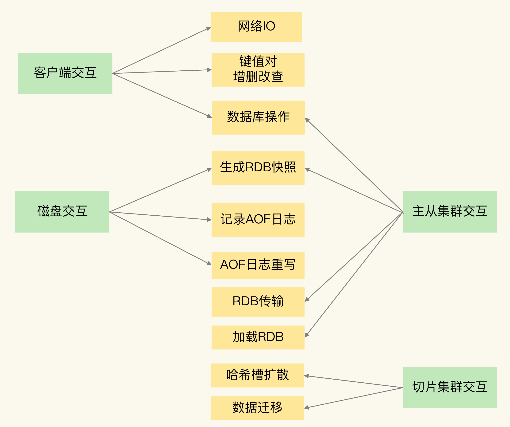
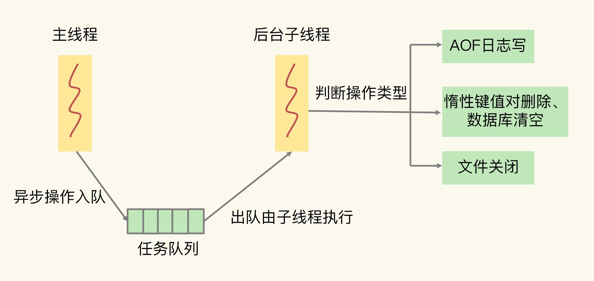

# 异步机制

Redis 实例在运行时，要和许多对象进行交互，这些不同的交互就会涉及不同的操作

- 客户端：网络 IO，键值对增删改查操作，数据库操作

- 磁盘：生成 RDB 快照，记录 AOF 日志，AOF 日志重写

- 主从节点：主库生成、传输 RDB 文件，从库接收 RDB 文件、清空数据库、加载 RDB 文件

- 切片集群实例：向其他实例传输哈希槽信息，数据迁移

## 阻塞风险

### 客户端交互

#### 网络 IO

Redis 使用了 IO 多路复用机制，避免了主线程一直处在等待网络连接或请求到来的状态

#### 键值对操作

键值对的增删改查操作是 Redis 和客户端交互的主要部分，也是 Redis 主线程执行的主要任务。所以，复杂度高的增删改查操作肯定会阻塞 Redis，复杂度标准为 O(N)

Redis 中涉及集合的操作复杂度通常为 O(N)，所以集合全量查询和聚合操作在使用时需要重视

集合自身的删除操作同样也有潜在的阻塞风险：删除操作的本质是要释放键值对占用的内存空间；为了更加高效地管理内存空间，在应用程序释放内存时，操作系统需要把释放掉的内存块插入一个空闲内存块的链表，以便后续进行管理和再分配，这个过程需要一定时间，而且会阻塞当前释放内存的应用程序

在删除大量键值对数据的时候，最典型的就是删除包含了大量元素的集合，也称为 bigkey 删除

清空数据库因为涉及到删除和释放所有的键值对，因此也会带来阻塞

### 磁盘交互

磁盘 IO 一般都是比较费时费力的，Redis 因此采用子进程的方式生成 RDB 快照文件，以及执行 AOF 日志重写操作

Redis 直接记录 AOF 日志时，会根据不同的写回策略对数据做落盘保存；如果有大量的写操作需要记录在 AOF 日志中，并同步写回的话，就会阻塞主线程了

### 主从节点交互

在主从集群中，主库需要生成 RDB 文件，并传输给从库。主库在复制的过程中，创建和传输 RDB 文件都是由子进程来完成的，不会阻塞主线程

对于从库来说，它在接收了 RDB 文件后，需要使用 FLUSHDB 命令清空当前数据库，因此会阻塞

从库在清空当前数据库后，还需要把 RDB 文件加载到内存，这个过程的快慢和 RDB 文件的大小密切相关，RDB 文件越大，加载过程越慢，因此会带来阻塞

### 切片集群交互

切片集群在迁移 bigkey 时，由于使用同步迁移，因此会带来阻塞

## 异步

为了避免阻塞式操作，Redis 提供了异步线程机制

Redis 会启动一些子线程，然后把一些任务交给这些子线程，让它们在后台完成，而不再由主线程来执行这些任务。使用异步线程机制执行操作，可以避免阻塞主线程

### 关键路径操作

如果一个操作能被异步执行，则它不是 Redis 主线程的关键路径上的操作

主线程接收到操作后不需要给客户端返回具体的数据则可以交给后台子线程，因此不是关键路径操作

主线程接收到操作后需要给客户端返回具体数据则不能交给后台子线程，因此是关键路径操作

- 读操作是典型的关键路径操作

- 删除操作不是关键路径操作

- AOF 日志同步写需要保证操作记录落盘，可以让子线程同步写，不是关键路径操作

- 从库加载 RDB 文件是关键路径操作，因为加载完 RDB 文件才能提供服务

除了集合全量查询和聚合操作和从库加载 RDB 文件，其他三个阻塞点涉及的操作都不在关键路径上，所以可以使用 Redis 的异步子线程机制来实现 bigkey 删除，清空数据库，以及 AOF 日志同步写

集合全量查询和聚合操作：可以使用 SCAN 命令，分批读取数据，再在客户端进行聚合计算

从库加载 RDB 文件：把主库的数据量大小控制在 2~4GB 左右，以保证 RDB 文件能以较快的速度加载

### 异步机制

Redis 主线程启动后，会使用操作系统提供的 pthread_create 函数创建 3 个子线程，分别由它们负责 AOF 日志写操作、键值对删除以及文件关闭的异步执行

主线程通过一个链表形式的任务队列和子线程进行交互

当收到键值对删除和清空数据库的操作时，主线程会把这个操作封装成一个任务，放入到任务队列中，然后给客户端返回一个完成信息，表明删除已经完成；异步删除也称为惰性删除（lazy free），删除或清空操作不会阻塞主线程，这就避免了对主线程的性能影响

当 AOF 日志配置成 everysec 选项后，主线程会把 AOF 写日志操作封装成一个任务，也放到任务队列中。后台子线程读取任务后，开始自行写入 AOF 日志，这样主线程就不用一直等待 AOF 日志写完了

当 AOF 日志配置成 always 时，Redis 需要确保每个操作记录日志都写回磁盘，如果用后台子线程异步完成，主线程就无法及时地知道每个操作是否已经完成了，所以 always 策略并不使用后台子线程来执行

