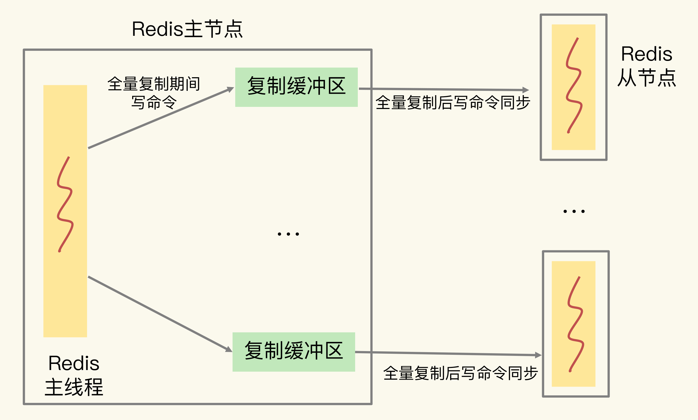
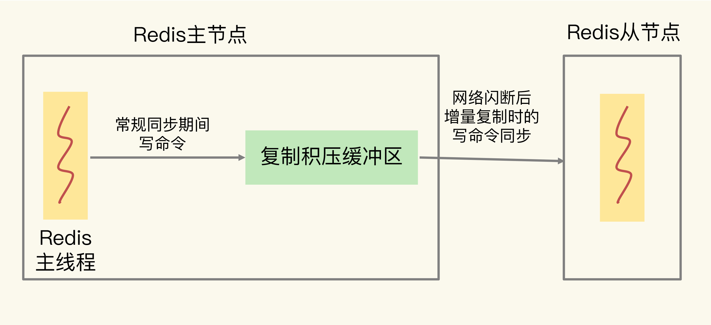

# 缓冲

缓冲区就是用一块内存空间来暂时存放命令数据，以免出现因为数据和命令的处理速度慢于发送速度而导致的数据丢失和性能问题。但因为缓冲区的内存空间有限，如果往里面写入数据的速度持续地大于从里面读取数据的速度，就会导致缓冲区需要越来越多的内存来暂存数据。当缓冲区占用的内存超出了设定的上限阈值时，就会出现缓冲区溢出

缓冲区不设上限，随着累积的数据越来越多，缓冲区占用内存空间越来越大，一旦耗尽了 Redis 实例所在机器的可用内存，就会导致 Redis 实例崩溃

主要场景：

- 在客户端和服务器端之间进行通信时，用来暂存客户端发送的命令数据，或者是服务器端返回给客户端的数据结果

- 主从节点间进行数据同步时，用来暂存主节点接收的写命令和数据

## 客户端输入输出缓冲区

为了避免客户端和服务器端的请求发送和处理速度不匹配，服务器端给每个连接的客户端都设置了一个输入缓冲区和输出缓冲区

输入缓冲区会先把客户端发送过来的命令暂存起来，Redis 主线程再从输入缓冲区中读取命令，进行处理。当 Redis 主线程处理完数据后，会把结果写入到输出缓冲区，再通过输出缓冲区返回给客户端

### 输入缓冲区溢出

输入缓冲区就是用来暂存客户端发送的请求命令的，所以可能导致溢出的情况主要是下面两种：

- 写入了 bigkey，比如一下子写入了多个百万级别的集合类型数据

- 服务器端处理请求的速度过慢，导致客户端发送的请求在缓冲区越积越多

Redis 服务器端不止服务一个客户端，当多个客户端连接占用的内存总量，超过了 Redis 的 maxmemory 配置项时（例如 4GB），就会触发 Redis 进行数据淘汰。一旦数据被淘汰出 Redis，再要访问这部分数据，就需要去后端数据库读取，这就降低了业务应用的访问性能

Redis 没有提供参数调节客户端输入缓冲区的大小，只能从数据命令的发送和处理速度入手，也就是前面提到的避免客户端写入 bigkey，以及避免 Redis 主线程阻塞

### 输出缓冲区溢出

输出缓冲区暂存的是 Redis 主线程要返回给客户端的数据

Redis 为每个客户端设置的输出缓冲区也包括两部分：一部分，是一个大小为 16KB 的固定缓冲空间，用来暂存 OK 响应和出错信息；另一部分，是一个可以动态增加的缓冲空间，用来暂存大小可变的响应结果

输出去缓冲溢出主要情况：

- 服务器端返回 bigkey 的大量结果

- 执行了 MONITOR 命令

- 缓冲区大小设置得不合理

可以通过 client-output-buffer-limit 配置项，来设置缓冲区的大小；主要包括设置缓冲区大小的上限阈值，设置输出缓冲区持续写入数据的数量上限阈值，和持续写入数据的时间的上限阈值

## 主从集群输入输出缓冲区

主从集群间的数据复制包括全量复制和增量复制两种。全量复制是同步所有数据，而增量复制只会把主从库网络断连期间主库收到的命令，同步给从库

### 复制缓冲区溢出

在全量复制过程中，主节点在向从节点传输 RDB 文件的同时，会继续接收客户端发送的写命令请求。这些写命令就会先保存在复制缓冲区中，等 RDB 文件传输完成后，再发送给从节点去执行

主节点上会为每个从节点都维护一个复制缓冲区，来保证主从节点间的数据同步

如果在全量复制时，从节点接收和加载 RDB 较慢，同时主节点接收到了大量的写命令，写命令在复制缓冲区中就会越积越多，最终导致溢出

主节点上的复制缓冲区，本质上也是一个用于和从节点连接的客户端使用的输出缓冲区，复制缓冲区一旦发生溢出，主节点也会直接关闭和从节点进行复制操作的连接，导致全量复制失败

控制主节点保存的数据量大小，把主节点的数据量控制在 2~4GB，这样可以让全量同步执行得更快些，避免复制缓冲区累积过多命令

使用 client-output-buffer-limit 配置项，来设置合理的复制缓冲区大小

主节点上复制缓冲区的内存开销，会是每个从节点客户端输出缓冲区占用内存的总和，控制和主节点连接的从节点个数，不要使用大规模的主从集群

### 复制积压缓冲区溢出

主节点在把接收到的写命令同步给从节点时，同时会把这些写命令写入复制积压缓冲区。一旦从节点发生网络闪断，再次和主节点恢复连接后，从节点就会从复制积压缓冲区中，读取断连期间主节点接收到的写命令，进而进行增量同步

复制积压缓冲区 repl_backlog_buffer 是一个大小有限的环形缓冲区，当主节点把复制积压缓冲区写满后，会覆盖缓冲区中的旧命令数据。如果从节点还没有同步这些旧命令数据，就会造成主从节点间重新开始执行全量复制