# 数据结构

## 全局哈希表

为了实现从键到值的快速访问，Redis 使用了一个哈希表来保存所有键值对

一个哈希表，其实就是一个数组，数组的每个元素称为一个哈希桶，每个哈希桶中保存了键值对数据；哈希桶中的元素保存的并不是值本身，而是指向具体值的指针；哈希桶中的 entry 元素中保存了 *key 和 *value 指针，分别指向了实际的键和值，这样一来，即使值是一个集合，也可以通过 *value 指针被查找到

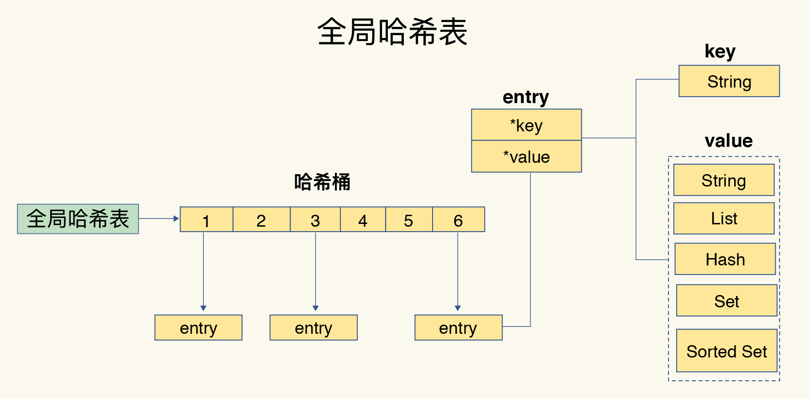

使用哈希表可以很快查找键值对，但哈希表的冲突问题和 rehash 可能带来的操作阻塞

### 哈希冲突

当往哈希表中写入更多数据时，哈希冲突是不可避免的问题，毕竟哈希桶的个数通常要少于 key 的数量，这也就是说，难免会有一些 key 的哈希值对应到了同一个哈希桶中

Redis 使用开链的方式解决哈希冲突，同一个哈希桶中的多个元素用一个链表来保存，它们之间依次用指针连接

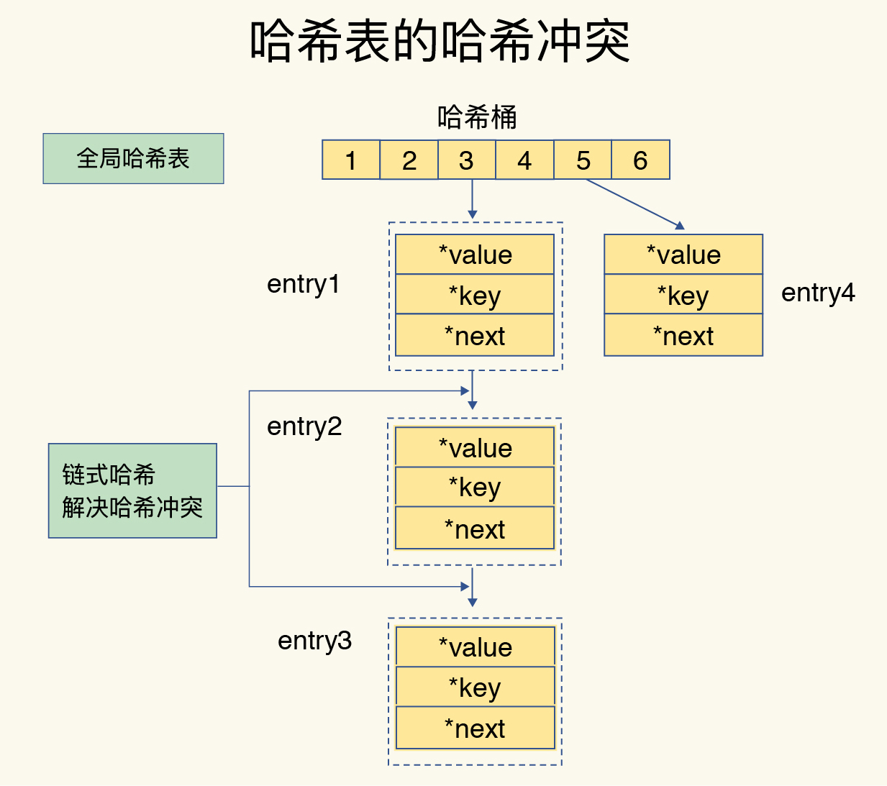

### rehash

Redis 会对哈希表做 rehash 操作，rehash 也就是增加现有的哈希桶数量，让逐渐增多的 entry 元素能在更多的桶之间分散保存，减少单个桶中的元素数量，从而减少单个桶中的冲突

为了使 rehash 操作更高效，Redis 默认使用了两个全局哈希表：哈希表 1 和哈希表 2

一开始，当你刚插入数据时，默认使用哈希表 1，此时的哈希表 2 并没有被分配空间，随着数据逐步增多，Redis 开始执行 rehash

1. 给哈希表 2 分配更大的空间

2. 把哈希表 1 中的数据重新映射并拷贝到哈希表 2 中

3. 释放哈希表 1 的空间，留作下一次 rehash 扩容备用

第二步涉及大量的数据拷贝，如果一次性把哈希表 1 中的数据都迁移完，会造成 Redis 线程阻塞，无法服务其他请求，所以 Redis 采用了渐进式 rehash

在第二步拷贝数据时，Redis 仍然正常处理客户端请求，每处理一个请求时，从哈希表 1 中的第一个索引位置开始，顺带着将这个索引位置上的所有 entries 拷贝到哈希表 2 中；等处理下一个请求时，再顺带拷贝哈希表 1 中的下一个索引位置的 entries；把一次性大量拷贝的开销，分摊到了多次处理请求的过程中，避免了耗时操作，保证了数据的快速访问

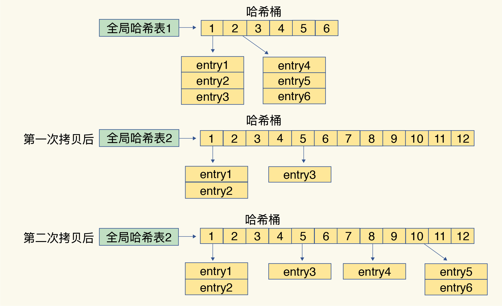

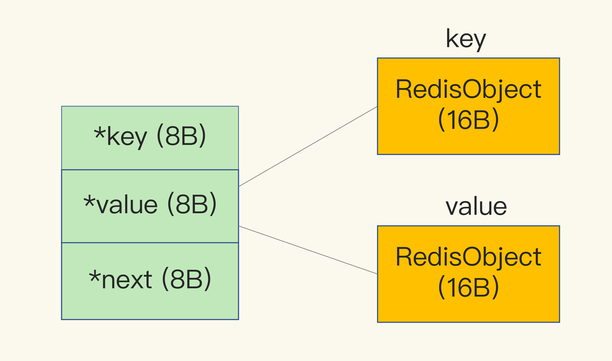

## 内存分配

Redis 使用内存分配库 jemalloc

jemalloc 在分配内存时，会根据我们申请的字节数 N，找一个比 N 大，但是最接近 N 的 2 的幂次数作为分配的空间，这样可以减少频繁分配的次数

dictEntry 结构就占用了 32 字节

## RedisObject

因为 Redis 的数据类型有很多，而且不同数据类型都有些相同的元数据要记录（比如最后一次访问的时间、被引用的次数等），所以，Redis 会用一个 RedisObject 结构体来统一记录这些元数据，同时指向实际数据

一个 RedisObject 包含了 8 字节的元数据和一个 8 字节指针，这个指针再进一步指向具体数据类型的实际数据所在，例如指向 String 类型的 SDS 结构所在的内存地址

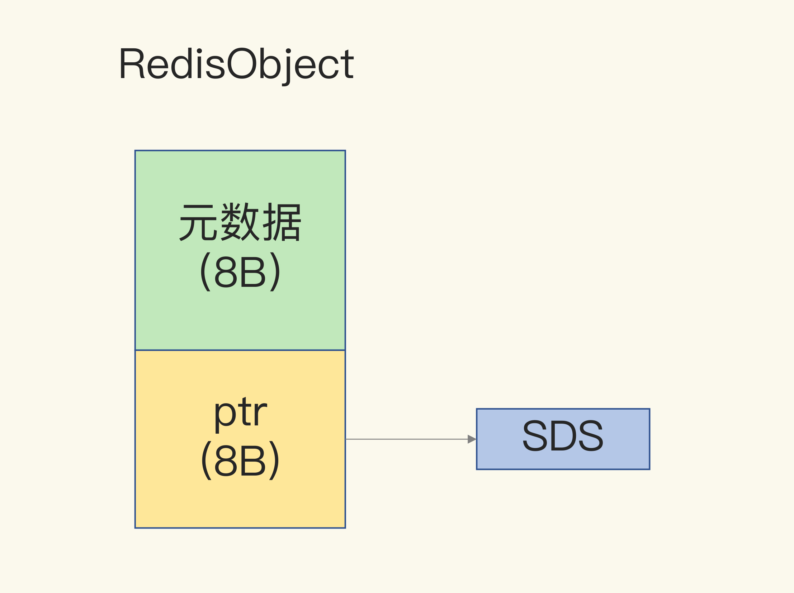

## 基本数据结构

Redis 的 value 支持的数据结构为：String、List、Hash、Set、Sorted Set

底层数据结构一共有 6 种，分别是简单动态字符串、双向链表、压缩列表、哈希表、跳表和整数数组

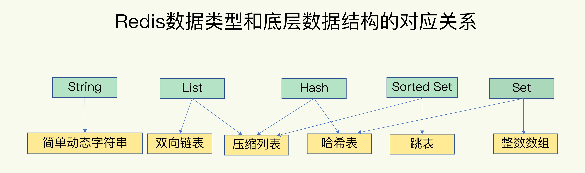

String 类型的底层实现只有一种数据结构，也就是简单动态字符串

List、Hash、Set 和 Sorted Set 这四种数据类型，都有两种底层实现结构，这四种类型为集合类型，特点是一个键对应一个集合的数据

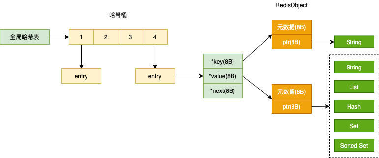

## SDS

### 内存布局

当保存 64 位有符号整数时，String 类型会把它保存为一个 8 字节的 Long 类型整数，这种保存方式通常也叫作 int 编码方式

当你保存的数据中包含字符时，String 类型就会用简单动态字符串（Simple Dynamic String，SDS）结构体来保存

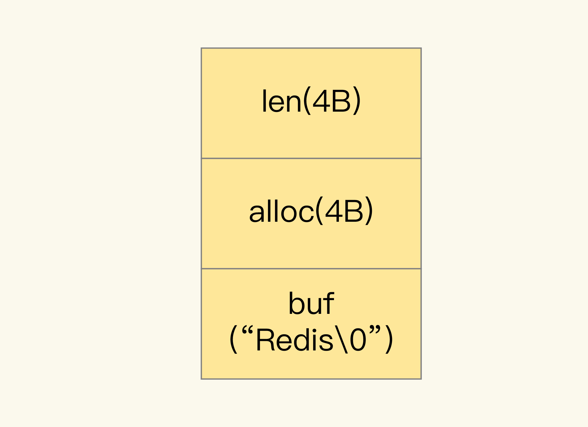

buf：字节数组，保存实际数据。为了表示字节数组的结束，Redis 会自动在数组最后加一个 `\0`，这会额外占用 1 个字节的开销

len：占 4 个字节，表示 buf 的已用长度

alloc：也占个 4 字节，表示 buf 的实际分配长度，一般大于 len

当保存的是 Long 类型整数时，RedisObject 中的指针就直接赋值为整数数据了，这样就不用额外的指针再指向整数了，节省了指针的空间开销，布局方式为 int 编码

当保存的是字符串数据，并且字符串小于等于 44 字节时，RedisObject 中的元数据、指针和 SDS 是一块连续的内存区域，这样就可以避免内存碎片，布局方式为 embstr 编码

当字符串大于 44 字节时，SDS 的数据量就开始变多了，Redis 就不再把 SDS 和 RedisObject 布局在一起了，而是会给 SDS 分配独立的空间，并用指针指向 SDS 结构，布局方式为 raw 编码

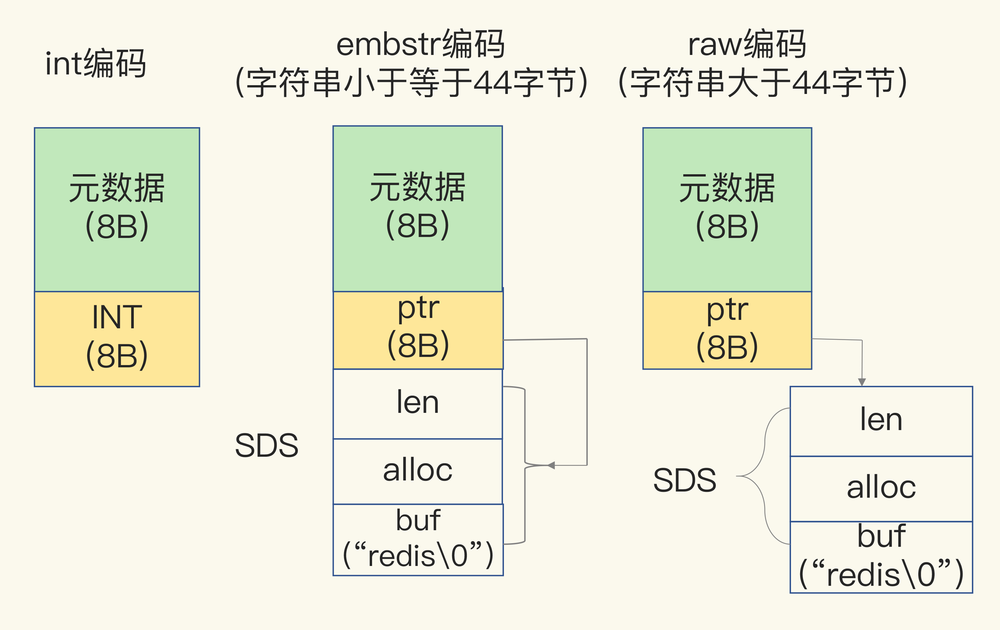

## ziplist

### 内存布局

类似于一个数组，数组中的每一个元素都对应保存一个数据；和数组不同的是，压缩列表在表头有三个字段 zlbytes、zltail 和 zllen，分别表示列表长度、列表尾的偏移量和列表中的 entry 个数；压缩列表在表尾还有一个 zlend，表示列表结束

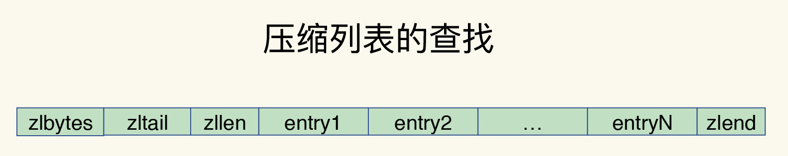

在压缩列表中，如果我们要查找定位第一个元素和最后一个元素，可以通过表头三个字段的长度直接定位，复杂度是 O(1)。而查找其他元素时，就没有这么高效了，只能逐个查找，此时的复杂度就是 O(N) 了

|字段|长度|值
|-|-|-|
zlbytes|uint32_t|整个 ziplist 占用的内存字节数
zltail|uint32_t|起始位置与 ziplist 尾节点的偏移量
zllen|uint16_t|ziplist 中节点的数量，当这个值小于 UINT16_MAX （65535）时，这个值就是 ziplist 中节点的数量； 当这个值等于 UINT16_MAX 时，节点的数量需要遍历整个 ziplist 才能计算得出
zlend|uint8_t|255 的二进制值 1111 1111 （UINT8_MAX） ，用于标记 ziplist 的末端

### entry 元数据

压缩列表之所以能节省内存，就在于它是用一系列连续的 entry 保存数据

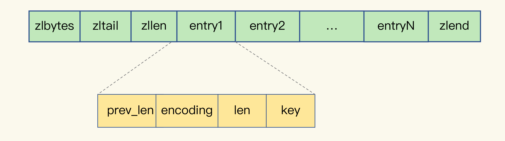

- prev_len，表示前一个 entry 的长度。prev_len 有两种取值情况：1 字节或 5 字节。取值 1 字节时，表示上一个 entry 的长度小于 254 字节。虽然 1 字节的值能表示的数值范围是 0 到 255，但是压缩列表中 zlend 的取值默认是 255，因此，就默认用 255 表示整个压缩列表的结束，其他表示长度的地方就不能再用 255 这个值了。所以，当上一个 entry 长度小于 254 字节时，prev_len 取值为 1 字节，否则，就取值为 5 字节

- len：表示自身长度，4 字节

- encoding：表示编码方式，1 字节

- key：保存实际数据

entry 会挨个放置在内存中，不需要再用额外的指针进行连接，这样就可以节省指针所占用的空间

### 内存开销

Redis 基于压缩列表实现了 List、Hash 和 Sorted Set 这样的集合类型，最大好处就是节省了 dictEntry 的开销

在某些情况下，使用集合类型存储单一数据会比 String 更节省空间

## 跳表

在链表的基础上，增加了多级索引，通过索引位置的几个跳转，实现数据的快速定位

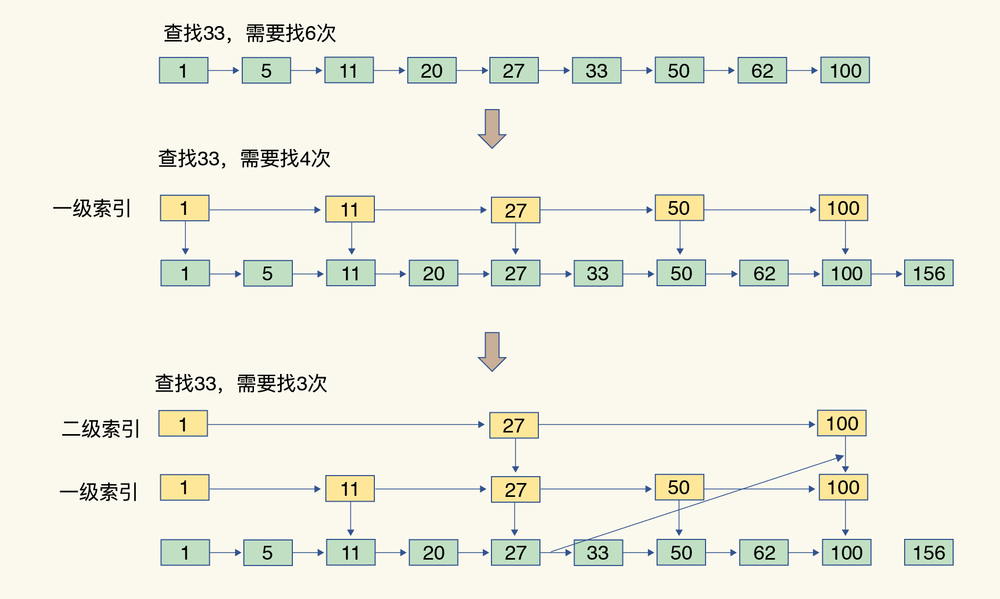