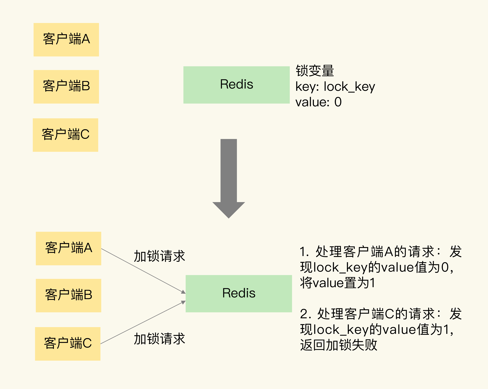

# 分布式锁

Redis 属于分布式系统，当有多个客户端需要争抢锁时，我们必须要保证，这把锁不能是某个客户端本地的锁。否则的话，其它客户端是无法访问这把锁的，当然也就不能获取这把锁了

在分布式系统中，当有多个客户端需要获取锁时，需要分布式锁。此时，锁是保存在一个共享存储系统中的，可以被多个客户端共享访问和获取

Redis 本身可以被多个客户端共享访问，正好就是一个共享存储系统，可以用来保存分布式锁，而且 Redis 的读写性能高，可以应对高并发的锁操作场景

和单机上的锁类似，分布式锁同样可以用一个变量来实现。客户端加锁和释放锁的操作逻辑，也和单机上的加锁和释放锁操作逻辑一致：加锁时同样需要判断锁变量的值，根据锁变量值来判断能否加锁成功；释放锁时需要把锁变量值设置为 0，表明客户端不再持有锁

但是，和线程在单机上操作锁不同的是，在分布式场景下，锁变量需要由一个共享存储系统来维护，只有这样，多个客户端才可以通过访问共享存储系统来访问锁变量。相应的，加锁和释放锁的操作就变成了读取、判断和设置共享存储系统中的锁变量值

分布式锁的两个要求：

1. 分布式锁的加锁和释放锁的过程，涉及多个操作。所以，在实现分布式锁时，我们需要保证这些锁操作的原子性

2. 共享存储系统保存了锁变量，如果共享存储系统发生故障或宕机，那么客户端也就无法进行锁操作了。在实现分布式锁时，我们需要考虑保证共享存储系统的可靠性，进而保证锁的可靠性

## 基于单个 Redis 节点实现分布式锁

赋予锁变量一个变量名，把这个变量名作为键值对的键，而锁变量的值，则是键值对的值，这样一来，Redis 就能保存锁变量了，客户端也就可以通过 Redis 的命令操作来实现锁操作

可以用 SETNX 和 DEL 命令组合来实现加锁和释放锁操作

SETNX 命令用于设置键值对的值，这个命令在执行时会判断键值对是否存在，如果不存在，就设置键值对的值，如果存在，就不做任何设置

对于释放锁操作来说，使用 DEL 命令删除锁变量

### 风险

假如某个客户端在执行了 SETNX 命令、加锁之后，紧接着却在操作共享数据时发生了异常，结果一直没有执行最后的 DEL 命令释放锁。因此，锁就一直被这个客户端持有，其它客户端无法拿到锁，也无法访问共享数据和执行后续操作，这会给业务应用带来影响

一个有效的解决方法是，给锁变量设置一个过期时间。这样一来，即使持有锁的客户端发生了异常，无法主动地释放锁，Redis 也会根据锁变量的过期时间，在锁变量过期后，把它删除。其它客户端在锁变量过期后，就可以重新请求加锁，这就不会出现无法加锁的问题了

如果客户端 A 执行了 SETNX 命令加锁后，假设客户端 B 执行了 DEL 命令释放锁，此时，客户端 A 的锁就被误释放了。如果客户端 C 正好也在申请加锁，就可以成功获得锁，进而开始操作共享数据。这样一来，客户端 A 和 C 同时在对共享数据进行操作，数据就会被修改错误

在加锁操作时，可以让每个客户端给锁变量设置一个唯一值，这里的唯一值就可以用来标识当前操作的客户端；在释放锁操作时，客户端需要判断，当前锁变量的值是否和自己的唯一标识相等，只有在相等的情况下，才能释放锁；在释放锁操作时，需要判断锁变量的值是否等于执行释放锁操作的客户端的唯一标识，使用 Lua 脚本实现的释放锁操作

采用主从集群模式部署的单机分布式锁，也不能保证锁的可靠性，由于主从复制是异步的，加锁操作的命令还未同步到 slave，此时主从切换，新 master 节点依旧会丢失该锁，对业务来说相当于锁失效了

## 基于多个 Redis 节点实现高可靠的分布式锁

只用了一个 Redis 实例来保存锁变量，如果这个 Redis 实例发生故障宕机了，那么锁变量就没有了。此时，客户端也无法进行锁操作了，这就会影响到业务的正常执行

为了避免 Redis 实例故障而导致的锁无法工作的问题，Redis 使用分布式锁算法 Redlock

Redlock 算法的基本思路，是让客户端和多个独立的 Redis 实例依次请求加锁，如果客户端能够和半数以上的实例成功地完成加锁操作，那么就认为，客户端成功地获得分布式锁了，否则加锁失败。这样一来，即使有单个 Redis 实例发生故障，因为锁变量在其它实例上也有保存，所以，客户端仍然可以正常地进行锁操作，锁变量并不会丢失

Redlock 算法的实现需要有 N 个独立的 Redis 实例，分成 3 步来完成加锁操作

1. 客户端获取当前时间

2. 客户端按顺序依次向 N 个 Redis 实例执行加锁操作，加锁操作和在单实例上执行的加锁操作一样；为避免某个实例宕机，需设置一个超时时间；如果客户端在和一个 Redis 实例请求加锁时，一直到超时都没有成功，那么此时，客户端会和下一个 Redis 实例继续请求加锁；加锁操作的超时时间需要远远地小于锁的有效时间，一般也就是设置为几十毫秒

3. 一旦客户端完成了和所有 Redis 实例的加锁操作，客户端就要计算整个加锁过程的总耗时

加锁成功条件：

1. 客户端从超过半数（大于等于 N/2+1）的 Redis 实例上成功获取到了锁

2. 客户端获取锁的总耗时没有超过锁的有效时间

在满足了这两个条件后，我们需要重新计算这把锁的有效时间，计算的结果是锁的最初有效时间减去客户端为获取锁的总耗时

如果客户端在和所有实例执行完加锁操作后，没能同时满足这两个条件，那么，客户端向所有 Redis 节点发起释放锁的操作