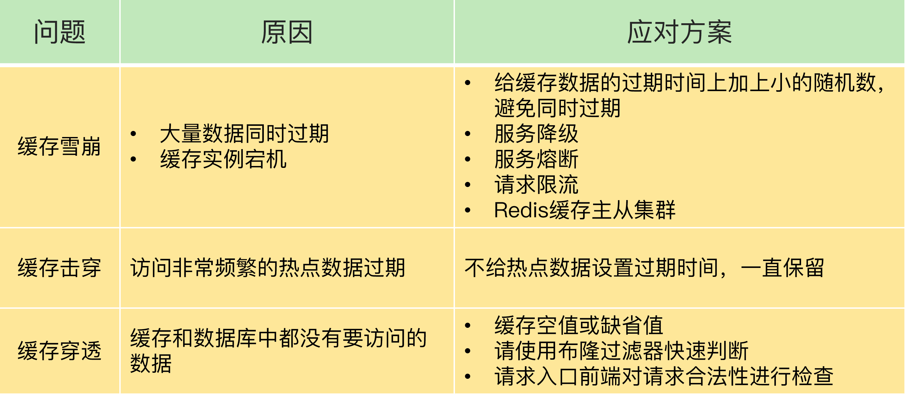
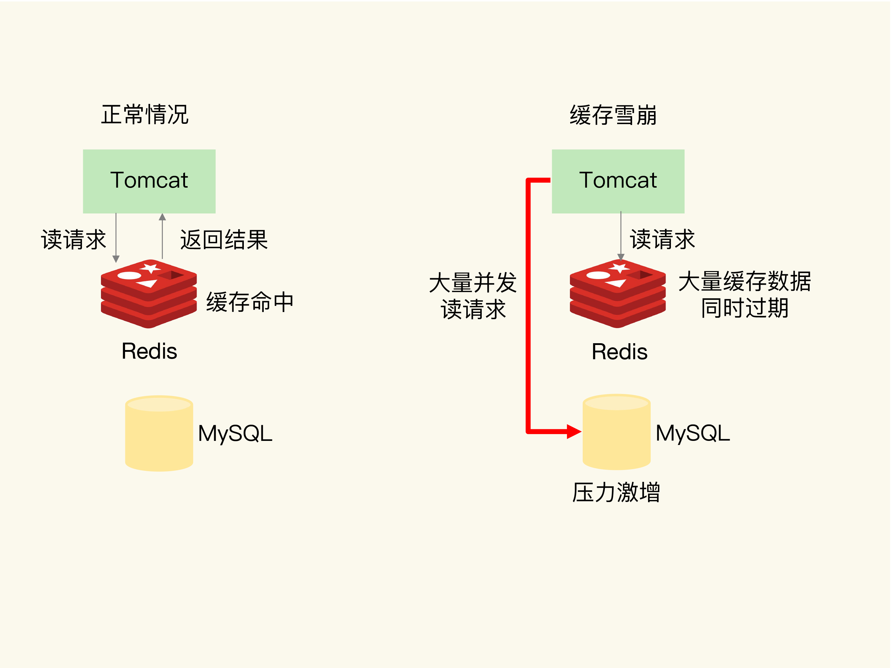
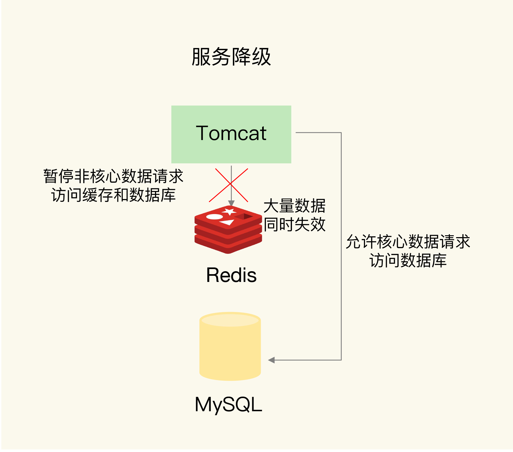
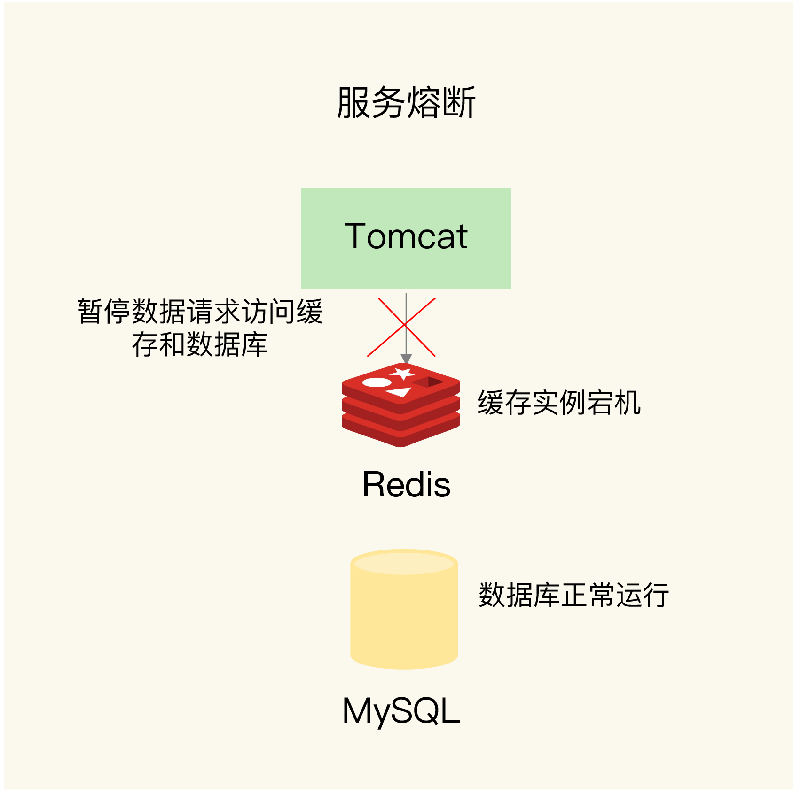
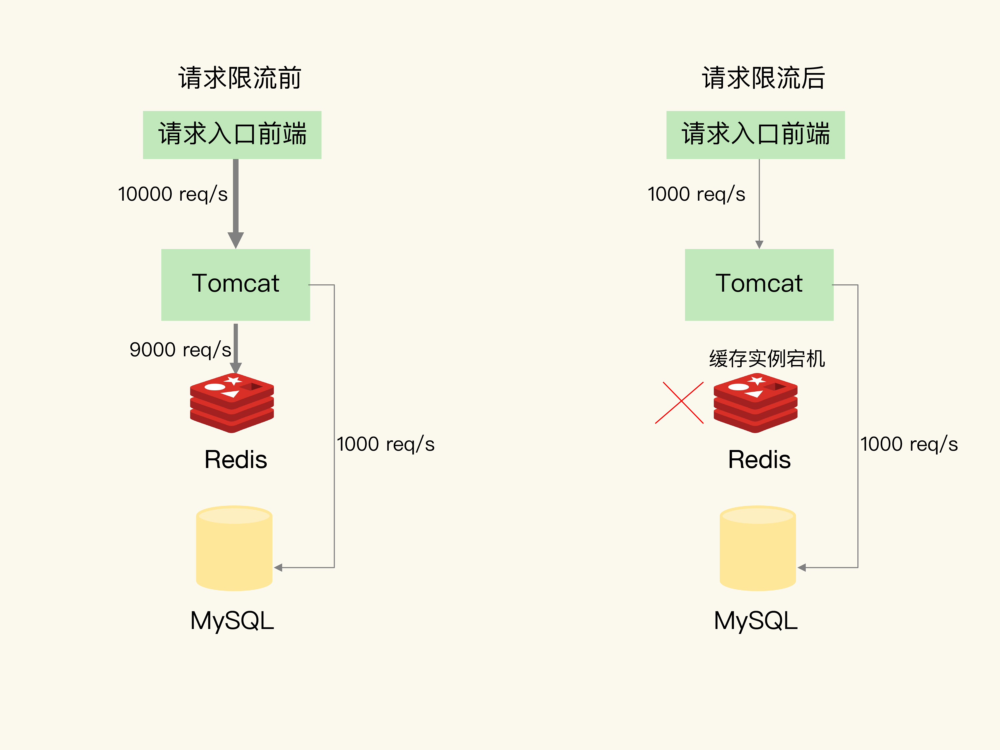
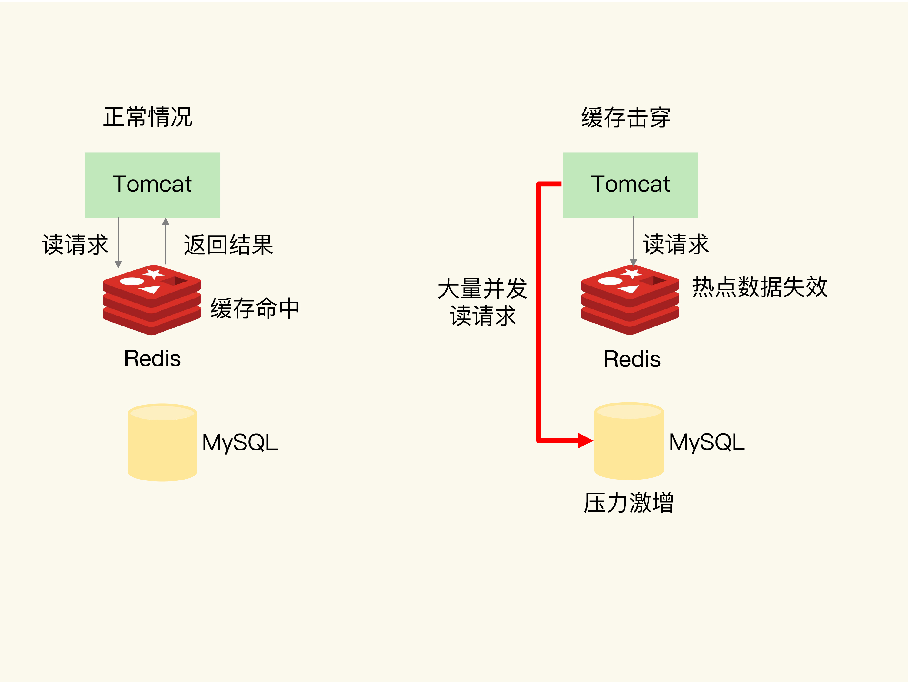
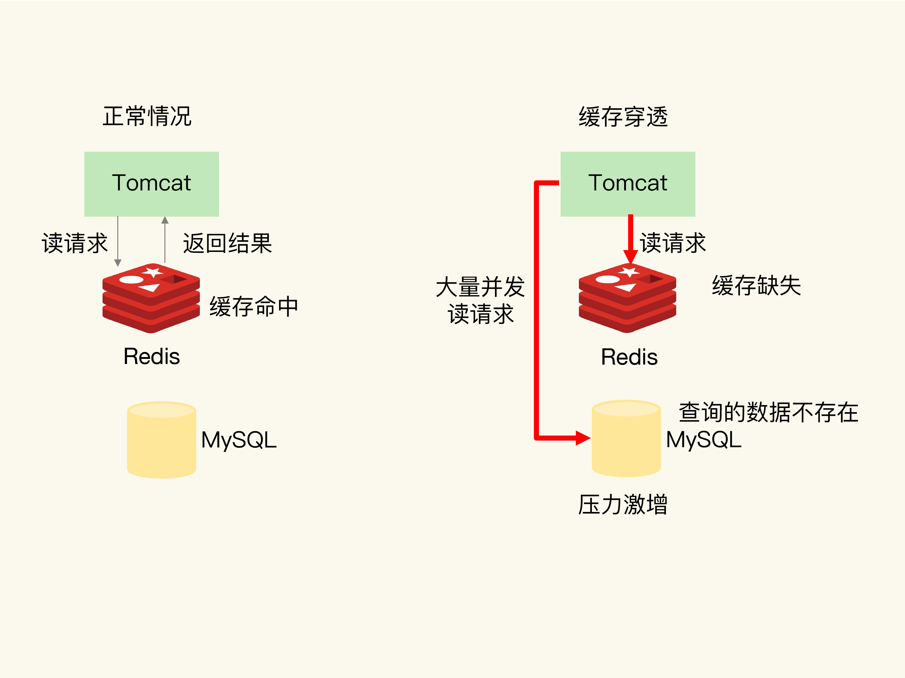

# 缓存异常

## 缓存雪崩

大量的应用请求无法在 Redis 缓存中进行处理，紧接着，应用将大量请求发送到数据库层，导致数据库层的压力激增

### 缓存中有大量数据同时过期

给数据的过期时间增加一个较小的随机数，不同数据的过期时间有所差别，但差别又不会太大，既避免了大量数据同时过期，同时也保证了这些数据基本在相近的时间失效，仍然能满足业务需求

服务降级，发生缓存雪崩时，针对不同的数据采取不同的处理方式；访问非核心数据时，暂时停止从缓存中查询这些数据，而是直接返回预定义信息、空值或是错误信息；访问核心数据时，允许查询缓存，如果缓存缺失，也可以继续通过数据库读取

### Redis 缓存实例发生故障宕机

在业务系统中实现服务熔断或请求限流机制：在发生缓存雪崩时，为了防止引发连锁的数据库雪崩，甚至是整个系统的崩溃，我们暂停业务应用对缓存系统的接口访问

服务熔断虽然可以保证数据库的正常运行，但是暂停了整个缓存系统的访问，对业务应用的影响范围大。为了尽可能减少这种影响，我们也可以进行请求限流；在业务系统的请求入口前端控制每秒进入系统的请求数，避免过多的请求被发送到数据库

通过主从节点的方式构建 Redis 缓存高可靠集群，主节点故障宕机，从节点还可以切换成为主节点，继续提供缓存服务，避免了由于缓存实例宕机而导致的缓存雪崩问题

## 缓存击穿

缓存击穿是指，针对某个访问非常频繁的热点数据的请求，无法在缓存中进行处理，紧接着，访问该数据的大量请求，一下子都发送到了后端数据库，导致了数据库压力激增，会影响数据库处理其他请求

缓存击穿的情况，经常发生在热点数据过期失效时

### 热点数据不设置过期时间

对于访问特别频繁的热点数据，就不设置过期时间了

## 缓存穿透

缓存穿透是指要访问的数据既不在 Redis 缓存中，也不在数据库中，导致请求在访问缓存时，发生缓存缺失，再去访问数据库时，发现数据库中也没有要访问的数据；应用无法从数据库中读取数据再写入缓存来服务后续请求，这样一来缓存也就成了摆设，如果应用持续有大量请求访问数据，就会同时给缓存和数据库带来巨大压力

原因：

- 业务层误操作：缓存中的数据和数据库中的数据被误删除了，所以缓存和数据库中都没有数据

- 恶意攻击：专门访问数据库中没有的数据

### 缓存空值或缺省值

一旦发生缓存穿透，可以针对查询的数据，在 Redis 中缓存一个空值或是和业务层协商确定的缺省值；应用发送的后续请求再进行查询时，就可以直接从 Redis 中读取空值或缺省值，返回给业务应用了，避免了把大量请求发送给数据库处理，保持了数据库的正常运行

### 布隆过滤器

使用布隆过滤器快速判断数据是否存在，避免从数据库中查询数据是否存在，减轻数据库压力

工作原理：

- 布隆过滤器由一个初值都为 0 的 bit 数组和 N 个哈希函数组成，可以用来快速判断某个数据是否存在

- 标记某个数据存在时，使用 N 个哈希函数，分别计算这个数据的哈希值，得到 N 个哈希值

- 把这 N 个哈希值对 bit 数组的长度取模，得到每个哈希值在数组中的对应位置

- 把对应位置的 bit 位设置为 1，这就完成了在布隆过滤器中标记数据的操作

- 如果数据不存在，也就没有用布隆过滤器标记过数据，那么，bit 数组对应 bit 位的值仍然为 0

当需要查询某个数据时，就执行刚刚说的计算过程，先得到这个数据在 bit 数组中对应的 N 个位置；查看 bit 数组中这 N 个位置上的 bit 值；只要这 N 个 bit 值有一个不为 1，这就表明布隆过滤器没有对该数据做过标记，所以，查询的数据一定没有在数据库中保存

基于布隆过滤器的快速检测特性，可以在把数据写入数据库时，使用布隆过滤器做个标记。当缓存缺失后，应用查询数据库时，可以通过查询布隆过滤器快速判断数据是否存在。如果不存在，就不用再去数据库中查询了。这样一来，即使发生缓存穿透了，大量请求只会查询 Redis 和布隆过滤器，而不会积压到数据库，也就不会影响数据库的正常运行。布隆过滤器可以使用 Redis 实现，本身就能承担较大的并发访问压力