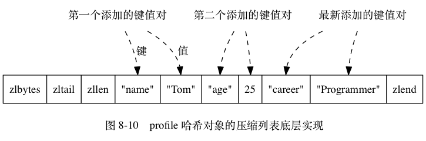
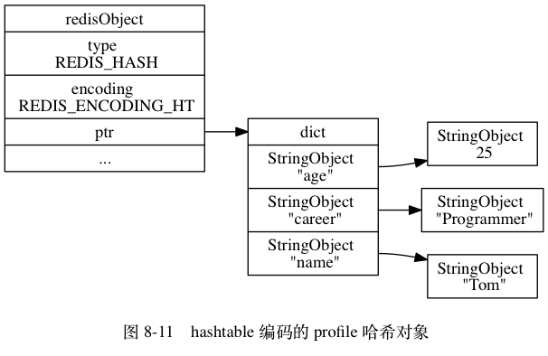

# Hash

Hash 的编码可以是 ziplist 或者 hashtable

## ziplist

每当有新的键值对要加入到 Hash 时，新的压缩列表节点放入压缩列表尾

- 保存了同一键值对的两个节点总是紧挨在一起，保存键的节点在前，保存值的节点在后

- 先添加到 Hash 中的键值对会被放在压缩列表的表头方向，后来添加到 Hash 中的键值对会被放在压缩列表的表尾方向



## hashtable

Hash 的每个键值对都使用一个字典键值对来保存

- 字典的每个键都是一个字符串对象，对象中保存了键值对的键

- 字典的每个值都是一个字符串对象， 对象中保存了键值对的值



## 编码转换

当 Hash 同时满足以下两个条件时将使用 ziplist 编码：

- 哈希对象保存的所有键值对的键和值的字符串长度都小于 64 字节

- 哈希对象保存的键值对数量小于 512 个

不能满足这两个条件的哈希对象需要使用 hashtable 编码

对于使用 ziplist 编码的列表对象来说，当使用 ziplist 编码所需的两个条件的任意一个不能被满足时，对象的编码转换操作就会被执行：原本保存在压缩列表里的所有键值对都会被转移并保存到字典里面，对象的编码也会从 ziplist 变为 hashtable

## 基本命令

```
// 将 hash 表中 filed 设置为 valude
HSET hash field value
// 如果给定的哈希表并不存在， 那么创建一个新的哈希表
// 如果 field 已经存在于哈希表中， 那么它的旧值将被新值覆盖

HGET hash field

HEXISTS hash field

HMSET hash field1 value1 fedld2 value2...
// 会覆盖已存在的 field

HMGET hash field1 field2...

// 哈希表不存在则创建
// field 存在则放弃执行
// field 不存在则执行
HSETNX hash field value

// 删除 hash 中的 field
HDEL hash field1 field2

// 获取 hash 表中 field 数量
HLEN hash

// 获取 hash 表中 field 对应的字符串长度
HSTRLEN hash field

// 为 hash 表中 field 的值加上增量
// 增量可以为负数
HINCRBY hash field num
HINCRBYFLOAT hash field num
// hash 不存在则新建
// field 不存在则初始化为 0

// 获取 hash 中所有的 field
HKEYS hash

// 获取 hash 中所有 value
HVALS hash

// 获取 hash 中所有 field-value
HGETALL hash
```