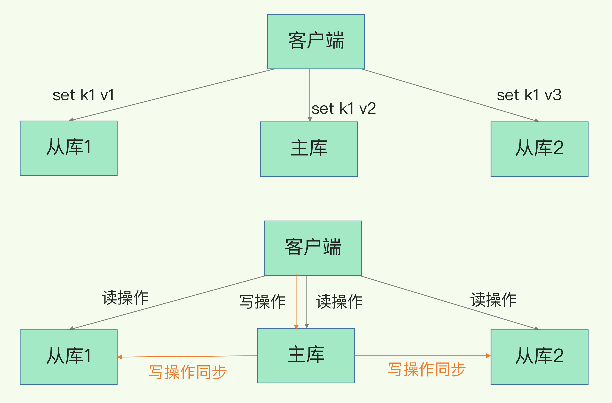
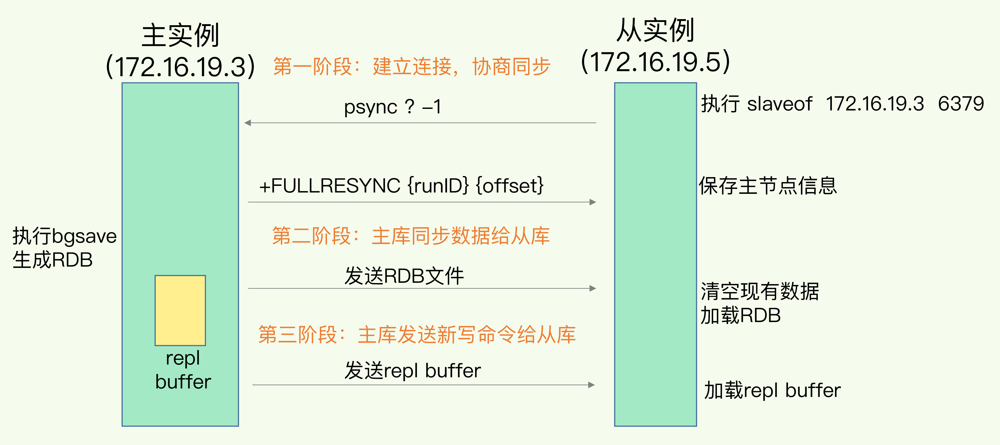
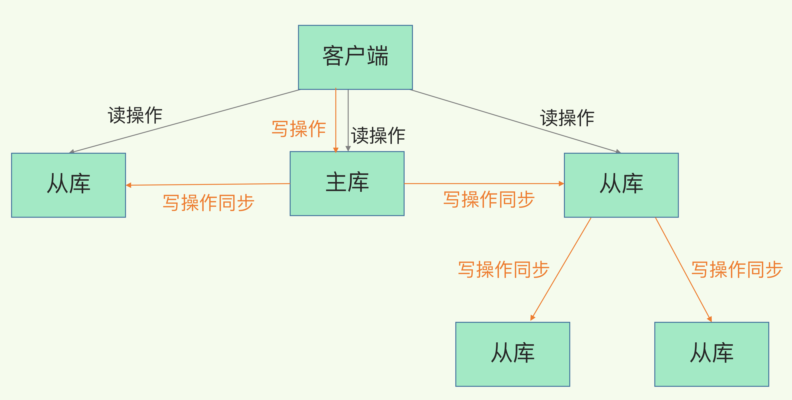
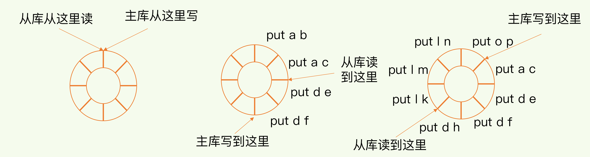
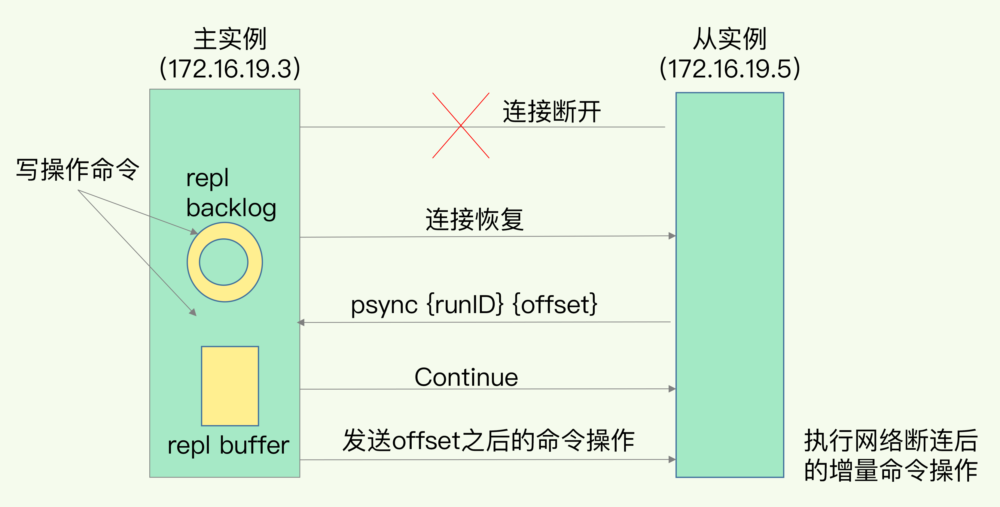
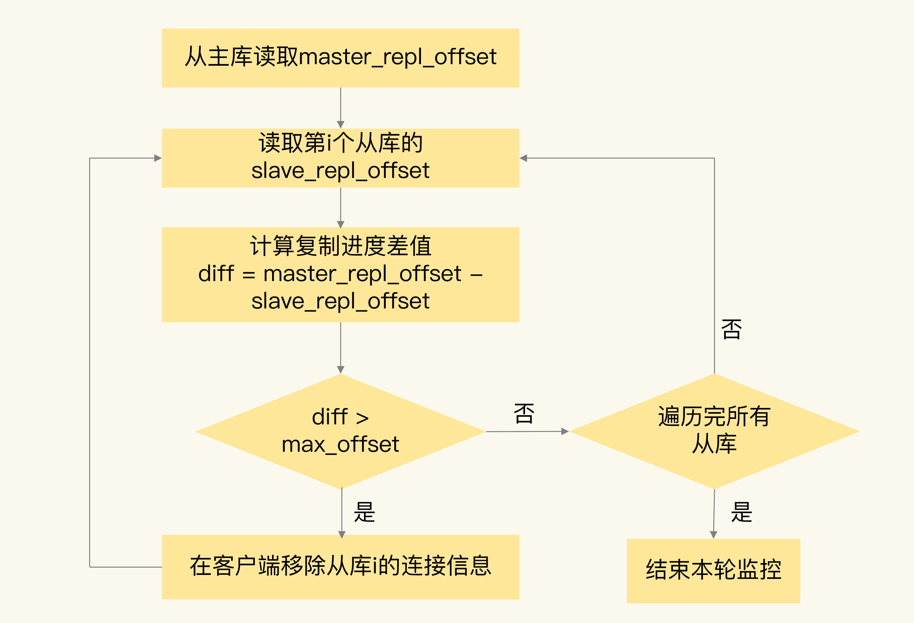
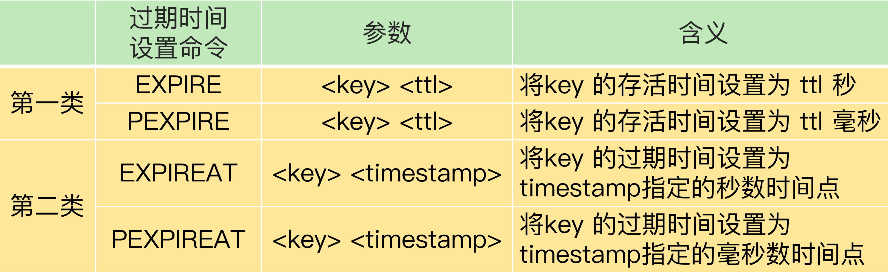

# 主从同步

Redis 具有高可靠性：数据尽量少丢失（RDB、AOF）、服务尽量少中断（master、slave）

Redis 提供了主从库模式，以保证数据副本的一致，主从库之间采用的是读写分离的方式

- 读操作：主库、从库都可以接收

- 写操作：首先到主库执行，然后主库将写操作同步给从库

## 主从库第一次同步

当启动多个 Redis 实例的时候，它们相互之间就可以通过 replicaof 命令形成主库和从库的关系，之后会按照三个阶段完成数据的第一次同步；执行 replicaof 的实例为从库

1. 第一阶段是主从库间建立连接、协商同步的过程，主要是为全量复制做准备；从库和主库建立起连接，并告诉主库即将进行同步，主库确认回复后，主从库间就可以开始同步了；从库给主库发送 psync 命令，表示要进行数据同步，主库根据这个命令的参数来启动复制；psync 命令包含了主库的 runID 和复制进度 offset 两个参数；runID 是每个 Redis 实例启动时都会自动生成的一个随机 ID，用来唯一标记这个实例；当从库和主库第一次复制时，因为不知道主库的 runID，所以将 runID 设为 `?`；offset 设为 -1，表示第一次复制

2. 主库收到 psync 命令后，会用 FULLRESYNC 响应命令带上两个参数：主库 runID 和主库目前的复制进度 offset，返回给从库；从库收到响应后，会记录下这两个参数；FULLRESYNC 响应表示第一次复制采用的全量复制，主库会把当前所有的数据都复制给从库；主库将所有数据同步给从库，从库收到数据后，在本地完成数据加载，这个过程依赖于内存快照生成的 RDB 文件；主库执行 bgsave 命令，生成 RDB 文件，接着将文件发给从库；从库接收到 RDB 文件后，会先清空当前数据库，然后加载 RDB 文件；在主库将数据同步给从库的过程中，主库不会被阻塞，仍然可以正常接收请求；请求中的写操作并没有记录到刚刚生成的 RDB 文件中，为了保证主从库的数据一致性，主库会在内存中用专门的 replication buffer，记录 RDB 文件生成后收到的所有写操作

3. 主库会把第二阶段执行过程中新收到的写命令，再发送给从库；当主库完成 RDB 文件发送后，就会把此时 replication buffer 中的修改操作发给从库，从库再重新执行这些操作

## 主从级联模型 

主从库间第一次数据同步的过程中，对于主库来说，需要完成两个耗时的操作：生成 RDB 文件和传输 RDB 文件

如果从库数量很多，而且都要和主库进行全量复制的话，就会导致主库忙于 fork 子进程生成 RDB 文件，进行数据全量同步

fork 这个操作会阻塞主线程处理正常请求，从而导致主库响应应用程序的请求速度变慢

传输 RDB 文件也会占用主库的网络带宽，同样会给主库的资源使用带来压力

通过主从级联模式（主-从-从）将主库生成 RDB 和传输 RDB 的压力，以级联的方式分散到从库上

在部署主从集群的时候，可以手动选择一个从库，用于级联其他的从库；再选择一些从库执行 replicaof，让它们和刚才所选的从库，建立起主从关系

## 主从网络连接

一旦主从库完成了全量复制，它们之间就会一直维护一个网络连接，主库会通过这个连接将后续陆续收到的命令操作再同步给从库，这个过程也称为基于长连接的命令传播，可以避免频繁建立连接的开销

网络断了之后，主从库会采用增量复制的方式继续同步，只会把主从库网络断连期间主库收到的命令，同步给从库

当主从库断连后，主库会把断连期间收到的写操作命令，写入 replication buffer，同时也会把这些操作命令也写入 repl_backlog_buffer 缓冲区

repl_backlog_buffer 是一个环形缓冲区，主库会记录自己写到的位置，从库则会记录自己已经读到的位置

刚开始的时候，主库和从库的写读位置在一起，是它们的起始位置；随着主库不断接收新的写操作，它在缓冲区中的写位置会逐步偏离起始位置，对主库来说对应的偏移量就是 master_repl_offset，主库接收的新写操作越多，这个值就会越大；从库在复制完写操作命令后，它在缓冲区中的读位置也开始逐步偏移刚才的起始位置，从库已复制的偏移量 slave_repl_offset 也在不断增加；正常情况下，这两个偏移量基本相等

在网络断连阶段，主库可能会收到新的写操作命令，所以，一般来说，master_repl_offset 会大于 slave_repl_offset；主库只用把 master_repl_offset 和 slave_repl_offset 之间的命令操作同步给从库就行

主从库的连接恢复之后，从库首先会给主库发送 psync 命令，并把自己当前的 slave_repl_offset 发给主库，主库会判断自己的 master_repl_offset 和 slave_repl_offset 之间的差距

因为 repl_backlog_buffer 是一个环形缓冲区，所以在缓冲区写满后，主库会继续写入，此时，就会覆盖掉之前写入的操作；如果从库的读取速度比较慢，就有可能导致从库还未读取的操作被主库新写的操作覆盖了，这会导致主从库间的数据不一致

可以调整 repl_backlog_size 这个参数

## 主从数据一致性

主从数据不一致是指客户端从从库中读取到的值和主库中的最新值并不一致，因为主从库间的命令复制是异步进行的

在主从库命令传播阶段，主库收到新的写命令后，会发送给从库。但是，主库并不会等到从库实际执行完命令后，再把结果返回给客户端，而是主库自己在本地执行完命令后，就会向客户端返回结果了。如果从库还没有执行主库同步过来的命令，主从库间的数据就不一致了

一方面，主从库间的网络可能会有传输延迟，所以从库不能及时地收到主库发送的命令，从库上执行同步命令的时间就会被延后；一方面，即使从库及时收到了主库的命令，但是，也可能会因为正在处理其它复杂度高的命令（例如集合操作命令）而阻塞

解决方案：

1. 在硬件环境配置方面，我们要尽量保证主从库间的网络连接状况良好，避免把主从库部署在不同的机房

2. 开发一个外部程序来监控主从库间的复制进度；Redis 的 INFO replication 命令可以查看主库接收写命令的进度信息（master_repl_offset）和从库复制写命令的进度信息（slave_repl_offset），如果某个从库的进度差值大于预设的阈值，可以让客户端不再和这个从库连接进行数据读取，这样就可以减少读到不一致数据的情况

## 从数据库读取过期数据

Redis 同时使用了两种策略来删除过期的数据，分别是惰性删除策略和定期删除策略

惰性删除策略：当一个数据的过期时间到了以后，并不会立即删除数据，而是等到再有请求来读写这个数据时，对数据进行检查，如果发现数据已经过期了，再删除这个数据；减少删除操作对 CPU 资源的使用，对于用不到的数据，就不再浪费时间进行检查和删除；导致大量已经过期的数据留存在内存中，占用较多的内存资源

定期删除策略：每隔一段时间（默认 100ms），就会随机选出一定数量的数据，检查它们是否过期，并把其中过期的数据删除，这样就可以及时释放一些内存

虽然定期删除策略可以释放一些内存，但是 Redis 为了避免过多删除操作对性能产生影响，每次随机检查数据的数量并不多

惰性删除策略中，如果客户端从主库上读取留存的过期数据，主库会触发删除操作，客户端并不会读到过期数据；从库本身不会执行删除操作，如果客户端在从库中访问留存的过期数据，从库并不会触发数据删除，会返回空值

同时，Redis 用于设置过期时间的命令在从库上可能会被延后，导致应该过期的数据又在从库上被读取到；设置数据过期时间的命令一共有 4 个，EXPIRE 和 PEXPIRE 给数据设置的是从命令执行时开始计算的存活时间，EXPIREAT 和 PEXPIREAT 会直接把数据的过期时间设置为具体的一个时间点

当主从库全量同步时，如果主库接收到了一条 EXPIRE 命令，那么，主库会直接执行这条命令。这条命令会在全量同步完成后，发给从库执行。而从库在执行时，就会在当前时间的基础上加上数据的存活时间，这样一来，从库上数据的过期时间就会比主库上延后了

在业务应用中使用 EXPIREAT/PEXPIREAT 命令，把数据的过期时间设置为具体的时间点，避免读到过期数据，同时主从节点上的时钟要保持一致