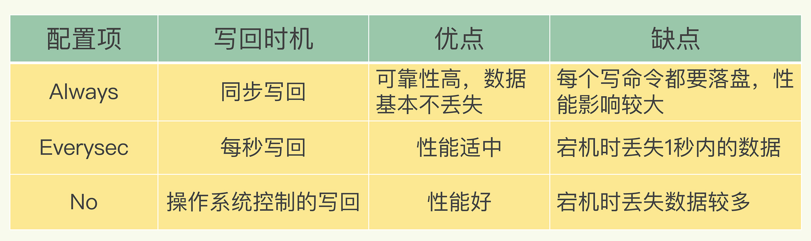
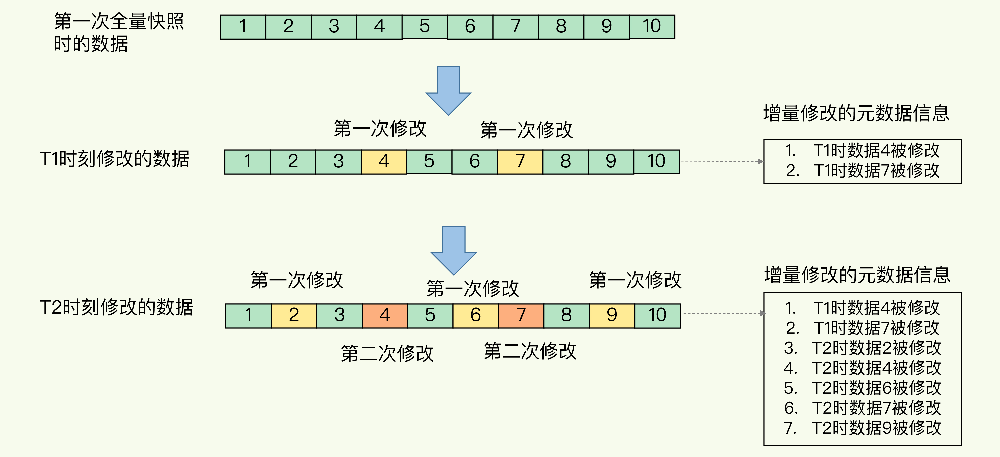
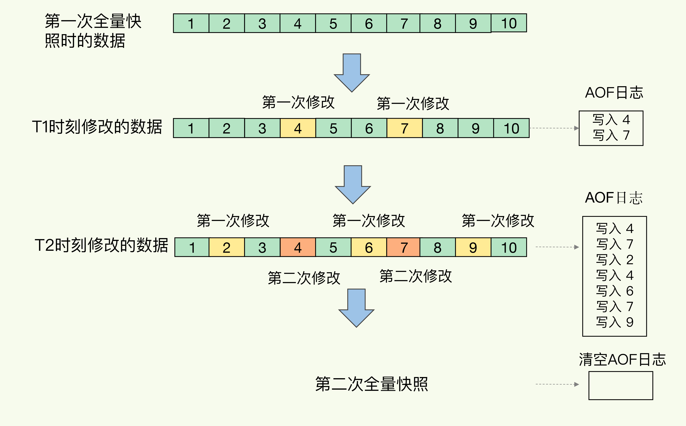

# 持久化机制

Redis 的持久化主要有两大机制，即 AOF（Append Only File）日志和 RDB 快照

## AOF

AOF 日志是写后日志，即 Redis 是先执行命令，把数据写入内存，然后才记录日志

AOF 里记录的是 Redis 收到的每一条命令，这些命令是以文本形式保存的

以 Redis 收到 set testkey testvalue 命令后记录的日志为例，看看 AOF 日志的内容。其中，*3 表示当前命令有三个部分，每部分都是由 $+数字 开头，后面紧跟着具体的命令、键或值。数字表示这部分中的命令、键或值一共有多少字节。例如，$3 set 表示这部分有 3 个字节，也就是 set 命令

### 写后日志原因

- 为了避免额外的检查开销，Redis 在向 AOF 里面记录日志的时候，并不会先去对这些命令进行语法检查。所以如果先记日志再执行命令的话，日志中就有可能记录了错误的命令，Redis 在使用日志恢复数据时，就可能会出错

- 先让系统执行命令，只有命令能执行成功，才会被记录到日志中，可以避免出现记录错误命令的情况

- 在命令执行后才记录日志，不会阻塞当前的写操作

### 潜在风险

- 刚执行完一个命令，还没有来得及记日志就宕机了，那么这个命令和相应的数据就有丢失的风险

- AOF 虽然避免了对当前命令的阻塞，但可能会给下一个操作带来阻塞风险

### 写回策略 

潜在风险都是和 AOF 写回磁盘的时机相关的，如果能够控制一个写命令执行完后 AOF 日志写回磁盘的时机，风险就解除了

AOF 配置项 appendfsync 的三个可选值提供了三个选择

- Always，同步写回：每个写命令执行完，立马同步地将日志写回磁盘；可以做到基本不丢数据，但是它在每一个写命令后都有一个慢速的落盘操作，不可避免地会影响主线程性能

- Everysec，每秒写回：每个写命令执行完，只是先把日志写到 AOF 文件的内存缓冲区，每隔一秒把缓冲区中的内容写入磁盘；如果发生宕机，上一秒内未落盘的命令操作仍然会丢失

- No，操作系统控制的写回：每个写命令执行完，只是先把日志写到 AOF 文件的内存缓冲区，由操作系统决定何时将缓冲区内容写回磁盘；落盘的时机已经不在 Redis 手中了，只要 AOF 记录没有写回磁盘，一旦宕机对应的数据就丢失了

### 重写机制

AOF 是以文件的形式在记录接收到的所有写命令，随着接收的写命令越来越多，AOF 文件会越来越大

AOF 文件过大带来的性能问题：

- 文件系统本身对文件大小有限制，无法保存过大的文件

- 如果文件太大，之后再往里面追加命令记录的话，效率也会变低

- 如果发生宕机，AOF 中记录的命令要一个个被重新执行，用于故障恢复，如果日志文件太大，整个恢复过程就会非常缓慢

AOF 重写机制就是在重写时，Redis 根据数据库的现状创建一个新的 AOF 文件，也就是说，读取数据库中的所有键值对，然后对每一个键值对用一条命令记录它的写入

重写机制具有多变一功能，旧日志文件中的多条命令，在重写后的新日志中变成了一条命令

重写过程是由后台子进程 bgrewriteaof 来完成的，这也是为了避免阻塞主线程，导致数据库性能下降

每次执行重写时，主线程 fork 出后台的 bgrewriteaof 子进程，fork 会把主线程的内存拷贝一份给 bgrewriteaof 子进程，这里面就包含了数据库的最新数据；然后 bgrewriteaof 子进程就可以在不影响主线程的情况下，逐一把拷贝的数据写成操作，记入重写日志

因为主线程未阻塞，仍然可以处理新来的操作。此时如果有写操作，Redis 会把这个操作写到正在使用的 AOF 日志的缓冲区。这样一来，即使宕机了，这个 AOF 日志的操作仍然是齐全的，可以用于恢复

新操作也会被写到重写日志的缓冲区，重写日志也不会丢失最新的操作。等到拷贝数据的所有操作记录重写完成后，重写日志记录的这些最新操作也会写入新的 AOF 文件，以保证数据库最新状态的记录。此时就可以用新的 AOF 文件替代旧文件了

### 潜在风险

fork 瞬间一定是会阻塞主线程，虽然 fork 采用 COW 机制，但 fork 子进程需要拷贝进程必要的数据结构，其中有一项就是拷贝内存页表（虚拟内存和物理内存的映射索引表），这个拷贝过程会消耗大量 CPU 资源，拷贝完成之前整个进程是会阻塞的，阻塞时间取决于整个实例的内存大小，实例越大，内存页表越大，fork 阻塞时间越久

由于采用 COW 机制，所以在写发生时，才真正拷贝内存真正的数据，这个过程中，父进程也可能会产生阻塞的风险

## RDB

内存快照，就是指内存中的数据在某一个时刻的状态记录

RDB（Redis DataBase）把某一时刻的状态以文件的形式写到磁盘上，也就是快照；即使宕机，快照文件也不会丢失，数据的可靠性也就得到了保证

RDB 记录的是某一时刻的数据，并不是操作，所以，在做数据恢复时，可以直接把 RDB 文件读入内存，很快地完成恢复

### 全量快照

Redis 的数据都在内存中，为了提供所有数据的可靠性保证，它执行的是全量快照，也就是说，把内存中的所有数据都记录到磁盘中

### 生成快照

Redis 提供了两个命令来生成 RDB 文件，分别是 save 和 bgsave

- save：在主线程中执行，会导致阻塞

- bgsave：创建一个子进程，专门用于写入 RDB 文件，避免了主线程的阻塞，这也是 Redis RDB 文件生成的默认配置

bgsave 借助 COW，在执行快照的同时，正常处理写操作；bgsave 子进程是由主线程 fork 生成的，可以共享主线程的所有内存数据；bgsave 子进程运行后，开始读取主线程的内存数据，并把它们写入 RDB 文件；如果主线程要修改一块数据，这块数据就会被复制一份，生成该数据的副本；bgsave 子进程会把这个副本数据写入 RDB 文件，而在这个过程中，主线程仍然可以直接修改原来的数据

### 增量快照

虽然 bgsave 执行时不阻塞主线程，但是如果频繁地执行全量快照，也会带来两方面的开销：

- 频繁将全量数据写入磁盘，会给磁盘带来很大压力

- 虽然子进程在创建后不会再阻塞主线程，但是 fork 这个创建过程本身会阻塞主线程，而且主线程的内存越大，阻塞时间越长

增量快照，即做了一次全量快照后，后续的快照只对修改的数据进行快照记录，这样可以避免每次全量快照的开销

记住哪些数据被修改了需要使用额外的元数据信息去记录哪些数据被修改了，这会带来额外的空间开销问题

## AOF 和 RDB 混合方法

内存快照以一定的频率执行，在两次 RDB 快照之间，使用 AOF 日志记录这期间的所有命令操作

RDB 快照不用很频繁地执行，这就避免了频繁 fork 对主线程的影响。而且，AOF 日志也只用记录两次快照间的操作，不需要记录所有操作。因此，就不会出现文件过大的情况了，也可以避免重写开销

