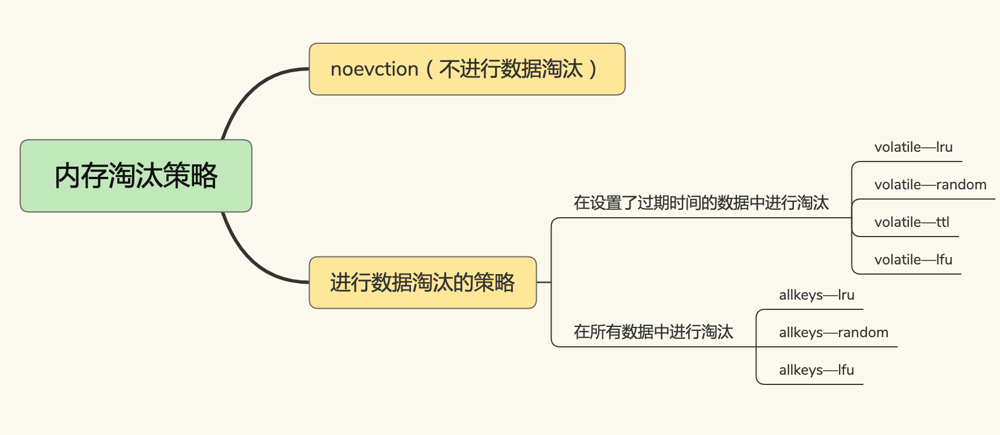
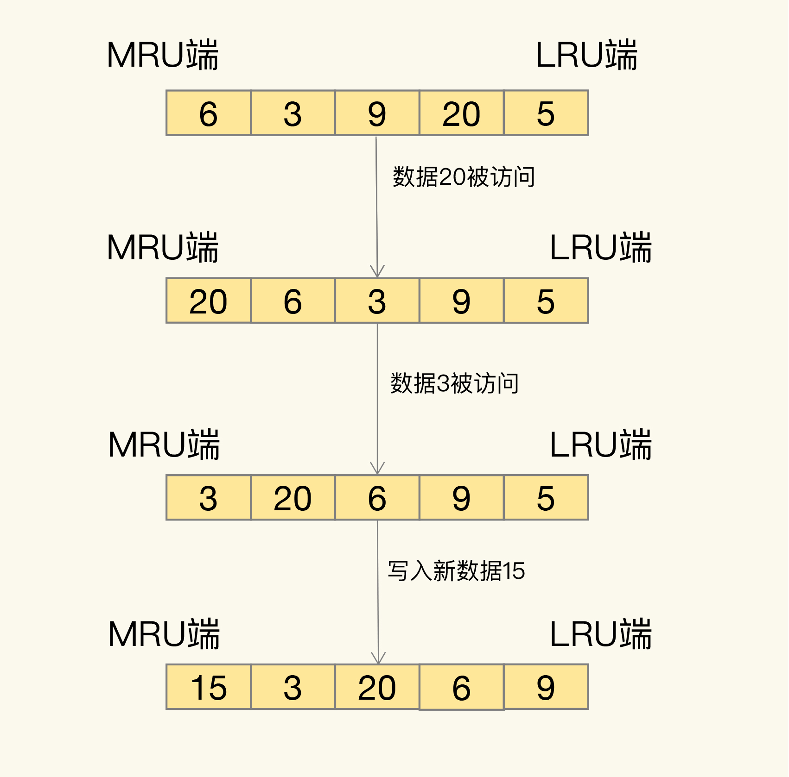
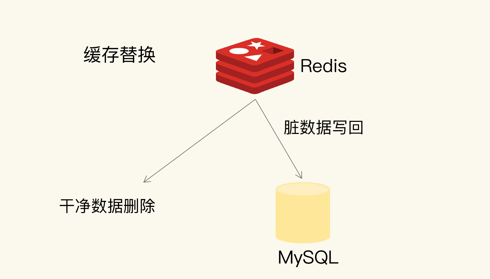

# 缓存淘汰

## 缓存淘汰

应用 Redis 缓存时，如果能缓存会被反复访问的数据，那就能加速业务应用的访问

在一些场景下，有些数据被访问的次数非常少，甚至只会被访问一次。当这些数据服务完访问请求后，如果还继续留存在缓存中的话，就只会白白占用缓存空间

为了保证较高的性价比，缓存的空间容量必然要小于后端数据库的数据总量。不过，内存大小毕竟有限，随着要缓存的数据量越来越大，有限的缓存空间不可避免地会被写满

淘汰机制包括两步：第一，根据一定的策略，筛选出对应用访问来说不重要的数据；第二，将这些数据从缓存中删除，为新来的数据腾出空间

## 设置缓存容量

### 长尾效应

20% 的数据贡献了 80% 的访问

### 重尾效应

20% 的数据可能贡献不了 80% 的访问，而剩余的 80% 数据反而贡献了更多的访问量

### 经验

把缓存容量设置为总数据量的 15% 到 30%，兼顾访问性能和内存空间开销

## 淘汰策略

volatie-* 四种淘汰策略，筛选的候选数据范围，被限制在已经设置了过期时间的键值对上，即使缓存没有写满，这些数据如果过期了，也会被删除

allkeys-* 三种淘汰策略，筛选的候选数据范围，扩大到了所有键值对，无论这些键值对是否设置了过期时间

### noevction

默认情况下，Redis 在使用的内存空间超过 maxmemory 值时，并不会淘汰数据；一旦缓存被写满了，再有写请求来时，Redis 不再提供服务，而是直接返回错误

Redis 用作缓存时，实际的数据集通常都是大于缓存容量的，总会有新的数据要写入缓存，这个策略本身不淘汰数据，也就不会腾出新的缓存空间，因此不能把它用在 Redis 缓存中

### volatile-ttl

针对设置了过期时间的键值对，根据过期时间的先后进行删除，越早过期的越先被删除

### volatile-random

在设置了过期时间的键值对中，进行随机删除

### volatile-lru

使用 LRU 算法筛选设置了过期时间的键值对

### volatile-lfu

使用 LFU 算法选择设置了过期时间的键值对

### allkeys-random

从所有键值对中随机选择并删除数据

### allkeys-lru

使用 LRU 算法在所有数据中进行筛选

### allkeys-lfu

使用 LFU 算法在所有数据中进行筛选

## random

volatile-random 和 allkeys-random 这两种策略，它们都是采用随机挑选数据的方式，来筛选即将被淘汰的数据

随机挑选，那么 Redis 就不会根据数据的访问情况来筛选数据，在避免缓存污染这个问题上的效果非常有限

## ttl

volatile-ttl 针对的是设置了过期时间的数据，把这些数据中剩余存活时间最短的筛选出来并淘汰掉；虽然 volatile-ttl 策略不再是随机选择淘汰数据了，但是剩余存活时间并不能直接反映数据再次访问的情况，所以和按随机方式淘汰数据类似，也可能出现数据被淘汰后，被再次访问导致的缓存缺失问题

## LRU

LRU 算法的全称是 Least Recently Used，按照最近最少使用的原则来筛选数据，最不常用的数据会被筛选出来，而最近频繁使用的数据会留在缓存中

LRU 会把所有的数据组织成一个链表，链表的头和尾分别表示 MRU 端和 LRU 端，分别代表最近最常使用的数据和最近最不常用的数据

LRU 算法选择删除数据时，都是从 LRU 端开始，所以把刚刚被访问的数据移到 MRU 端，就可以让它们尽可能地留在缓存中

LRU 算法背后的想法非常朴素：它认为刚刚被访问的数据，肯定还会被再次访问，所以就把它放在 MRU 端；长久不访问的数据，肯定就不会再被访问了，所以就让它逐渐后移到 LRU 端，在缓存满时，就优先删除它

LRU 算法在实际实现时，需要用链表管理所有的缓存数据，会带来额外的空间开销。而且，当有数据被访问时，需要在链表上把该数据移动到 MRU 端，如果有大量数据被访问，就会带来很多链表移动操作，会很耗时，进而会降低 Redis 缓存性能

在 Redis 中，LRU 算法被做了简化，以减轻数据淘汰对缓存性能的影响：Redis 默认会记录每个数据的最近一次访问的时间戳（由键值对数据结构 RedisObject 中的 lru 字段记录）；Redis 在决定淘汰的数据时，第一次会随机选出 N 个数据，把它们作为一个候选集合；Redis 会比较这 N 个数据的 lru 字段，把 lru 字段值最小的数据从缓存中淘汰出去；不用为所有的数据维护一个大链表，也不用在每次数据访问时都移动链表项，提升了缓存的性能

因为只看数据的访问时间，使用 LRU 策略在处理扫描式单次查询操作时，无法解决缓存污染

应用对大量的数据进行一次全体读取，每个数据都会被读取，而且只会被读取一次。此时，因为这些被查询的数据刚刚被访问过，所以 lru 字段值都很大；在使用 LRU 策略淘汰数据时，这些数据会留存在缓存中很长一段时间，造成缓存污染

## LFU

LFU 缓存策略是在 LRU 策略基础上，为每个数据增加了一个计数器，来统计这个数据的访问次数。当使用 LFU 策略筛选淘汰数据时，首先会根据数据的访问次数进行筛选，把访问次数最低的数据淘汰出缓存。如果两个数据的访问次数相同，LFU 策略再比较这两个数据的访问时效性，把距离上一次访问时间更久的数据淘汰出缓存

Redis 在实现 LFU 策略的时候，只是把原来 24bit 大小的 lru 字段，又进一步拆分成了两部分

1. ldt 值：lru 字段的前 16bit，表示数据的访问时间戳

2. counter 值：lru 字段的后 8bit，表示数据的访问次数，最大值是 255

在实现 LFU 策略时，Redis 并没有采用数据每被访问一次，就给对应的 counter 值加 1 的计数规则，而是采用了一个更优化的计数规则：使用配置项 lfu_log_factor、衰减因子配置项 lfu_decay_time 来统计计数

当 LFU 策略筛选数据时，Redis 会在候选集合中，根据数据 lru 字段的后 8bit 选择访问次数最少的数据进行淘汰。当访问次数相同时，再根据 lru 字段的前 16bit 值大小，选择访问时间最久远的数据进行淘汰

## 淘汰操作

干净数据和脏数据的区别就在于，和最初从后端数据库里读取时的值相比，有没有被修改过。干净数据一直没有被修改，所以后端数据库里的数据也是最新值。在替换时，它可以被直接删除

脏数据就是曾经被修改过的，已经和后端数据库中保存的数据不一致了。此时，如果不把脏数据写回到数据库中，这个数据的最新值就丢失了，就会影响应用的正常使用

## 使用建议

- 优先使用 allkeys-lru 策略，充分利用 LRU 的优势，把最近最常访问的数据留在缓存中，提升应用的访问性能

- 如果业务应用中的数据访问频率相差不大，没有明显的冷热数据区分，建议使用 allkeys-random 策略

- 有置顶的需求，可以使用 volatile-lru 策略，同时不给这些置顶数据设置过期时间

