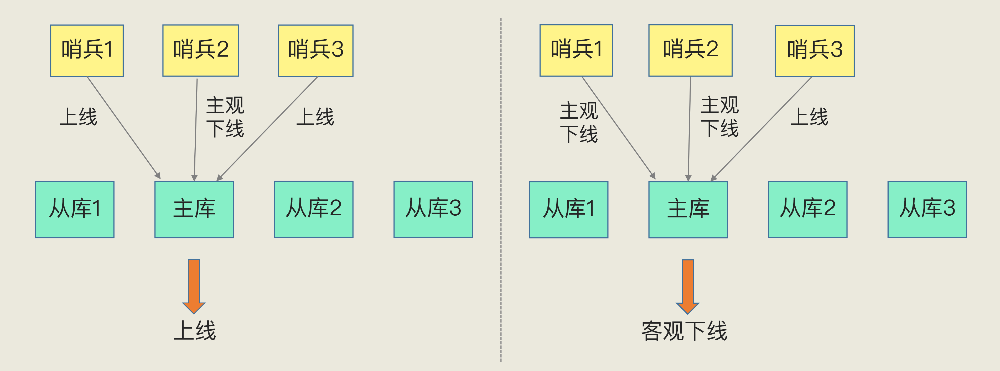
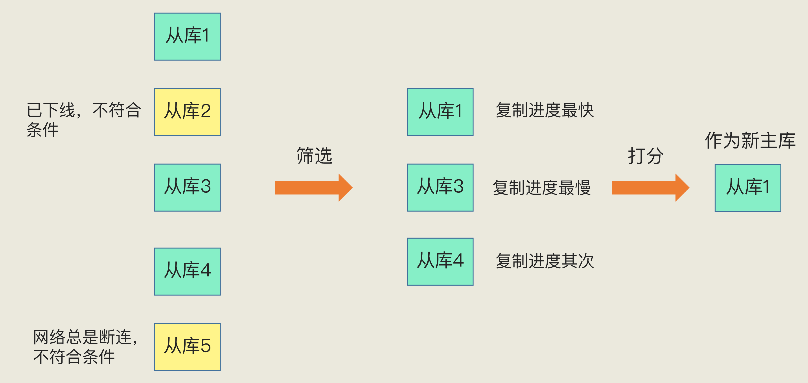

# 哨兵机制

如果从库发生故障了，客户端可以继续向主库或其他从库发送请求，进行相关的操作，但是如果主库发生故障了，那就直接会影响到从库的同步，因为从库没有相应的主库可以进行数据复制操作了

在 Redis 主从集群中，哨兵机制是实现主从库自动切换的关键机制，它有效地解决了主从复制模式下故障转移

## 基本流程

哨兵其实就是一个运行在特殊模式下的 Redis 进程，主从库实例运行的同时它也在运行

哨兵主要负责的就是三个任务：监控、选主（选择主库）和通知

- 监控是指哨兵进程在运行时，周期性地给所有的主从库发送 PING 命令，检测它们是否仍然在线运行；如果从库没有在规定时间内响应哨兵的 PING 命令，哨兵就会把它标记为下线状态；果主库也没有在规定时间内响应哨兵的 PING 命令，哨兵就会判定主库下线，然后开始自动切换主库的流程

- 选主是主库挂了以后，哨兵就需要从很多个从库里，按照一定的规则选择一个从库实例，把它作为新的主库

- 通知是哨兵会把新主库的连接信息发给其他从库，让它们执行 replicaof 命令，和新主库建立连接，并进行数据复制；哨兵会把新主库的连接信息通知给客户端，让它们把请求操作发到新主库上

## 监控机制

哨兵进程会使用 PING 命令检测它自己和主、从库的网络连接情况，用来判断实例的状态；如果哨兵发现主库或从库对 PING 命令的响应超时了，哨兵就会先把它标记为主观下线

如果检测的是从库，那么哨兵简单地把它标记为主观下线就行了，因为从库的下线影响一般不太大，集群的对外服务不会间断

如果检测的是主库，那么哨兵还不能简单地把它标记为主观下线，因为如果哨兵误判了，其实主库并没有故障，一旦启动了主从切换，后续的选主和通知操作都会带来额外的计算和通信开销

误判一般会发生在集群网络压力较大、网络拥塞，或者是主库本身压力较大的情况下

哨兵机制通常会采用多实例组成的集群模式进行部署，组成哨兵集群。引入多个哨兵实例一起来判断，就可以避免单个哨兵因为自身网络状况不好，而误判主库下线的情况。同时，多个哨兵的网络同时不稳定的概率较小，由它们一起做决策，误判率也能降低

只有大多数的哨兵实例都判断主库已经主观下线了，主库才会被标记为客观下线

客观下线的标准就是，当有 N 个哨兵实例时，最好要有 N/2 + 1 个实例判断主库为主观下线，才能最终判定主库为客观下线。这样一来，就可以减少误判的概率，也能避免误判带来的无谓的主从库切换

## 选主机制

哨兵选择新主库的过程为筛选 + 打分。简单来说，在多个从库中，先按照一定的筛选条件，把不符合条件的从库去掉。然后，再按照一定的规则，给剩下的从库逐个打分，将得分最高的从库选为新主库

### 筛选

- 保证所选的从库仍然在线运行

- 判断从库之前的网络连接状态

### 打分

按照三个规则依次进行三轮打分，打分标准为：

- 从库优先级

- 从库复制进度

- 从库 ID 号

只要在某一轮中，有从库得分最高，那么它就是主库了，选主过程到此结束；如果没有出现得分最高的从库，那么就继续进行下一轮

第一轮：优先级最高的从库得分高；通过 slave-priority 配置项，给不同的从库设置不同优先级

第二轮：和旧主库同步程度最接近的从库得分高；如果选择和旧主库同步最接近的那个从库作为主库，那么这个新主库上就有最新的数据；在主从库同步的命令传播的过程中，主库会用 master_repl_offset 记录当前的最新写操作在 repl_backlog_buffer 中的位置，而从库会用 slave_repl_offset 这个值记录当前的复制进度；从库的 slave_repl_offset 最接近 master_repl_offset，那么它的得分就最高，可以作为新主库

第三轮：ID 号小的从库得分高；每个实例都会有一个 ID，在优先级和复制进度都相同的情况下，ID 号最小的从库得分最高，会被选为新主库