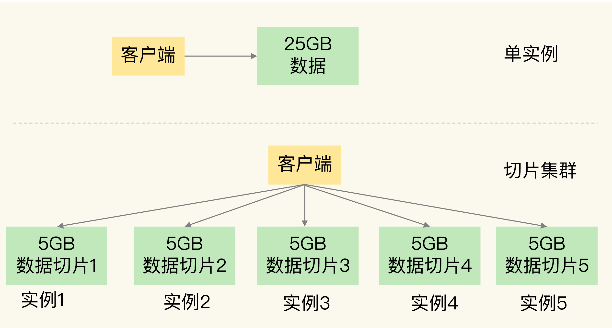
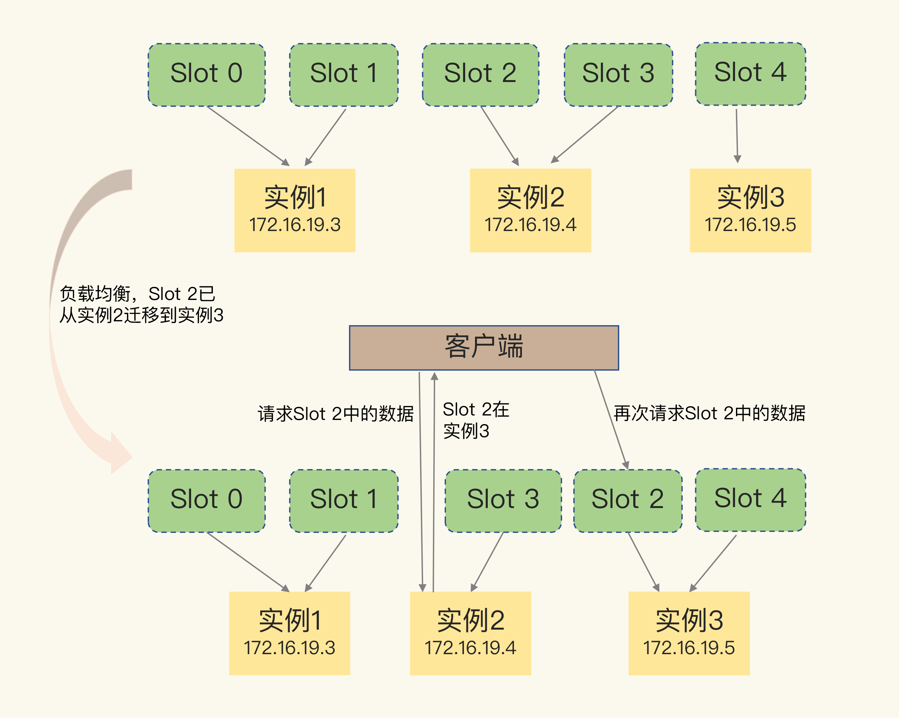
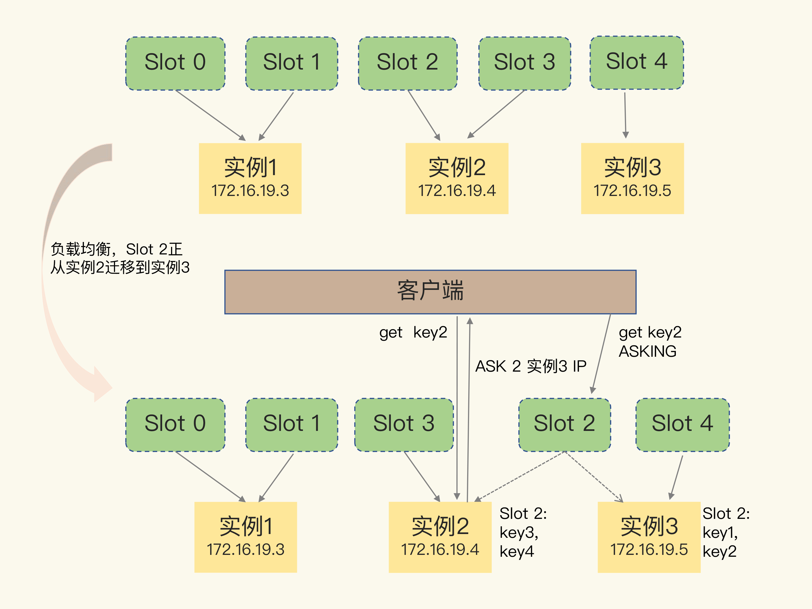

# 切片集群

在使用 RDB 进行持久化时，Redis 会 fork 子进程来完成，fork 操作的用时和 Redis 的数据量是正相关的，而 fork 在执行时会阻塞主线程。数据量越大，fork 操作造成的主线程阻塞的时间越长，Redis 响应变慢

切片集群，也叫分片集群，就是指启动多个 Redis 实例组成一个集群，然后按照一定的规则，把收到的数据划分成多份，每一份用一个实例来保存

## 保存大量数据方式

- 纵向扩展：升级单个 Redis 实例的资源配置，包括增加内存容量、增加磁盘容量、使用更高配置的 CPU；好处是实施起来简单、直接；坏处是数据持久化时阻塞服务，硬件成本较高

- 横向扩展：横向增加当前 Redis 实例的个数；好处是不用担心单个实例的硬件和成本限制；坏处是集群管理困难

## 数据切片

切片集群是一种保存大量数据的通用机制，这个机制可以有不同的实现方案

Redis Cluster 方案中规定了数据和实例的对应规则：Redis Cluster 方案采用哈希槽（Hash Slot）来处理数据和实例之间的映射关系；在 Redis Cluster 方案中，一个切片集群共有 16384 个哈希槽，这些哈希槽类似于数据分区，每个键值对都会根据它的 key，被映射到一个哈希槽中

具体的映射过程分为两大步：首先根据键值对的 key，按照哈希算法计算一个 16 bit 的值；然后，再用这个 16bit 值对 16384 取模，得到 0~16383 范围内的模数，每个模数代表一个相应编号的哈希槽

可以使用 cluster create 命令创建集群，此时，Redis 会自动把这些槽平均分布在集群实例上

使用 cluster addslots 命令手动分配哈希槽，手动分配时需要把 16384 个槽都分配完，否则 Redis 集群无法正常工作

现代的分布式数据库实现分片基本都是 Range-based 的，能够实现分片的动态调度，但某个 range 内的记录数量很多，这就会导致相应的数据分片比较大，一般也叫做数据倾斜，导致负载不均衡；Redis 用 Hash-based 的设计方式，能把数据打得比较散，不太容易引起数据倾斜，提高访问性能

Redis Cluster 方案通过哈希槽的方式把键值对分配到不同的实例上，这个过程需要对键值对的 key 做 CRC 计算，然后再和哈希槽做映射，而不是直接对 key 做哈希的理由是：

- 整个集群存储key的数量是无法预估的，key的数量非常多时，直接记录每个key对应的实例映射关系，这个映射表会非常庞大，这个映射表无论是存储在服务端还是客户端都占用了非常大的内存空间

- 每个节点拥有整个集群完整的路由关系，需要节点之间互相交换路由表，节点之间交换信息也会变得非常庞大，消耗过多的网络资源

- 迁移时需要修改每个key的映射关系，维护成本高

- 中间增加一层哈希槽，可以把数据和节点解耦，让数据分布更均匀，还可以让这个映射表变得很小，利于客户端和服务端保存，节点之间交换信息时也变得轻量

## 客户端定位槽

一般来说，客户端和集群实例建立连接后，实例就会把哈希槽的分配信息发给客户端。但是，在集群刚刚创建的时候，每个实例只知道自己被分配了哪些哈希槽，是不知道其他实例拥有的哈希槽信息的

Redis 实例会把自己的哈希槽信息发给和它相连接的其它实例，来完成哈希槽分配信息的扩散。当实例之间相互连接后，每个实例就有所有哈希槽的映射关系了

客户端收到哈希槽信息后，会把哈希槽信息缓存在本地。当客户端请求键值对时，会先计算键所对应的哈希槽，然后就可以给相应的实例发送请求了

## 重定向机制

当实例和哈希槽的对应关系发生变化，如实例有新增或删除，Redis 重新分配哈希槽，或为了负载均衡，Redis 把哈希槽在所有实例上重新分布一遍

实例之间可以通过相互传递消息，获得最新的哈希槽分配信息，但客户端无法主动感知变化

Redis Cluster 方案提供了一种重定向机制：客户端给一个实例发送数据读写操作时，这个实例上并没有相应的数据，客户端要再给一个新实例发送操作命令；当客户端把一个键值对的操作请求发给一个实例时，如果这个实例上并没有这个键值对映射的哈希槽，那么，这个实例就会给客户端返回下面的 MOVED 命令响应结果，这个结果中就包含了新实例的访问地址

当实例重新分配过程中，槽的一部分数据还未转移成功，此时客户端请求会收到一条 ASK 报错信息，表示客户端请求的键值对所在的哈希槽正在迁移，客户端需要先给新实例发送一个 ASKING 命令，让这个实例允许执行客户端接下来发送的命令。然后，客户端再向这个实例发送 GET 命令，以读取数据

和 MOVED 命令不同，ASK 命令并不会更新客户端缓存的哈希槽分配信息