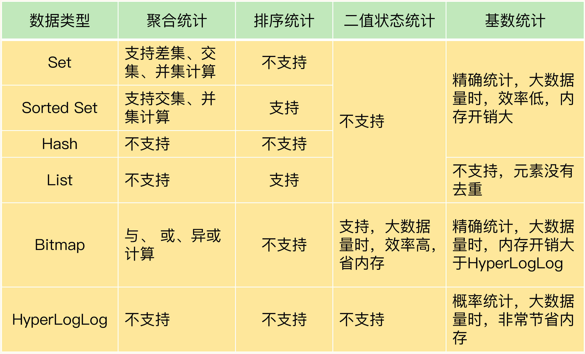

# 统计

常见的四种统计模式，包括聚合统计、排序统计、二值状态统计和基数统计

不同统计模式适合使用不同的集合类型

## 聚合统计

统计多个集合元素的聚合结果，包括：统计多个集合的共有元素（交集统计）；把两个集合相比，统计其中一个集合独有的元素（差集统计）；统计多个集合的所有元素（并集统计）

当需要对多个集合进行聚合计算时，Set 类型会是一个非常不错的选择，但 Set 的差集、并集和交集的计算复杂度较高，在数据量较大的情况下，如果直接执行这些计算，会导致 Redis 实例阻塞

可以从主从集群中选择一个从库，让它专门负责聚合计算，或者是把数据读取到客户端，在客户端来完成聚合统计

## 排序统计

Redis 常用的 4 个集合类型中（List、Hash、Set、Sorted Set），List 和 Sorted Set 就属于有序集合

List 是按照元素进入 List 的顺序进行排序的，而 Sorted Set 可以根据元素的权重来排序，可以自己来决定每个元素的权重值

在面对需要展示最新列表、排行榜等场景时，如果数据更新频繁或者需要分页显示，建议优先考虑使用 Sorted Set

## 二值状态统计

二值状态就是指集合元素的取值就只有 0 和 1 两种

Bitmap 提供了 GETBIT/SETBIT 操作，使用一个偏移值 offset 对 bit 数组的某一个 bit 位进行读和写；提供了 BITCOUNT 操作用来统计这个 bit 数组中所有 1 的个数

Bitmap 支持用 BITOP 命令对多个 Bitmap 按位做与或异或的操作，操作的结果会保存到一个新的 Bitmap 中

## 基数统计

统计一个集合中不重复的元素个数

Set 和 Hash 类型默认支持去重，但集合较大时会非常消耗内存

HyperLogLog 是一种用于统计基数的数据集合类型，它的最大优势就在于，当集合元素数量非常多时，它计算基数所需的空间总是固定的，而且还很小

在 Redis 中，每个 HyperLogLog 只需要花费 12 KB 内存，就可以计算接近 2^64 个元素的基数

HyperLogLog 的统计规则是基于概率完成的，所以它给出的统计结果是有一定误差的，标准误算率是 0.81%，虽然误差率不算大，但是如果需要精确统计结果的话，最好还是继续用 Set 或 Hash 类型
