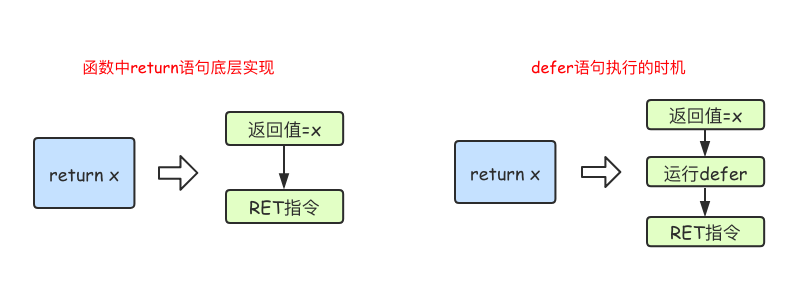

# 函数

## 函数定义
```go
/*
func 函数名(参数)(返回值){
    函数体
}
函数名：由字母、数字、下划线组成。但函数名的第一个字母不能是数字。在同一个包内，函数名也称不能重名
参数：参数由参数变量和参数变量的类型组成，多个参数之间使用,分隔
返回值：返回值由返回值变量和其变量类型组成，也可以只写返回值的类型，多个返回值必须用()包裹，并用,分隔
*/

func intSum(x int, y int) int {
	return x + y
}
// 调用有返回值的函数时，可以不接收其返回值

// 类型简写：函数的参数中如果相邻变量的类型相同，则可以省略类型
func intSum(x, y int) int {
	return x + y
}
```

## 可变参数
可变参数是指函数的参数数量不固定，通过在参数名后加 `...` 来标识
可变参数通常要作为函数的最后一个参数
```go
func intSum2(x ...int) int {
	fmt.Println(x) //x是一个切片
	sum := 0
	for _, v := range x {
		sum = sum + v
	}
	return sum
}
```

## 返回值
```go
func calc(x, y int) (int, int) {
	sum := x + y
	sub := x - y
	return sum, sub
}

// 函数定义时可以给返回值命名，并在函数体中直接使用这些变量，最后通过return关键字返回
func calc(x, y int) (sum, sub int) {
	sum = x + y
	sub = x - y
	return
}
```

## defer语句
`defer` 语句会将其后面跟随的语句进行延迟处理

在 `defer` 归属的函数即将返回时，将延迟处理的语句按 `defer` 定义的逆序进行执行，也就是说，先被 `defer`的语句最后被执行，最后被 `defer` 的语句，最先被执行
```go
func main() {
	fmt.Println("start")
	defer fmt.Println(1)
	defer fmt.Println(2)
	defer fmt.Println(3)
	fmt.Println("end")
}

/* 输出
start
end
3
2
1
*/
```
Go 中 `return` 语句并不是原子操作，分为给返回值赋值和 RET 指令两步



## 变量作用域
如果局部变量和全局变量重名，优先访问局部变量

## 自定义函数类型
```go
// 使用type关键字来定义一个函数类型
type calculation func(int, int) int
// 定义了一个calculation类型，它是一种函数类型，这种函数接收两个int类型的参数并且返回一个int类型的返回值

func add(x, y int) int {
	return x + y
}

func main() {
	var c calculation               // 声明一个calculation类型的变量c
	c = add                         // 把add赋值给c
	fmt.Printf("type of c:%T\n", c) // type of c:main.calculation
	fmt.Println(c(1, 2))            // 像调用add一样调用c

	f := add                        // 将函数add赋值给变量f1
	fmt.Printf("type of f:%T\n", f) // type of f:func(int, int) int
	fmt.Println(f(10, 20))          // 像调用add一样调用f
}
```

## 函数作为参数
```go
func add(x, y int) int {
	return x + y
}
func calc(x, y int, op func(int, int) int) int {
	return op(x, y)
}
func main() {
	ret2 := calc(10, 20, add)
	fmt.Println(ret2) //30
}
```

## 函数作为返回值
```go
func do(s string) (func(int, int) int, error) {
	switch s {
	case "+":
		return add, nil
	case "-":
		return sub, nil
	default:
		err := errors.New("无法识别的操作符")
		return nil, err
	}
}
```

## 匿名函数
匿名函数是没有函数名的函数
```go
func(参数)(返回值){
    函数体
}
// 匿名函数因为没有函数名，所以没办法像普通函数那样调用，所以匿名函数需要保存到某个变量或者作为立即执行函数
func main() {
	// 将匿名函数保存到变量
	add := func(x, y int) {
		fmt.Println(x + y)
	}
	add(10, 20) // 通过变量调用匿名函数

	//自执行函数：匿名函数定义完加()直接执行
	func(x, y int) {
		fmt.Println(x + y)
	}(10, 20)
}
// 匿名函数多用于实现回调函数和闭包
```

## 闭包
闭包指的是一个函数和与其相关的引用环境组合而成的实体；闭包=函数+引用环境
```go
func adder() func(int) int {
	var x int
	return func(y int) int {
		x += y
		return x
	}
}
func main() {
	var f = adder()
	fmt.Println(f(10)) //10
	fmt.Println(f(20)) //30
	fmt.Println(f(30)) //60

	f1 := adder()
	fmt.Println(f1(40)) //40
	fmt.Println(f1(50)) //90
}
// 变量f是一个函数并且它引用了其外部作用域中的x变量，此时f就是一个闭包
// 在f的生命周期内，变量x也一直有效

// Demo1
func adder2(x int) func(int) int {
	return func(y int) int {
		x += y
		return x
	}
}
func main() {
	var f = adder2(10)
	fmt.Println(f(10)) //20
	fmt.Println(f(20)) //40
	fmt.Println(f(30)) //70

	f1 := adder2(20)
	fmt.Println(f1(40)) //60
	fmt.Println(f1(50)) //110
}

// Demo2
func makeSuffixFunc(suffix string) func(string) string {
	return func(name string) string {
		if !strings.HasSuffix(name, suffix) {
			return name + suffix
		}
		return name
	}
}

func main() {
	jpgFunc := makeSuffixFunc(".jpg")
	txtFunc := makeSuffixFunc(".txt")
	fmt.Println(jpgFunc("test")) //test.jpg
	fmt.Println(txtFunc("test")) //test.txt
}

// Demo3
func calc(base int) (func(int) int, func(int) int) {
	add := func(i int) int {
		base += i
		return base
	}

	sub := func(i int) int {
		base -= i
		return base
	}
	return add, sub
}

func main() {
	f1, f2 := calc(10)
	fmt.Println(f1(1), f2(2)) //11 9
	fmt.Println(f1(3), f2(4)) //12 8
	fmt.Println(f1(5), f2(6)) //13 7
}
```

## `panic/recover`
使用 `panic/recover` 模式来处理错误

`panic` 可以在任何地方引发

`recover` 只能在 `defer` 调用的函数中有效

```go
// defer一定要在可能引发panic的语句之前定义
func funcA() {
	fmt.Println("func A")
}

func funcB() {
	defer func() {
		err := recover()
		//如果程序出出现了panic错误,可以通过recover恢复过来
		if err != nil {
			fmt.Println("recover in B")
		}
	}()
	panic("panic in B")
}

func funcC() {
	fmt.Println("func C")
}
func main() {
	funcA()
	funcB()
	funcC()
}
```

## 内置函数
内置函数| 介绍|
:-:|:-:
`close`|关闭 `channel`
`len`|求长度
`new`|主要用于分配值类型内存，返回的是指针
`make`|用来分配引用类型内存
`append`|用来数组、切片追加元素
`panic、recover`|错误处理