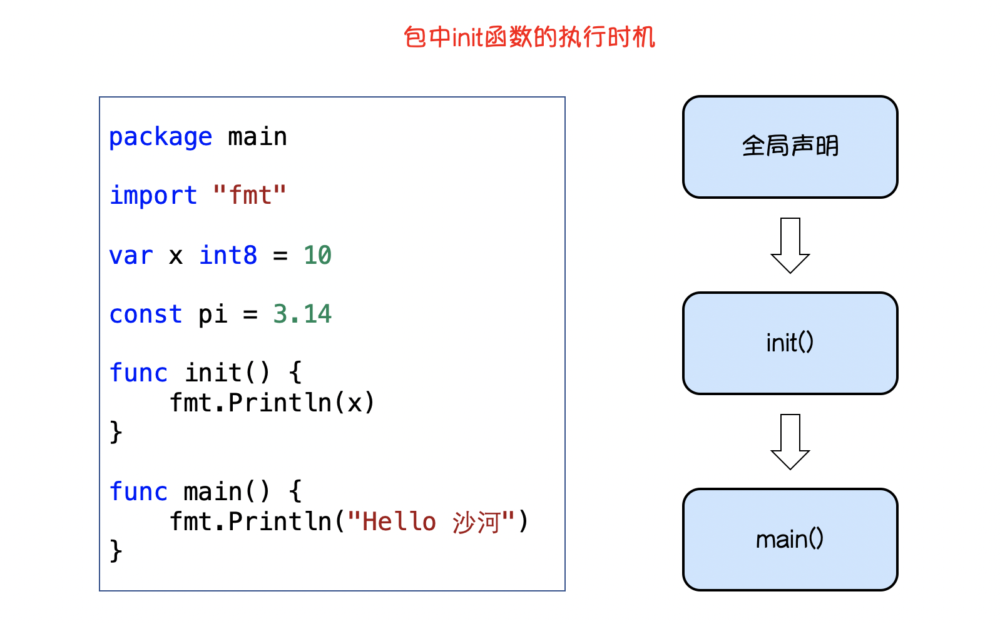
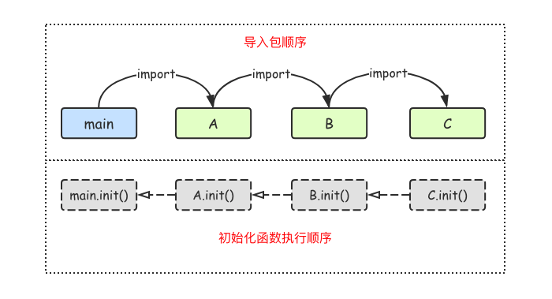

# 包

Go 源码复用是建立在包（package）基础之上
包（package）是多个 Go 源码的集合，是一种高级的代码复用方案

## 定义包
我们还可以根据自己的需要创建自己的包
一个包可以简单理解为一个存放.go文件的文件夹
该文件夹下面的所有go文件都要在代码的第一行添加如下代码，声明该文件归属的包
```go
// package 包名
// 一个文件夹下面只能有一个包，同样一个包的文件不能在多个文件夹下
// 包名可以不和文件夹的名字一样，包名不能包含-符号
// 包名为main的包为应用程序的入口包，编译时不包含main包的源代码时不会得到可执行文件
```

## 可见性
如果想在一个包中引用另外一个包里的标识符（如变量、常量、类型、函数等）时，该标识符必须是对外可见的（public）
只需要将标识符的首字母大写就可以让标识符对外可见了
```go
package pkg2

import "fmt"

// 包变量可见性

var a = 100 // 首字母小写，外部包不可见，只能在当前包内使用

// 首字母大写外部包可见，可在其他包中使用
const Mode = 1

type person struct { // 首字母小写，外部包不可见，只能在当前包内使用
	name string
}

// 首字母大写，外部包可见，可在其他包中使用
func Add(x, y int) int {
	return x + y
}

func age() { // 首字母小写，外部包不可见，只能在当前包内使用
	var Age = 18 // 函数局部变量，外部包不可见，只能在当前函数内使用
	fmt.Println(Age)
}

// 结构体中的字段名和接口中的方法名如果首字母都是大写，外部包可以访问这些字段和方法
type Student struct {
	Name  string //可在包外访问的方法
	class string //仅限包内访问的字段
}

type Payer interface {
	init() //仅限包内访问的方法
	Pay()  //可在包外访问的方法
}
```

## 包的导入
```go
// import "包的路径"
// 导入的包名需要使用双引号包裹起来
// 包名是从$GOPATH/src/后开始计算的，使用/进行路径分隔
// 禁止循环导入包

import "包1"
import "包2"

import (
    "包1"
    "包2"
)

// 自定义包名
// import 别名 "包的路径"
import "fmt"
import m "github.com/Q1mi/studygo/pkg_test"
import (
    "fmt"
    m "github.com/Q1mi/studygo/pkg_test"
 )

func main() {
	fmt.Println(m.Add(100, 200))
	fmt.Println(m.Mode)
}

// 匿名导入包
// import _ "包的路径"
// 匿名导入的包与其他方式导入的包一样都会被编译到可执行文件中
```

## init()初始化函数
执行时导入包语句会自动触发包内部`init()`函数的调用
`init()`函数没有参数也没有返回值
在程序运行时自动被调用执行，不能在代码中主动调用它


