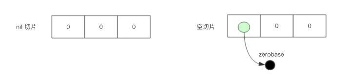

# 切片

数组长度是固定的并且数组长度属于类型的一部分，所以数组有很多局限性
切片是一个拥有相同类型元素的可变长度序列，它是基于数组类型的一层封装，支持动态扩容
切片一般用于快速操作一块数据集合

## 切片是引用类型
内部结构包含指向数组的指针、长度和容量

## 切片的定义
```go
var name []T

func main() {
	// 声明切片类型
	var a []string              //声明一个字符串切片
	var b = []int{}             //声明一个整型切片并初始化
	var c = []bool{false, true} //声明一个布尔切片并初始化
	var d = []bool{false, true} //声明一个布尔切片并初始化
	fmt.Println(a)              //[]
	fmt.Println(b)              //[]
	fmt.Println(c)              //[false true]
	fmt.Println(a == nil)       //true
	fmt.Println(b == nil)       //false
	fmt.Println(c == nil)       //false
	// fmt.Println(c == d)   //切片是引用类型，不支持直接比较，只能和nil比较
}
```

## 长度和容量
通过内置 `len()` 函数求长度 `cap()` 函数求容量

## 基于数组定义切片
由于切片底层就是一个数组，所以可以基于数组定义切片
```go
func main() {
	// 基于数组定义切片
	a := [5]int{55, 56, 57, 58, 59}
	b := a[1:4]                     //基于数组a创建切片，包括元素a[1],a[2],a[3]
	fmt.Println(b)                  //[56 57 58]
	fmt.Printf("type of b:%T\n", b) //type of b:[]int
	
	c := a[1:] //[56 57 58 59]
    d := a[:4] //[55 56 57 58]
    e := a[:]  //[55 56 57 58 59]
}
```

## 切片再切片
通过切片来得到切片
```go
func main() {
	//切片再切片
	a := [...]string{"北京", "上海", "广州", "深圳", "成都", "重庆"}
	fmt.Printf("a:%v type:%T len:%d  cap:%d\n", a, a, len(a), cap(a))
	b := a[1:3]
	fmt.Printf("b:%v type:%T len:%d  cap:%d\n", b, b, len(b), cap(b))
	c := b[1:5]
	fmt.Printf("c:%v type:%T len:%d  cap:%d\n", c, c, len(c), cap(c))
}

/* 输出
a:[北京 上海 广州 深圳 成都 重庆] type:[6]string len:6  cap:6
b:[上海 广州] type:[]string len:2  cap:5
c:[广州 深圳 成都 重庆] type:[]string len:4  cap:4
*/
```

## 使用 `make()` 函数构造切片
动态创建一个切片需要使用 `make()` 函数
```go
make([]T, size, cap)
```

## 切片的本质
切片的本质就是对底层数组的封装，它包含了三个信息：底层数组的指针、切片的长度（len）和切片的容量（cap）
容器是底层数组的元素数组（从切片指针开始）到数组最后一个元素
切片并不复制整个切片元素，它创建一个新的切片执行同样的底层数组，因此通过一个新切片修改元素同样会影响到原始切片
切片增长不能超出其容量。增长超出切片容量将会导致运行时异常，就像切片或数组的索引超出范围引起异常一样；同样，不能使用小于零的索引去访问切片之前的元素

现在有一个数组 `a := [8]int{0, 1, 2, 3, 4, 5, 6, 7}`，切片 `s1 := a[:5]`，`s2 := a[3:6]`，相应示意图如下


## 切片不能直接比较
不能使用 `==` 来判断两个切片是否含有全部相等元素
切片唯一合法的比较操作时和 `nil` 比较，`nil` 切片没有底层数组，长度和容量都是 0；但长度和容量是 0 的切片不一定是 `nil`；所以判断一个切片是否是空，只能用 `len(s)==0` 来判断
```go
var s1 []int         //len(s1)=0;cap(s1)=0;s1==nil   nil切片
s2 := []int{}        //len(s2)=0;cap(s2)=0;s2!=nil   空切片
s3 := make([]int, 0) //len(s3)=0;cap(s3)=0;s3!=nil   空切片

// 空切片的指针指向zerobase，所有空切片都共享一个内存地址
// 不要创建使用空切片，统一使用nil切片
// 避免将切片和nil进行比较来执行某些逻辑
```


## 切片的赋值拷贝
```go
func main() {
	s1 := make([]int, 3) //[0 0 0]
	s2 := s1             //将s1直接赋值给s2，s1和s2共用一个底层数组
	s2[0] = 100
	fmt.Println(s1) //[100 0 0]
	fmt.Println(s2) //[100 0 0]
}
```

## 切片遍历
支持索引和 `for range` 遍历
```go
func main() {
	s := []int{1, 3, 5}

	for i := 0; i < len(s); i++ {
		fmt.Println(i, s[i])
	}

	for index, value := range s {
		fmt.Println(index, value)
	}
}
```

## `append()`方法为切片添加元素
内建函数`append()`函数可以为切片动态添加元素
每个切片会指向一个底层数组，这个数组能容纳一定数量的元素。当底层数组不能容纳新增的元素时，切片就会自动按照一定的策略进行“扩容”，此时该切片指向的底层数组就会更换
```go
func main() {
	//append()添加元素和切片扩容
	var numSlice []int
	for i := 0; i < 10; i++ {
		numSlice = append(numSlice, i)
		fmt.Printf("%v  len:%d  cap:%d  ptr:%p\n", numSlice, len(numSlice), cap(numSlice), numSlice)
	}
}

/* 输出
[0]  len:1  cap:1  ptr:0xc0000a8000
[0 1]  len:2  cap:2  ptr:0xc0000a8040
[0 1 2]  len:3  cap:4  ptr:0xc0000b2020
[0 1 2 3]  len:4  cap:4  ptr:0xc0000b2020
[0 1 2 3 4]  len:5  cap:8  ptr:0xc0000b6000
[0 1 2 3 4 5]  len:6  cap:8  ptr:0xc0000b6000
[0 1 2 3 4 5 6]  len:7  cap:8  ptr:0xc0000b6000
[0 1 2 3 4 5 6 7]  len:8  cap:8  ptr:0xc0000b6000
[0 1 2 3 4 5 6 7 8]  len:9  cap:16  ptr:0xc0000b8000
[0 1 2 3 4 5 6 7 8 9]  len:10  cap:16  ptr:0xc0000b8000

1. append()函数将元素追加到切片的最后并返回该切片
2. 每次扩容后都是扩容前的2倍
*/

// 支持一次性追加多个元素
var citySlice []string
// 追加一个元素
citySlice = append(citySlice, "北京")
// 追加多个元素
citySlice = append(citySlice, "上海", "广州", "深圳")
// 追加切片
a := []string{"成都", "重庆"}
citySlice = append(citySlice, a...)
fmt.Println(citySlice) //[北京 上海 广州 深圳 成都 重庆]
```

- copy()方法复制切片
内建的`copy()`函数可以迅速地将一个切片的数据复制到另外一个切片空间中
```go
// copy(目标切片, 数据来源切片 []T)
func main() {
	// copy()复制切片
	a := []int{1, 2, 3, 4, 5}
	c := make([]int, 5, 5)
	copy(c, a)     //使用copy()函数将切片a中的元素复制到切片c
	fmt.Println(a) //[1 2 3 4 5]
	fmt.Println(c) //[1 2 3 4 5]
	c[0] = 1000
	fmt.Println(a) //[1 2 3 4 5]
	fmt.Println(c) //[1000 2 3 4 5]
}
```

## 从切片中删除元素
没有删除切片元素的专用方法，我们可以使用切片本身的特性来删除元素
```go
// 要从切片a中删除索引为index的元素，操作方法是a = append(a[:index], a[index+1:]...)
func main() {
	// 从切片中删除元素
	a := []int{30, 31, 32, 33, 34, 35, 36, 37}
	// 要删除索引为2的元素
	a = append(a[:2], a[3:]...)
	fmt.Println(a) //[30 31 33 34 35 36 37]
}
```