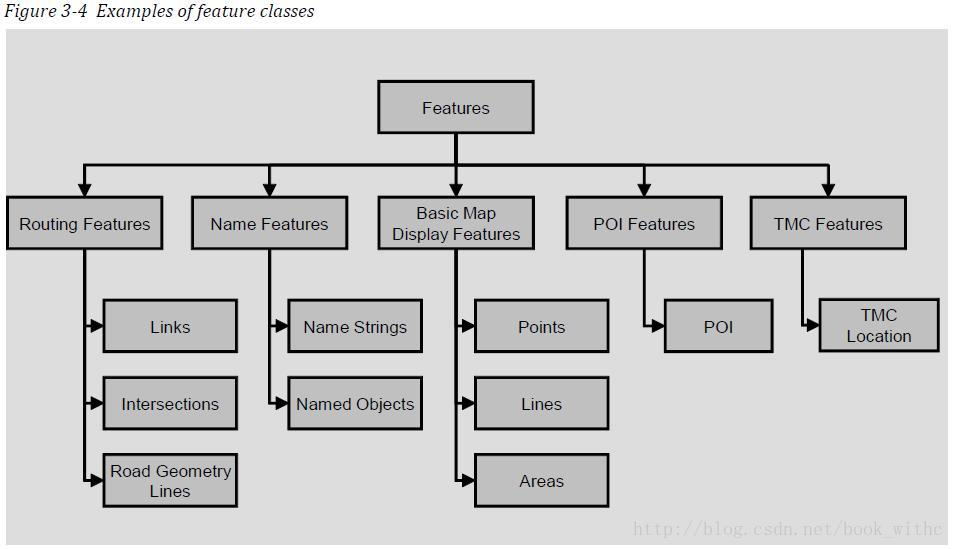

# NDS 架构

NDS 的数据可以称为是一个 database，是被其标准文档所规范好的标准 database

## NDS Database Structure

一个 NDS 的 database 由多个 product database 组成，每个 product database 又可以进一步分出多个 update region

update region 又由 building blocks 来组成，一个 block 就是某个 level 的某种类型的数据

### Product Database

一个 product database 由一个数据供应商发布,可以单独进行数据更新，和其他 product databse 无关

举例来说：一个欧洲的 NDS database 数据包含 2 个 product database：Europe basic navigation 和 Europe POIs

### Update Region

update region 是一个在地图数据在更新的时候单位，地图会按地理位置切分成一个个 update region，数据增加和更新的时候就以此为基准

2 个 update region 在地理上如果是相接壤，在边界上就会定义些重叠的点（gateways），但是 update region 的内容本身是独立描述的

update region 只是描述自己范围的所有内容，不在其范围内的内容是不描述的

一个 region 的边界上的点，会定义自己为一个 gateways，跨 region 就是通过 gateways

### Building Block

每个 building block 存储了自己特定功能的内容，这个内容由 NDS 准所规定

name building block 里面存储的都是名字（城市名，道路名等），routing building block 包含了路网数据，poi building block 包含了 POI 的数据

building block 分为 2 个类别：core building blcok（核心） 和 supplementary building block（辅助）

核心 building block 是必须的，辅助 building block 可有可无，并且辅助 building block 必须和核心 building blcok 一起发布

一个 NDS 的 produc database 必须包含至少一个核心 building block

在一个 product database 里面，包含了多个 update region，一个 update region 包含了多个 building block，所以对某种 type 的 building blcok 会有好几个，update region id + building block id 能够表达唯一的 building block

### Levels

某些 building block，其包含的数据内容是分层组织的

level 越高，数据的空间范围越大，size 越小，内容也越疏

数据分层是统一规划，用于显示的数据和用于路径规划的数据，它们是按照相同的网格定义来分层。同一个 level 的所有类型的 building block，其表示的块（tile）的面积是相同的

数据分层主要针对的是routing和basic map display

越是底层的数据，数据量越多，也越详细。通过过滤掉一些不重要的 feature，减少数据量，把数据抽到高层

高层的数据总是底层数据的冗余，这个过程由编译数据的时候完成

- 对于 map display， 使用高层的数据，可以用很少量的数据就覆盖了大片的区域，地图的绘制会更快，虽然会减少很多细节，但是不会影响用户的使用

- 对长距离的 route，使用高层数据，可以快速的得到规划的路径，当然，得到的路径主要有些重要道路组成，因为不重要的道路在分层的时候被过滤掉了

在每个 level，会按相同大小的网格分隔成 tile，每个 level 的 tile 都能够完全覆盖整个地球

一个 tile 就是一个经度和纬度一样长的面积，当 level 固定的时候，这个 level 的 tile 的经纬度长度就是固定的

tile 用于方便的访问数据，根据一个地理坐标，就可以快速的定位到这个坐标点在那个 tile

## Database Content

把数据分成3个大类：

- Features：与导航相关的，现实世界存在的对象就叫 feature

- Attributes：属性就是附着在 features 上面，它一定是某个 features 的属性

- Metadata：描述数据库的辅助信息，针对 product data、building block 或者整个 datebase 的描述

### Feature

现实世界的一个对象会对应到一个或者多个 feature

一条道路就是一个存储于 routing building blok 里面的 link feature，一座山的山顶就是 Basic map display bulding block 里的 point feature，一个城市就是在 name building block 里面的 administrative area name feature，一个旅店就是在 poi building block 里的  poi feature

NDS 对 feature 定义了些 abstract class，这些 abstract class 是不可以被实例化或者具体化，往下细分就是些具体的 class 可以被实例化

一个 feature 的具体组成，包含：

- attribute 描述了这个 feature 所具有的性质或特点

- reference 对另一个 feature 的引用

- idengtifying features 唯一识别一个 feature，由 tileId、ClassID、LocalIndex 组成

### Attribute

描述了不同 feature 的细节

NDS 提供了 2 种 attribute：fixed 和 flexible

对于 fixed attribute，当 feature 实例化的时候，其 fixed attribute 的值必须提供

flexible attribute 是可选的，它的组织方式为 attribute group 形式

### Metadata

metadata 包含了一些变化的数据内容，这部分数据帮助应用程序适应不同的情况

- Global metadata 类似于全局的数据信息，它关联到多个甚至所有的 building blocks；global metadata 的信息可以定义为在一个 product 适用，或者一个 update region，或者一个行政区域里面，甚至可以作为 common metadata 定义于几个 building blocks 里面适用

- metadata specific to a building block 对某一个特定的 building block 适合的 metadata 信息