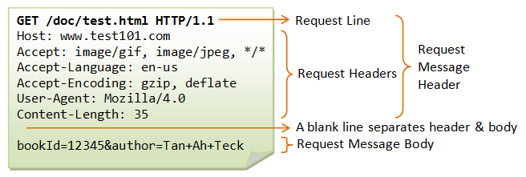
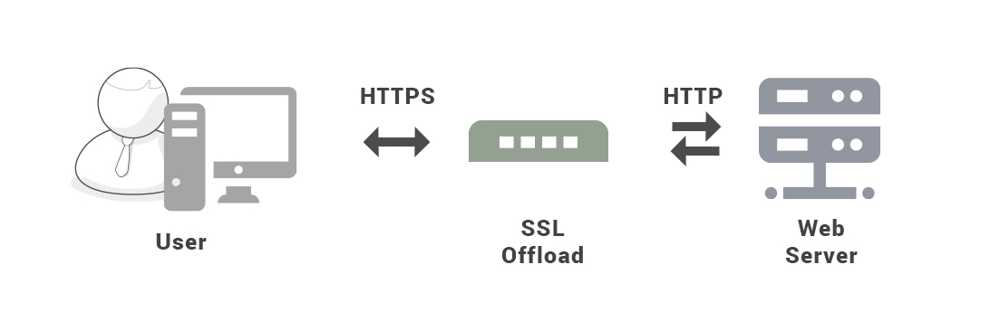

# HTTP

## URI

URI (Unifrom Resource Identifier) 统一资源标识符，包含 URL (Uniform Resource Locator) 统一资源定位符和 URN (Uniform Resource Name) 统一资源名称


## URL 构成


```cpp
/*
http://www.aspxfans.com:8080/news/index.asp?boardID=5&ID=24618&page=1#name

该 URL 的域名部分为 www.aspxfans.com
一个 URL 中，也可以使用 IP 地址作为域名使用

跟在域名后面的是端口，域名和端口之间使用 : 作为分隔符
端口不是一个 URL 必须的部分，如果省略端口部分，将采用默认端口

从域名后的 / 开始到 ? 为止，为路径，如果没有 ? 则是到 #，如果没有 # 则是到文件末
*/
```

## 请求和响应报文

### 请求报文

请求报文主要由四大部分组成：请求行、请求头、空行、请求数据

请求头与请求数据间的空行，用来区分请求头和请求数据




### 响应报文

响应报文主要由四个部分组成：状态行、消息报头、空行和响应正文


### 常见字段

- Host：指定服务器的域名

- Content-Length：本次请求体长度

- Connection：客户端要求服务器使用 TCP 持久连接，以便其他请求复用；HTTP/1.1 默认持久连接

- Content-Type：服务器告诉客户端本次数据格式

- Accept：客户端声明能接受的数据格式

- Content-Encoding：数据的压缩方法

- Accept-Encoding：客户端能接受的压缩方法

## HTTP 请求响应过程及特征

### 过程

输入网址并点击回车时，浏览器内部会进行如下操作

1. 输入 url，浏览器先解析 url 地址是否合法，同时获取 url 中的域名和文件名，根据这些信息生成 HTTP 请求消息

2. 游览器检查是否有缓存（游览器缓存-系统缓存-路由器缓存），如果有直接显示

3. 在发送 http 请求前，需要域名解析（DNS 解析），解析获取对应过的 ip 地址

4. 浏览器向服务器发起 TCP 连接请求

5. 连接成功后，浏览器发送 HTTP 请求

6. 服务器收到处理的请求，先发送应答给浏览器

7. 游览器收到 HTTP 响应

8. 游览器解析响应，如果响应可以缓存，则存入缓存

9. 浏览器解析 HTML 代码，并请求 HTML 代码中的资源

10. 浏览器接受完响应报文后，TCP 连接会关闭

11. 浏览器渲完成后呈现给用户

### 特征

- 客户（浏览器）-服务器模式

- 客户向服务器请求服务时，只需传送请求方法和路径

- HTTP 允许传输任意类型的数据对象，正在传输的类型由 Content-Type 加以标记

- 无连接，限制每次连接只处理一个请求

- 无状态，对于事务处理没有记忆能

## HTTP 方法

客户端发送的请求报文第一行为请求行，包含了方法字段

- Get: 请求指定的页面信息，并返回实体主题

- Head: 获取报文首部，但是不返回报文实体主体部分，主要用于确认 URL 的有效性以及资源更新的日期时间等

- Post: 向指定资源提交数据进行处理请求，数据包含在请求体中；POST 主要用来传输数据，可能会导致新的资源建立或已有资源的修改；GET 主要用来获取资源

- Put: 上传文件，从客户端向服务器传送的数据取代指定的文档的内容

- Patch: 对资源进行部分修改，Put 也可以用于修改资源，但是只能完全替代原始资源，Patch 允许部分修改

- Delete: 删除文件，不带验证机制

- Options: 查询 URL 能够支持的方法

- Connect：HTTP/1.1 协议中预留给能够将连接改为管道方式的代理服务器

- Trace

## Get 和 Post 区别

Get 用于获取资源，Post 用于传输实体主主体

Get 和 Post 的请求都能使用额外的参数，但是 Get 的参数是以查询字符串出现在 URL 中，而 Post 的参数存储在实体主体中；不能因为 Post 参数存储在实体主体中就认为它的安全性更高，因为照样可以通过一些抓包工具（Fiddler）查看

因为 URL 只支持 ASCII 码，因此 Get 的参数中如果存在中文等字符就需要先进行编码，Post 参数支持标准字符集

安全的 HTTP 方法不会改变服务器状态，也就是说它只是可读的；Get 方法是安全的，而 Post 却不是，因为 Post 的目的是传送实体主体内容，这个内容可能是用户上传的表单数据，上传成功之后，服务器可能把这个数据存储到数据库中，因此状态也就发生了改变；安全的方法除了 Get 之外还有：Head、Options，不安全的方法除了 Post 之外还有 Put、Delete

同样的请求被执行一次与连续执行多次的效果是一样的，服务器的状态也是一样的，幂等方法不应该具有副作用；所有的安全方法也都是幂等的；在正确实现的条件下，Get，Head，Put 和 Delete 等方法都是幂等的，而 Post 方法不是

## 状态码

服务器返回的响应报文中第一行为状态行，包含了状态码以及原因短语，用来告知客户端请求的结果

状态码|类别|含义
-|-|-
1XX|Informational（信息性状态码）|接收的请求正在处理
2XX|Success（成功状态码）|请求正常处理完毕
3XX|Redirection（重定向状态码）|请求的资源发生了变动，需要用新的 URL 重新发送请求
4XX|Client Error（客户端错误状态码）|客户端发送的报文有误，服务器无法处理
5XX|Server Error（服务器错误状态码）|服务器处理请求出错

### 1XX 

- 100 Continue：表明到目前为止都很正常，客户端可以继续发送请求或者忽略这个响应

### 2XX

- 200 OK

- 204 No Content：请求已经成功处理，但是返回的响应报文不包含实体的主体部分。一般在只需要从客户端往服务器发送信息，而不需要返回数据时使用

- 206 Partial Content：响应返回的 body 数据并不是资源的全部，而是其中的一部分，也是服务器处理成功的状态

### 3XX

- 301 Moved Permanently：永久性重定向，请求的资源已经不存在了，需改用新的 URL 再次访问

- 302 Found：临时性重定向，请求的资源还在，但暂时需要用另一个 URL 来访问

- 303 See Other：和 302 有着相同的功能，但是 303 明确要求客户端应该采用 GET 方法获取资源

- 304 Not Modified：请求报文首部包含一些条件，不满足条件，则服务器会返回 304 

- 307 Temporary Redirect：临时重定向，与 302 的含义类似，但是 307 要求浏览器不会把重定向请求的 POST 方法改成 GET 方法

### 4XX

- 400 Bad Request：请求报文错误

- 401 Unauthorized：该状态码表示发送的请求需要有认证信息

- 403 Forbidden：服务器禁止访问资源

- 404 Not Found：请求的资源在服务器上不存在或未找到

### 5XX

- 500 Internal Server Error：服务器正在执行请求时发生错误

- 501 Not Implemented：请求的功能还不支持

- 503 Service Unavailable：服务器暂时处于超负载或正在进行停机维护，现在无法处理请求

## 连接管理


### 短连接和长连接

当浏览器访问一个包含多张图片的 HTML 页面时，除了请求访问的 HTML 页面资源，还会请求图片资源。如果每进行一次 HTTP 通信就要新建一个 TCP 连接，那么开销会很大

长连接只需要建立一次 TCP 连接就能进行多次 HTTP 通信

- 从 HTTP/1.1 开始默认是长连接的，如果要断开连接，需要由客户端或者服务器端提出断开

- 在 HTTP/1.1 之前默认是短连接，需要一个 keep-alive 参数告诉服务器建立一个长连接

### 流水线

默认情况下，HTTP 请求是按顺序发出的，下一个请求只有在当前请求收到响应之后才会被发出

由于受到网络延迟和带宽的限制，在下一个请求被发送到服务器之前，可能需要等待很长时间

流水线是在同一条长连接上连续发出请求，而不用等待响应返回，这样可以减少延迟；服务器还是按顺序响应请求，不存在并行响应

## Cookie

HTTP 协议是无状态的，主要是为了让 HTTP 协议尽可能简单，使得它能够处理大量事务

HTTP/1.1 引入 Cookie 来保存状态信息，Cookie 是服务器发送到用户浏览器并保存在本地的一小块数据，它会在浏览器之后向同一服务器再次发起请求时被携带上，用于告知服务端两个请求是否来自同一浏览器

由于之后每次请求都会需要携带 Cookie 数据，因此会带来额外的性能开销（尤其是在移动环境下）

随着现代浏览器开始支持各种各样的存储方式，Cookie 渐渐被淘汰。新的浏览器 API 已经允许开发者直接将数据存储到本地，如使用 Web storage API（本地存储和会话存储）或 IndexedDB

### 用途

- 会话状态管理（如用户登录状态、购物车、游戏分数或其它需要记录的信息）

- 个性化设置（如用户自定义设置、主题等）

- 浏览器行为跟踪（如跟踪分析用户行为等）

### 组成

Cookie实际上是一小段的文本信息（key-value格式）

- Name：一个唯一确定的 Cookie 名称

- Expires：过期时间

- Domain：生成该 Cookie 的域名

- Path：该 Cookie 是在当前的哪个路径下生成的

### 创建过程

服务器发送的响应报文包含 Set-Cookie 首部字段，客户端得到响应报文后把 Cookie 内容保存到浏览器中

客户端之后对同一个服务器发送请求时，会从浏览器中取出 Cookie 信息并通过 Cookie 请求首部字段发送给服务器

### 分类

- 会话期 Cookie：浏览器关闭之后它会被自动删除，也就是说它仅在会话期内有效

- 持久性 Cookie：指定过期时间（Expires）或有效期（max-age）之后就成为了持久性的 Cookie

## Session

除了可以将用户信息通过 Cookie 存储在用户浏览器中，也可以利用 Session 存储在服务器端，存储在服务器端的信息更加安全

Session 可以存储在服务器上的文件、数据库或者内存中。也可以将 Session 存储在 Redis 这种内存型数据库中，效率会更高

### 创建过程

1. 用户进行登录时，用户提交包含用户名和密码的表单，放入 HTTP 请求报文中

2. 服务器验证该用户名和密码，如果正确则把用户信息存储到 Redis 中，它在 Redis 中的 Key 称为 Session ID

3. 服务器返回的响应报文的 Set-Cookie 首部字段包含了这个 Session ID，客户端收到响应报文之后将该 Cookie 值存入浏览器中

4. 客户端之后对同一个服务器进行请求时会包含该 Cookie 值，服务器收到之后提取出 Session ID，从 Redis 中取出用户信息，继续之前的业务操作

### 安全问题

Session ID 不能让它被恶意攻击者轻易获取，那么就不能产生一个容易被猜到的 Session ID 值，同时需要经常重新生成 Session ID

### Cookie 和 Session 选择

- Cookie 只能存储 ASCII 码字符串，而 Session 则可以存储任何类型的数据，因此在考虑数据复杂性时首选 Session

- Cookie 存储在浏览器中，容易被恶意查看。如果非要将一些隐私数据存在 Cookie 中，可以将 Cookie 值进行加密，然后在服务器进行解密

- 对于大型网站，如果用户所有的信息都存储在 Session 中，那么开销是非常大的，因此不建议将所有的用户信息都存储到 Session 中

## HTTPS

HTTP 有以下安全性问题：

- 使用明文进行通信，内容可能会被窃听

- 不验证通信方的身份，通信方的身份有可能遭遇伪装

- 无法证明报文的完整性，报文有可能遭篡改

让 HTTP 先和 SSL（Secure Sockets Layer）通信，再由 SSL 和 TCP 通信，也就是说 HTTPS 使用了隧道进行通信

通过使用 SSL，HTTPS 具有了混合加密（防窃听）、认证（防伪装）和摘要算法（防篡改）




### HTTPS 加密方式

#### 对称秘钥加密

加密和解密使用同一密钥

- 优点：运算速度快

- 缺点：无法安全地将密钥传输给通信方

#### 非对称秘钥加密

加密和解密使用不同的密钥，公开密钥所有人都可以获得

公钥和私钥中的任一个均可用作加密，此时另一个则用作解密

- 优点：可以更安全地将公开密钥传输给通信发送方

- 缺点：运算速度慢

#### 数字证书认证

数字证书认证用来证明公开密钥是货真价实的公开密钥，可以使用由数字证书认证机构（CA，Certificate Authority）或其他相关机关颁发的公开密钥证书

1. 服务器把自己的公钥登录至数字证书认证机构，数字证书认证机构用自己的私有密钥向服务器的公钥颁发公钥证书

2. 浏览器内置一个受信任的 CA 机构列表；服务器会提供经 CA 机构认证颁发的服务器证书，如果认证该服务器证书的 CA 机构存在于浏览器的受信任 CA 机构列表中，并且服务器证书中的信息与当前正在访问的网站（域名等）一致，那么浏览器就认为服务端是可信的，并从服务器证书中取得服务器公钥

#### HTTPS 加密方式

HTTPS 采用混合的加密机制

对称加密算法加密数据 + 非对称加密算法交换密钥 + 数字证书验证身份


1. TCP 三次握手后开始 SSL 通信，双方互相明文交换 SSL 信息

2. 服务器发送认证报文，包括公钥证书

3. 客户端验证证书的合法性，包括可信性，是否吊销，过期时间和域名

4. 如果证书没有问题，那么就生成一个随机值，然后用证书（也就是公钥）对这个随机值进行加密

5. 将加密的随机值发送给服务端，以后客户端和服务端的通信就可以通过这个随机值来进行加密解密

6. 服务器用私钥解密，拿到对称加密的密匙

缺点

- 因为需要进行加密解密等过程，因此速度会更慢

- 需要支付证书授权的高额费用

## SSL 连接

1. ClientHello：由客户端向服务器发起加密通信请求，主要向服务器发送信息包括：客户端支持的 SSL/TLS 协议版本；客户端生产的随机数（Client Random），后面用于生产对称加密的密钥；客户端支持的密码套件列表，如 RSA 加密算法

2. ServerHello：服务器收到客户端请求后，向客户端发出响应，回应的内容包括：确认 SSL/ TLS 协议版本，如果浏览器不支持，则关闭加密通信；服务器生产的随机数（Server Random），后面用于生产对称加密的密钥；确认的密码套件列表，如 RSA 加密算法；服务器的数字证书

3. 客户端回应：客户端收到服务器的回应之后，首先通过浏览器或者操作系统中的 CA 公钥，确认服务器的数字证书的真实性；如果证书没有问题，客户端会从数字证书中取出服务器的公钥，然后使用它加密报文，向服务器发送如下信息：一个随机数（pre-master key），并使用公钥进行非对称加密；加密通信算法改变通知，表示之后的信息都将用对称加密的密钥加密通信；客户端握手结束通知，表示客户端的握手阶段已经结束

4. 服务器收到客户端的第三个随机数（pre-master key）之后，通过协商的加密算法，计算出本次通信的对称加密秘钥，向客户端发生最后的信息：加密通信算法改变通知，表示随后的信息都将用对称加密秘钥加密通信；服务器握手结束通知，表示服务器的握手阶段已经结束

客户端和服务器端都拥有三个随机数，双方使用事先商定的加密方法，各自生成本次会话所用的同一把对称会话密钥

握手阶段全部结束后，客户端与服务器进入加密通信，就完全是使用普通的 HTTP 协议，只不过用会话密钥加密内容


由于 SSL 协议中证书是静态的，因此有必要引入一种随机因素来保证协商出来的会话密钥的随机性

因为 SSL/TLS 握手过程的数据都是明文传输的，并且多个随机数种子来生成秘钥不容易被暴力破解出来

## HTTP 与 HTTPS 区别

- HTTP 的 URL 以 http:// 开头，而 HTTPS 的 URL 以 https:// 开头

- HTTP 是不安全的，而 HTTPS 是安全的

- HTTP 标准端口是 80 ，而 HTTPS 的标准端口是 443

- 在 OSI 网络模型中，HTTP 工作于应用层，而 HTTPS 的安全传输机制工作在会话层

- HTTP 无法加密，而 HTTPS 对传输的数据进行加密

- HTTP 无需证书，而 HTTPS 需要 CA 机构颁发的 SSL 证书

## HTTP/2.0

### HTTP/1.1 优点

- 默认使用长连接

- 支持流水线

- 缓存、断点传输、Host 字段

### HTTP/1.x 缺陷

HTTP/1.x 实现简单是以牺牲性能为代价的

- 不会压缩请求和响应首部，从而导致不必要的网络流量

- 每次互相发送相同的首部造成的浪费较多

- 服务器是按请求的顺序响应的，如果服务器响应慢，会招致客户端一直请求不到数据，也就是队头阻塞

- 没有请求优先级控制

- 请求只能从客户端开始，服务器只能被动响应

### HTTP/2 优化

HTTP/2 协议是基于 HTTPS 的，所以 HTTP/2 的安全性也是有保障的

- 压缩首部，如果同时发出多个请求，请求的首部是一样的或是相似的，协议会消除重复部分

- HTTP/2 不再采用 HTTP/1.1 里的纯文本形式的报文，而是全面采用了二进制格式，HTTP/2 是二进制协议


- 将传输的信息分割为更小的消息和帧，每个二进制帧会标识该帧属于哪个流，流就是由多个帧组成的数据流，因此浏览器收到数据后可以按照流来对数据进行合并而不会出现合并后数据错乱的问题，因此服务器可以并行的传输数据

- 对同一域名下所有请求都是基于流，只有一个 TCP 连接

- 客户端可以指定数据流的优先级

- 移除串行请求，解决队头阻塞

- 服务器推送

### HTTP/2 缺陷

多个 HTTP 请求在复用一个 TCP 连接，下层的 TCP 协议是不知道有多少个 HTTP 请求的；一旦发生了丢包现象，就会触发 TCP 的重传机制，这样在一个 TCP 连接中的所有的 HTTP 请求都必须等待这个丢了的包被重传回来

HTTP/3 把 HTTP 下层的 TCP 协议改成了 UDP