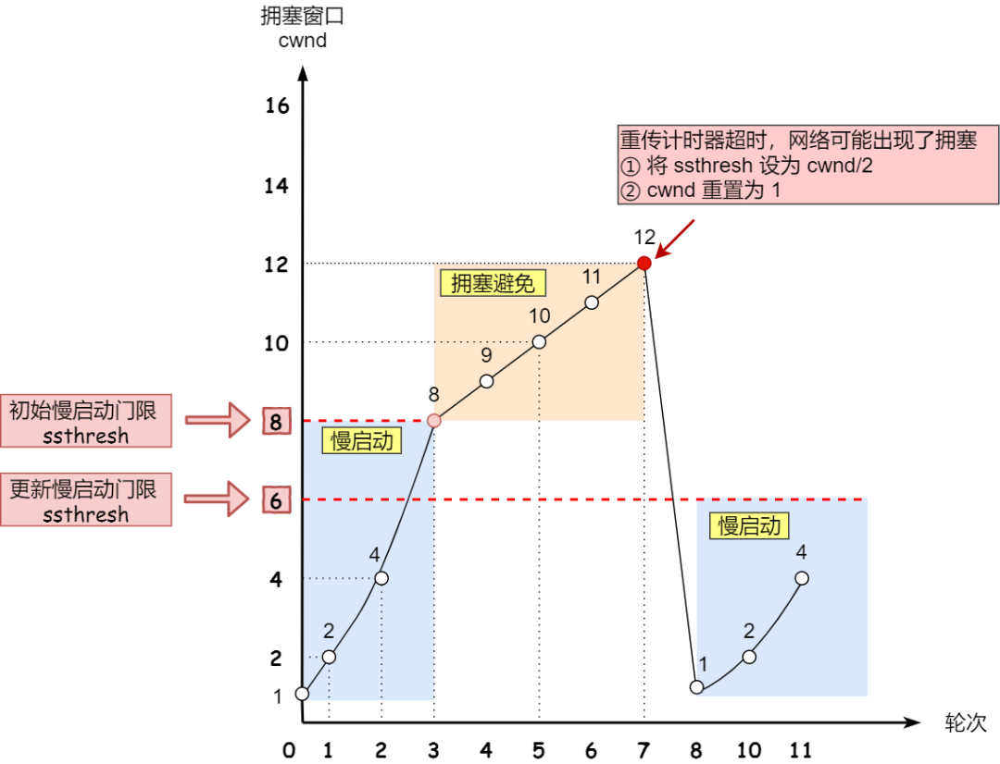

# 网络协议

## OSI 七层协议分层

发送方从最高层开始，从上到下按顺序传输数据，每一层接收到由上层处理的数据时，添加该层的首部并可能会对数据进行处理（如表示层）。而接收端则将顺序反过来，从首层开始，将数据的内容与该层对应的首部拆开，传给上一层


- 应用层：最靠近用户的一层，是为计算机用户提供应用接口，也为用户直接提供各种网络服务，常见应用层的网络服务协议有：HTTP，HTTPS，FTP，POP3、SMTP 等

- 表示层：表示层提供各种用于应用层数据的编码和转换功能，确保一个系统的应用层发送的数据能被另一个系统的应用层识别；数据压缩、加密以及数据描述是主要功能

- 会话层：负责建立、管理和终止表示层实体之间的通信会话

- 运输层：传输层建立了主机端到端的链接，传输层的作用是为上层协议提供端到端的可靠和透明的数据传输服务，包括处理差错控制和流量控制等问题（TCP/UDP在这一层）

- 网络层：通过 IP 寻址来建立两个节点之间的连接，选择合适的路由和交换节点，正确无误地按照地址传送给目的端的运输层（IP 协议层）

- 数据链路层：在物理层提供的服务基础上，在通信的实体间建立数据链路连接，传输以帧为单位的数据包

- 物理层：利用传输介质为数据链路层提供物理连接，负责处理数据传输

## TCP/IP 四层模型


### 网络接口层

网络通信就是把有特定意义的数据通过物理介质传送给对方，单纯的发送 0 和 1 是没有意义的，要传输有意义的数据，就需要以字节为单位对 0 和 1 进行分组，并且要标识好每一组电信号的信息特征，然后按照分组的顺序依次发送。以太网规定一组电信号就是一个数据包，一个数据包被称为一帧


整个数据帧由首部、数据和尾部三部分组成，首部固定为 14 个字节，包含了目标 MAC 地址、源 MAC 地址和类型；数据最短为 46 个字节，最长为 1500 个字节，如果需要传输的数据很长，就必须分割成多个帧进行发送；尾部固定为 4 个字节，表示数据帧校验序列，用于确定数据包在传输过程中是否损坏

以太网内采用广播形式，把数据包发给该子网内所有主机，子网内每台主机在接收到这个包以后，都会读取首部里的目标 MAC 地址，然后和自己的 MAC 地址进行对比，如果相同就做下一步处理，如果不同则丢弃这个包

网络接口层主要工作就是对电信号进行分组并形成具有特定意义的数据帧，然后以广播的形式通过物理介质发送给子网内的接收方

存在问题：发送者如何知道接收者的 MAC 地址；发送者如何知道接收者和自己同属一个子网；如果接收者和自己不在同一个子网，数据包如何发给对方

### 网络层

网络层的主要工作是定义网络地址，区分网段，子网内 MAC 寻址，对于不同子网的数据包进行路由

为了解决网络接口层的问题，网络层引入了 IP 协议、ARP 协议、路由协议

### 传输层

网络接口层定义了主机的身份，即 MAC 地址，网络层定义了 IP 地址，明确了主机所在的网段，有了这两个地址，数据包就从可以从一个主机发送到另一台主机。实际上数据包是从一个主机的某个应用程序发出，然后由对方主机的应用程序接收。而每台电脑都有可能同时运行着很多个应用程序，所以当数据包被发送到主机上以后，是无法确定哪个应用程序要接收这个包

传输层的主要工作是定义端口，标识应用程序身份，实现端口到端口的通信，TCP 协议可以保证数据传输的可靠性


### 应用层

有了前三层协议，数据已经可以从一个主机上的应用程序传输到另一台主机的应用程序了，但此时传过来的数据是字节流，不能很好的被程序识别，操作性差

应用层定义了各种各样的协议来规范数据格式，常见的有 HTTP、FTP、SMTP 等

## 数据在各层之间的传递


在向下的过程中，需要添加下层协议所需要的首部或者尾部，而在向上的过程中不断拆开首部和尾部

## 各层上的设备

- 物理层：网线、集线器

- 数据链路层：网卡、网桥、交换机

- 网络层：路由器

- 传输层、会话层：计算机

- 表示层：不同格式的文件

- 应用层：应用程序

## IP 协议

MAC 地址只与厂商有关，与所处的网络无关，所以无法通过 MAC 地址来判断两台主机是否属于同一个子网，因此网络层引入了 IP 协议，制定了一套新地址，使得我们能够区分两台主机是否同属一个网络

IP地址目前有 IPv4 和 IPv6

IPv4 是一个 32 位的地址，并且将这个 32 位的地址分为两部分，前面部分代表网络地址，后面部分表示该主机在局域网中的地址

### 分类


A、B 和 C 类用于单播通信中设备 IP 地址分配，D 类属于组播地址，用于组播通信；E 类是保留地址

A 类地址第 1 字节为网络地址，其它 3 个字节为主机地址，第 1 个字节的第一位固定为 0，而 0 和 127 的 A 类网络不可用的，所以网络号范围：1.0.0.0—126.0.0.0，子网掩码固定为 255.0.0.0

B 类地址第 1 字节和第 2 字节为网络地址，其它 2 个字节为主机地址，第 1 个字节的前两位固定为 10，网络号范围：128.0.0.0—191.255.0.0，子网掩码为固定的255.255.0.0

C 类地址第 1 字节、第 2 字节和第 3 个字节为网络地址，第 4 个字节为主机地址，第1个字节的前三位固定为110，地址网络号范围：192.0.0.0—223.255.255.0，子网掩码为固定的 255.255.255.0

D 类地址不分网络地址和主机地址，第 1 个字节的前四位固定为 1110，地址范围：240.0.0.0—255.255.255.254


### 特殊 IP

- IP 地址中全为 0 表示本网络，为保留地址

- 网络号为 127（0111 1111）为本地软件回环测试地址，回环地址的 IP 数据报不会出现在网络中

- 128.0.0.0 不可指派

- 192.0.0.0 不可指派

- 主机号全为 0 指定本主机所连接的网络

- 主机号全为 1 指定本主机所连接的网络里的所有主机，用于广播


### 子网划分

子网划分实际上是将主机地址分为两个部分：子网网络地址和子网主机地址


### 子网掩码

从 IP 数据报无法看出主机所连接的网络是否进行了子网划分

如果两个 IP 地址在同一个子网内，则网络地址和子网网络地址一定相同

IP 协议引入了子网掩码，IP 地址和子网掩码通过按位与运算后就可以得到网络地址和子网地址

### 无分类编址

32 比特的 IP 地址被划分为两部分，前面是网络号，后面是主机号，表示形式 a.b.c.d/x，其中 /x 表示前 x 位属于网络号， x 的范围是 0 ~ 32

无分类编址不使用子网，斜线后面数据就是地址掩码中 1 的个数

### IP 包


IP 数据包由首部和数据两部分组成，首部长度为 20 个字节，主要包含了目标 IP 地址和源 IP 地址，目标 IP 地址是网关路由的线索和依据；数据部分的最大长度为 65515 字节，理论上一个 IP 数据包的总长度可以达到 65535 个字节，而以太网数据包的最大长度是 1500 个字符，如果超过这个大小，就需要对 IP 数据包进行分割，分成多帧发送

## ARP 协议

ARP 协议根据 IP 地址获取 MAC 地址

每台主机都有一个 ARP 高速缓存，存放了 IP 地址到硬件地址的映射，且映射经常动态更新

当本地没有 IP 地址的 MAC 地址时，便向局域网上广播一个 ARP 请求

ARP 解决的是同一局域网内 IP 与 MAC 地址的映射问题，当跨局域网时需要路由器转发 ARP 请求

## 路由协议

首先通过 IP 协议来判断两台主机是否在同一个子网中，如果在同一个子网，就通过 ARP 协议查询对应的 MAC 地址，然后以广播的形式向该子网内的主机发送数据包；如果不在同一个子网，以太网会将该数据包转发给本子网的网关进行路由

网关是互联网上子网与子网之间的桥梁，所以网关会进行多次转发，最终将该数据包转发到目标IP所在的子网中，然后再通过 ARP 获取目标机 MAC，最终也是通过广播形式将数据包发送给接收方

完成这个路由协议的物理设备就是路由器，路由器会根据信道情况，选择并设定路由，以最佳路径来转发数据包

## NAT 

NAT(Network Address Translation)，网络地址转换，允许一个整体机构以一个公用 IP 地址出现在 Internet 上，它是一种把内部私有网络地址（IP 地址）翻译成合法网络 IP 地址的技术

NAT 在一定程度上，能够有效的解决公网地址不足的问题

NAT 有三种类型：

- 静态 NAT：一个公网 IP 对应一个私有 IP，是一对一的转换，没有进行端口的转换

- 动态 NAT：在路由器上配置一个外网 IP 地址池，当内部有计算机需要和外部通信时，就从地址池里动态的取出一个外网 IP，并将他们的对应关系绑定到 NAT 表中，通信结束后，这个外网 IP 才被释放，可供其他内部 IP 地址转换使用

- 网络地址端口转换：不但要转换 IP 地址，还要进行传输层的端口转换，把内部地址映射到外部网络的一个 IP 地址的不同端口

## TCP 与 UDP 的特点与区别

UDP 是无连接的，尽最大可能交付，没有拥塞控制，面向报文（对于应用程序传下来的报文不合并也不拆分，只是添加 UDP 首部），支持一对一、一对多、多对一和多对多的交互通信

TCP 提供一种面向连接的、可靠的字节流服务，利用校验、确认和重传机制来保证可靠传输，给数据分节进行排序，并使用累积确认保证数据的顺序不变和非重复，使用滑动窗口机制来实现流量控制，通过动态改变窗口的大小进行拥塞控制

## UDP

UDP（User Datagram Protocol）是无连接的，尽最大可能交付，没有拥塞控制，面向报文（对于应用程序传下来的报文不合并也不拆分，只是添加 UDP 首部），支持一对一、一对多、多对一和多对多的交互通信


UDP 数据包由首部和数据两部分组成，首部长度为 8 个字节，主要包括源端口和目标端口；数据最大为 65527 个字节，整个数据包的长度最大可达到 65535 个字节


从 UDP 数据包的包头可以看出，UDP 的最大包长度是 2^16-1 的个字节，由于 UDP 包头占 8 个字节，而在 IP 层进行封装后的 IP 包头占去 20 字节，网络接口层最大包长 1500 字节，所以 UDP 数据包的最大理论长度是 1500 - 8 - 20 = 1472 字节

UDP 协议没有确认机制，数据包一旦发出，无法知道对方是否收到，因此可靠性较差

## TCP

TCP（Transmission Control Protocol）是面向连接的，提供可靠交付，有流量控制，拥塞控制，提供全双工通信，面向字节流（把应用层传下来的报文看成字节流，把字节流组织成大小不等的数据块），每一条 TCP 连接只能是点对点的


TCP 数据包和 UDP 一样，都是由首部和数据两部分组成，唯一不同的是，TCP 数据包没有长度限制，理论上可以无限长，但是为了保证网络的效率，通常 TCP 数据包的长度不会超过 IP 数据包的长度，以确保单个 TCP 数据包不必再分割


TCP 负责应用软件和网络软件之间的通信：IP 负责计算机之间的通信；TCP 负责将数据分割并装入 IP 包，然后在它们到达的时候重新组合它们；IP 负责将包发送至接受者

- 32 位序列号：用于对字节流进行编号，例如序号为 301，表示第一个字节的编号为 301，如果携带的数据长度为 100 字节，那么下一个报文段的序号应为 401

- 32 位确认号：期望收到的下一个报文段的序号。例如 B 正确收到 A 发送来的一个报文段，序号为 501，携带的数据长度为 200 字节，因此 B 期望下一个报文段的序号为 701，B 发送给 A 的确认报文段中确认号就为 701

- 4 位首部长度：数据部分距离报文段起始处的偏移量，实际上指的是首部的长度

- 源端口号/目的端口号: 表示数据从哪个进程来, 到哪个进程去

- 16 位窗口大小：作为接收方让发送方设置其发送窗口的依据

- 6 位标志域：紧急标志 URG (1 表示有效)、有意义的应答标志 ACK （1 时确认号字段有效，否则无效，在连接建立后所有传送的报文段都必须把 ACK 置 1）、推 PSH （1 时表示接收端不将该数据进行队列处理，而是尽可能快地将数据转由应用处理）、重置连接标志 RST 、同步序列号标志 SYN (仅在三次握手建立 TCP 连接时有效，当 SYN=1，ACK=0 时表示这是一个连接请求报文段。若对方同意建立连接，则响应报文中 SYN=1，ACK=1)、完成发送数据标志 FIN (1 表示此报文段的发送方的数据已发送完毕，并要求释放连接)

- TCP 校验和会覆盖首部和数据

## TCP 三次握手

建立一个 TCP 连接时，需要客户端和服务端总共发送 3 个包以确认连接的建立，在 socket 编程中，这一过程由客户端执行 connect 来触发


- 第一次：客户端 - - > 服务器。此时服务器知道了客户端要建立连接了  Client 将标志位 SYN 置为 1，随机产生一个值 seq = J，并将该数据包发送给 Server，Client 进入 SYN_SENT 状态，等待 Server 确认

- 第二次：客户端 < - - 服务器。此时客户端知道服务器收到连接请求了 Server 收到数据包后由标志位 SYN = 1 知道 Client 请求建立连接，Server 将标志位 SYN 和 ACK 都置为 1，ack = J + 1，随机产生一个值 seq=K ，并将该数据包发送给 Client 以确认连接请求，Server 进入 SYN_RCVD 状态

- 第三次：客户端 - - > 服务器。此时服务器知道客户端收到了自己的回应 Client 收到确认后，检查 ack 是否为 J + 1 ，ACK 是否为 1，如果正确则将标志位 ACK 置为 1，ack = K + 1，并将该数据包发送给 Server，Server 检查 ack 是否为 K + 1，ACK 是否为 1，如果正确则连接建立成功，Client 和 Server 进入 ESTABLISHED 状态

## 为什么不两次握手

### 避免历史连接

为了防止已经失效的连接请求报文突然又传送到了服务器，从而产生错误

如果是历史连接（序列号过期或超时），则第三次握手发送的报文是 RST 报文，终止历史连接

### 同步双方初始序列号

确保双方的初始序列号能被可靠的同步，保证 TCP 的可靠性

### 避免资源浪费

客户端发送的连接请求如果在网络中滞留，那么就会隔很长一段时间才能收到服务器端发回的连接确认。客户端等待一个超时重传时间之后，就会重新请求连接。但是这个滞留的连接请求最后还是会到达服务器，如果不进行三次握手，那么服务器就会打开两个连接。如果有第三次握手，客户端会忽略服务器之后发送的对滞留连接请求的连接确认，不进行第三次握手，因此就不会再次打开连接

## SYN 攻击

Server 发送 SYN-ACK 之后，收到 Client 的 ACK 之前的 TCP 连接称为半连接。SYN 攻击就是 Client 在短时间内伪造大量不存在的 IP 地址，并向 Server 不断地发送 SYN 包，Server 回复确认包，并等待 Client 的确认，由于源地址是不存在的，因此，Server 需要不断重发直至超时，这些伪造的 SYN 包将产时间占用未连接队列，导致正常的 SYN 请求因为队列满而被丢弃，从而引起网络堵塞甚至系统瘫痪

## 半连接队列和全连接队列

在 TCP 三次握手的时候，Linux 内核会维护两个队列，分别是：半连接队列，也称 SYN 队列；全连接队列，也称 accepet 队列

服务端收到客户端发起的 SYN 请求后，内核会把该连接存储到半连接队列，并向客户端响应 SYN+ACK，接着客户端会返回 ACK，服务端收到第三次握手的 ACK 后，内核会把连接从半连接队列移除，然后创建新的完全的连接，并将其添加到 accept 队列，等待进程调用 accept 函数时把连接取出来


不管是半连接队列还是全连接队列，都有最大长度限制，超过限制时，内核会直接丢弃，或返回 RST 包

当服务端并发处理大量请求时，如果 TCP 全连接队列过小，就容易溢出；Linux 溢出的默认操作时丢弃连接，也可以选择向客户端发送 RST 复位报文，告诉客户端连接已经建立失败

## TCP 四次挥手

断开一个 TCP 连接时，需要客户端和服务端总共发送 4 个包以确认连接的断开，在 socket 编程中，这一过程由客户端或服务端任一方执行 close 来触发，由于 TCP 连接时全双工的，因此，每个方向都必须要单独进行关闭；发送一个 FIN 来终止这一方向的连接，收到一个 FIN 只是意味着这一方向上没有数据流动了，即不会再收到数据了，但是在这个 TCP 连接上仍然能够发送数据，直到这一方向也发送了 FIN


- 客户端进程发出连接释放报文，并且停止发送数据，客户端进入 FIN - WAIT - 1 状态

- 服务器收到连接释放报文，发出确认报文，ACK = 1，ack = u + 1，并且带上自己的序列号 seq = v，服务端就进入了 CLOSE-WAIT 状态，此时处于半关闭状态，即客户端已经没有数据要发送了，但是服务器若发送数据，客户端依然要接受客户端收到服务器的确认请求后，客户端就进入 FIN-WAIT-2 状态，等待服务器发送连接释放报文

- 服务器将最后的数据发送完毕后，就向客户端发送连接释放报文，FIN = 1，ack = u + 1，服务器就进入了 LAST-ACK （最后确认）状态，等待客户端的确认

- 客户端收到服务器的连接释放报文后，必须发出确认，ACK = 1，ack = w + 1，seq = u + 1，客户端就进入了 TIME-WAIT 状态，此时TCP连接还没有释放，必须经过 2 ∗ MSL （最长报文段寿命）的时间后，才进入 CLOSED 状态，服务器只要收到了客户端发出的确认，立即进入 CLOSED 状态

## 客户端最后需要等待 2 * MSL 的时间

- 保证客户端发送的最后一个 ACK 报文能够到达服务器，因为这个 ACK 报文可能丢失，站在服务器的角度看来，我已经发送了 FIN + ACK 报文请求断开了，客户端还没有给我回应，应该是我发送的请求断开报文它没有收到，于是服务器又会重新发送一次，而客户端就能在这个 2 MSL 时间段内收到这个重传的报文，接着给出回应报文，并且会重启 2 MSL 计时器

- 客户端发送完最后一个确认报文后，在这个 2 * MSL 时间中，可以使本连接持续的时间内所产生的所有报文段都从网络中消失，这样新的连接中不会出现旧连接的请求报文

## 为什么四次挥手

建立连接的时候， 服务器在 LISTEN 状态下，收到建立连接请求的 SYN 报文后，把 ACK 和 SYN 放在一个报文里发送给客户端，而关闭连接时服务器收到对方的 FIN 报文时，仅仅表示对方不再发送数据了但是还能接收数据，而自己也未必全部数据都发送给对方了，所以己方可以立即关闭，也可以发送一些数据给对方后，再发送 FIN 报文给对方来表示同意现在关闭连接，因此，己方 ACK 和 FIN 一般都会分开发送，从而导致多了一次

## 建立连接后客户端突发故障

TCP 的连接实际上是一种纯软件层面的概念，在物理层面并没有连接这种概念。在长时间无数据交互的时间段内，交互双方都有可能出现掉电、死机、异常重启等各种意外，当这些意外发生之后，这些 TCP 连接并未来得及正常释放。在软件层面上，连接的另一方并不知道对端的情况，它会一直维护这个连接，长时间的积累会导致非常多的半打开连接，造成端系统资源的消耗和浪费 

TCP 设有一个保活计时器，服务器每收到一次客户端的请求后都会重新复位这个计时器，时间通常是设置为 2 小时，若两小时还没有收到客户端的任何数据，服务器就会发送一个探测报文段，以后每隔 75 分钟发送一次。若一连发送 10 个探测报文仍然没反应，服务器就认为客户端出了故障，接着就关闭连接

## 滑动窗口

窗口是缓存的一部分，用来暂时存放字节流。发送方和接收方各有一个窗口，接收方通过 TCP 报文段中的窗口字段告诉发送方自己的窗口大小，发送方根据这个值和其它信息设置自己的窗口大小


发送窗口内的字节都允许被发送，接收窗口内的字节都允许被接收。如果发送窗口左部的字节已经发送并且收到了确认，那么就将发送窗口向右滑动一定距离，直到左部第一个字节不是已发送并且已确认的状态；接收窗口的滑动类似，接收窗口左部字节已经发送确认并交付主机，就向右滑动接收窗口


接收窗口只会对窗口内最后一个按序到达的字节进行确认，例如接收窗口已经收到的字节为 {31, 34, 35}，其中 {31} 按序到达，而 {34, 35} 就不是，因此只对字节 31 进行确认。发送方得到一个字节的确认之后，就知道这个字节之前的所有字节都已经被接收


## 流量控制

流量控制是为了控制发送方发送速率，保证接收方来得及接收

接收方发送的确认报文中的窗口字段可以用来控制发送方窗口大小，从而影响发送方的发送速率。将窗口字段设置为 0，则发送方不能发送数据

## 阻塞控制

如果网络出现拥塞，分组将会丢失，此时发送方会继续重传，从而导致网络拥塞程度更高。因此当出现拥塞时，应当控制发送方的速率

TCP 主要通过四个算法来进行拥塞控制：慢开始、拥塞避免、快重传、快恢复

发送方维护一个叫做拥塞窗口 cwnd 的状态变量，拥塞窗口只是一个状态变量，实际决定发送方能发送多少数据的是发送方窗口

慢开始：发送的最初执行慢开始，令 cwnd = 1，发送方只能发送 1 个报文段；当收到确认后，将 cwnd 加倍，因此之后发送方能够发送的报文段数量为：2、4、8 ...

拥塞避免：cwnd 加倍递增，增长速度非常快，从而使得发送方发送的速度增长速度过快，网络拥塞的可能性也就更高。设置一个慢开始门限 ssthresh，当 cwnd >= ssthresh 时，进入拥塞避免，每个轮次只将 cwnd 加 1，如果出现了超时，则令 ssthresh = cwnd / 2，然后重新执行慢开始

快重传：要求接收方在收到一个失序的报文段后就立即发出重复确认，发送方只要一连收到三个重复确认就应当立即重传对方尚未收到的报文段，而不必继续等待设置的重传计时器时间到期



快恢复：快重传因为丢失个别报文段，而不是网络拥塞，因此执行快恢复，令 ssthresh = cwnd / 2 ，cwnd = ssthresh，直接进入拥塞避免


慢开始 cwnd 设定为 1，而快恢复 cwnd 设定为 ssthresh

## TCP 重传机制

### 超时重传

在发送数据时，设定一个定时器，当超过指定的时间后，没有收到对方的 ACK 确认应答报文，就会重发该数据，也就是我们常说的超时重传

解决：数据包丢失、确认应答丢失

超时时间需要根据网络延迟进行动态调整，延迟越大，超时时间越长

RTT（Round Trip Time）：往返时延，也就是数据包从发出去到收到对应 ACK 的时间。RTT 是针对连接的，每一个连接都有各自独立的 RTT

RTO（Retransmission Time Out）：重传超时时间

RTO 根据网络中的 RTT 来自适应调整，往往大于两倍的 RTT

超时往往意味着拥塞，一旦发生这种情况，TCP 不仅会重传对应数据段，还会降低当前的数据发送速率，因为 TCP 会认为当前网络发生了拥塞


### 快速重传

不以时间为驱动，而是以数据驱动重传，当收到三个相同的 ACK 报文时，会在定时器过期之前，重传丢失的报文段

解决：丢失连续数据的中间部分

问题：重传时是重传之前的一个还是重传全部，但根据不同实现，两种情况都可能发生

### SACK

只重传丢失的数据

### D-SACK

使用了 SACK 来告诉发送方有哪些数据被重复接收了

## TCP 粘包和拆包

UDP 是基于报文发送的，UDP 并不对数据进行拆分合并，且 UDP 首部有指示 UDP 报文长度，所以没有粘包的问题

TCP 是基于字节流的，虽然应用层和传输层之间的数据交互是大小不等的数据块，但是 TCP 并没有把这些数据块区分边界，仅仅是一连串没有结构的字节流，且 TCP 首部并没有指示数据长度，所以 TCP 有粘包问题

当 client 向 server 连续发送两个数据：server 可能会分开收到两个数据；也有可能只收到一个包含两个数据的数据包，server 不知道这两个数据包的界限，即粘包现象；server 收到两个数据，但这两个数据要么不完整要么多出一部分，即发生了粘包和拆包

### 为什么会粘包

- 要发送的数据小于 TCP 发送缓冲区的大小，TCP 将多次写入缓冲区的数据一次发送出去，将会发生粘包

- 接收数据端的应用层没有及时读取接收缓冲区中的数据，将发生粘包

### 为什么会拆包

- 要发送的数据大于 TCP 发送缓冲区剩余空间大小，将会发生拆包

- 待发送数据大于最大报文长度，TCP 在传输前将进行拆包

### 粘包、拆包解决方案

由于 TCP 本身是面向字节流的，无法理解上层的业务数据，所以在底层是无法保证数据包不被拆分和重组的，这个问题只能通过上层的应用协议栈设计来解决

- 消息定长：发送端将每个数据包封装为固定长度，这样接收端每次接收缓冲区中读取固定长度的数据就自然而然的把每个数据包拆分开来

- 设置消息边界：服务端从网络流中按消息边界分离出消息内容

- 将消息分为消息头和消息体：消息头中包含表示消息总长度的字段

## socket 的 accept 与三次握手

- 客户端的协议栈向服务器端发送了 SYN 包，并告诉服务器端当前发送序列号 client_isn，客户端进入 SYNC_SENT 状态

- 服务器端的协议栈收到这个包之后，和客户端进行 ACK 应答，应答的值为 client_isn+1，表示对 SYN 包 client_isn 的确认，同时服务器也发送一个 SYN 包，告诉客户端当前我的发送序列号为 server_isn，服务器端进入 SYNC_RCVD 状态

- 客户端协议栈收到 ACK 之后，使得应用程序从 connect 调用返回，表示客户端到服务器端的单向连接建立成功，客户端的状态为 ESTABLISHED，同时客户端协议栈也会对服务器端的 SYN 包进行应答，应答数据为 server_isn+1

- 应答包到达服务器端后，服务器端协议栈使得 accept 阻塞调用返回，这个时候服务器端到客户端的单向连接也建立成功，服务器端也进入 ESTABLISHED 状态

客户端 connect 成功返回是在第二次握手，服务端 accept 成功返回是在三次握手成功之后

## TCP 保证可靠性

TCP 发送的报文是交给 IP 层的，但 IP 层只能提供最大努力服务，所以 TCP 下面的网络层并不可靠，所以 TCP 需要采用适当措施保证传输可靠

TCP 主要提供了检验和、序列号/确认应答、超时重传、最大消息长度、滑动窗口控制等方法实现了可靠性传输

### 校验和

接收端通过对 TCP 首部、TCP 伪首部和 TCP 数据进行校验计算，可以检测出来数据是否有差错和异常，假如有差错就会直接丢弃 TCP 段

### 序列号/确认应答

发送端发送信息给接收端，接收端会回应一个应答包；只要发送端有一个包传输，但没有收到应答包都会重发数据，这样保证了数据完整性

### 超时重传

发送出去的数据包到接收到确认包之间的时间，如果超过了这个时间会被认为是丢包了，需要重传

### 最大消息长度

在建立 TCP 连接的时候，双方约定一个最大的长度（MSS）作为发送的单位，重传的时候也是以这个单位来进行重传

### 滑动窗口

发送方可连续发送多个分组，不必每发完一个包就停下来等待确认，提高信道利用率

通过滑动窗口机制，接收方对按序到达的最后一个包进行确认，表示最后一个包以前的都是正确收到

### 拥塞控制


## Nagle 算法

发送端即使还有应该发送的数据，但如果这部分数据很少的话，则进行延迟发送的一种处理机制

仅在下列任意一种条件下才能发送数据：

- 已发送的数据都已经收到确认应答

- 可以发送最大段长度的数据时

## 延迟确认应答

接收方收到数据之后可以并不立即返回确认应答，而是延迟一段时间的机制

- 在没有收到 2*最大段长度的数据为止不做确认应答

- 其他情况下，最大延迟 0.5秒发送确认应答

- TCP 文件传输中，大多数是每两个数据段返回一次确认应答

## 最大报文长度 MSS

MSS 与接收窗口无关；选择较小 MSS 则对网络利用率较低，选择较大 MSS，则可能在 IP 层分解成多个数据报，这样不仅需要在接收端装配报文，而且如果出错还会重传使得增大开销；因此，只要在 IP 层不分片的情况下尽可能大

TCP 在三次握手建立连接过程中，会在 SYN 报文中使用 MSS（Maximum Segment Size）选项功能，协商交互双方能够接收的最大段长 MSS 值，交互双方会以双方通告的 MSS 值中取最小值作为发送报文的最大段长

MSS = MTU - 20 字节 TCP 报头 - 20 字节 IP 报头，那么在以太网环境下 MSS 值一般就是 1500 - 20 - 20 = 1460 字节

通过在 TCP 连接之初，协商 MSS 值巧妙的解决了避免端系统分片的问题，但是在复杂的实际网络环境下，影响到 IP 报文分片的并不仅仅是发送方和接收方，还有路由器、防火墙等中间系统

## 初始 SYN 号是随机值

源 IP 可以伪造，所以序列号要随机，使得伪造的随机值不在合法范围内，而被接收方丢弃，增加安全性

## 系统中过多 TIME_WAIT 状态连接

高并发可以让服务器在短时间范围内同时占用大量端口，短连接处理完业务，在关闭连接之后，这个业务用过的端口会停留在 TIME_WAIT 状态几分钟，而这几分钟，其他请求来临的时候是无法占用此端口的

解决方案：

- 使用长连接，如果是 http，可以使用 keepalive

- 修改内核参数，提高 TIME_WAIT 连接状态的上限

- 启动快速回收机制，但 NAT 网络下可能会出现问题

- 开启重用机制，允许将 TIME-WAIT socket 重新用于新的 TCP 连接

- 由客户端来发起关闭连接请求

## TCP 传输速率

传输速度和接收方的接受窗口 RWND 以及发送方的拥塞窗口 CWND 有关，传输速率取 RWND 和 CWND 中小的那一个

RWND 通过滑动窗口机制来控制接收窗口，表示着自己此刻还能接收多少字节的报文

CWND 由拥塞控制算法控制

## UDP 实现可靠传输

UDP 不属于连接协议，具有资源消耗少，处理速度快的优点，所以通常音频、视频和普通数据在传送时，使用 UDP 较多，因为即使丢失少量的包，也不会对接受结果产生较大的影响

改进 UDP 即在应用层自己实现一些保障可靠传输的机制，在应用层实现 TCP 协议的可靠数据传输机制

### 应答确认

Seq/Ack 应答机制

### 重传

为了保证可靠性，需要在发送数据的时候添加重传定时器，来保证丢失的数据会被重传。重传的定时器可以定时回调发送重传的数据，也支持将接收到 ACK 的数据从定时器中取出

接收端接收到消息时设定一个定时器，当超时时将这段时间内所有要发送的 ACK 组合在一起发送；还有一种是捎带 ACK，即定时器未到但恰好也有数据要发送给对端，那么就将 ACK 捎带在这个数据包中一起发送出去

### 定义协议头

数据添加一个自己的协议头以使双端来识别必要的消息，可以通过不同的控制标识组合来实现一个变长的协议头，有效利用数据包的传输数据量

### 有序接受

添加包序号

### 滑动窗口流量控制

滑动窗口协议

## 惊群效应

惊群效应就是多进程（多线程）在同时阻塞等待同一个事件的时候（休眠状态），如果等待的这个事件发生，那么就会唤醒等待的所有进程（或者线程），但是最终却只可能有一个进程（线程）获得这个时间的控制权，对该事件进行处理，而其他进程（线程）获取控制权失败，只能重新进入休眠状态，这种现象和性能浪费就叫做惊群

### 消耗

- 系统对用户进程/线程频繁地做无效的调度，上下文切换系统性能大打折扣

- 为了确保只有一个线程得到资源，用户必须对资源操作进行加锁保护，进一步加大了系统开销

### accept 惊群

主进程创建了 `socket()`、`bind()`、`listen()` 之后，`fork()` 出来多个进程，每个子进程都开始循环处理 `accept()` 这个 listen_fd

linux 内核通过睡眠队列来组织所有等待某个事件的 task，而 wakeup 机制则可以异步唤醒整个睡眠队列上的 task，wakeup 逻辑在唤醒睡眠队列时，会遍历该队列链表上的每一个节点，调用每一个节点的 `callback`，从而唤醒睡眠队列上的每个 task

每个进程都阻塞在 `accept()` 上，当一个新的连接到来时候，所有阻塞在 `accept` 上的的进程都会被唤醒，但是其中只有一个进程会接受成功，其余皆失败，重新休眠

现在的内核解决了 accept 惊群，通过添加了一个 `WQ_FLAG_EXCLUSIVE` 标记告诉内核进行排他性的唤醒，即唤醒一个进程后即退出唤醒的过程

当多个进程/线程都阻塞在对同一个 socket 的接受调用上时，当有一个新的连接到来，内核只会唤醒一个进程，其他进程保持休眠，压根就不会被唤醒

### epoll 惊群

主进程创建 `socket()`、`bind`、`listen()` 后，将该 socket 加入到 `epoll()` 中，然后 `fork()` 出多个子进程，每个进程共享一颗红黑树，都阻塞在 `epoll_wait()` 上

当 `accept` 事件进来时可以选择一个进程来 `accept`，这时任何一个进程都可以，但后续的读写事件也应该由该进程来处理，但当读写事件进来时 epoll 并不知道该由哪个进程来处理，可能会错误通知另一个进程来处理

一般在每个进程（线程）里面会再次创建一个 epoll 事件循环机制，每个进程的读写事件只注册在自己进程的 epoll 中

### NGINX 解决方案

在用户空间进程间锁实现的原理：弄一个让所有进程共享的东西，比如 mmap 的内存，比如文件，然后通过这个东西来控制进程的互斥

每个进程在监听 FD 事件之前，先要通过 ngx_trylock_accept_mutex 去获取一个全局的锁。如果拿锁成功，那么则开始通过 ngx_process_events 尝试去处理事件。如果拿锁失败，则放弃本次操作。所以从某种意义上来讲，对于某一个 FD，Nginx 同时只有一个 Worker 来处理 FD 上的事件，从而避免惊群

## TCP 故障排查

通过 TCP 各个状态，可以排除和定位网络或系统故障

### 常用命令

- `netstat -nat`：查看 TCP 各个状态的数量

- `lsof -i: port`：检测到打开套接字的状况

- `tcpdump -iany tcp port 9090`：对 tcp 端口为 9000 的进行抓包

### 常见状态

#### LISTENING

当提供的服务没有被连接时就处于 LISTENING 状态

#### SYN_SENT

发送连接请求后等待匹配的连接请求，客户端 tcp 发送一个 SYN 以请求建立一个连接，之后状态置为 SYN_SENT

连接成功了就变为 ESTABLISHED，正常情况下 SYN_SENT 状态非常短暂

如果发现有很多 SYN_SENT，一般是网络不好或服务器不存在

#### SYN_RECV

当服务器收到客户端发送的同步信号时，将标志位 ACK 和 SYN 置 1 发送给客户端，此时服务器端处于 SYN_RCVD 状态，如果连接成功了就变为 ESTABLISHED，正常情况下 SYN_RCVD 状态非常短暂

如果发现有很多 SYN_RECV，可能出现 SYN 攻击，服务器端一般会重试（再次发送 SYN + ACK 给客户端）并等待一段时间后丢弃这个未完成的连接

#### CLOSE_WAIT

客户端断开的时候发送了 FIN 包，则服务端将会处于 CLOSE_WAIT 状态

客户端断开的时候未发送 FIN 包，则服务端处还是显示 ESTABLISHED 状态

## 数据切分与重组

数据链路层的数据为数据帧，网络层的数据为数据片，传输层的数据为数据段

传输分段的原因是 MSS，网络层分片的原因是 MTU，由于一直有 MSS<=MTU，所有分段后的每一段 TCP 报文段再加上 IP 首部后的长度不可能超过 MTU，因此也就不需要在网络层进行 IP 分片了

### MTU

MTU 是数据链路层对数据帧的一个限制，以太网是 1500 字节

一个 IP 数据报在网络中传输，如果它的长度大于 MTU 值就要进行分片传输，使得每片数据报的长度小于 MTU

分片传输的 IP 数据报不一定按序到达，但 IP 首部中的信息能让这些数据报片按序组装

### MSS

MSS 的值一般为 MTU 值减去两个首部大小（网络层首部和传输层首部），以太网是 1460 字节

## IP 层分片

IP 报文的大小超过最大传输单位 MTU 时就会产生 IP 分片情况

使用 UDP 很容易导致 IP 分片，TCP 因为有 MSS 所以很难发送一个需要进行分片的报文

分片和重新组装的过程对传输层是透明的，分片之后的数据报根据需要也可以再次进行分片，由目的端的 IP 层来完成组装

在传输过程中，如果某一段链路 MTU 小于包长，若在 IP 头设置了 Dont Fragment 则会丢弃这个包并通过 ICMP 告知源主机因为不能分片丢弃了信息，不设置则会在该路由继续分片传输

## PING 工作原理

ping 是基于 ICMP(Internet Control Message Protocol，互联网控制报文协议) 协议工作的

### ICMP

网络包在复杂的网络传输环境里，常常会遇到各种问题，传出消息，报告遇到了什么问题，这样才可以调整传输策略，以此来控制整个局面

ICMP 主要的功能包括：确认 IP 包是否成功送达目标地址、报告发送过程中 IP 包被废弃的原因和改善网络设置等

在 IP 通信中如果某个 IP 包因为某种原因未能达到目标地址，那么这个具体的原因将由 ICMP 负责通知


ICMP 报文是封装在 IP 包里面，它工作在网络层，是 IP 协议的助手

### PING 过程

- 主机 A ping 主机 B，A 会先构建一个 ICMP 数据包

- ICMP 协议将这个数据包连同主机 B 地址一起交给 IP 层，IP 层将以该地址作为目的地址，本机 IP 地址作为源地址，构建一个 IP 数据包

- 加入 MAC 头；如果在本地 ARP 映射表中查找出目标 IP 地址所对应的 MAC 地址，则可以直接使用；如果没有，则需要发送 ARP 协议查询 MAC 地址，获得 MAC 地址后，由数据链路层构建一个数据帧，目的地址是 IP 层传过来的 MAC 地址，源地址则是本机的 MAC 地址

- 主机 B 收到这个数据帧后，先检查它的目的 MAC 地址，并和本机的 MAC 地址对比，如符合，则接收，否则就丢弃

- 将 IP 数据包从帧中提取出来，交给本机的 IP 层；IP 层检查后，将有用的信息提取后交给 ICMP 协议

- 主机 B 会构建一个 ICMP 回送响应消息数据包，然后再发送出去给主机 A

- 在规定的时候间内，源主机如果没有接到 ICMP 的应答包，则说明目标主机不可达；如果接收到了 ICMP 回送响应消息，则说明目标主机可达


## DNS 域名系统

DNS 是一个分布式数据库，提供了主机名和 IP 地址之间相互转换的服务

在域名系统中，用句点分割，越靠右层级越高

```cpp
/*
www.server.com

根域是在最顶层，它的下一层就是 com 顶级域名，server 是二级域名，www 为三级域名

域名的层级关系类似一个树状结构：

- 根 DNS 服务器

- 定义域 DNS 服务器

- 权威 DNS 服务器
*/
```


1. 客户端向本地域名服务器发出解析域名的请求

2. 本地域名服务器查看本地缓存，是否有缓存过域名 IP，如果有直接返回给客户端，如果没有执行下一步

3. 本地域名服务器先向一个根域名服务器查询，根域名服务器告诉本地域名服务器应该向哪个顶级域名进行查询

4. 顶级域名再告诉本地域名服务器向哪个二级域名服务器进行查询，依次类推直到找到域名 IP

5. 本地域名服务器将得到的 IP 告诉客户端

域名服务器大量使用缓存存放最近查询过的域名以及从何处获得域名映射信息的记录，如直接存有网站映射的 IP 或顶级域名服务器地址，从而不需要向根域名查询，而是直接对顶级域名查询

DNS 可以使用 UDP 或者 TCP 进行传输

## FTP 文件传送协议

FTP 使用 TCP 进行连接，它需要两个连接来传送一个文件

- 控制连接：服务器打开端口号 21 等待客户端的连接，客户端主动建立连接后，使用这个连接将客户端的命令传送给服务器，并传回服务器的应答

- 数据连接：用来传送一个文件数据

## DHCP 动态主机配置协议

DHCP 提供了即插即用的连网方式，用户不再需要手动配置 IP 地址等信息，DHCP 还配置了子网掩码、网关 IP 地址

## TELNET 远程登录协议

TELNET 用于登录到远程主机上，并且远程主机上的输出也会返回

## 电子邮件协议

- SMTP 只能发送 ASCII 码，而互联网邮件扩充 MIME 可以发送二进制文件。MIME 并没有改动或者取代 SMTP，而是增加邮件主体的结构，定义了非 ASCII 码的编码规则


- POP3 只要用户从服务器上读取了邮件，就把该邮件删除

- IMAP 中客户端和服务器上的邮件保持同步，如果不手动删除邮件，那么服务器上的邮件也不会被删除


## CDN

CDN 全称 Content Delivery Network，即内容分发网络

为尽可能避开互联网上有可能影响数据传输速度和稳定性的瓶颈和环节，使内容传输的更快、更稳定，CDN 在现有的互联网基础之上，通过在网络各处放置节点服务器构成一层智能虚拟网络，实时地根据网络流量和各节点的连接、负载状况以及到用户的距离和响应时间等综合信息将用户的请求重新导向离用户最近的服务节点上，使用户可就近取得所需内容，解决网络拥挤的状况，提高用户访问网站的响应速度和成功率

CDN 的意图就是尽可能的减少资源在转发、传输、链路抖动等情况下顺利保障信息的连贯性


1. 当用户点击网站页面上的内容 URL，经过本地 DNS 系统解析，DNS 系统会最终将域名的解析权交给 CDN 专用 DNS 服务器

2. CDN 的 DNS 服务器将 CDN 的全局负载均衡设备 IP 地址返回用户

3. 用户向 CDN 的全局负载均衡设备发起内容 URL 访问请求

4. CDN 全局负载均衡设备根据用户 IP 地址，以及用户请求的内容 URL，选择一台用户所属区域的区域负载均衡设备，告诉用户向这台设备发起请求

5. 区域负载均衡设备会为用户选择一台合适的缓存服务器提供服务，选择的依据包括：根据用户 IP 地址，判断哪一台服务器距用户最近；根据用户所请求的 URL 中携带的内容名称，判断哪一台服务器上有用户所需内容；查询各个服务器当前的负载情况，判断哪一台服务器尚有服务能力。基于以上这些条件的综合分析之后，区域负载均衡设备会向全局负载均衡设备返回一台缓存服务器的IP地址

6. 全局负载均衡设备把服务器的 IP 地址返回给用户

7. 用户向缓存服务器发起请求，缓存服务器响应用户请求，将用户所需内容传送到用户终端

CDN 是只对网站的某一个具体的域名加速。如果同一个网站有多个域名，则访客访问加入 CDN 的域名获得加速效果，访问未加入 CDN 的域名，或者直接访问 IP 地址，则无法获得 CDN 效果


## 交换机、路由器工作原理

交换机工作在链路层，路由器工作在网络层

### MAC 表

交换机根据 MAC 表转发数据帧，它会维护一张记录着局域网主机 MAC 地址与交换机端口对应的表，然后根据这张表将数据帧传输到指定的主机上

1. 交换机在接收到数据帧以后，首先会将数据帧中的源 MAC 地址和对应的到达端口记录到 MAC 表中

2. 交换机检查自己的 MAC 表是否有数据帧中目的 MAC 地址的匹配条目，如果有则根据 MAC 表中记录的对应端口将数据帧单播出去，否则将该数据帧从非达到端口的其它全部端口广播出去

交换机具有动态自学习源 MAC 地址与物理端口映射的功能，并且交换机的一个端口可以对应多个 MAC 地址，但是一个 MAC 地址只能对应一个端口

### ARP 表

在网络拓扑中的每个节点或说主机上都维护有一张 ARP 表，它记录着主机的 IP 地址到 MAC 地址的映射关系

1. 主机 A 想发送数据包给通过交换机相连的处于同一网段内的另一台主机 B，此时主机 A 已经知道主机 B 的 IP 地址

2. 主机A首先会检查自己的 ARP 表，查看是否有主机 B 的 IP 地址与其 MAC 地址的对应关系，如果有则直接将主机 B 的 MAC 地址作为目的 MAC 地址封装到数据帧中，否则发送一个 ARP 请求信息，请求的目的 IP 地址是主机 B 的 IP 地址，目的 MAC 地址是 MAC 层的广播地址

3. 交换机接收到该广播帧之后，将此数据帧从非接收的所有端口发送出去

4. 同一网段中的所有节点都会接收到该 ARP 请求数据包，目的 IP 不匹配的节点会直接忽略该请求，而当主机 B 接收到此数据帧后，解析到 IP 地址与自己的 IP 地址一致，先将主机 A 的 IP 地址及其 MAC 地址的对应关系记录到自己的 ARP 表中，同时会发送一个 ARP 应答，应答数据包源 MAC 地址即主机 B 自身的 MAC 地址，该应答通过交换机转发至主机 A

5. 主机 A 在收到这个回应的数据帧之后，在自己的 ARP 表中记录主机 B 的 IP 地址和 MAC 地址的对应关系

### 路由表

IP 地址是逻辑地址，在不同的地理位置加入互联网就会根据 DHCP 动态分配到完全不同的 IP 地址，但由于属于网络层，相对较高的抽象层次设计的初衷就是为了简化通信，方便使用，尤其对于用户进程而言

MAC 地址是物理地址，工作在数据链路层，任何时候任何条件都不会改变，虽说使用起来不太方便，且描述的是较低层的数据链路通信细节，但在任何时候都可用于数据通信寻址

路由器负责不同网段之间的通信，每个与路由器端口相连的网络被称为一个子网或网段，也就是一个广播域

在路由器中有路由表，通过在网络节点上运行路由协议，记录并更新去往不同网段的路径信息