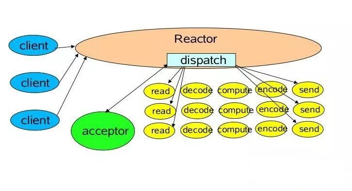
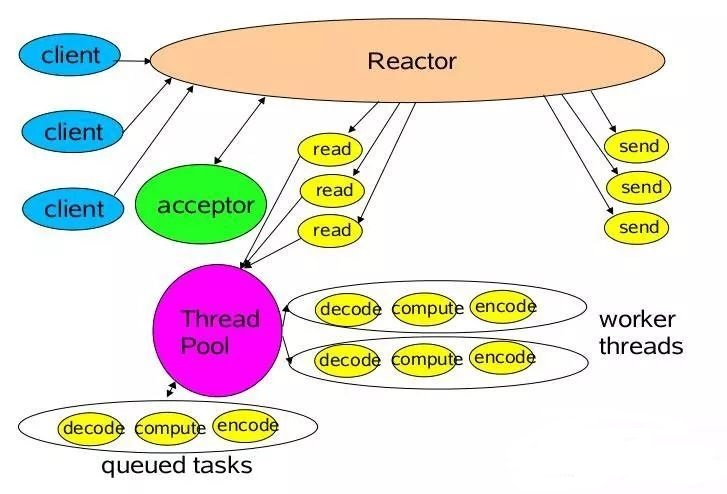
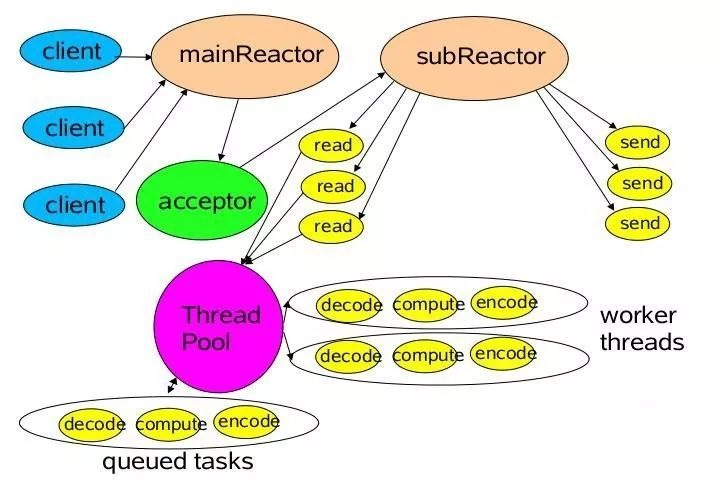

# Reactor 与 Proactor

Reactor 模式用于同步 IO，而 Proactor 运用于异步 IO 操作

Reactor 实现相对简单，对于耗时短的处理场景处理高效，处理耗时长的操作会造成事件分发的阻塞，影响到后续事件的处理

Proactor 性能更高，能够处理耗时长的并发场景，实现逻辑复杂，依赖操作系统对异步的支持

## Reactor

Reactor 模式是事件驱动的，有一个或多个并发输入源，有一个 Service Handler，有多个 Request Handlers；Service Handler 会对输入的请求 Event 进行多路复用，并同步地将它们分发给相应的 Request Handler

### 单 Reactor 单线程模型

Reactor 线程负责多路分离套接字，accept 新连接，并分派请求到 handler

1. Reactor 对象通过 select 监控连接事件，收到事件后通过 dispatch 进行转发

2. 如果是连接建立的事件，则由 acceptor 接受连接，并创建 handler 处理后续事件

3. 如果不是建立连接事件，则 Reactor 会分发调用 Handler 来响应

4. handler 会完成 read 业务处理 send 的完整业务流程

单 Reactor 单线程模型只是在代码上进行了组件的区分，但是整体操作还是单线程，不能充分利用硬件资源

### 单 Reactor 多线程模型

在事件处理器 Handler 部分采用了多线程

1. Reactor 对象通过 select 监控客户端请求事件，收到事件后通过 dispatch 进行分发

2. 如果是建立连接请求事件，则由 acceptor 通过 accept 处理连接请求，然后创建一个 Handler 对象处理连接完成后续的各种事件

3. 如果不是建立连接事件，则 Reactor 会分发调用连接对应的 Handler 来响应

4. Handler 只负责响应事件，不做具体业务处理，通过 Read 读取数据后，会分发给后面的 Worker 线程池进行业务处理

5. Worker 线程池会分配独立的线程完成真正的业务处理，如何将响应结果发给 Handler 进行处理

6. Handler 收到响应结果后通过 send 将响应结果返回给 Client

获取到 IO 的读写事件之后，交由线程池来处理，降低 Reactor 的性能开销，从而更专注的做事件分发工作了，提升整个应用的吞吐

多线程数据共享和访问比较复杂，如果子线程完成业务处理后，把结果传递给主线程 Reactor 进行发送，就会涉及共享数据的互斥和保护机制

Reactor 承担所有事件的监听和响应，只在主线程中运行，可能会存在性能问题

### 主从 Reactor 多线程模型

mainReactor 负责监听 server socket，用来处理网络 IO 连接建立操作，将建立的 socketChannel 指定注册给 subReactor，subReactor 主要做和建立起来的 socket 做数据交互和事件业务处理操作

1. 从主线程池中随机选择一个 Reactor 线程作为 acceptor 线程，用于绑定监听端口，接收客户端连接

2. acceptor 线程接收客户端连接请求之后创建新的 SocketChannel，将其注册到主线程池的其它 Reactor 线程上，由其负责接入认证、IP 黑白名单过滤、握手等操作

3. 将 SocketChannel 从主线程池的 Reactor 线程的多路复用器上摘除，重新注册到 Sub 线程池的线程上，并创建一个 Handler 用于处理各种连接事件

4. 当有新的事件发生时，SubReactor 会调用连接对应的 Handler 进行响应

## Proactor

1. 应用程序初始化一个异步读取操作，然后注册相应的事件处理器，此时事件处理器不关注读取就绪事件，而是关注读取完成事件

2. 事件分离器等待读取操作完成事件

3. 在事件分离器等待读取操作完成的时候，操作系统调用内核线程完成读取操作，并将读取的内容放入用户传递过来的缓存区中

4. 事件分离器捕获到读取完成事件后，激活应用程序注册的事件处理器，事件处理器直接从缓存区读取数据，而不需要进行实际的读取操作