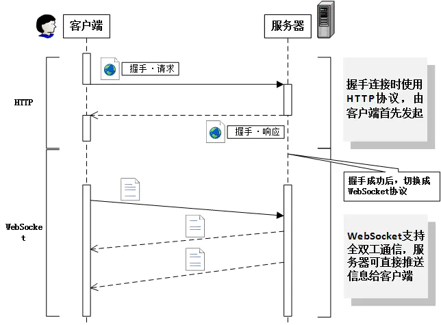

# WebSocket

## 概述

WebSocket 是基于 HTTP1.1 的协议

Webscoket 是 Web 浏览器和服务器之间的一种全双工通信协议，一旦 Web 客户端与服务器建立起连接，之后的全部数据通信都通过这个连接进行

与 HTTP 相同点：

- 都是基于 TCP 的应用层协议

- 都使用 Request/Response 模型进行连接的建立

- 在连接的建立过程中对错误的处理方式相同，在这个阶段 WS 可能返回和 HTTP 相同的返回码

与 HTTP 不同点：

- WS 使用 HTTP 来建立连接，但是定义了一系列新的 header 域，这些域在 HTTP 中并不会使用

- WS 的连接不能通过中间人来转发，它必须是一个直接连接

- WS 连接建立之后，通信双方都可以在任何时刻向另一方发送数据

- WS 连接建立之后，数据的传输使用帧来传递，不再需要 Request 消息

- WS 的数据帧有序



## 特点

- 推送功能：服务器可以直接向客户端推送消息

- 减少通信量：只要第一次建立连接，就可以一直进行通信，Websocket 的头部数据也比较少

## 握手协议

通过 HTTP 协议建立 TCP 连接，之后客户端发送 websocket 的握手请求

握手请求报文头部格式：

```http
GET /chat HTTP/1.1
Host: server.example.com
**Upgrade: websocket**
Connection: Upgrade
Sec-WebSocket-Key: dGhlIHNhbXBsZSBub25jZQ==
Origin: https://example.com
Sec-WebSocket-Protocol: chat, superchat
Sec-WebSocket-Version: 13
```
- 请求方法必须是 GET，版本号大于 1.1

- 必须有 Upgrade 字段，值为 websocket

- 必须有 Connection 字段，值为 Upgrade

- 必须有 Sec-WebSocket-Key 字段，记录着握手过程中必不可少的键值

- 必须有 Sec-WebSocket-Protocol 字段，记录着使用的子协议

服务器接收到请求后，返回状态码为 101 Switching Protocols 的响应

```http
HTTP/1.1 101 Switching Protocols
Upgrade: websocket
Connection: Upgrade
Sec-WebSocket-Accept: s3pPLMBiTxaQ9kYGzzhZRbK+xOo=
Sec-WebSocket-Protocol: chat
```

握手成功后，通信不再使用 HTTP 协议，而采用 WebSocket 独立的数据帧

## 与 HTTP2.0 的关系

HTTP2 虽然支持服务器推送资源到客户端缓存，不是客户端应用程序本身，不是应用程序可以感知的，主要是让浏览器（用户代理）提前缓存静态资源，所以不能指望 HTTP2 可以像 WebSocket 建立双向实时通信

||HTTP2|WebSocket|
|-|-|-|
头部|压缩|没有
二进制|二进制协议|二进制或文本
多路复用|是|是
优先级|有|没有
方向|客户端/服务器 + 服务器推送|双向
全双工|是|是
