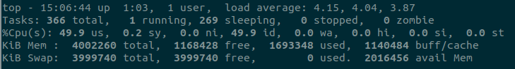

# 常用命令

## ps

```
ps [options] [--help]

-A 列出所有的行程

-w 显示加宽可以显示较多的资讯

-au 显示较详细的资讯

-aux 显示所有包含其他使用者的行程

USER: 行程拥有者

%CPU: 占用的 CPU 使用率
```

## lsof

列出当前系统打开的文件

```
# 显示当前系统打开的文件
lsof 

# 查看某个用户打开的文件信息
lsof -u username

# 列出所有网络连接
lsof -i

# 列出所有 tcp 网络连接
lsof -i tcp

# 列出所有 udp 网络连接
lsof -i udp

# 列出端口号
lsof -i:port

# 显示 abc 进程现在打开的文件
lsof -c abc

# 通过某个进程号显示该进行打开的文件
$lsof -p pid
```

## netstat

```
netstat -tunlp 用于显示 tcp，udp 的端口和进程等相关情况

-a 列出所有端口使用情

-t (tcp) 仅显示tcp相关选项

-u (udp)仅显示udp相关选项

-n 拒绝显示别名，能显示数字的全部转化为数字

-l 仅列出在Listen(监听)的服务状态

-p 显示建立相关链接的程序名
```

## kill

将指定的信号发送到指定的进程或进程组，如果未指定信号，则发送TERM信号

```
kill [-s signal] pid

kill 12345 杀死进程

kill -KILL 123456 强制杀死进程

kill -9 123456
```

## wget

```
wget url 下载单个文件

wget -b URL 后台下载

wget -c URL 支持断点续传
```

## 查看系统信息

```
uname -a
```

## 查看网络信息

```
ifconfig -a
```

## 源码编译

获取源码文件，解压后，进入源码文件目录，找到 configure 程序，使用 `./configure` 建立 Makefile 文件（必须保证 Makefile 文件正确建立，如果建立不成功的话，查看错误，并依据错误提示，解决后再次建立 Makefile 文件，直到正确建立 Makefile 文件）

成功生成 Makefile 后 只需要使用 `make` 命令进行编译

编译成功后，使用 `make install` 进行安装软件

也可以使用 `./configure --prefix='File Path'` 命令，将软件安装在 File Path 位置

## apt

```
apt-get update 更新源

apt-get dist-upgrade 升级系统

apt-get upgrade 更新所有已经安装的软件包

apt-get install package_name 安装软件包(加上 --reinstall重新安装)

apt-get remove 移除软件包（保留配置信息）

apt-get purge package_name 移除软件包（删除配置信息）

apt show pack_name 获取包的相关信息

apt search page_name 搜索包的相关信息

apt-cache depends package 了解使用依赖

apt-get check 检查是否有损坏的依赖

apt-get autoclean 清除那些已经卸载的软件包的.deb文件

apt-get clean 将已安装软件包裹的.deb文件一并删除
```

## dpkg

```
dpkg -l 显示已安装软件包列表
```

## chmod

文件所有者（Owner）、用户组（Group）、其它用户（Other Users）；只有文件所有者和超级用户可以修改文件或目录的权限


```
chmod abc file

# 其中a,b,c各为一个数字，分别表示User、Group、及Other的权限
# r=4，w=2，x=1
```

目录也是文件，也有 rwx 权限；目录的 r 权限就是可以读取这个目录内的信息，例如 `ls`；目录的 w 权限就是可以修改目录，即给文件改名、删除文件和子目录这些操作；目录的 x 权限就是可以进入该目录

## top

`top` 能够实时显示系统中各个进程的资源占用状况，可以通过用户按键来不断刷新当前状态，该命令可以按 CPU 使用、内存使用和执行时间对任务进行排序

```
top -p pidid：显示指定的进程信息

// 交互命令
k: 终止一个进程

P：按 CPU 使用率排行

M：按 MEM 排行

1：显示各 CPU 情况

q: 退出程序

m: 切换显示内存信息模式

t: 切换显示进程和 CPU 状态信息模型
```



第一行：当前系统时间、系统已运行时间、当前登入用户、系统1分钟5分钟15分钟的负载情况，假设机器的 cpu 核心数为 n，则当负载的平均值为 n 的时候，机器就是刚好满负载运行了，如果大于 n，就是超负荷运行了

第二行：当前系统进程情况

第三行：用户空间占用 CPU 的百分比、内核空间占用 CPU 的百分比、改变过优先级的进程占用 CPU 的百分比、空闲 CPU 百分比、IO 等待占用 CPU 的百分比、硬中断（Hardware IRQ）占用 CPU 的百分比、软中断（Software Interrupts）占用 CPU 的百分比

第四行：物理内存总量、空闲内存总量、使用中的内存总量、缓存的内存量

第五行：交换区总量、空闲交换区总量、使用的交换区总量


PID   -- 进程id

USER  -- 进程所有者

PR    -- 进程优先级

NI    -- 负值表示高优先级，正值表示低优先级

VIRT  -- 进程使用的虚拟内存总量，VIRT = SWAP + RES

RES   -- 进程使用的、未被换出的物理内存大小，RES = CODE + DATA

SHR   -- 共享内存大小

S     -- 进程状态，D：不可中断的睡眠状态 R：运行 S：睡眠 T：跟踪/停止 Z：僵尸进程

%CPU  -- 上次更新到现在的CPU时间占用百分比

%MEM  -- 进程使用的物理内存百分比

## head & tail

显示前几行或前几个字节

```
head [-n count | -c bytes] [file ...]

-n 展示前 n 行

-c 展示前 n 个字符
```

从尾部开始展示文本

```
tail [-n count | -c bytes] [file ...]

-n 展示前 n 行

-c 展示前 n 个字符
```

## more & less

流式读取，支持翻页

## tail

用于查看文件尾部内容

```
tail [opt] [file]

opt:

-f 循环刷新读取
-n <行数> 显示文件的尾部 n 行内容
```

## awk

awk 把文件逐行的读入，以空格和制表符为默认分隔符将每行切片，切开的部分再进行各种分析处理

```
awk [options] 'script' file

options 这个表示一些可选的参数选项

script 表示可执行脚本代码（一般被 {} 花括号包围），这个是必须的

file 表示需要处理的文件，必须是纯文本文件

awk 根据分隔符将每一行分为若干字段，依次用 $1, $2,$3 来表示，$0 表示整行

awk 内置变量：

1. NR 表示文件中的行号，表示当前是第几行、

2. NF 表示文件中的当前行被分割的列数


awk -F ':' '{print $1}' /etc/passwd：使用 -F 来改变分隔符为 :，用 print 将第 1 列字段的内容打印输出

awk '{$2 = "***"; print $0}' fruit.txt：对 $2 变量进行重新赋值，来隐藏每一行的第 2 列内容，并且用星号 * 来代替其输出

awk '{print $1 "\t" $2 "\t" $3}' fruit.txt：在参数列表中加入一些字符串或者转义字符之类的，让输出的内容格式更漂亮，但一定要记住要使用双引号

awk '{print NR "\t" $0}' fruit.txt：内置 NR 变量表示每一行的行号

awk '{print NF "\t" $0}' fruit.txt：内置 NF 变量表示每一行的列数

搭配 if
awk '{num = 10; if (num % 2 == 0) printf "%d 是偶数\n", num }'

搭配 if-else
awk '{
    num = 11; 
    if (num % 2 == 0) printf "%d 是偶数\n", num; 
    else printf "%d 是奇数\n", num 
}'

搭配 for
awk '{ for (i = 1; i <= 5; ++i) print i }'

搭配 while
awk '{i = 1; while (i < 6) { print i; ++i } }'

搭配 break
awk '{
   sum = 0; for (i = 0; i < 20; ++i) { 
      sum += i; if (sum > 50) break; else print "Sum =", sum 
   } 
}'

搭配 continue
awk '{for (i = 1; i <= 20; ++i) {if (i % 2 == 1) continue ; else print i} }'
```

## sed

sed 可依照脚本的指令来处理、编辑文本文件

## wc

计算文件的行数、单次树、字节数

```
-c 统计字节数

-l 统计行数

-m 统计字符数
```

## which

在 PATH 变量指定的路径中，搜索某个系统命令的位置，并且返回第一个搜索结果

## whereis

whereis命令只能用于程序名的搜索

```
-m  定位 man 说明帮助文件

-s  定位源代码文件

-b  定位可执行文件
```

## find

对列出的每个路径递归地遍历目录树，根据树中的每个文件计算表达式

```
find [-H | -L | -P] [-EXdsx] [-f path] path ... [expression]

-print：find 命令将匹配的文件输出到标准输出

-exec：find 命令对匹配的文件执行该参数所给出的 shell 命令，以 \; 为结束标志

-name：按照文件名查找文件

-user：按照文件属主来查找文件

-group：按照文件所属的组来查找文件

# 查找目录下的所有 .log 结尾的文件
find /User -name "*.log" -print

# 删除目录下一个月以前的日志文件， {} 不能少
find /home/midou/logs// -mtime +30 -name "*.log.gz" -exec rm -rf {} \;
```

## ulimit

shell 执行程序的资源限制

```
ulimit -a: 查看所有限制
ulimit -u 500: 设置当前 shell 用户程序上限
```

## 重定向

```
command > file   将输出重定向到 file
command < file   将输入重定向到 file
command >> file  将输出以追加的方式重定向到 file

n (0/1/2)> file
n (0/1/2)>> file
/*
文件描述符 0 通常是标准输入（STDIN），1 是标准输出（STDOUT），2 是标准错误输出（STDERR）

重定向到 /dev/null 处理不需要的输出
*/
```

## update-alternatives

软件多版本管理

```
update-alternatives --install link name path priority
link 为系统中功能相同软件的公共链接目录，比如 /usr/bin/python
name为命令链接符名称，如 python
path 为你所要使用新命令、新软件的所在目录
priority 为优先级，当命令链接已存在时，需高于当前值，因为当 alternative 为自动模式时,系统默认启用 priority 高的链接

update-alternatives --display name
显示一个命令链接的所有可选命令，即查看一个命令链接组的所有信息

update-alternatives --config name
显示和修改实际指向的候选命令，为在现有的命令链接选择一个作为系统默认

update-alternatives --remove name path
name 与 path 与 install 中的一致
```

## ln

```
ln [参数][源文件或目录][目标文件或目录]
默认硬链接
-s 软链接，源文件需使用绝对地址
```

