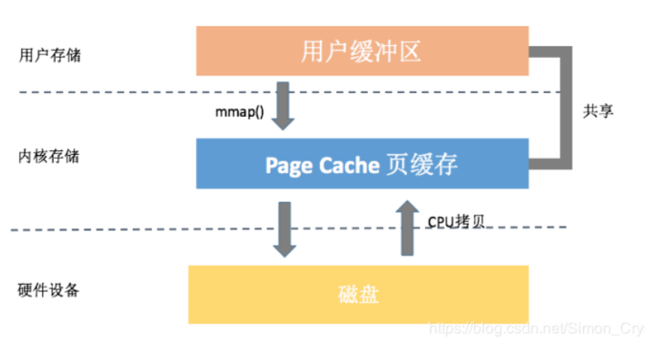

# 文件 IO

IO 结构模型分为 Direct IO、mmap 和 Buffer IO

## 缓存 IO

缓存 IO 又被称作标准 IO，大多数文件系统的默认 IO 操作都是缓存 IO

在 Linux 的缓存 IO 机制中，数据先从磁盘复制到内核空间的缓冲区，然后从内核空间缓冲区复制到应用程序的地址空间

- 读操作：操作系统检查内核的缓冲区有没有需要的数据，如果已经缓存了就直接从缓存中返回，否则从磁盘中读取然后缓存在操作系统的缓存中

- 写操作：应用程序将数据从用户空间复制到内核空间的 page cache 中，数据什么时候写到磁盘由应用程序采用的写操作机制决定，默认是采用延迟写机制，应用程序不需要等待数据全部被写入磁盘，系统会负责定期将页缓存数据写入磁盘

优点：

- 在一定程度上分离了内核空间和用户空间，保护系统本身的运行安全

- 可以减少读盘的次数，从而提高性能

缺点：

- 读操作中，可以将数据直接从磁盘读到 page cache 中，或者将数据从 page cache 直接写回到磁盘上，而不能直接在应用程序地址空间和磁盘之间进行数据传输，数据在传输过程中需要在应用程序地址空间（用户空间）和缓存（内核空间）之间进行多次数据拷贝操作，这些数据拷贝操作所带来的 CPU 以及内存开销是非常大的

- 写操作中，延迟写机制可能会导致数据丢失，page cache 中被修改的内存称为脏页，内核通过 flush 线程定期将数据写入磁盘；在实际应用中，如果某些数据非常重要，是完全不允许有丢失风险的，这时应该采用同步写机制，在应用程序中使用 sync、fsync、msync 等系统调用时，内核都会立刻将相应的数据写回到磁盘

## 直接 IO

直接 IO 就是应用程序直接访问磁盘数据，而不经过内核缓冲区，这样做的目的是减少一次从内核缓冲区到用户程序缓存的数据复制

优点：

- 应用程序自己选择缓存机制，提高数据的存取效率

缺点：

- 如果访问的数据不在应用程序缓存中，那么每次数据都会直接从磁盘加载，这种直接加载会非常慢

## 内存映射

内存映射，简而言之就是将内核空间的一段内存区域映射到用户空间。映射成功后，用户对这段内存区域的修改可以直接反映到内核空间，相反，内核空间对这段区域的修改也直接反映用户空间。那么对于内核空间与用户空间两者之间需要大量数据传输等操作的话效率是非常高的。当然，也可以将内核空间的一段内存区域同时映射到多个进程，这样还可以实现进程间的共享内存通信

### mmap

mmap 是一种内存映射文件的方法，即将一个文件或者其它对象映射到进程的地址空间，实现文件磁盘地址和进程虚拟地址空间中一段虚拟地址的一一对映关系；实现这样的映射关系后，进程就可以采用指针的方式读写操作这一段内存，而系统会自动回写脏页面到对应的文件磁盘上，即完成了对文件的操作而不必再调用 `read`、`write` 等系统调用函数。相反，内核空间对这段区域的修改也直接反映用户空间，从而可以实现不同进程间的文件共享

内存映射服务的地址空间处在堆栈之间的空余部分

### 实现过程

1. 调用 `open()` 打开一个本地文件，获得文件 fd

2. 进程在用户空间调用库函数 `void* mmap(void *start, size_t length, int prot, int flags, int fd, off_t offset)`，在当前进程的虚拟地址空间中，寻找一段空闲的满足要求的连续的虚拟地址

### mmap 与常规文件操作区别

常规文件操作为了提高读写效率和保护磁盘，使用了页缓存机制，造成读文件时需要先将文件页从磁盘拷贝到页缓存中，由于页缓存处在内核空间，不能被用户进程直接寻址，所以还需要将页缓存中数据页再次拷贝到内存对应的用户空间中。通过了两次数据拷贝过程，才能完成进程对文件内容的获取任务。写操作也是一样，待写入的 buffer 在内核空间不能直接访问，必须要先拷贝至内核空间对应的主存，再写回磁盘中（延迟写回），也是需要两次数据拷贝

使用 mmap 操作文件中，创建新的虚拟内存区域和建立文件磁盘地址和虚拟内存区域映射这两步，没有任何文件拷贝操作。而之后访问数据时发现内存中并无数据而发起的缺页异常过程，可以通过已经建立好的映射关系，只使用一次数据拷贝，就从磁盘中将数据传入内存的用户空间中，供进程使用

### 优点

- 对文件的读取操作跨过了页缓存，减少了数据的拷贝次数，用内存读写取代 IO 读写，提高了文件读取效率

- 实现了用户空间和内核空间的高效交互方式。两空间的各自修改操作可以直接反映在映射的区域内，从而被对方空间及时捕捉

- 提供进程间共享内存及相互通信的方式，不管是父子进程还是无亲缘关系的进程，都可以将自身用户空间映射到同一个文件或匿名映射到同一片区域，从而通过各自对映射区域的改动，达到进程间通信和进程间共享的目的

- 实现高效的大规模数据传输，通过 mmap 映射解决内存不足，但使用硬盘 IO 效率较低，并且无法增加文件长度，因为创建映射的时候需要指定长度

### 细节

- mmap 映射区域大小必须是物理页大小（page_size）的整倍数（32 位系统中通常是 4kb）

### 与共享内存的区别

- shm 的内存共享，效率比 mmap 效率要高，但 mmap 操作更简单，存储量也更大

- mmap 使用普通文件提供的内存映射，适用于任何进程之间；使用特殊文件提供匿名内存映射，适用于具有亲缘关系的进程之间

- 机器重启后，mmap 因为是映射磁盘文件所以数据不会丢失，而 shm 会丢失数据