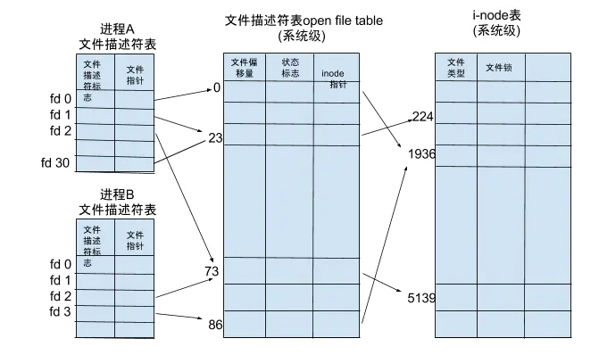

# 文件描述符

Linux 系统中把一切都看做是文件。当进程打开现有文件或创建新文件时，内核向进程返回一个文件描述符，文件描述符就是内核为了高效管理已被打开的文件所创建的索引，用来指向被打开的文件，所有执行 I/O 操作的系统调用都会通过文件描述符

每个文件描述符会与一个打开的文件相对应，不同的文件描述符也可能指向同一个文件，相同的文件可以被不同的进程打开，也可以在同一个进程被多次打开

常见的文件描述符是 0、1、2，分别表示标准输入、标准输出和错误输出。一个进程创建时，这个三个文件就也被它打开了

系统为维护文件描述符，建立了三个表：进程级的文件描述符表、系统级的文件描述符表和文件系统的 inode 表

操作系统为每个进程维护了一个文件描述符表，该表的值都从 0 开始的，所以在不同的进程中会有相同的文件描述符

fd 相同，不意味着打开的文件相同，因为每个进程都有自己的表，隔离而独立
