# 进程与线程

## 并发、并行

并发：指宏观上看起来两个程序在同时运行，比如说在单核 cpu 上的多任务；但是从微观上看两个程序的指令是交织着运行的，你的指令之间穿插着我的指令，我的指令之间穿插着你的，在单个周期内只运行了一个指令；这种并发并不能提高计算机的性能，只能提高效率

并行：指严格物理意义上的同时运行，比如多核 cpu，两个程序分别运行在两个核上，两者之间互不影响，单个周期内每个程序都运行了自己的指令，也就是运行了两条指令；并行提高了计算机的效率


## 互斥与同步

互斥：是指某一资源同时只允许一个访问者对其进行访问，具有唯一性和排它性；互斥无法限制访问者对资源的访问顺序，即访问是无序的

同步：是指在互斥的基础上（大多数情况），通过其它机制实现访问者对资源的有序访问


## 多核、多进程、多线程

- 计算机的 cpu 核数是同时可以并行的线程数量（cpu 只能看到线程，线程是 cpu 调度分配的最小单位）

- 如果计算机有多个 cpu 核，且计算机中的总的线程数量小于核数，那线程就可以并行运行在不同的核中

- 如果是单核多线程，那多线程之间就不是并行而是并发，为了均衡负载，cpu 调度器会不断的在单核上切换不同的线程执行

- 如果是多核多线程且线程数量大于核数，其中有些线程就会不断切换，并发执行，但实际上最大的并行数量还是当前这个进程中的核的数量，所以盲目增加线程数不仅不会让你的程序更快，反而会给你的程序增加额外的开销

- 对计算密集型任务，可以使用核心数个线程，就可以占满 cpu 资源，进而可以充分利用 cpu，如果再多，就会造成额外的开销

- 对于 IO 密集型任务，线程由于被 IO 阻塞，如果仍然用核心数个线程，cpu 是跑不满的，于是可以使用更多个线程来提高 cpu 使用率


## 单核机器的多线程需要加锁

线程锁通常用来实现线程的同步和通信，单核机器上的多线程程序，仍然存在线程同步的问题；在抢占式操作系统中，通常为每个线程分配一个时间片，当某个线程时间片耗尽时，操作系统会将其挂起，然后运行另一个线程。如果这两个线程共享某些数据，不使用线程锁的前提下，可能会导致共享数据修改引起冲突


## 用户态和内核态

在 cpu 的一些指令中，有的指令如果用错，将会导致整个系统崩溃；分了内核态和用户态后，当用户需要操作这些指令时候，内核为其提供了API，可以通过系统调用陷入内核，让内核去执行这些操作

用户态和内核态是操作系统的两种运行级别，两者最大的区别就是特权级不同

用户态拥有最低的特权级，内核态拥有较高的特权级，运行在用户态的程序不能直接访问操作系统内核数据结构和程序

内核态和用户态之间的转换方式主要包括：系统调用，异常和中断

- 系统调用：用户进程通过系统调用申请操作系统提供的服务程序完成工作

- 异常：当 CPU 在执行运行在用户态下的程序时，发生了某些事先不可知的异常，就会触发由当前运行进程切换到处理此异常的内核相关程序中，也就转到了内核态，比如缺页异常

- 中断：当外围设备完成用户请求的操作之后，会向 CPU 发出相应的中断信号，这时 CPU 会暂停执行下一条将要执行的指令，转而去执行中断信号的处理程序，如果先执行的指令是用户态下的程序，那么这个转换的过程自然也就发生了有用户态到内核态的切换


## 系统调用

运行在用户态的程序向操作系统内核态请求需要更高权限运行的服务，系统调用提供了用户态与内核态之间的接口

`open()`、`write()`、`fork()` 等都是系统调用


## 进程与线程

进程是对运行时程序的封装，是系统进行资源调度和分配的的基本单位，实现了操作系统的并发

线程是进程的子任务，是 CPU 调度和分派的基本单位，实现进程内部的并发；进程内每个线程完成不同的任务，但是共享同一地址空间（也就是同样的动态内存，映射文件，目标代码等等），打开的文件队列和其他内核资源

### 区别：

- 一个线程只能属于一个进程，而一个进程可以有多个线程，但至少有一个线程，线程依赖于进程而存在

- 进程在执行过程中拥有独立的内存单元，而多个线程共享进程的内存；资源分配给进程，同一进程的所有线程共享该进程的所有资源，共享代码段（代码和常量），数据段（全局变量和静态变量），扩展段（堆存储）；每个线程拥有自己的栈段，栈段又叫运行时段，用来存放所有局部变量和临时变量

- 进程是资源分配的最小单位，线程是 CPU 调度的最小单位

- 进程切换的开销远大于线程切换的开销；在创建或撤消进程时，系统都要为之分配或回收资源，因此系统开销远大于创建或撤销线程的开销

- 由于同一进程中的多个线程具有相同的地址空间，致使它们之间的同步和通信可以使用直接读写进程数据段（如全局变量）；进程通信需要使用进程同步和互斥手段来保证数据的一致性

- 进程编程调试简单可靠性高，线程编程调试相对复杂

- 进程间不会相互影响；一个线程挂掉将导致整个进程挂掉

- 进程适应于多核、多机分布，线程适用于多核

## 线程实现

- 用户线程：在用户空间实现的线程，不是由内核管理的线程，是由用户态的线程库来完成线程的管理

- 内核线程：在内核中实现的线程，是由内核管理的线程

- 轻量级进程：在内核中来支持用户线程

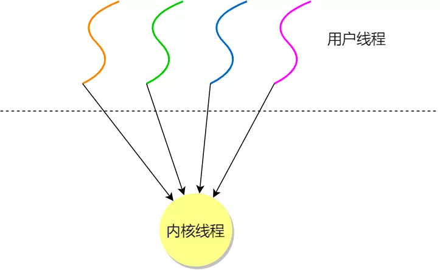

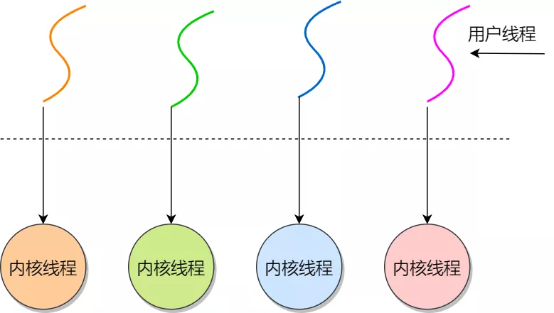

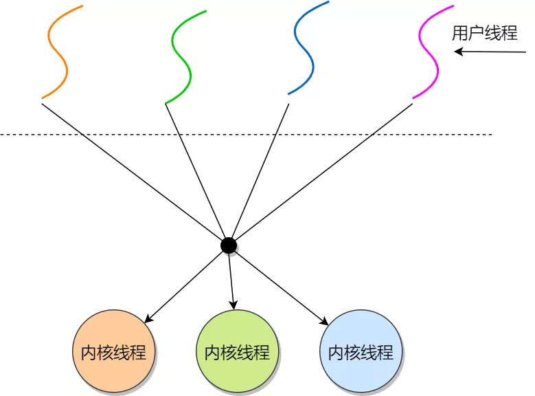

### 用户线程

用户线程是基于用户态的线程管理库来实现的，那么线程控制块（Thread Control Block, TCB） 
也是在库里面来实现的，对于操作系统而言是看不到这个 TCB 的，它只能看到整个进程的 PCB

用户线程的整个线程管理和调度，操作系统是不直接参与的，而是由用户级线程库函数来完成线程的管理，
包括线程的创建、终止、同步和调度等

优点：

- 每个进程都需要有它私有的线程控制块（TCB）列表，用来跟踪记录它各个线程状态信息（PC、栈指针、寄存器），
TCB 由用户级线程库函数来维护，可用于不支持线程技术的操作系统

- 用户线程的切换也是由线程库函数来完成的，无需用户态与内核态的切换，所以速度特别快

缺点：

- 由于操作系统不参与线程的调度，如果一个线程发起了系统调用而阻塞，那进程所包含的用户线程都不能执行了

- 当一个线程开始运行后，除非它主动地交出 CPU 的使用权，否则它所在的进程当中的其他线程无法运行，因为用户态的线程没法打断当前运行中的线程，它没有这个特权，只有操作系统才有，但是用户线程不是由操作系统管理的

- 由于时间片分配给进程，在多线程执行时，每个线程得到的时间片较少，执行会比较慢

### 内核线程

内核线程是由操作系统管理的，线程对应的 TCB 自然是放在操作系统里的，这样线程的创建、终止和管理都是由操作系统负责

优点：

- 在一个进程当中，如果某个内核线程发起系统调用而被阻塞，并不会影响其他内核线程的运行

- 多线程的进程获得更多的 CPU 运行时间

缺点：

- 在支持内核线程的操作系统中，由内核来维护进程和线程的上下文信息，如 PCB 和 TCB

- 线程的创建、终止和切换都是通过系统调用的方式来进行，因此对于系统来说，系统开销比较大

## 进程状态

在一个进程的基本状态，即创建状态、运行状态、就绪状态、阻塞状态、挂起状态、结束状态

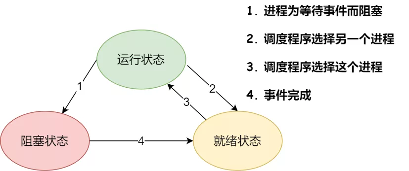

- 创建状态：进程正在被创建时的状态

- 运行状态：该时刻进程占用 CPU

- 就绪状态：可运行，但因为其他进程正在运行而暂停停止

- 阻塞状态：该进程正在等待某一事件发生而暂时停止运行，即使给它CPU控制权，它也无法运行

- 结束状态：进程正在从系统中消失时的状态


挂起状态表示进程没有占有物理内存空间（由于虚拟内存管理原因，进程所使用的空间可能并没有映射到物理内存，而是在硬盘上）

- 阻塞挂起状态：进程在外存（硬盘）并等待某个事件的出现

- 就绪挂起状态：进程在外存（硬盘），但只要进入内存，即刻立刻运行

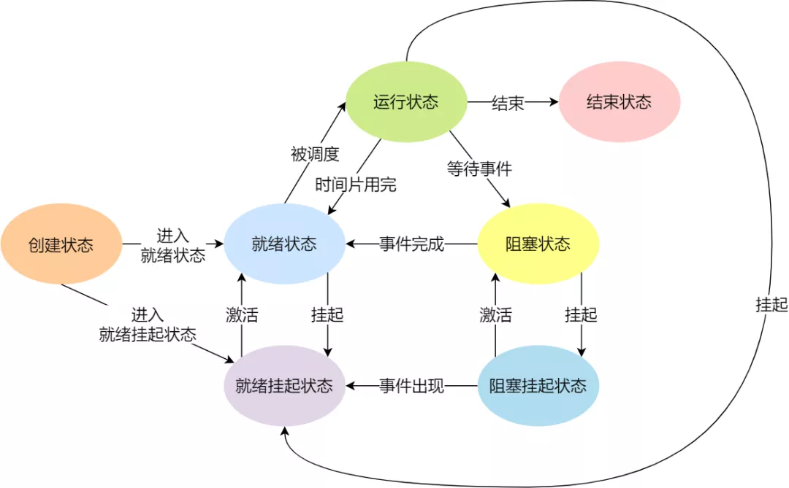

## 进程控制结构

在操作系统中，是用进程控制块（process control block，PCB）数据结构来描述进程，PCB 是进程存在的唯一标识

一个进程的存在，必然会有一个 PCB，如果进程消失了，那么 PCB 也会随之消失

### PCB 结构体

#### 进程描述信息

- 进程标识符：标识各个进程，每个进程都有一个并且唯一的标识符

- 用户标识符：进程归属的用户，用户标识符主要为共享和保护服务

#### 进程控制和管理信息

- 进程当前状态，如 new、ready、running、waiting 或 blocked 等

- 进程优先级：进程抢占 CPU 时的优先级

#### 资源分配清单

- 有关内存地址空间或虚拟地址空间的信息，所打开文件的列表和所使用的 I/O 设备信息

#### CPU 信息

- CPU 中各个寄存器的值，当进程被切换时，CPU 的状态信息都会被保存在相应的 PCB 中，以便进程重新执行时，能从断点处继续执行

### PCB 组织方式

通过链表的方式进行组织，把具有相同状态的进程链在一起，组成各种队列

- 将所有处于就绪状态的进程链在一起，称为就绪队列

- 把所有因等待某事件而处于等待状态的进程链在一起就组成各种阻塞队列

- 对于运行队列，在单核 CPU 系统中则只有一个运行指针了，因为单核 CPU 在某个时间，只能运行一个程序

因为面临进程创建，销毁等调度导致进程状态发生变化，所以使用链表，以便能够更加灵活的插入和删除


## 进程控制

### 创建

操作系统允许一个进程创建另一个进程，而且允许子进程继承父进程所拥有的资源，当子进程被终止时，其在父进程处继承的资源应当还给父进程，终止父进程时同时也会终止其所有的子进程

1. 为新进程分配一个唯一的进程标识号，并申请一个空白的 PCB，PCB 是有限的，若申请失败则创建失败

2. 为进程分配资源，此处如果资源不足，进程就会进入等待状态，以等待资源

3. 初始化 PCB

4. 如果进程的调度队列能够接纳新进程，那就将进程插入到就绪队列，等待被调度运行

### 终止

进程可以有 3 种终止方式：正常结束、异常结束以及外界干预（信号 kill 掉）

1. 查找需要终止的进程的 PCB

2. 如果处于执行状态，则立即终止该进程的执行，然后将 CPU 资源分配给其他进程

3. 如果其还有子进程，则应将其所有子进程终止

4. 将该进程所拥有的全部资源都归还给父进程或操作系统

5. 将其从 PCB 所在队列中删除

### 阻塞

当进程需要等待某一事件完成时，它可以调用阻塞语句把自己阻塞等待；一旦被阻塞等待，它只能由另一个进程唤醒

1. 找到将要被阻塞进程标识号对应的 PCB

2. 如果该进程为运行状态，则保护其现场，将其状态转为阻塞状态，停止运行

3. 将该 PCB 插入的阻塞队列中去


### 唤醒

只有当该进程所期待的事件出现时，才由发现者进程用唤醒语句叫醒它

1. 在该事件的阻塞队列中找到相应进程的 PCB

2. 将其从阻塞队列中移出，并置其状态为就绪状态

3. 把该 PCB 插入到就绪队列中，等待调度程序调度


## 上下文切换

### CPU 上下文

在每个任务运行前，CPU 需要知道任务从哪里加载，又从哪里开始运行；操作系统需要事先帮 CPU 设置好 CPU 寄存器和程序计数器

CPU 寄存器和程序计数器是 CPU 在运行任何任务前，所必须依赖的环境，这些环境就叫做 CPU 上下文

CPU 上下文切换就是先把前一个任务的 CPU 上下文（CPU 寄存器和程序计数器）保存起来，然后加载新任务的上下文到这些寄存器和程序计数器，最后再跳转到程序计数器所指的新位置，运行新任务

系统内核会存储保持下来的上下文信息，当此任务再次被分配给 CPU 运行时，CPU 会重新加载这些上下文，这样就能保证任务原来的状态不受影响，让任务看起来还是连续运行

CPU 上下文切换分成：进程上下文切换、线程上下文切换和中断上下文切换

### 进程上下文

进程是由内核管理和调度的，所以进程的切换只能发生在内核态

进程的上下文切换不仅包含了虚拟内存、栈、全局变量等用户空间的资源，还包括了内核堆栈、
寄存器等内核空间的资源

系统会把交换的信息保存在进程的 PCB，当要运行另外一个进程的时候，我们需要从这个进程的 PCB 
取出上下文，然后恢复到 CPU 中，这使得这个进程可以继续执行

为了保证所有进程可以得到公平调度，CPU 时间被划分为一段段的时间片，这些时间片再被轮流分配给各个进程。
这样，当某个进程的时间片耗尽了，就会被系统挂起，切换到其它正在等待 CPU 的进程运行

进程在系统资源不足（比如内存不足）时，要等到资源满足后才可以运行，这个时候进程也会被挂起，
并由系统调度其他进程运行

当进程通过睡眠函数 sleep 这样的方法将自己主动挂起时，自然也会重新调度

当有优先级更高的进程运行时，为了保证高优先级进程的运行，当前进程会被挂起，由高优先级进程来运行

发生硬件中断时，CPU 上的进程会被中断挂起，转而执行内核中的中断服务程序


### 线程上下文

同一个进程内多个线程之间可以共享代码段、数据段、打开的文件等资源，但每个线程都有独立一套的寄存器和栈，这样可以确保线程的控制流是相对独立的

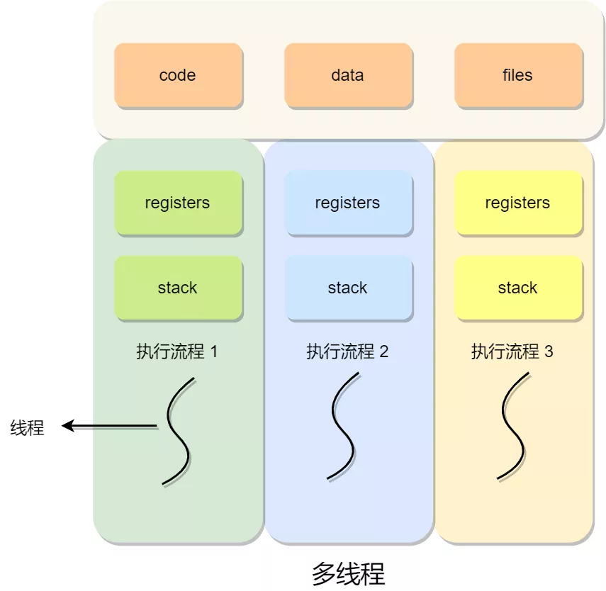

系统的任务调度，实际上的调度对象是线程，而进程只是给线程提供了虚拟内存、全局变量等资源

线程上下文切换分为同一进程线程切换和不同进程线程切换：当两个线程不是属于同一个进程，则切换的过程就跟进程上下文切换一样；当两个线程是属于同一个进程，因为虚拟内存是共享的，所以在切换时，虚拟内存这些资源就保持不动，只需要切换线程的私有数据、寄存器等不共享的数据


## 进程调度

### 调度算法

- 非抢占式调度算法：挑选一个进程，然后让该进程运行直到被阻塞，或者直到该进程退出，才会调用另外一个进程，也就是说不会理时钟中断这个事情

- 抢占式调度算法挑选一个进程，然后让该进程只运行某段时间，如果在该时段结束时，该进程仍然在运行时，则会把它挂起，接着调度程序从就绪队列挑选另外一个进程。这种抢占式调度处理，需要在时间间隔的末端发生时钟中断，以便把 CPU 控制返回给调度程序进行调度，也就是常说的时间片机制

### 调度原则

- CPU 利用率：如果运行的程序，发生了 I/O 事件的请求，那 CPU 使用率必然会很低，为了提高 CPU 利用率，
在这种发生 I/O 事件致使 CPU 空闲的情况下，调度程序需要从就绪队列中选择一个进程来运行

- 系统吞吐量：有的程序执行某个任务花费的时间会比较长，如果这个程序一直占用着 CPU，会造成系统吞吐量（CPU 在单位时间内完成的进程数量）
的降低；要提高系统的吞吐率，调度程序要权衡长任务和短任务进程的运行完成数量

- 周转时间：进程运行时间和进程等待时间总和称为周转时间；一个进程的周转时间越小越好

- 等待时间：处于就绪队列的进程不能等太久

- 响应时间：用户提交请求到系统第一次产生响应所花费的时间，在交互式系统中，响应时间是衡量调度算法好坏的主要标准

### 调度算法

#### 非抢占式的先来先服务（First Come First Severd, FCFS）

每次从就绪队列选择最先进入队列的进程，然后一直运行，直到进程退出或被阻塞，
才会继续从队列中选择第一个进程接着运行

FCFS 对长作业有利，适用于 CPU 繁忙型作业的系统，而不适用于 I/O 繁忙型作业的系统

#### 非抢占式的最短作业优先（Shortest Job First, SJF）

优先选择运行时间最短的进程来运行，这有助于提高系统的吞吐量

对长作业不利，很容易造成一种极端现象

#### 非抢占式高响应比优先（Highest Response Ratio Next, HRRN）

每次进行进程调度时，先计算响应比优先级，然后把响应比优先级最高的进程投入运行

等待时间越长，优先权越高


#### 抢占式时间轮片

每个进程被分配一个时间段，称为时间片（Quantum），即允许该进程在该时间段中运行

如果时间片用完，进程还在运行，那么将会把此进程从 CPU 释放出来，并把 CPU 分配另外一个进程

如果该进程在时间片结束前阻塞或结束，则 CPU 立即进行切换

#### 最高优先级

从就绪队列中选择最高优先级的进程进行运行

进程的优先级可以分为，静态优先级或动态优先级：

- 静态优先级：创建进程时候，就已经确定了优先级了，然后整个运行时间优先级都不会变化

- 动态优先级：根据进程的动态变化调整优先级，比如如果进程运行时间增加，则降低其优先级，如果进程等待时间（就绪队列的等待时间）增加，则升高其优先级，也就是随着时间的推移增加等待进程的优先级

该算法还分为抢占式和非抢占式：

- 非抢占式：当就绪队列中出现优先级高的进程，运行完当前进程，再选择优先级高的进程

- 抢占式：当就绪队列中出现优先级高的进程，当前进程挂起，调度优先级高的进程运行

#### 多级反馈队列

多级反馈队列是时间片轮转和最高优先级的综合和发展

多级：有多个队列，每个队列优先级从高到低，同时优先级越高时间片越短

反馈：如果有新的进程加入优先级高的队列时，立刻停止当前正在运行的进程，转而去运行优先级高的队列

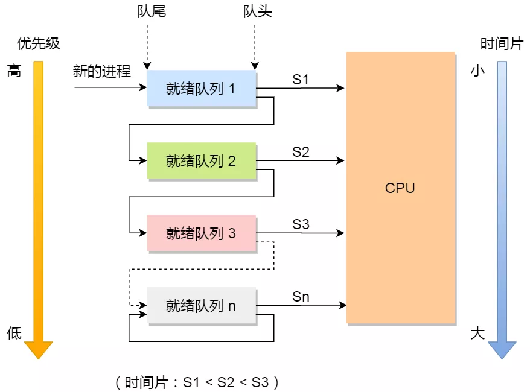

- 设置了多个队列，赋予每个队列不同的优先级，每个队列优先级从高到低，同时优先级越高时间片越短

- 新的进程会被放入到第一级队列的末尾，按先来先服务的原则排队等待被调度，如果在第一级队列规定的时间片没运行完成，则将其转入到第二级队列的末尾，以此类推，直至完成

- 当较高优先级的队列为空，才调度较低优先级的队列中的进程运行。如果进程运行时，有新进程进入较高优先级的队列，则停止当前运行的进程并将其移入到原队列末尾，接着让较高优先级的进程运行

对于短作业可能可以在第一级队列很快被处理完；对于长作业，如果在第一级队列处理不完，可以移入下次队列等待被执行，虽然等待的时间变长了，但是运行时间也会更长了，所以该算法很好的兼顾了长短作业，同时有较好的响应时间

## 进程通信

每个进程的用户地址空间都是独立的，一般而言是不能互相访问的，但内核空间是每个进程都共享的，
所以进程之间要通信必须通过内核

进程间通信主要包括管道、消息队列、信号量、信号、共享内存、以及套接字 socket 等

### 管道

主要包括匿名管道和命名管道，匿名管道用于具有亲缘关系的父子进程通信，命名管道还可允许无亲缘关系进程通信

管道的实质是一个内核缓冲区，进程以先进先出的方式从缓冲区存取数据，管道一端的进程顺序的将数据写入缓冲区，另一端的进程则顺序的读出数据

- 匿名管道：半双工的，数据只能在一个方向上流动，具有固定的读端和写端；只能用于具有亲缘关系的进程之间的通信（父子进程或者兄弟进程之间）；可以看成是一种特殊的文件，对于它的读写也可以使用普通的 `read`、`write` 等函数，但不是普通的文件，并不属于其他任何文件系统，并且只存在于内存中；缓冲区是有限，所传送的是无格式字节流，这就要求管道的读出方和写入方必须事先约定好数据的格式

- 命名管道：可以在无关的进程之间交换数据；有路径名与之相关联，它以一种特殊设备文件形式存在于文件系统中；
命名管道严格遵循先进先出

管道的效率低，不适合进程间频繁地交换数据

#### 匿名管道创建

通过系统调用 `int pipe(int fd[2])` 创建匿名管道， 并返回了两个描述符，一个是管道的读
取端描述符 fd[0]，另一个是管道的写入端描述符 fd[1]

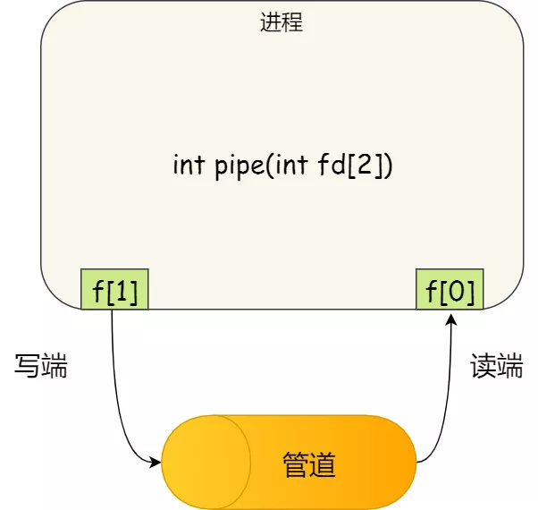

使用 `fork` 创建子进程，创建的子进程会复制父进程的文件描述符，这样就做到了两个进程各有
两个 `fd[0]` 与 `fd[1]`，两个进程就可以通过各自的 `fd` 写入和读取同一个管道文件实现跨
进程通信了

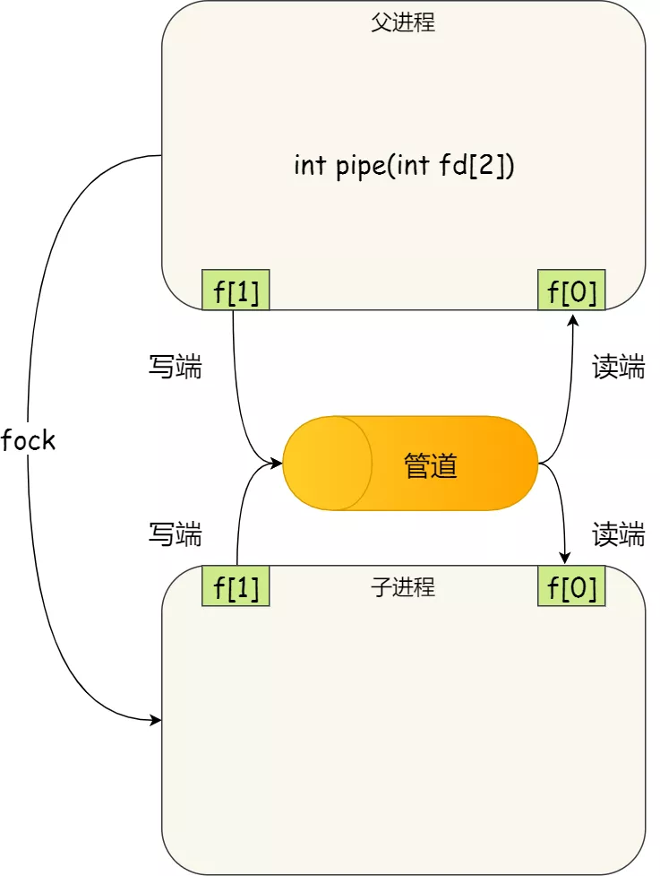

如果需要双向通信，则应该创建两个管道

#### 命名管道创建

通过系统调用 `int mkfifo(const char * filename, mode_t mode)`，创建成功则返回 0，
否则返回 -1，使用 `open()` 打开命名管道

当前进程以写方式（且设置了阻塞标识）打开命名管道时，如果已有别的进程以读打开该命名管道
时，则当前的打开操作成功返回，否则一直阻塞直到有进程为读打开该命名管道

当前进程以读方式（且设置了阻塞标识）打开命名管道时，如果已有别的进程为写打开该命名管道时，
则当前的打开操作成功返回，否则一直阻塞直到有进程为写打开该管道

### 共享内存

系统加载一个进程的时候，分配给进程的内存并不是实际物理内存，而是虚拟内存空间；让两个进程各
自拿出一块虚拟地址空间来，然后映射到相同的物理内存中，两个进程虽然有着独立的虚拟内存空
间，但有一部分却是映射到相同的物理内存，解决了由用户态向内核态拷贝所消耗的时间；需要依靠某
种进程同步操作，如互斥锁和信号量等

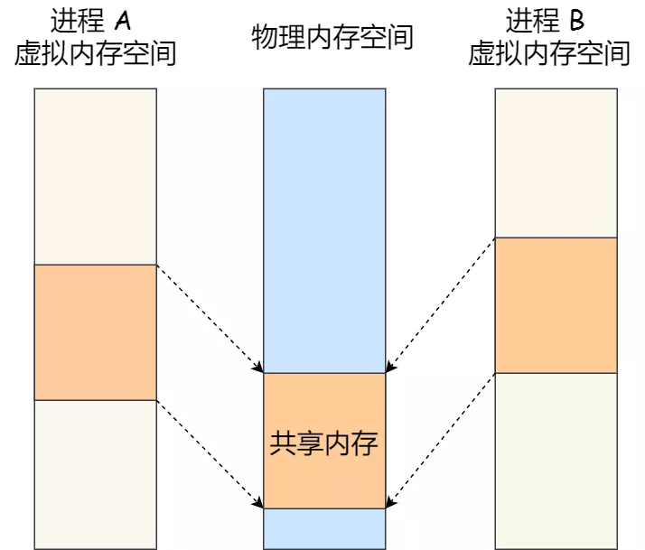

### 消息队列

消息队列存放在内核中，具有写权限的进程可以按照一定得规则向消息队列中添加新信息，有读权限的
进程则可以从消息队列中读取信息；消息队列是面向记录的，其中的消息具有特定的格式以及特定的优
先级；消息队列独立于发送与接收进程，进程终止时，消息队列及其内容并不会被删除；消息队列可以
实现消息的随机查询，消息不一定要以先进先出的次序读取，也可以按消息的类型读取；消息队列存放
在内核中，只有在内核重启或者显示地删除一个消息队列时，该消息队列才会被真正的删除；消息队列
克服了信号承载信息量少，管道只能承载无格式字节流以及缓冲区大小受限等缺点

消息队列不适合比较大数据的传输，因为在内核中每个消息体都有一个最大长度的限制，同时所有队列
所包含的全部消息体的总长度也是有上限

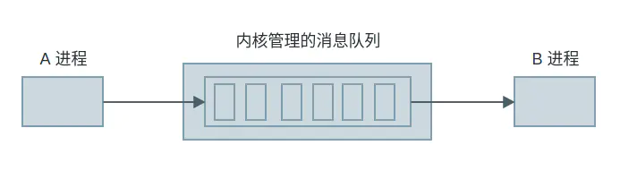

```cpp
// key：用来指定返回 MQ 的 ID
// msgflg：创建的标志
// return：成功返回队列 ID，失败返回 -1, 并设置 erron
int msgget(key_t key, int msgflg);

/*
 * msgid：消息队列 ID
 * msgp：指向 msgbuf 的指针，用来指定发送的消息
 * msgsz：要发送消息的长度
 * msgflg：创建标记，如果指定 IPC_NOWAIT，失败会立刻返回
 * return：成功返回 0, 失败返回 -1, 并设置 erron
 */
int msgsnd(int msqid, const void *msgp, size_t msgsz, int msgflg);

/*
 * msgid：消息队列 ID
 * msgp：指向 msgbuf 的指针，用来接收消息
 * msgsz：要接收消息的长度
 * msgtyp：接收消息的方式
 * msgflg：创建标记，如果指定 IPC_NOWAIT，获取失败会立刻返回
 * return：成功返回实际读取消息的字节数, 失败返回 -1, 并设置 erron
 */
ssize_t msgrcv(int msqid, void *msgp, size_t msgsz, long msgtyp, int msgflg);

/*
 * msqid：消息队列 ID
 * cmd：控制命令，例如 IPC_RMID 删除命令
 * buf：存储消息队列的相关信息的 buf
 * return：成功根据不同的 cmd 有不同的返回值，失败返回 -1, 并设置 erron
 */
int msgctl(int msqid, int cmd, struct msqid_ds *buf);
```

### socket

特性由 3 个属性确定，它们分别是：域、端口号、协议类型；域指定套接字通信中使用的网络介质（网络或 UNIX 文件系统）

同一主机不同进程使用 socket 通信时，可以使用 UNIX Domain Socket，其优势：

- 传输不需要经过网络协议栈，不需要打包拆包等操作，只是数据的拷贝过程

- 分为 SOCK_STREAM 和 SOCK_DGRAM，由于是在本机通过内核通信，不会丢包也不会出现发送包的次序和接收包的次序不一致的问题

### 信号

信号是进程间通信机制中唯一的异步通信机制，因为可以在任何时候发送信号给某一进程

### 信号量

信号量是是一个计数器，可以用来控制多个进程对共享资源的访问，用于实现进程间的互斥与同步，
而不是用于存储进程间通信数据

若要在进程间传递数据需要结合共享内存

程序对信号量的操作都是原子操作

通过对信号量进行 PV 操作，获取共享资源；P 操作将信号量减一，若减一后大于等于 0，则继续执行，否者进入等待队列；S 操作将信号量加一，若加一后大于 0，则继续执行，否则释放等待队列中第一个进程

互斥信号量的初值一般为 1，P、V 操作必须成对出现，先做 P 操作，进临界区，后做 V 操作，出临界区

## 进程或线程同步互斥方法

- 临界区：临界区是一种轻量级的同步机制，与互斥和事件这些内核同步对象相比，临界区是用户态下的对象，即只能在同一进程中实现线程互斥，保证在某一时刻只有一个线程能访问数据的简便办法；在任意时刻只允许一个线程对共享资源进行访问，如果有多个线程试图同时访问临界区，那么在有一个线程进入后其他所有试图访问此临界区的线程将被挂起，并一直持续到进入临界区的线程离开，临界区在被释放后，其他线程可以继续抢占，并以此达到用原子方式操作共享资源的目的；包含两个操作原语，`EnterCriticalSection()` 进入临界区和 `LeaveCriticalSection()` 离开临界区；`EnterCriticalSection()` 语句执行后代码将进入临界区，以后无论发生什么必须确保与之匹配的 `LeaveCriticalSection()` 都能够被执行到，否则临界区保护的共享资源将永远不会被释放；临界区只能通过本进程内的线程

- 互斥量：拥有互斥对象的线程才具有访问资源的权限，由于互斥对象只有一个，因此就决定了任何情况下此共享资源都不会同时被多个线程所访问；使用互斥量不仅仅能够在同一应用程序不同线程中实现资源的安全共享，而且可以在不同应用程序的线程之间实现对资源的安全共享

- 信号量：允许多个线程同时使用共享资源，但限制了同时访问共享资源的线程最大数目；每增加一个线程对共享资源的访问，当前可用资源计数就会减 1，只要当前可用资源计数是大于 0 的，就可以发出信号量信号

- 事件：事件对象也可以通过通知操作的方式来保持线程的同步，可以实现不同进程中的线程同步操作

## 锁实现

根据锁的实现不同，可以分为忙等待锁和无忙等待锁

### 测试和置位指令

特殊原子操作指令 —— 测试和置位（Test-and-Set）指令

```cpp
// 形式如下
int TestAndSet(int * old_ptr, int new) {
    int old = *old_ptr;
    *old_ptr = new;
    return old;
}
```

这些代码是原子执行，既可以测试旧值，又可以设置新值


### 忙等待

用 Test-and-Set 指令来实现忙等待锁

```cpp
stuct lock_t {
    // flag == 0 时锁未被持有
    // flag == 1 时锁被持有
    int flag;
}

void init(lock_t * lock) {
    lock->flag = 0;
}

void lock(lock_t * lock) {
    while(TestAndSet(lock, 1) == 1) ;
}

void unlock(lock_t * lock) {
    lock->flag = 0;
}
```

当获取不到锁时，线程就会一直 while 循环，不做任何事情，所以就被称为忙等待锁，也被称为自旋锁

自旋锁利用 CPU 周期，一直自旋直到锁可用；在单处理器上，需要抢占式的调度器，因为一个自旋的线程永远不会放弃 CPU

### 无忙等待

当没获取到锁的时候，就把当前线程放入到锁的等待队列，然后执行调度程序，把 CPU 让给其他线程执行

```cpp
stuct lock_t {
    int flag;
    queue_t * q;  // 等待队列
}

void init(lock_t * lock) {
    lock->flag = 0;
    queue_init(lock->q);
}

void lock(lock_t * lock) {
    while(TestAndSet(lock, 1) == 1) {
        // 保存现在运行线程 TCB，并插入等待队列
        // 设置该线程为等待状态
        // 调度
    }
}

void unlock(lock_t * lock) {
    if(lock->q != nullptr) {
        // 移除等待队列的队头元素
        // 将该线程的 TCB 插入到就绪队列
        // 设置线程为就绪状态
    }
    lock->flag = 0;
}
```

## 信号量实现

信号量表示资源的数量，对应的变量是一个整型（sem）变量，还有两个原子操作的系统调用函数来控
制信号量，分别是：P 操作，将 sem 减 1，相减后，如果 sem < 0，则进程/线程进入阻塞等待，
否则继续，表明 P 操作可能会阻塞；V 操作：将 sem 加 1，相加后，如果 sem <= 0，唤醒一个等待
中的进程/线程，表明 V 操作不会阻塞

P 操作是用在进入临界区之前，V 操作是用在离开临界区之后，这两个操作是必须成对出现的

PV 操作的函数是由操作系统管理和实现的，所以操作系统已经使得执行 PV 函数时是具有原子性的

### 互斥访问

为每类共享资源设置一个信号量 s，其初值为 1，表示该临界资源未被占用

只要把进入临界区的操作置于 P(s) 和 V(s) 之间，即可实现进程/线程互斥

任何想进入临界区的线程，必先在互斥信号量上执行 P 操作，在完成对临界资源的访问后再执行 V 操作

由于互斥信号量的初始值为 1，故在第一个线程执行 P 操作后 s 值变为 0，表示临界资源为空闲，
可分配给该线程，使之进入临界区；第二个线程想进入临界区，也应先执行 P 操作，结果使 s 变为
负值，这就意味着临界资源已被占用，第二个线程被阻塞；第一个线程执行 V 操作，释放临界资源
而恢复 s 值为 0 后，才唤醒第二个线程，使之进入临界区，待它完成临界资源的访问后，
又执行 V 操作，使 s 恢复到初始值 1

### 事件同步

通过 V 操作的加 1 唤醒一个线程使得达到线程同步效果

## 信号

每个信号都有一个名字和编号，这些名字都以 SIG 开头

常用的 kill 命令就是一个发送信号的工具

常用信号：SIGHUP 挂起、SIGINT 中断、SIGQUIT 退出、SIGKILL kill 信号、SIGBUS 非法内存访问

信号的处理有三种方法，分别是：忽略、捕捉和默认动作

- 忽略：大多数信号可以使用这个方式来处理，但是有两种信号不能被忽略，分别是 SIGKILL 和 SIGSTOP，因为他们向内核和超级用户提供了进程终止和停止的可靠方法

- 捕捉：告诉内核，用户希望如何处理某一种信号，说白了就是写一个信号处理函数，然后将这个函数告诉内核，实现某种信号的处理

- 默认动作：对于每个信号来说，系统都对应由默认的处理动作，当发生了该信号，系统会自动执行

对于信号来说，最大的意义是实现一些异步通讯的手段

信号处理函数注册方式有：`signal()` 和 `sigaction()`

信号处理发送函数有：`kill()` 和 `sigqueue()`


## 多线程模型

### 生产者消费者模型

使用一个缓存来保存任务，开启一个或多个线程来生产任务，然后再开启一个或多个线程来从缓存中取出任务进行处理

### master-worker 模型

开启一个 master 线程接收任务，然后在 master 中根据任务的具体情况进行分发给其它 worker 子线程，然后由子线程处理任务，worker 处理结束之后把处理结果返回给 master


## Linux 锁机制

- 互斥锁 mutex：用于保证在任何时刻，都只能有一个线程访问该对象。当获取锁操作失败时，线程会释放 CPU；等到锁被释放后，内核会在合适的时机唤醒线程，当这个线程成功获取到锁后，于是就可以继续执行；存在两次线程上下文切换开销

- 读写锁 rwlock：分为读锁和写锁；处于读操作时，可以允许多个线程同时获得读操作；同一时刻只能有一个线程可以获得写锁，其它获取写锁失败的线程都会进入睡眠状态，直到写锁释放时被唤醒；写锁会阻塞其它读写锁，当有一个线程获得写锁在写时，读锁也不能被其它线程获取，写锁优先于读锁（一旦有写锁，则后续读者必须等待，唤醒时优先考虑写锁）；适用于读取数据的频率远远大于写数据的频率的场合

- 自旋锁 spinlock：在任何时刻同样只能有一个线程访问对象，但是当获取锁操作失败时，不会释放 CPU，而是会在原地自旋，直到锁被释放；保护的临界区必须小，且操作过程必须短；节省了线程从睡眠状态到被唤醒期间的消耗，在加锁时间短暂的环境下会极大的提高效率；加锁时间过长，则会非常浪费 CPU 资源；自旋锁在用户态完成加锁和解锁，不会主动产生线程上下文切换；被广泛应用于内核

- RCU(read-copy-update)：在修改数据时首先需要读取数据，然后生成一个副本，对副本进行修改，修改完成后再将老数据 update 成新的数据；读锁几乎不需要同步开销，既不需要获得锁，也不使用原子指令，不会导致锁竞争；对于写锁的同步开销较大，它需要复制被修改的数据，还必须使用锁机制同步并行其它写锁的修改操作；在有大量读操作，少量写操作的情况下效率非常高


## 读写锁、自旋锁实现机制

### 一般模型

多个进程同时访问某公共变量要进行临界区的互斥访问，不然容易发生冲突，或者集群状态下为了保证各个节点的数据一致性也需要进行同步，实现同步一般都通过锁机制(包括信号量)来完成

### 读写锁

```cpp
class RWLock {
public:
    RWLock() : m_readCount(0), m_writeCount(0), m_isWriting(false) {}
    virtual ~RWLock() = default;

    void lockWrite() {
        std::unique_lock<std::mutex> ul(m_lock);
        ++m_writeCount;
        m_writeCond.wait(ul, [=](){return !m_isWriting && m_readCount == 0});
        m_isWriting = true;
    }
    void unlockWrite() {
        std::unique_lock<std::mutex> ul(m_lock);
        m_isWriting = false;
        if(0 == (--m_writeCount)) {
            m_readCond.notify_all();
        }
        else {
            m_writeCond.notify_one();
        }
    }

    void lockRead() {
        std::unique_lock<std::mutex> ul(m_lock);
        m_readCond.wait(ul, [=](){return 0 == m_writeCount;});
        ++m_readCount;
    }
    void unlockRead() {
        std::unique_lock<std::mutex> ul(m_lock);
        if(0 == (--m_readCount) && m_writeCount > 0) {
            m_writeCond.notify_one();
        }
    }

private:
    volatile int m_readCount;
    volatile int m_writeCount;
    volatile bool m_isWriting;
    std::mutex m_lock;
    std::condition_variable m_readCond;
    std::condition_variable m_writeCond;
};

class ReadGuard {
 public:
    explicit ReadGuard(RWLock& lock) : m_lock(lock) {
        m_lock.lockRead();
    }
    virtual ~ReadGuard() {
        m_lock.unlockRead();
    }

 private:
    ReadGuard(const ReadGuard&);
    ReadGuard& operator=(const ReadGuard&);

 private:
    RWLock &m_lock;
};

class WriteGuard {
 public:
    explicit WriteGuard(RWLock& lock) : m_lock(lock) {
        m_lock.lockWrite();
    }
    virtual ~WriteGuard() {
        m_lock.unlockWrite();
    }

 private:
    WriteGuard(const WriteGuard&);
    WriteGuard& operator=(const WriteGuard&);

 private:
  RWLock& m_lock;
};
```

### 自旋锁

```cpp
class spin_lock {
private:
    atomic_flag flag;
public:
    spin_lock() = default;
    ~spin_lock() = default;

    void lock() {
        while(flag.test_and_set());
    }

    void unlock() {
        flag.clear();
    }
}
```

## 多进程管理

### 多进程并行

对于一个单核 CPU 来讲，从宏观上是并行的，而从微观上是串行的，它使用时间片划分周期调用来实现；每个任务在一段时间内会分到一段时间片(占 cpu 的时间)，在这段时间内该任务只能运行时间片长度从而达到同时的效果

### 父子进程

Linux 中的进程都是由其它进程启动

Linux 启动时，0 进程启动 1 号进程 (init) 和 2 号进程(内核线程)，0 号进程退出，其它进程是由 1、2 直接或间接产生

- 1号进程 (init) 是所有用户进程的祖先

- 2号进程(内核线程)是内核进程的祖先

### 多进程编程

#### fork 函数

调用 `fork()` 函数时，复制父进程的进程空间来创建子进程

父进程空间代码段是不会复制到子进程的，而是共享；其它段需要复制，包括进程上下文、进程堆栈、内存信息、打开的文件描述符、信号控制设定、进程优先级、进程组号等，属于写拷贝（COW，即只有改的时候, 才需要拷贝），这样提高效率, 节省资源，相当于克隆了一个自己

在 `fork()` 函数执行完毕后有两个进程，一个是子进程，一个是父进程；在子进程中，`fork()` 函数返回 0，在父进程中，`fork()` 返回子进程的进程 ID；因此可以通过 `fork()` 返回的值来判断当前进程是子进程还是父进程，从而让它们同时干不同的事情

所有由父进程打开的文件描述符都被复制到子进程中，父、子进程中相同编号的文件描述符在内核中指向同一个 file 结构体，也就是说，file 结构体的引用计数要增加

父子进程的执行顺序是由操作系统调度的，谁先执行并不确定

#### vfork 函数

`vfork()` 函数不复制父进程的进程空间，而是抢占父进程的资源，导致父进程堵塞，无法继续运行，子进程完成后，父进程才能继续运行

#### clone 函数

`clone()` 可以让有选择性的继承父进程的资源，可以选择想 `vfork()` 一样和父进程共享一个虚存空间，也可以不和父进程共享，甚至可以选择创造出来的进程和父进程不再是父子关系，而是兄弟关系

#### 联系

`fork()`、`clone()`、`vfork()` 的内部实际都是调用一个内核内部函数 `do_fork()`，只是填写的参数不同而已

#### 进程退出

- 正常退出：`main()` 中 `return`；进程的所有线程结束；`exit()` 代表整个进程的结束，是库函数；`_exit()` 或者 `_Exit()` 是系统调用函数；`exit()` 通过调用 `_exit()` 来实现退出的，但 `exit()` 多干了两件事情: 清空缓冲区、调用退出处理函数；退出处理函数可以做一些清理工作，需要先登记才生效，退出处理函数保存在退出处理函数栈中(先进后出的原则)

- 异常退出：被信号打断（ctrl + c、段错误、kill -9）；主线程被取消

#### 资源回收

子进程退出时, 不管是正常还是异常, 父进程会收到信号；子进程退出后，内核会释放掉该进程资源（打开的文件、占用的内存等），但仍会保留一部分信息由父进程负责回收（进程号、退出状态、
运行时间），系统所能使用的进程号是有限的，如果大量的产生僵死进程，将因为没有可用的进程号而导致系统不能产生新的进程

- 僵尸进程：子进程先结束，会通知父进程(通过信号)，让父进程回收资源，如果父进程不处理信号，子进程则变成僵尸进程；僵尸进程是一个进程必然会经过的过程，这是每个子进程在结束时都要经过的阶段

- 孤儿进程：父进程先结束，子进程就会变成孤儿进程，就会由 1 号进程（ init ）负责回收，但在实际编程中要避免这种情况

#### wait 函数

`wait()` 函数等待子进程的结束信号；阻塞函数，只有任意一个子进程结束，它才能继续往下执行

#### waitpid 函数

`waitpid()` 可以选择等指定等待哪个子进程结束，还可以选择等待方式(堵塞、不堵塞)

#### exec 系列函数

`fork()`、`vfork()` 产生的子进程内容和父进程完全一致，使用 `exec()` 系列函数载入二进制映像，替换当前进程的映像，使子进程执行不同的程序

使用 `vfork()` 堵塞父进程，抢了资源，但是使用 `exec()` 后，子进程替换了内容，便不抢占资源了，父进程继续执行，不用等子进程

#### 父子进程共享的文件描述符

PCB 里有个数组专门用于记录打开的文件，数组元素为指向所打开的文件所创建的文件表项，文件表项是用于描述文件当前被某个进程打开后的状态信息，包括文件状态标志，记录当前文件读取的位移量，以及文件的 i 节点指针

不同进程打开同一个文件后，进程表和文件表的关系；`fork()` 之后打开文件，与不同进程打开同一文件情况相同

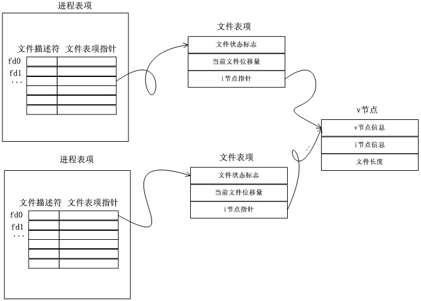

`fork()` 之前打开文件，子进程是共享父进程的文件表项

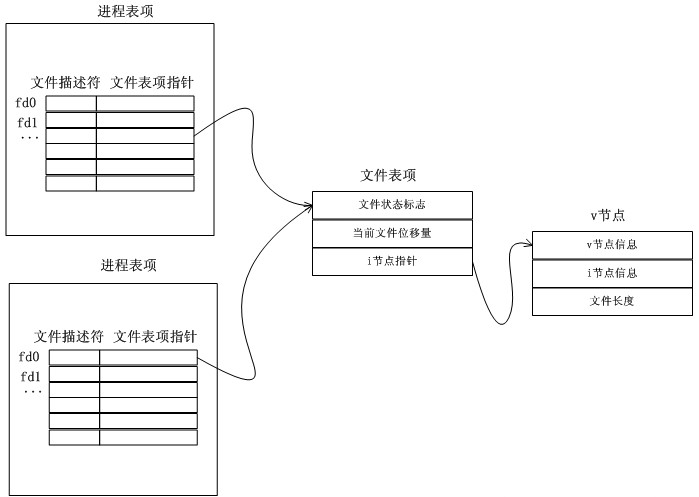

进程调用 `fork()` 后，子进程和父进程的文件描述符所对应的文件表项是共享的，这意味着子进程对文件的读写直接影响父进程的文件位移量(反之同理)

## 死锁

死锁是指两个或两个以上进程在执行过程中，因争夺资源而造成的下相互等待的现象

死锁发生的四个必要条件：

- 互斥条件：进程对所分配到的资源不允许其他进程访问，若其他进程访问该资源，只能等待，直至占有该资源的进程使用完成后释放该资源

- 请求和保持条件：进程获得一定的资源后，又对其他资源发出请求，但是该资源可能被其他进程占有，此时请求阻塞，但该进程不会释放自己已经占有的资源

- 不可剥夺条件：进程已获得的资源，在未完成使用之前，不可被剥夺，只能在使用后自己释放

- 环路等待条件：进程发生死锁后，必然存在一个进程-资源之间的环形链

解决方法：

- 资源一次性分配，从而剥夺请求和保持条件

- 可剥夺资源：即当进程新的资源未得到满足时，释放已占有的资源，从而破坏不可剥夺的条件

- 资源有序分配法：系统给每类资源赋予一个序号，每个进程按编号递增的请求资源，释放则相反

## 银行家算法

操作系统按照银行家制定的规则为进程分配资源：

- 当进程首次申请资源时，要测试该线程对资源的最大需求量，如果系统现存的资源可以满足它的最大需求量则按当前的申请量分配资源，否则就推迟分配

- 当线程在执行中继续申请资源时，先测试该线程已占用的资源数与本次申请的资源数之和是否超过了该线程对资源的最大需求量，若超过则拒绝分配资源，若没有超过则再测试系统现存的资源能否满足该进程尚需的最大资源量，若能满足则按当前的申请量分配资源，否则也要推迟分配
