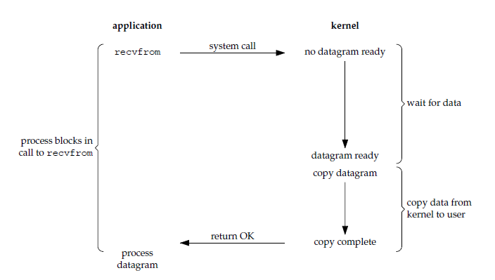
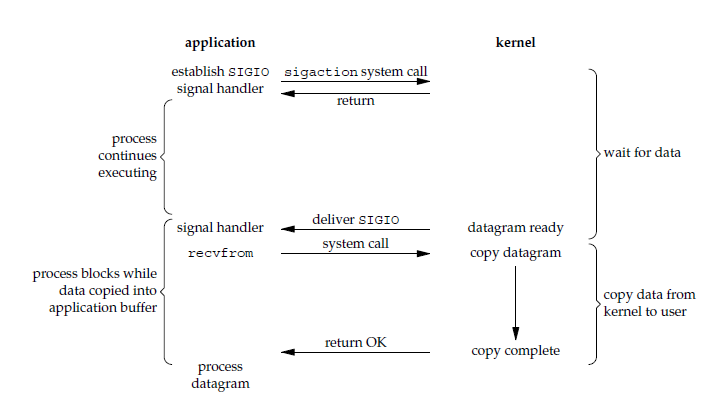
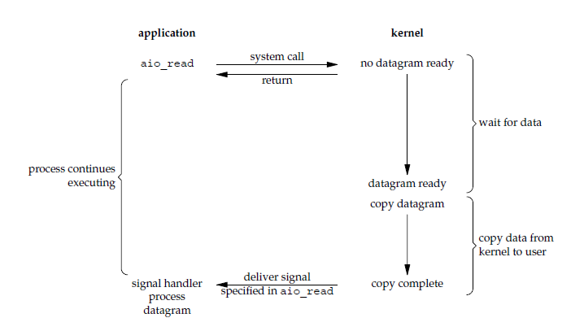

# I/O 模型

一个输入操作通常包括两个阶段：

1. 等待数据准备好

2. 从内核向进程复制数据

对于一个套接字上的输入操作，第一步通常涉及等待数据从网络中到达。当所等待数据到达时，它被复制到内核中的某个缓冲区。第二步就是把数据从内核缓冲区复制到应用进程缓冲区

```cpp
/*
1、输入操作：read、readv、recv、recvfrom、recvmsg 共 5 个函数，如果是阻塞状态，则会在 wait data 和 copy data 两个阶段阻塞，如果设置为非阻塞则在 wait 不到 data 时抛出异常

2、输出操作：write、writev、send、sendto、sendmsg 共 5 个函数，在发送缓冲区满了会阻塞在原地，如果设置为非阻塞，则会抛出异常

3、接收外来链接：accept，与输入操作类似

4、发起外出链接：connect，与输出操作类似
*/
```

## 同步阻塞式 I/O

应用进程被阻塞，直到数据从内核缓冲区复制到应用进程缓冲区中才返回

在阻塞的过程中，其它应用进程还可以执行，因此阻塞不意味着整个操作系统都被阻塞

因为其它应用进程还可以执行，所以不消耗 CPU 时间，这种模型的 CPU 利用率会比较高

`recvfrom()` 用于接收 Socket 传来的数据，并复制到应用进程的缓冲区 buf 中



解决方案：服务器端使用多线程或多进程，让每个连接都拥有独立的线程或进程，但面对成千上万的连接请求，都会严重占据系统资源，降低系统对外界响应效率，而且线程和进程更容易进入假死状态

`connect(), accept(), send(), recv()` 默认都是同步阻塞模式

## 同步非阻塞式 I/O

应用进程执行系统调用之后，内核返回一个错误码。应用进程可以继续执行，但是需要不断的执行系统调用来获知 I/O 是否完成，这种方式称为轮询（polling）

因为应用进程在数据没有到达之前会不停查询，使 CPU 要处理更多的系统调用，因此这种模型的 CPU 利用率比较低


非阻塞 I/O 决不被推荐，虽然能够在等待任务完成的时间里干其他活，但轮询将推高 CPU 占用，同时任务完成的响应延迟增大了，因为任务会在轮询间隔之间的任意时间完成，降低整体数据吞吐量

## I/O 复用

在同步非阻塞 I/O 中，`recv()` 更多的是起到检测的作用，而操作系统提供了更为高效的检测操作是否完成接口，同时接口可以一次检测多个连接是否活跃

使用 select 或者 poll 等待数据，并且可以等待多个套接字中的任何一个变为可读。这一过程会被阻塞，当某一个套接字可读时返回，之后再使用 recvfrom 把数据从内核复制到进程中

它可以让单个进程具有处理多个 I/O 事件的能力。又被称为 Event Driven I/O，即事件驱动 I/O

如果一个 Web 服务器没有 I/O 复用，那么每一个 Socket 连接都需要创建一个线程去处理。如果同时有几万个连接，那么就需要创建相同数量的线程。相比于多进程和多线程技术，I/O 复用不需要进程线程创建和切换的开销，系统开销更小

这种模型中，使用非阻塞 I/O，然后使用阻塞 select，用 select 来管理多个 I/O，当没有数据时 select 阻塞，如果在超时时间内数据到来则 select 返回，再调用 recv 进行数据的复制，recv 返回后处理数据


当用户调用 select，整个进程会被阻塞，当 select 负责的 socket 数据准备好了 select 便会返回，整个过程和阻塞 I/O 并没有太大的不同，其实要更差一些，因为使用了两个系统调用（select 和 recvfrom），但 select 的优势在于可以同时处理多个连接

如果处理的连接数不是很高的话，使用 I/O 复用不一定比使用多线程阻塞 I/O 性能更好，可能延迟更高，I/O 复用的优势在于能处理更多的连接

## 信号驱动 I/O

应用进程使用 sigaction 系统调用，内核立即返回，应用进程可以继续执行，也就是说等待数据阶段应用进程是非阻塞的。内核在数据到达时向应用进程发送 SIGIO 信号，应用进程收到之后在信号处理程序中调用 recvfrom 将数据从内核复制到应用进程中

相比于非阻塞式 I/O 的轮询方式，信号驱动 I/O 的 CPU 利用率更高



## 异步 I/O（非阻塞）

应用进程执行 aio_read 系统调用会立即返回，应用进程可以继续执行，不会被阻塞，内核会在所有操作完成之后向应用进程发送信号

异步 I/O 与信号驱动 I/O 的区别在于，异步 I/O 的信号是通知应用进程 I/O 完成，而信号驱动 I/O 的信号是通知应用进程可以开始 I/O



## I/O 模型比较

- 同步 I/O：将数据从内核缓冲区复制到应用进程缓冲区的阶段（第二阶段），应用进程会阻塞

- 异步 I/O：第二阶段应用进程不会阻塞

同步 I/O 包括阻塞式 I/O、非阻塞式 I/O、I/O 复用和信号驱动 I/O ，它们的主要区别在第一个阶段

非阻塞式 I/O 、信号驱动 I/O 和异步 I/O 在第一阶段不会阻塞


## I/O 复用

select/poll/epoll 都是 I/O 多路复用的具体实现，select 出现的最早，之后是 poll，再是 epoll

### select

`select()` 将监听的文件描述符分为三组，每一组监听不同的需要进行的 IO 操作

readfds 是需要进行读操作的文件描述符，writefds 是需要进行写操作的文件描述符，exceptfds 是需要进行异常事件处理的文件描述符

```cpp
#include <sys/select.h>
int select(int n, fd_set *readfds, fd_set *writefds, fd_set *exceptfds, struct timeval *timeout);

struct timeval {
    long tv_sec;  // second
    long tv_usec;  // microsecond
}
/*
fd_set 使用数组实现，数组大小使用 FD_SETSIZE 定义，所以只能监听少于 FD_SETSIZE 数量的描述符

readset、writeset、exceptset，分别对应读、写、异常条件的描述符集合

timeout 为超时参数，调用 select 会一直阻塞直到有描述符的事件到达或者等待的时间超过 timeout

timeout 为空时表示永不超时，超时之后 timeout 参数都会被置 0

成功调用返回结果大于 0，出错返回结果为 -1，超时返回结果为 0
*/

void FD_ZERO(fd_set *fdset);  
void FD_SET(int fd, fd_set *fdset);
void FD_CLR(int fd, fd_set *fdset);
int FD_ISSET(int fd,fd_set *fdset);
/*
FD_ZERO：指定的文件描述符集清空，在对文件描述符集合进行设置前，必须对其进行初始化，如果不清空，由于在系统分配内存空间后，通常并不作清空处理，所以结果是不可知的

FD_SET：用于在文件描述符集合中增加一个新的文件描述符

FD_CLR：用于在文件描述符集合中删除一个文件描述符

FD_ISSET：用于测试指定的文件描述符是否在该集合中
*/

fd_set fd_in, fd_out;
struct timeval tv;

// Reset the sets
FD_ZERO( &fd_in );
FD_ZERO( &fd_out );

// Monitor sock1 for input events
FD_SET( sock1, &fd_in );

// Monitor sock2 for output events
FD_SET( sock2, &fd_out );

// Find out which socket has the largest numeric value as select requires it
int largest_sock = sock1 > sock2 ? sock1 : sock2;

// Wait up to 10 seconds
tv.tv_sec = 10;
tv.tv_usec = 0;

// Call the select
int ret = select( largest_sock + 1, &fd_in, &fd_out, NULL, &tv );

// Check if select actually succeed
if ( ret == -1 )
    // report error and abort
else if ( ret == 0 )
    // timeout; no event detected
else
{
    if ( FD_ISSET( sock1, &fd_in ) )
        // input event on sock1

    if ( FD_ISSET( sock2, &fd_out ) )
        // output event on sock2
}
```

select 允许应用程序监视一组文件描述符，等待一个或者多个描述符成为就绪状态，从而完成 I/O 操作

select 监控的 fd 有上限，取决于 `sizeof(fd_set)` 的大小

将 fd 加入 select 监控集的同时，还要再使用一个 array 保存放到 select 监控集中的 fd，一是用于当 select 返回后需要 array 作为源数据和 fd_set 进行 FD_ISSET 判断；二是 select 返回后会把以前加入的但并无事件发生的 fd 清空，则每次开始 select 前都要重新从 array 取得 fd 逐一加入（FD_ZERO 最先），扫描 array 的同时取得 fd 最大值 maxfd，用于 select 的第一个参数

当套接字比较多的时候，每次 `select()` 都要通过遍历 FD_SETSIZE 个 socket 来完成调度，不管哪个 socket 是活跃的，都遍历一遍

### poll

poll 的功能与 select 类似，也是等待一组描述符中的一个成为就绪状态

poll 中的描述符只有一个 pollfd 数组，数组中的每个元素都表示一个需要监听 IO 操作事件的文件描述符

```cpp
#include <poll.h>
int poll(struct pollfd *fds, unsigned int nfds, int timeout);

struct pollfd {
    int fd;         /* file descriptor */
    short events;     /* requested events */
    short revents;    /* returned events */
};
/*
合法事件：
POLLIN              有数据可读
POLLRDNORM          有普通数据可读
POLLRDBAND          有优先数据可读
POLLPRI             有紧迫数据可读

POLLOUT             写数据不会导致阻塞
POLLWRNORM          写普通数据不会导致阻塞
POLLWRBAND          写优先数据不会导致阻塞
POLLMSG SIGPOLL     消息可用

revents 域中还可能返回事件:
POLLER              指定的文件描述符发生错误
POLLHUP             指定的文件描述符挂起事件
POLLNVAL            指定的文件描述符非法

POLLIN | POLLPRI 等价于 select() 的读事件
POLLOUT |POLLWRBAND 等价于 select() 的写事件
POLLIN 等价于 POLLRDNORM |POLLRDBAND
POLLOUT 则等价于 POLLWRNORM
*/


// The structure for two events
struct pollfd fds[2];

// Monitor sock1 for input
fds[0].fd = sock1;
fds[0].events = POLLIN;

// Monitor sock2 for output
fds[1].fd = sock2;
fds[1].events = POLLOUT;

// Wait 10 seconds
int ret = poll( &fds, 2, 10000 );
// Check if poll actually succeed
if ( ret == -1 )
    // report error and abort
else if ( ret == 0 )
    // timeout; no event detected
else
{
    // If we detect the event, zero it out so we can reuse the structure
    if ( fds[0].revents & POLLIN )
        fds[0].revents = 0;
        // input event on sock1

    if ( fds[1].revents & POLLOUT )
        fds[1].revents = 0;
        // output event on sock2
}
```

没有最大连接数的限制，原因是它是基于链表来存储的

### select 和 poll 比较

- `select()` 会修改描述符，而 `poll()` 不会（`select()` 之前需要使用 `FD_ZERO()`、`FD_SET()`、`FD_CLR()`、`FD_ISSET()`）

- `select()` 的描述符类型使用数组实现，FD_SETSIZE 大小默认为 1024，因此默认只能监听少于 1024 个描述符。如果要监听更多描述符的话，需要修改 FD_SETSIZE 之后重新编译；而 `poll()` 没有描述符数量的限制

- `poll()` 提供了更多的事件类型，并且对描述符的重复利用上比 `select()` 高

- 如果一个线程对某个描述符调用了 `select()` 或者 `poll()`，另一个线程关闭了该描述符，会导致调用结果不确定

- `select()` 和 `poll()` 速度都比较慢，每次调用都需要将全部描述符从应用进程缓冲区复制到内核缓冲区，且都需要遍历 fd 来获取就绪的 socket

- 几乎所有的系统都支持 `select()`，但是只有比较新的系统支持 `poll()`

### epoll

epoll 仅适用于 Linux OS

epoll 比 select 和 poll 更加灵活而且没有描述符数量限制

epoll 对多线程编程更有友好，一个线程调用了 `epoll_wait()` 另一个线程关闭了同一个描述符也不会产生像 `select()` 和 `poll()` 的不确定情况

`epoll()` 分清了频繁调用和不频繁调用的操作，`epoll_wait()` 是非常频繁调用的，而 `epoll_ctl()` 是不太频繁调用的，不会随着并发连接的增加使得入参越发多起来，导致内核执行效率下降。

```cpp
#include <sys/epoll.h>

// 创造 epoll fd
// size 大于 0 即可
// 失败返回 -1
int epoll_create(int size);

// 注册监听事件
// op 表示对 fd 操作类型
// EPOLL_CTL_ADD（注册新的 fd 到 epfd 中）
// EPOLL_CTL_MOD（修改已注册的 fd 的监听事件）
// EPOLL_CTL_DEL（从 epfd 中删除一个 fd）

int epoll_ctl(int epfd, int op, int fd, struct epoll_event *event);

// 等待事件的就绪，成功时返回就绪的事件数目，调用失败时返回 -1，等待超时返回 0
// events 用来从内核得到就绪事件的集合
// maxevents 告诉内核这个 events 有多大
// timeout 表示等待时的超时时间，以毫秒为单位
// 返回值是有事件发生的 fd 数目
int epoll_wait(int epfd, struct epoll_event * events, int maxevents, int timeout);

struct epoll_events {
    __uint32_t events;  // epoll event
    epoll_data_t data;  // user data variable
}

union epoll_data_t {
    void ptr;
    int fd;
    __uint32_t u32;
    __uint64_t u64;
}
/*
epoll_event 被用于注册所感兴趣的事件和回传所发生待处理的事件，其中 epoll_data 联合体用来保存触发事件的某个文件描述符相关的数据

events 字段是表示感兴趣的事件和被触发的事件可能的取值为：
EPOLLIN ：表示对应的文件描述符可以读；
EPOLLOUT：表示对应的文件描述符可以写；
EPOLLPRI：表示对应的文件描述符有紧急的数据可读
EPOLLERR：表示对应的文件描述符发生错误；
EPOLLHUP：表示对应的文件描述符被挂断；
EPOLLET：表示对应的文件描述符设定为edge模式；
EPOLLONESHOT：最多触发其上注册的一个可读、可写、或者异常事件，且只触发一次，使一个 socket 连接任何时刻都只被一个线程所处理，注册了 EPOLLONESHOT 事件的 socket 一旦被某个线程处理完毕，该线程就应该立即重置这个 socket 上的 EPOLLONESHOT 事件，以确保这个 socket 下一次可读

EPOLLET 通过与其他事件取或运算，使该事件成为边缘触发模式
*/

// Create the epoll descriptor. Only one is needed per app, and is used to monitor all sockets.
// The function argument is ignored (it was not before, but now it is), so put your favorite number here
int pollingfd = epoll_create( 0xCAFE );

if ( pollingfd < 0 )
// report error

// Initialize the epoll structure in case more members are added in future
struct epoll_event ev = { 0 };

// Associate the connection class instance with the event. You can associate anything
// you want, epoll does not use this information. We store a connection class pointer, pConnection1
ev.data.ptr = pConnection1;

// Monitor for input, and do not automatically rearm the descriptor after the event
ev.events = EPOLLIN | EPOLLONESHOT;
// Add the descriptor into the monitoring list. We can do it even if another thread is
// waiting in epoll_wait - the descriptor will be properly added
if ( epoll_ctl( epollfd, EPOLL_CTL_ADD, pConnection1->getSocket(), &ev ) != 0 )
// report error

// Wait for up to 20 events (assuming we have added maybe 200 sockets before that it may happen)
struct epoll_event pevents[ 20 ];

// Wait for 10 seconds, and retrieve less than 20 epoll_event and store them into epoll_event array
int ret = epoll_wait( pollingfd, pevents, 20, 10000 );
// Check if epoll actually succeed
if ( ret == -1 )
// report error and abort
else if ( ret == 0 )
// timeout; no event detected
else
{
    // Check if any events detected
    for ( int i = 0; i < ret; i++ )
    {
        if ( pevents[i].events & EPOLLIN )
        {
            // Get back our connection pointer
            Connection * c = (Connection*) pevents[i].data.ptr;
            c->handleReadEvent();
         }
    }
}
```

`epoll_ctl()` 用于向内核注册新的描述符或者是改变某个文件描述符的状态。已注册的描述符在内核中会被维护在一棵红黑树上，通过回调函数内核会将 I/O 准备好的描述符加入到一个链表中管理，进程调用 `epoll_wait()` 便可以得到事件完成的描述符

epoll 使用 mmap 减少复制开销，内核可以直接看到 epoll 监听的句柄，效率高

epoll 将用户关系的文件描述符的事件存放到内核的一个事件表中，因此只需要将描述符从进程缓冲区向内核缓冲区拷贝一次，并且进程不需要通过轮询来获得事件完成的描述符

要在内核中长久的维护一个数据结构来存放文件描述符，并且时常会有插入、查找和删除的操作发生，会对内核产生不小的影响，因此需要一种插入、查找和删除效率都不错的数据结构来存放这些文件描述符，因此选择红黑树存储文件描述符

在红黑树中排序的根据是 epoll_filefd 的地址大小

### epoll 工作模式

epoll 的描述符事件有两种触发模式：LT（level trigger）和 ET（edge trigger）

- LT：默认的一种模式，当 `epoll_wait()` 检测到描述符事件到达时，将此事件通知进程，进程可以不立即处理该事件，下次调用 `epoll_wait()` 会再次通知进程；支持阻塞 socket 和非阻塞 socket

- ET：通知之后进程必须立即处理事件，如果不处理，则下次再调用  `epoll_wait()` 时不会再得到事件到达的通知，很大程度上减少了 epoll 事件被重复触发的次数，因此效率要比 LT 模式高；内核会假设进程知道文件描述符已经就绪，并且不会再为那个文件描述符发送更多的就绪通知，直到进程做了某些操作导致那个文件描述符不再为就绪状态；只支持非阻塞 socket

- LT 模式下，读事件触发后，可以按需收取想要的字节数，不用把本次接收到的数据收取干净，当数据未接受完时读事件仍会触发；ET 模式下，读事件必须把数据收取干净，因为不一定有下一次机会再收取数据了，即使有机会，也可能存在上次没读完的数据没有及时处理，造成客户端响应延迟，即需要循环到 recv 或者 read 函数返回 -1，错误码为 EWOULDBLOCK 或 EAGAIN，因此需搭配非阻塞 socket 使用

- LT 模式下，不需要写事件一定要及时移除，避免不必要的触发，浪费 CPU 资源；ET 模式下，写事件触发后，如果还需要下一次的写事件触发来驱动任务（例如发上次剩余的数据），可继续注册一次检测可写事件


### 应用场景

- select 的 timeout 参数精度为微秒，而 poll 和 epoll 为毫秒，因此 select 更加适用于实时性要求比较高的场景；select 可移植性更好，几乎被所有主流平台所支持

- poll 没有最大描述符数量的限制，如果平台支持并且对实时性要求不高，应该使用 poll 而不是 select

- 只需要运行在 Linux 平台上，有大量的描述符需要同时轮询，并且这些连接最好是长连接；需要同时监控小于 1000 个描述符，就没有必要使用 epoll，因为这个应用场景下并不能体现 epoll 的优势；需要监控的描述符状态变化多，而且都是非常短暂的，也没有必要使用 epoll，因为 epoll 中的所有描述符都存储在内核中，造成每次需要对描述符的状态改变都需要通过 `epoll_ctl()` 进行系统调用，频繁系统调用降低效率。并且 epoll 的描述符存储在内核，不容易调试

