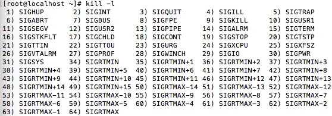

# 信号

每个信号都有一个编号和一个宏定义名称，所有的信号都由操作系统来发



## 分类

前 32 种信号为不可靠信号，后 32 种为可靠信号

- 可靠信号：实时信号，支持排队，信号不会丢失，发多少次就可以收到多少次

- 不可靠信号：非实时信号，不支持排队，信号可能会丢失，比如发送多次相同的信号，进程只能收到一次

## 产生方式

- 用户输入：比如在终端上按下组合键 ctrl + c，产生 SIGINT 信号

- 硬件异常：CPU 检测到内存非法访问等异常，通知内核生成相应信号，并发送给发生事件的进程

- 系统调用：`kill()`，`raise()`，`sigqueue()`，`alarm()`，`setitimer()`，`abort()` 等

1. ctrl + c 产生 SIGINT 信号

2. ctrl + - 产生 SIGQUIT 信号

## 注册和注销

### 注册

在进程 PCB 的 task_struct 结构体中有一个未决信号的成员变量 struct sigpending pending，每个信号在进程中注册都会把信号值加入到进程的未决信号集

- 每个信号在进程中注册都会把信号值加入到进程的未决信号集

- 实时信号发送给进程时，不管该信号是否在进程中注册过，都会再次注册，故信号不会丢失

- 非实时信号发送给进程时，如果该信息已经在进程中注册过，不会再次注册，故信号会丢失

### 注销

- 非实时信号：不可重复注册，最多只有一个 sigqueue 结构，当该结构被释放后把该信号从进程未决信号集中删除，则信号注销完毕

- 实时信号：可重复注册，可能存在多个 sigqueue 结构；当该信号的所有 sigqueue 处理完毕后，把该信号从进程未决信号集中删除，则信号注销完毕

## 处理方法

- 忽略此信号：大多数信号都可使用这种方式进行处理，但有两种信号却决不能被忽略，分别是：SIGKILL 和 SIGSTOP

- 直接执行进程对于该信号的默认动作 ：对大多数信号的系统默认动作是终止该进程

- 捕捉信号：执行自定义动作，需要通知内核在某种信号发生时，调用一个用户函数 handler，不能捕捉 SIGKILL 和 SIGSTOP 信号

## raise() 函数

向当前执行线程或进程发送信号，信号处理函数调用结束后返回

```cpp
int raise(int sig);
```

## kill() 函数

向指定进程发送信号

```cpp
#include <sys/types.h>
#include <signal.h>

int kill(pid_t pid, int sig);
/*
sig == 0：执行错误检查，信号不会发送，用来检查 pid 是否有效

pid > 0：将发送个该 pid 的进程
pid == 0：将会把信号发送给与发送进程属于同一进程组的所有进程
pid < 0：将信号发送给进程组ID 为 pid 绝对值的所有组内进程
pid == -1：将该信号发送给有权限发送信号的所有进程
*/
```

## alarm() 函数

```cpp
unsigned alarm(unsigned seconds);
/*
在指定 seconds 之后发送 SIGALRM 信号
seconds == 0 表示取消之前的定时器请求
seconds > 0 表示取消之前的定时器请求并重置为 seconds
*/
```

## signal() 函数

不支持信号传递信息，主要用于非实时信号安装

```cpp
#include <signal.h>
typedef void( *sighandler_t)(int);
sighandler_t signal(int signum, sighandler_t handler);
// 绑定失败返回 SIG_ERR

// 信号标号为signum


void handler(int sig) {
    printf("get a sig,num is %d\n",sig);
}
 
int main() {
    signal(2,handler);
    while(1) {
        sleep(1);
        printf("hello\n");
    }
    return 0;
}
```

## sigaction() 函数

支持信号传递信息，可用于所有信号安装

```cpp
struct sigaction {
    // 信号处理程序，不接受额外数据，SIG_IGN 为忽略，SIG_DFL 为默认动作
    void (*sa_handler)(int);  

    // 信号处理程序，能够接受额外数据和 sigqueue 配合使用
    void (*sa_sigaction)(int, siginfo_t *, void *);

    // 指定一个信号集，在调用信号处理函数之前，该信号集将被加入到进程的信号屏蔽字中
    // 设置在其的信号集中的信号，会在捕捉函数调用前设置为阻塞
    // 信号屏蔽字是指当前被阻塞的一组信号，它们不能被当前进程接收到
    // 缺省情况下当前信号本身被阻塞，防止信号的嵌套发送
    sigset_t sa_mask;

    // 设置为 SA_SIGINFO 属性时，说明了信号处理程序带有附加信息
    // 会调用 sa_sigaction 这个函数指针所指向的信号处理函数
    // 否则系统会默认使用 sa_handler 所指向的信号处理函数
    int sa_flags;
}
// sa_sigaction 和 sa_handler 使用的是同一块内存空间，
// 相当于 union，所以只能设置其中的一个，不能两个都同时设置

// siginfo_t 携带了数据值
struct siginfo_t { 
    int      si_signo;   // 信号编号 
    int      si_errno;   // 如果为非零值则错误代码与之关联 
    int      si_code;    // 说明进程如何接收信号以及从何处收到 
    pid_t    si_pid;     // 适用于 SIGCHLD，代表被终止进程的 PID 
    pid_t    si_uid;     // 适用于 SIGCHLD，代表被终止进程所拥有进程的 UID 
    int      si_status;  // 适用于 SIGCHLD，代表被终止进程的状态 
    clock_t  si_utime;   // 适用于 SIGCHLD，代表被终止进程所消耗的用户时间 
    clock_t  si_stime;   // 适用于 SIGCHLD，代表被终止进程所消耗系统的时间 

    sigval_t si_value; 
    int si_int; 
    void * si_ptr; 
    void* si_addr; 
    int si_band; 
    int si_fd; 
};

int sigaction(int signum, const struct sigaction *act, struct sigaction *oldact)
// signum：要操作的 signal 信号
// act：设置对 signal 信号的新处理方式
// oldact：原来对信号的处理方式，用来做备份
// 返回值：0 表示成功，-1 表示有错误发生
```

## sigqueue() 函数

`sigqueue()` 只能向一个进程发送信号，而不能发送信号给一个进程组

```cpp
#include <sys/types.h>
#include <signal.h>

int sigqueue(pid_t pid, int sig, const union sigval val);
// pid 指定接收信号的进程 ID
// sig 确定即将发送的信号
// val 指定信号传递的参数

typedef union sigval {
    int  sival_int;
    void *sival_ptr;
}sigval_t;

/*
调用 sigqueue() 时，sigval_t 指定的信息会拷贝到对应 sig 注册的 3 参数信号处理函数的 siginfo_t 结构中，这样信号处理函数就可以处理这些信息了
*/
```


## 信号集函数

```cpp
// 将信号集初始化为空
int sigemptyset(sigset_t *set);

// 把信号集初始化包含所有已定义的信号
int sigfillset(sigset_t *set);

// 把信号 signo 添加到信号集 set 中，成功时返回 0，失败时返回 -1
int sigaddset(sigset_t *set, int signo);

// 把信号 signo 从信号集 set 中删除，成功时返回 0，失败时返回 -1
int sigdelset(sigset_t *set, int signo);

// 判断给定的信号 signo 是否是信号集中的一个成员
// 是返回 1，不是返回 0，无效返回 -1
int sigismember(sigset_t *set, int signo);

// 根据参数指定的方法修改进程的信号屏蔽字
// 新的信号屏蔽字由参数 set（非空）指定
// 原先的信号屏蔽字将保存在 oset（非空）中
// 成功完成返回 0，如果 how 取值无效返回 -1
int sigpromask(int how, const sigset_t *set, sigset_t *oset);
// how = SIG_BLOCK set 中的信号添加进屏蔽字中
// how = SIG_SETMASK 屏蔽字设置为 set
// how = SIG_UNBLOCK  屏蔽字删除 set
```