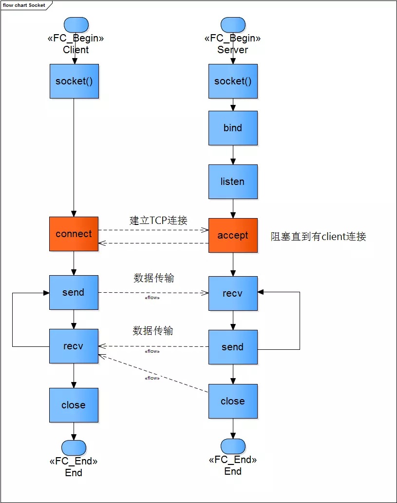
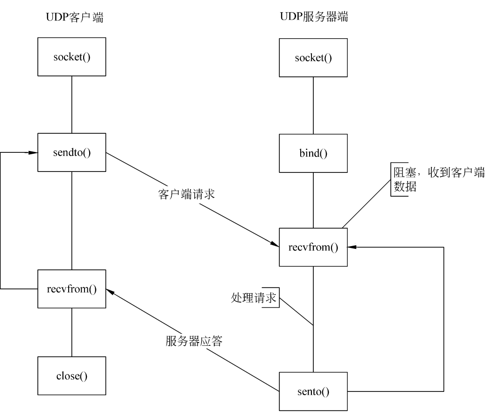
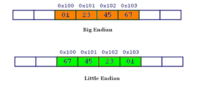
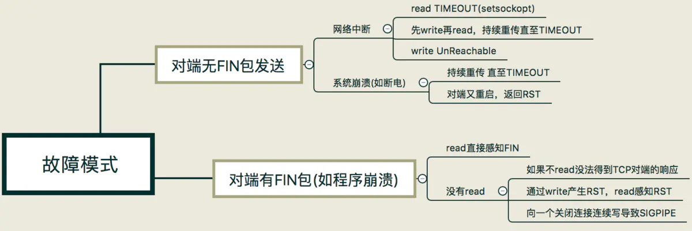

# Socket

## socket 套接字

Unix/Linux 基本哲学之一就是一切皆文件，都可以用 open –> write/read –> close 模式来操作

socket 即是一种特殊的文件，一些 socket 函数就是对其进行的操作（读/写 IO、打开、关闭）

### 套接字描述符

套接字描述符是一个整数，我们最熟悉的句柄是 0、1、2 三个，0是标准输入，1是标准输出，2是标准错误输出，分别对应 FILE* 结构 stdin、stdout、stderr

当应用程序要创建一个套接字时，操作系统就返回一个小整数作为描述符来标识这个套接字，应用程序则使用这个描述符作为传递参数，通过调用函数来完成操作

应用程序只需记住这个描述符，并在以后操作该文件时使用它

系统为每个运行的进程维护一张单独的文件描述符表，当进程打开一个文件时，系统把一个指向此文件内部数据结构的指针写入文件描述符表，并把该表的索引值返回给调用者

### 工作流程

- tcp 



- udp



## 核心函数

### socket()

`socket()` 用于创建一个 socket 描述符，它唯一标识一个 socket

```cpp
int socket(int domain, int type, int protocol);  //返回sockfd(描述符))

/*
domain: 即协议域，协议族决定了 socket 的地址类型，在通信中必须采用对应的地址，如 AF_INET 决定了要用 ipv4 地址（32 位的）与端口号（16 位的）的组合、AF_UNIX 决定了要用一个绝对路径名作为地址

type: 指定socket类型

protocol: 指定协议，为 0 时会自动选择 type 类型对应的默认协议

type 和 protocol 不可以随意组合的
*/
```

domain|说明|
-|-|
AF_INET|IPv4
AF_INET6|IPv6
AF_LOCAL|Unix 域协议
AF_ROUTE|路由套接字
AF_KEY|秘钥套接字

type|说明|
-|-|
SOCK_STREAM|字节流套接字
SOCK_DGRAM|数据包套接字
SOCK_SEQPACKET|有序分组套接字
SOCK_RAW|原始套接字

protocol|说明|
-|-|
IPPROTO_TCP|TCP
IPPROTO_UDP|UDP
IPPROTO_SCTP|SCIP
IPPROTO_TIPC|TIPC

### bind()

调用 `socket()` 创建一个 socket 时，返回的 socket 描述符，但没有一个具体的地址；给它赋值一个地址，就必须调用 `bind()` 函数，否则就当调用 `connect()`、`listen()` 时系统会自动随机分配一个端口

`bind()` 通过传递进来的文件描述符找到对应的 socket 结构，把一个地址族中的特定地址赋给 socket，也可以说是绑定 ip 端口和 socket

```cpp
int bind(int sockfd, const struct sockaddr *addr, socklen_t addrlen);

/*
addr: 一个 const struct sockaddr * 指针，指向要绑定给 sockfd 的协议地址，根据创建 socket 时的地址协议族的不同而不同
ipv4: sockaddr_in
ipv6: sockaddr_in6
unix: sockaddr_un

addrlen：对应的是地址的长度

addr 创建时先
*/

#include <netinet/in.h>
struct sockaddr {
    unsigned short    sa_family;    // 2 bytes address family, AF_xxx
    char              sa_data[14];     // 14 bytes of protocol address
};

// sockaddr_in 把 port 和 addr 分开存储
// sin_port 和 sin_addr 必须是 NBO
struct sockaddr_in {
    short            sin_family;       // 2 bytes e.g. AF_INET, AF_INET6
    unsigned short   sin_port;    // 2 bytes e.g. htons(3490)
    struct in_addr   sin_addr;     // 4 bytes see struct in_addr, below
    char             sin_zero[8];     // 8 bytes zero this if you want to
};

struct in_addr {
    unsigned long s_addr;          // 4 bytes load with inet_aton()
};

/*
sockaddr 和 sockaddr_in 两个结构体一样大，都是16个字节，而且都有family属性
sckaddr 和 sockaddr_in 包含的数据都是一样的，但他们在使用上有区别：sockaddr 是给操作系统用的，程序员应使用  sockaddr_in 来表示地址，sockaddr_in 区分了地址和端口，使用更方便
*/

#include <arpa/inet.h>
// 将字符串点数格式地址转化成无符号长整型，返回值型
int inet_addr(const char * server_addr);
// 将字符串点数格式地址转化成 NBO，指针型
int inet_aton(const char * server_addr, struct in_addr * a);  
// 将 NBO 地址转化成字符串点数格式
char * inet_ntoa(sockaddr_in.sin_addr addr);  
// 将 NBO 地址转化成 IPv4 或 IPv6 字符串点数格式
char * inet_ntop(int af, const void * src, char * dst, socklen_t size);  
```

通常服务器在启动的时候都会绑定一个众所周知的地址（如 ip 地址+端口号），用于提供服务，客户就可以通过它来接连服务器；而客户端就不用指定，有系统自动分配一个端口号和自身的 ip 地址组合。这就是为什么通常服务器端在 listen 之前会调用 `bind()`，而客户端就不会调用，而是在 `connect()` 时由系统随机生成一个

### listen()

和 `listen()` 相关的大部分信息存储在 inet_connection_sock 结构中

在创建套接字的时候使用了 `socket()` 函数，它创建的套接字是主动套接字，`listen()` 函数的功能就是通过这个将主动套接字，变成被动套接字，告诉内核应该接受指向这个套接字的请求, CLOSED 状态变成 LISTEN 状态

```cpp
int listen(int sockfd, int backlog);

// backlog：已建立连接未 accept 的最大连接数

struct inet_connection_sock {
   /* inet_sock has to be the first member! */
   struct inet_sock      icsk_inet;
   struct request_sock_queue icsk_accept_queue;
   struct inet_bind_bucket   *icsk_bind_hash;
   //....省略后面的代码
}

/*
icsk_accept_queue 规定了内核要为该套接字排队的最大连接个数
*/
```

### accept()

创建新的 struct socket 表示新的连接

如果 `accept()` 成功返回，则服务器与客户已经正确建立连接了，此时服务器通过 accept 返回的套接字来完成与客户的通信

```cpp
#include <sys/types.h>
#include <sys/socket.h>
int accept(int sockfd, struct sockaddr *addr, socklen_t *addrlen);

/*
第一个参数为 socket 创建的监听套接字，返回的是已连接套接字，两个套接字是有区别的；创建的监听套接字一般服务器只创建一个，并且一直存在；内核会为每一个服务器进程的客户连接建立一个连接套接字，当服务器完成对某个给定客户的服务时，连接套接字就会被关闭

addr 用来接受一个返回值，这返回值指定客户端的地址

addrlen 用来接受 addr 的结构的大小的，它指明 addr 结构所占有的字节个数

如果第二三个参数为空，代表了对客户的身份不感兴趣，因此置为 NULL
*/
```

 `accept()` 默认会阻塞进程，直到有一个客户连接建立后返回，它返回的是一个新可用的套接字，这个套接字是连接套接字

### connect()

客户端通过调用 `connect()`函数来建立与 TCP 服务器的连接

```cpp
int connect(int sockfd, const struct sockaddr *addr, socklen_t addrlen);

/*
addr：服务器的 socket 地址
addrlen：socket 地址的长度
*/
```

### close()

`close()` 一个 socket 的缺省行为时把该 socket 标记为已关闭，然后立即返回到调用进程。该描述字不能再由调用进程使用，也就是说不能再作为 read 或 write 的第一个参数

```cpp
#include <unistd.h>
int close(int fd);
```

close 操作只是使相应 socket 描述字的引用计数 -1，只有当引用计数为 0 的时候，才会触发 TCP 客户端向服务器发送终止连接请求

### shutdown()

```cpp
int shutdown(int sockfd, int how);

/*
how 取值：

SHUT_RD(0)：关闭 sockfd 上的读功能，此选项将不允许 sockfd 进行读操作；该套接字不再接受数据，任何当前在套接字接受缓冲区的数据将被丢弃

SHUT_WR(1)：关闭 sockfd 的写功能，此选项将不允许 sockfd 进行写操作，即进程不能在对此套接字发出写操作

SHUT_RDWR(2)：关闭 sockfd 的读写功能，相当于调用 shutdown 两次，首先 SHUT_RD 然后 SHUT_WR

成功则返回 0，错误返回 -1
错误码 errno：EBADF 表示 sockfd 不是一个有效描述符；ENOTCONN 表示 sockfd 未连接
*/
```

`shutdown()` 的效果是累计的，不可逆转的。既如果关闭了一个方向数据传输，那么这个方向将会被关闭直至完全被关闭或删除，而不能重新被打开

### read()、write()

- read() / write()

- recv() / send()

- readv() / writev()

- recvmsg() / sendmsg()

- recvfrom() / sendto()

`recvmsg()`、`sendmsg()` 函数是最通用的 I/O 函数，实际上可以把上面的其它函数都替换成这两个函数

```cpp
// Linux 中最基本的读写函数，可以用于各种数据的读写
#include <unistd.h>

ssize_t read(int fd, void *buf, size_t count);
ssize_t write(int fd, const void *buf, size_t count);

/*
read() 函数是负责从 fd 中读取内容.当读成功时，read 返回实际所读的字节数，如果返回的值是 0 表示已经读到文件的结束了，小于 0 表示出现了错误

write() 函数将 buf 中的 n 字节内容写入文件描述符 fd.成功时返回写的字节数。失败时返回 -1

一般来说对于常规文件的读写不会阻塞，函数一定会在有限的时间内返回，但对于网络读取就不一定了，如果网络通信消息一直没有到达则函数剧一直阻塞等待

失败返回 -1


send() 原理：
1. send() 只负责将数据提交给协议层
2. send() 先比较待发送数据的长度 count 和套接字 fd 的发送缓存的长度
3. 如果 count 大于 fd 的发送缓存的长度，该函数返回 SOCKET_ERROR
4. 如果 count 小于或者等于 fd 的发送缓存的长度，那么 send() 先检查协议是否正在发送发送缓存中的数据
5. 如果正在发送数据，则等待数据发送完
6. 如果协议还没有在发送 fd 的发送缓冲中的数据或者 fd 的发送缓冲中没有数据，那么 send() 就比较 fd 的发送缓冲区的剩余空间和 count
7. 如果 count 大于剩余空间大小，send() 就一直等待协议把 fd 的发送缓冲中的数据发送完，如果 len 小于剩余空间大小，send() 就仅仅把 buf 中的数据 copy 到剩余空间里


recv() 原理：
1. recv() 仅仅是 copy 数据，真正的接收数据是协议来完成的
1. recv() 先检查套接字 fd 的接收缓冲区，如果 fd 接收缓冲区中没有数据或者协议正在接收数据，那么 recv() 就一直等待，直到协议把数据接收完毕
2. 当协议把数据接收完毕，recv() 就把 fd 的接收缓冲中的数据 copy 到 buf 中
3. 协议接收到的数据可能大于 buf 的长度，所以在这种情况下要调用几次 recv() 才能把 fd 的接收缓冲中的数据 copy 完

recv() 返回值
-1：发送时报错
0：对端关闭连接
>0：发送成功，返回发送的数据长度
*/

// 只用于 socket 的数据处理
#include <sys/types.h>
#include <sys/socket.h>

ssize_t send(int sockfd, const void *buf, size_t len, int flags);
ssize_t recv(int sockfd, void *buf, size_t len, int flags);

// sendto 和 recvfrom 用于 udp
ssize_t sendto(int sockfd, const void *buf, size_t len, int flags,
                const struct sockaddr *dest_addr, socklen_t addrlen);
ssize_t recvfrom(int sockfd, void *buf, size_t len, int flags,
                struct sockaddr *src_addr, socklen_t *addrlen);

ssize_t sendmsg(int sockfd, const struct msghdr *msg, int flags);
ssize_t recvmsg(int sockfd, struct msghdr *msg, int flags);

struct iovec {
    void    *iov_base;      /* starting address of buffer */
    size_t  iov_len;        /* size of buffer */
}

struct msghdr {
    void * msg_name;  /* protocol address */
    socklen_t msg_namelen;   /* sieze of protocol address */
    struct iovec * msg_iov;  /* scatter/gather array */
    int msg_iovlen;  /* # elements in msg_iov */
    void * msg_control;  /* ancillary data ( cmsghdr struct) */
    socklen_t msg_controllen;  /* length of ancillary data */
    int msg_flags;  /* flags returned by recvmsg() */
}
/*
msg_name, msg_namelen 用于未连接的套接字（主要是UDP），用来指定接受来源或发送目的地址，对于已连接的套接字课直接设置为 NULL 和 0

msg_iov, msg_iovlen 用于指定数据缓冲区数组，即 iovec 结构数组，缓冲区是个二维数组，每一维长度不是固定的，需要提前设置好这两项并且分配好内存
如果只是当存传送一个字符串，那只需要将 msg_iovlen 设置成1，然后将数据赋给 iov[0].iov_base 就行了

msg_control, msg_controllen 是用来设置辅助数据的位置和大小，可以用来返回关于数据报文的其他指定信息，不过需要通过 setsockopt 函数指定要返回的辅助信息
对于 sendmsg，这两项需要都设置成 0，否则会导致发送数据失败
*/

/* 
发送数据的长度超过 socket 缓冲区长度，则返回错误

flags 取值 0 或为下面值的组合
MSG_OOB(0x01)：不接受外带数据，某些协议将加速数据放置在普通数据队列的开头，因此该标志不能用于此类协议

MSG_PEEK(0x02)：从接收数据的开头返回数据，且不删除数据，因此，后续的调用将返回相同的数据

MSG_TRUNC(0x20)：返回数据包或数据报的实际长度，即使比传递的缓冲区长

MSG_DONTWAIT(0x40)：启用非阻塞操作

MSG_WAITALL(0x100)：请求块操作，未读取请求数目字节之前不返回
*/
```

- udp 客户端调用 `connect()` 函数：udp 客户端建立了 socket 后可以直接调用 `sendto()` 函数向服务器发送数据，但是需要在 `sendto()` 函数的参数中指定目的地址/端口，但是可以调用 `connect()` 函数先指明目的地址/端口，然后就可以使用 `send()` 函数向目的地址发送数据了，因为此时套接字已经包含目的地址/端口，也就是 `send()` 函数已经知道包含目的地址/端口

- udp 客户端程序使用 `bind()` 函数：udp 服务器调用了 `bind()` 函数为服务器套接字绑定本地地址/端口，这样使得客户端的能知道它发数据的目的地址/端口，服务器如果单单接收客户端的数据，或者先接收客户端的数据(此时通过 `recvfrom()` 函数获取到了客户端的地址信息/端口)再发送数据，客户端的套接字可以不绑定自身的地址/端口，因为 udp 在创建套接字后直接使用 `sendto()`，隐含操作是，在发送数据之前操作系统会为该套接字随机分配一个合适的 udp 端口，将该套接字和本地地址信息绑定。但是，如果服务器程序就绪后一上来就要发送数据给客户端，那么服务器就需要知道客户端的地址信息和端口，那么就不能让客户端的地址信息和端口号由客户端所在操作系统分配，而是要在客户端程序指定了

## socket 缓冲区

每个 socket 被创建后，都会分配两个缓冲区，输入缓冲区和输出缓冲区

`write()/send()` 并不立即向网络中传输数据，而是先将数据写入输出缓冲区中，再由 TCP 协议将数据从缓冲区发送到目标机器。一旦将数据写入到缓冲区，函数就可以成功返回，不管它们有没有到达目标机器，也不管它们何时被发送到网络，这些都是 TCP 协议负责的事情

TCP 协议独立于 `write()/send()` 函数，数据有可能刚被写入缓冲区就发送到网络，也可能在缓冲区中不断积压，多次写入的数据被一次性发送到网络，这取决于当时的网络情况、当前线程是否空闲等诸多因素，不由程序员控制

`read()/recv()` 也类似，从输入缓冲区读取数据，而不是直接从网络中读取

- 使用 `write()/send()` 时：首先会检查缓冲区，如果缓冲区的可用空间长度小于要发送的数据，那么 `write()/send()` 会被阻塞，直到缓冲区中的数据被发送到目标机器，腾出足够的空间，才唤醒 `write()/send()` 函数继续写入数据；如果 TCP 协议正在向网络发送数据，那么输出缓冲区会被锁定，不允许写入，`write()/send()` 也会被阻塞，直到数据发送完毕缓冲区解锁，`write()/send()` 才会被唤醒；如果要写入的数据大于缓冲区的最大长度，那么将分批写入；直到所有数据被写入缓冲区 `write()/send()` 才能返回

- 使用 `read()/recv()` 读取数据时：首先会检查缓冲区，如果缓冲区中有数据，那么就读取，否则函数会被阻塞，直到网络上有数据到来；如果要读取的数据长度小于缓冲区中的数据长度，那么就不能一次性将缓冲区中的所有数据读出，剩余数据将不断积压，直到有 `read()/recv()` 函数再次读取；直到读取到数据后 `read()/recv()` 函数才会返回，否则就一直被阻塞

## 网络字节序和主机字节序

网络字节序（NBO，network byte order）和主机字节序（HBO，host byte order）

主机字节序就是我们平常说的大端和小端模式：不同的 CPU 有不同的字节序类型，这些字节序是指整数在内存中保存的顺序，这个叫做主机序

- 小端：低位字节排放在内存的低地址端，高位字节排放在内存的高地址端

- 大端：高位字节排放在内存的低地址端，低位字节排放在内存的高地址端

对于数值 0x1234567，使用四个字节存储



```cpp
void judge_bigend_littleend() {
    int i = 1;
    char c = (*(char*)&i);
    if (c)
        printf("小端\n");
    else
        printf("大端\n");
}

void judge_bigend_littleend() {
    union {
        int i;
        char c;
    }un;
    un.i = 1;
    if (un.c == 1)
        printf("小端\n");
    else
        printf("大端\n");
}
```

网络字节序为大端字节序，由于 TCP/IP 首部中所有的二进制整数在网络中传输时都要求以这种次序，因此它又称作网络字节序

在将一个地址绑定到 socket 的时候，请先将主机字节序转换成为网络字节序

```cpp
#include <netinet/in.h>

// host to net 本机字节序转换为网络字节序
uint32_t htonl(uint32_t hostlong);
uint16_t htons(uint16_t hostshort);

// net to host 网络字节序转换为本机字节序
uint32_t ntohl(uint32_t netlong);
uint16_t ntohs(uint16_t netshort);
```

## 错误码

变量 errno 存放一个正整数来表明上一个系统调用的错误值，仅当系统调用发生错误时才设置它

对于线程而言，每个线程都有专用的 errno 变量，它不是一个共享的变量，因此不必考虑多线程同步问题

```cpp
#include <errno.h>
// errno 记录系统的最后一次错误代码，是个 int 型

#include <string.h>
char *strerror(int errnum);
```

## 改变文件性质

`fcntl` 函数可以改变或者查看已打开文件的性质

`fcntl` 有 5 中功能

- 复制一个现有文件描述符 `cmd = F_DUPFD`

- 获取/设置文件描述符标记 `cmd = F_SETFD / F_GETFD`

- 获取/设置文件状态标记 `cmd = F_SETFL / F_GETFL`

- 获取/设置异步I/O所有权 `cmd = F_SETOWN / F_GETOWN`
 
- 获取/设置记录锁 `cmd = F_SETLK / F_GETLK / F_SETLKW` 
```cpp

#include <fcntl.h>
int fcntl(int fd, int cmd);
int fcntl(int fd, int cmd, long arg);
int fcntl(int fd, int cmd, struct flock *lock); 
//返回值：如果成功则依赖于cmd，出错则返回-1.

// 将 socket 设置为非阻塞
int flag = fcntl(socket_fd, F_GETFL, 0);
fcntl(socket_fd, F_SETFL, flag | O_NONBLOCK);
// 将 socket 设置为阻塞
int flag = fcntl(socket_fd, F_GETFL, 0);
fcntl(socket_fd, F_SETFL, flag & ~O_NONBLOCK);
```

## socket 异常

一般出错的地方是调用 `connect()`、`recv()`、`send()`



### 客户端连接服务器未监听端口

服务端会对收到的 SYN 回应一个 RST，客户端收到 RST 之后，终止连接并进入 CLOSED 状态，返回 ECONNREFUSED 111

### 服务器不可达

服务端地址不可访问，返回 EHOSTUNREACH 113

### 超时连接

客户端发送的 SYN 丢失在网络中，没有得到确认，客户端的 TCP 会超时重发 SYN，发送 7 个 SYN 后等待一个超时时间，仍然没有收到 ACK，则 `connect()` 返回超时

### 服务器端 SYN-ACK 丢失

客户端没有收到 SYN-ACK 包，类似于超时连接错误

服务器端由 LISTEN 进入 SYN_RECV，服务端的 TCP 会重发 SYN-ACK，直到超时，即 SYN 攻击

### 客户端 ACK 丢失

服务器端没有收到 ACK 包，类似于 SYN 攻击

对于客户端来讲，由 SYN_SENT 状态进入了 ESTABLISED 状态，即连接成功，客户端可以发送数据，但实际上数据是发送不到服务端；客户端发送出去的数据得不到确认，最终，客户端产生一个复位信号并终止连接

### 网络断开且互相不发送数据

双方都不知道网络已经不通，会一直保持 ESTABLISHDED 状态，需要引入心跳机制

### 网络断开但仍需发送数据

接收一方不知道网络出问题，会一直等待数据到来

对于发送方，发送方一直在发送数据，直到缓冲区满

需要引入心跳机制

### 网络断开后重启

当重传的 TCP 分组到达重启后的系统，由于系统中没有该 TCP 分组对应的连接数据，系统会返回一个 RST，TCP 程序通过 `read()` 或 `write()` 调用可以分别对 RST 进行错误处理

`read()` 会立即返回一个错误，错误信息为连接重置

`write()` 会立即失败，应用程序会被返回一个 SIGPIPE 信号

### 对端进程奔溃但仍接受数据

linux 下，按 ctrl+c 结束程序，会调用 `close()`，发送 FIN

接收方调用 `recv()` 返回 0

### 对端进程奔溃但仍发送数据

对端奔溃后内核会做一些清理的事情，为这个套接字发送一个 FIN 包；根据 TCP 协议，收到对方的 FIN 包只意味着对方不会再发送任何消息， 在一个双方正常关闭的流程中，收到 FIN 包的一端将剩余数据发送给对面（通过一次或多次 write），然后关闭套接字；当数据到达服务器端时，内核发现这是一个指向关闭的套接字，会再次向客户端发送一个 RST 包，对于发送端而言如果此时再执行 write 操作，立即会返回一个 RST 错误信息

第一次调用 `send()` 返回成功，数据会被发送到奔溃的对端，奔溃端会用一个 RST

再次调用 `send()` 返回 -1，errno 设置为 32 Broken pipe，会向应用程序发送 SIGPIPE 信号
