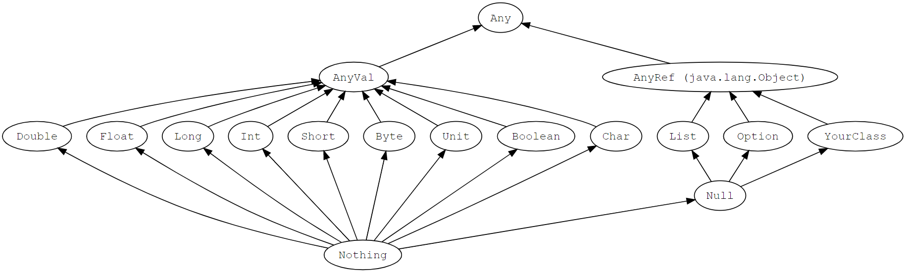
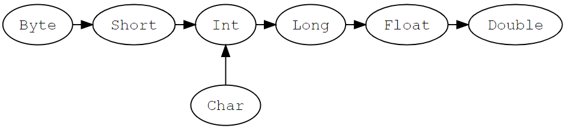

# 基础类型

在 Scala 中，所有的值都有类型，包括数值和函数



## 类型层次结构

### Any

`Any` 是所有类型的超类型，也称为顶级类型

它定义了一些通用的方法如 `equals`、`hashCode` 和 `toString`

`Any` 有两个直接子类：`AnyVal` 和 `AnyRef`

```scala
val list: List[Any] = List(
  "a string",
  732,  // an integer
  'c',  // a character
  true, // a boolean value
  () => "an anonymous function returning a string"
)

list.foreach(element => println(element))

/*
输出
a string
732
c
true
<function>
*/
```

### AnyVal

`AnyVal` 代表值类型，有 9 个预定义的非空的值类型分别是：`Double`、`Float`、`Long`、`Int`、`Short`、`Byte`、`Char`、`Unit` 和 `Boolean`

### AnyRef

`AnyRef` 代表引用类型，所有非值类型都被定义为引用类型

在 Scala 中，每个用户自定义的类型都是 `AnyRef` 的子类型

### Nothing

`Nothing` 是所有类型的子类型，也称为底部类型

用途之一是给出非正常终止的信号，如抛出异常、程序退出或者一个无限循环

### Null

`Null` 是所有引用类型的子类型，它有一个单例值由关键字 `null` 所定义

`Null` 主要是使得 Scala 满足和其他 JVM 语言的互操作性，但是几乎不应该在 Scala 代码中使用

### Unit

`Unit` 是不带任何意义的值类型，它仅有一个实例可以像这样声明：`()`

所有的函数必须有返回，所以说有时候 `Unit` 也是有用的返回类型

### 值类型

|类型|描述|
|-|-|
|`Byte`|8 位有符号补码整数
|`Short`|16 位有符号补码整数
|`Int`|32 位有符号补码整数
|`Long`|64 位有符号补码整数
|`Float`|32 位单精度浮点数
|`Double`|64 位双精度浮点数
|`Char`|16 位无符号 Unicode 字符
|`Boolean`|true 或 false
|`Unit`|无值

整型字面量用于 `Int` 类型，如果表示 `Long`，可以在数字后面添加 `L` 或者小写 `l` 作为后缀

如果浮点数后面有 `f` 或者 `F` 后缀时，表示这是一个 `Float` 类型，否则就是一个 `Double` 类型的

## 字符串

### 字符串字面量

字符串字面量使用双引号 `""` 来定义

### 多行字符串

多行字符串用三个双引号来表示分隔符，格式为：`""" ... """`

```scala
val foo = """菜鸟教程
www.runoob.com
www.w3cschool.cc
www.runnoob.com
以上三个地址都能访问"""
```

## 类型转换

值类型可以按照指定的方向进行转换



转换是单向