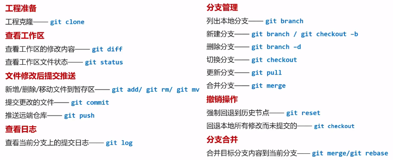

# Git

## 配置

### 系统配置

对所有用户都适用，存放在 %Git%/etc/gitconfig

使用 `git config --system` 便是读写该文件

### 用户配置

只适用于当前用户，存放于用户目录 ~/.gitconfig

使用 `git config --global` 便是读写该文件

### 仓库配置

只适用于当前仓库，存放于仓库目录 ./.git/config

使用 `git config --local` 便是读写该文件

每一个级别的配置都会覆盖上层相同配置，如 .git/config 会覆盖 %Git%/etc/gitconfig 中相同的变量名

### 配置个人身份

```
git config --global user.name "xxx"
git config --global user.email "xxx"
```

### 文本换行符配置

Windows 使用 `CRLF` 进行换行，而 Linux 和 Mac 只使用 `LF`

Git 可以在提交时自动转换换行符

```
// Windows 下打开自动替换
git config --global core.autocrlf true
// Linux Mac 下关闭
git config --global core.autocrlf input
```

### 文本编码配置

```
// git commit log 时使用 UTF-8 编码
git config --global i18n.commitEncoding utf-8
// git log 查看日志时采用 UTF-8 编码
git config --global i18n.logoutputencoding utf-8
```

## 基本命令



